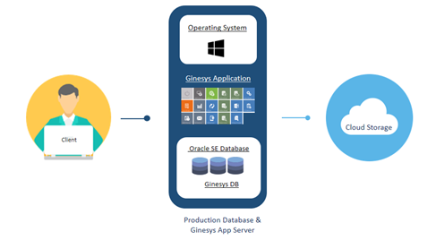
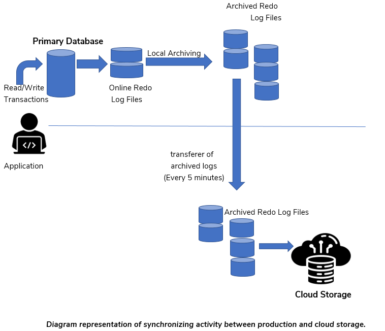

Cloud Database Objective
**Cloud Database Objective**

1. **Ginesys Cloud**

- The Ginesys Cloud Architecture offers a cloud-based database that typically operates on a cloud computing platform, providing access to the database as a service.
- In a database-as-a-service model, application owners are relieved from the need to install and maintain the database themselves. Instead, Ginesys assumes the responsibility for both installing and maintaining the database.

1. **Why are database backups important?**

- Organizations rely on data to conduct business, making it imperative that you are prepared with a plan to counteract failures.
- Today, retailers are increasingly leveraging data to drive future enhancements in sales and service. The rising demand for this form of business intelligence, coupled with the steady growth in data volumes within retail organizations, is prompting many companies to reassess their backup strategies..
- A robust backup and recovery plan can be likened to an insurance policy for your data.

1. **Backup solution provided by Ginesys Cloud**

A cloud database is a database that is constructed, deployed, and accessed within a cloud environment.

**3.1 Advantages of Cloud Database Backup**

**(a)** Stores your data on an external server.

**(b)** Provides the ability to access your files via the internet.

**(c)** Offers high affordability.

**(d)** Reduces maintenance costs.

**3.2 Limitations of Cloud Database Backup**

**(a)** The cloud performs image backups of the entire machine within 24

hours.

**(b)**The restoration of the database is only feasible up to the time at

which the full backup was created.

**(c)** Changes made to the database after the full backup cannot be

recovered in the event of a disaster.

**(d)** Could potentially result in data loss.

1. **To overcome cloud database limitations**

**4.1 Configure of Oracle Rman on Cloud database**

- Oracle RMAN is a utility built into Oracle databases to automate backup and recovery procedures
- RMAN automates the administration of backup strategies and ensures database integrity.
- Oracle RMAN enables the concept of online backup.
- Oracle RMAN handles underlying maintenance tasks that need to be performed before or after any database backup or recovery.

**4.2 Conversion of database to archive log mode**

- Enables the concept of online backup
- Log switch occurs every four minutes, meaning incremental backup takes place every four minutes.
- Backups can be performed while the database is open and available for use.
- More recovery options are available, such as the ability to perform point-in-time recovery.
- Minimal Data Loss

**4.3 Synchronization with secondary storage**

- Dual copies of the database's full backup and archive log are managed and stored on Microsoft Azure Storage
- Once the database's full backup is complete, a copy of the data is sent to a secondary storage location
- A synchronization process ensures the synchronization of generated archive log files from the cloud database to Azure Storage, running every five minutes.
- Synchronization ensures near-real-time database recovery with minimal data loss, approximately up to 10 minutes.

1. **Disaster recovery testing: Ensuring your backup plan works**

- Database recovery testing is a multi-step drill of an organization's disaster recovery plan, designed to ensure that the database can be restored if an actual disaster occurs.
- The primary objective of a Database Restore Drill is to ensure that, in the event of a disaster, the Recovery plan will indeed function effectively.
- The recovery testing drill reveals whether the backup is valid as full proof as it needs to be.

Database restoration testing includes three major steps:

(a) Restoration

(b) Validation

(c) Record Updation

**5.1 Restoration**

- The process involves downloading the database full backup from Microsoft Azure Storage for the date on which the restore drill is scheduled.
- Preparing a testing machine with the same parameter as of database which needs to be restored.
- Downloading archive logs from the time of the full backup to the current time when the restore activity commenced.
- Performing full backup restoration on the testing machine using Oracle utility RMAN.
- Applying Archive Log on the database once the full backup is successfully restored.

**5.2 Validation**

- This process ensures the completeness of database recovery by verifying application integrity after recovery.
- Validation checks whether the point-in-time recovery was successfully completed or if any data loss occurred.
- The latest data entry(depending on the customer business type) is recorded just before downloading the archive log.
- There are two types of customer data to validate:-

(a) RETAIL ( check from dxsessionlog table)

(b) NON-RETAIL (check from invstock table)

After restoration, the same data is validated using the same query result.

A minimal or no data gap between pre-restoration and post-restoration indicates a successful database recovery.

**5.3 Record Updation**

- Restoration data is managed and recorded into the GDBA database's DBA_RESTORE_DRILL table for further analysis.
- Restoration drill results and reports are regularly monitored.
- A minimum of two restoration drills are conducted per month.
- Sharing of restoration drill results with the Audit team.

1. **GDBA Database**

- The purpose of the GDBA database is to store the collective data of all cloud databases in a single place.
- GDBA Database is placed in the ORA-001 cloud Machine.
- All data from the cloud databases is gathered by running various procedures at their scheduled times.
- Data is gathered by connecting all the cloud databases with the help of database links configured in the GDBA database for all cloud clients.
- The data stored in the GDBA database for all cloud databases includes the following:

(a) Backup information

(b) Tablespace information

(c) Segment information

(d) Archive information,

(e) Materialized view information

(f) High watermark information

(g) Table count information(data count of some specific tables)

(h) Restore drill activity information

(i) Gathering database statistics information

(j)App table information(tables,where data deletion has been performed)
