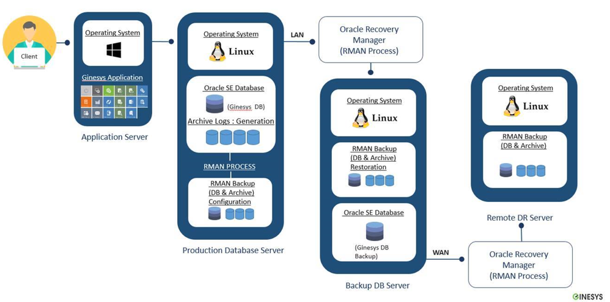
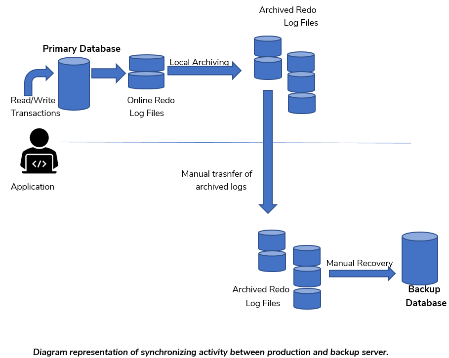

**Oracle Database Solutions and Service(Standard Version)**

1. **WHY ARE DATABASE BACKUPS IMPORTANT**

- Organizations rely on data to conduct business, so it is imperative that you are prepared with a plan to counteract failures.
- Today, retailers are making ever-greater use of data to drive future improvements in sales and service. Growth in demand for this kind of business intelligence, as well the steady increase in data volumes among retail organizations, is causing many companies re-evaluate their backup strategy.
- A sound backup and recovery plan can be thought of as an insurance policy for your data.

1. **TYPES OF FAILURE**

**Instance Failure:** Usually connected with an Oracle process failure

**Media Failure:** Disk failure, storage array controller failure etc.

**Block Corruption:** Usually caused by bugs in software or hardware failure.

**Human Error:** Accidentally deleted/updated data by the Database user or DBA.

**Disaster:** Fire, flood, earthquake, plane crash etc.

1. **INFRASTRUCTURE ARCHITECTURE WITH ORACLE STANDARD EDITION**

****

**(**a) _Application Server:_

- An application server is a modern form of platform middleware.
- It is system software that resides between the operating system (OS) on one side, the external resources (database management system, communications and Internet services) on another side and the users' applications on the third side.

(b) _Production Database Server_

- A production database contains the data You are using for production tasks such as creating and updating features.
- Depending on the data model you are using, data in a production database can be used to create a digital or hard-copy map or chart or a specific type of data.

(c) _Backup Database Server_

A backup database is a database replica created from a backup of a primary database.

A backup database has the following main purposes:

- Disaster protection
- Protection against data corruption.
- If the primary database is destroyed or its data becomes corrupted, you can perform a failover to the backup database (Manually), in which case the backup database becomes the new primary database.

_(d) Remote DR Server_

- Process of storing and retrieving files at a separate site than production.
- This type of data backup is much more secure than storing at home. It is not susceptible to the unforeseen events like fires or floods like with local. Whatever happens at your workplace, your files will be secure.

3.1 **INFRASTRUCTURAL IMPLEMENTATION**

- We have four servers for Ginesys Application, Production and Backup database along with remote DR storage
- Window 2012 R2 64-Bit installed in Application Server.
- Linux RHEL 7.x 64-Bit installed in Production, Backup and Remote Server.
- Oracle 12c Standard Edition 64-Bit installed for Production and Backup.
- SSD HDD used for Oracle Database in Production Server.
- SSD HDD used to keep archive and database backup.
- The Database in Archive mode for RMAN implementation.
- Raid 5 configured in SSD.
- Provided servers are virtual machine for Ginesys Application and Production and Backup. In term of High Availability in VM.
- Minimum 2 LAN port(1GB) are used in database and backup server - out of the same, one used explicitly for connecting Production server & backup server.

3.2 **HARDWARE AND VMWARE LANDSCAPE**

- _Mount Point details for Production Server_

| **HDD** | **Mount point** | **Disk Type** | **RAID Level** | **File System**     | **Size** | **Unit** | **Used for**                   |
| ------- | --------------- | ------------- | -------------- | ------------------- | -------- | -------- | ------------------------------ |
| sda     | /root           | SAS/SSD       | RAID 5         | Using LVM with EXT4 | 100      | GB       | To keep Linux operating        |
| sda     | /boot           | SAS/SSD       | RAID 5         | Using LVM with EXT4 | 1        | GB       | boot.ini file                  |
| sda     | swap            | &nbsp;        | &nbsp;         | &nbsp;              | 128      | GB       | &nbsp;                         |
| sda     | /u01            | SSD           | RAID 5         | Using LVM with EXT4 | 900      | GB       | Oracle setup/binaries/Database |
| sda     | /u02            | SSD           | RAID 5         | Using LVM with EXT4 | 407      | GB       | Oracle Database                |
| sdb     | /arch           | SAS/SSD       | RAID 5         | Using LVM with EXT4 | 800      | GB       | Oracle Archive log file        |
| sdb     | /backup         | SAS/SSD       | RAID 5         | Using LVM with EXT4 | 1024     | GB       | Oracle RMAN backup files       |
| Total   | &nbsp;          | &nbsp;        | &nbsp;         | &nbsp;              | 3360     | GB       | &nbsp;                         |
| CPU     | &nbsp;          | &nbsp;        | &nbsp;         | &nbsp;              | 32       | core     | &nbsp;                         |
| RAM     | &nbsp;          | &nbsp;        | &nbsp;         | &nbsp;              | 128      | GB       | &nbsp;                         |

- _Mount Point details for Backup Server_

| **HDD** | **Mount point** | **Disk Type** | **RAID Level** | **File System**     | **Size** | **Unit** | **Used for**                   |
| ------- | --------------- | ------------- | -------------- | ------------------- | -------- | -------- | ------------------------------ |
| sda     | /root           | SAS/SSD       | RAID 5         | Using LVM with EXT4 | 100      | GB       | To keep Linux operating        |
| sda     | /boot           | SAS/SSD       | RAID 5         | Using LVM with EXT4 | 1        | GB       | boot.ini file                  |
| sda     | Swap            | &nbsp;        | &nbsp;         | &nbsp;              | 128      | GB       | &nbsp;                         |
| sda     | /u01            | SSD           | RAID 5         | Using LVM with EXT4 | 900      | GB       | Oracle setup/binaries/Database |
| sda     | /u02            | SAS/SSD       | RAID 5         | Using LVM with EXT4 | 407      | GB       | Oracle Database                |
| sda     | /arch           | SAS/SSD       | RAID 5         | Using LVM with EXT4 | 800      | GB       | Oracle Archive log file        |
| sdb     | /backup         | SAS/SSD       | RAID 5         | Using LVM with EXT4 | 1024     | GB       | Oracle RMAN backup files       |
| Total   | &nbsp;          | &nbsp;        | &nbsp;         | &nbsp;              | 3360     | GB       | &nbsp;                         |
| CPU     | &nbsp;          | &nbsp;        | &nbsp;         | &nbsp;              | 32       | core     | &nbsp;                         |
| RAM     | &nbsp;          | &nbsp;        | &nbsp;         | &nbsp;              | 128      | GB       | &nbsp;                         |

1. **SOLUTIONS**

(a) _Configuration of Oracle RMAN_

- Oracle RMAN is a utility built into oracle databases to automate backup and recovery procedures
- RMAN automates administration of backup strategies and ensures database integrity.
- Oracle RMAN enables the concept of online backup.
- Oracle RMAN handles underlying maintenance tasks that must be performed before or after any database backup or recovery.

(b) _Conversion of Database into Archive Log Mode_

- Enables the concept of online backup.
- Log switch occurs with an interval of every four minutes incrementally.
- Backups can be performed while the database is open and available for use.
- More recovery options are available, such as the ability to perform point-in-time recovery.
- Minimal Data Loss

(c) _Synchronization with Backup Server_

- Multiple copies of database full backup and archive log are managed and stored on Backup Server.
- As soon as database full backup is complete, a copy of that data is sent from Production Server to Backup Server.
- A synchronization process runs every five minute that synchronize generated archive log files from Production Server to Backup Server physically.
- Ensuring availability of Backup Database at the time of production site failure with minimum downtime.

(d) _Availability of Backup Database_

- Creating a database replica from full backup of a primary database on backup server.
- Implementing a managed backup configuration where archives are applied on backup database that are shipped from production database.
- Making backup database the new primary database with minimal loss of time and data if the primary database is completely destroyed.

(e) _Recovery Time Objective / Recovery Point Objective_

- RTO is the goal your organization sets for the maximum length of time it should take to restore normal operations following an outage or data loss.
- RPO is your goal for the maximum amount of data the organization can tolerate losing.
- With the help of proposed solution, the backup server will be at par with an approximate RPO less than 15 minutes company to the production database.
- This can be achieved by generating archive files (increment data) in every 4 min and pushing the same file in every 5 minutes - this will minimize our data lose.

(f) _Disaster Recovery Testing: Ensuring your backup plan works_

- Database recovery testing is a multi-step drill of an organization's disaster recovery plan designed to assure that information technology systems will be restored if an actual disaster occurs.
- The main objective of Database Restore Drill is to make sure that, in case a disaster does happen, the Recovery plan will actually work.
- Recovery testing drill reveals whether the backup is truly as full proof as it needs to be.

__

1. **SERVICES**

Ginesys Team service includes:

(a) _Performing Full Database Backup_

- _Performing full database backup using Rman which greatly simplifies in backing up, restoring, and recovering database files processes._
- _Performing compressed Full backup for minimum utilization of hardware resources._
- _Monitoring full backup alert logs on daily basis._
- _Retaining important information about error messages and exceptions that occur during database operations from alert logs._

(b) _Performing daily deletion of old Backup files_

- _Managing limited space for maximum utilization._
- _Deleting old backup pieces to increase storage availability._
- _Performing old backup deletion on daily basis._
- _Monitoring alert logs of daily space availability on server after deletion of old backup files._

_(c) Performing Archive Backup_

- _Performing Daily incremental files backup._

_(d)_ Monitoring Archive Generation

- Checking archive log generation at physical locations.
- Checking archive log sequence logically at database level.
- Monitoring any gap in archive log sequence and take proper action.

_(_e) _Monitoring long-running operations_

- Checking all long running queries in database.
- Monitoring session's status and processes they are consuming.
- Monitoring input/output, waits, access of each session and to stop the session if found degrading database performance.
- Monitoring alerts logs of long running queries and operations every two hours.

(f) _Managing Database locks_

- Monitoring locks created in database through alert logs generated every two hours.
- Managing and resolving all locking and deadlock conflicts.
- Ensures smooth working of database transactions for optimal performance of database.
- Taking immediate action against sessions creating database locks.

(g) _Matching performance with Ginesys application_

- Removing events of extinct sites from production to optimize performance with application (it is Standard practice of application system will create events on any alteration / removing/addition (s) and that will be place in a queue for further sync and suppose user forgot to mark extinct site and later on the marked extinct ).

(h) _Tablespace Utilization_

- Monitoring all tablespaces utilization daily through alert logs and via database.
- Making sufficient space for all existing and new objects to reside.
- Adding new data files when required and increasing space on existing one at regular basis.
- Gathering tablespace data and analyzing database growth over time.
- Checking temporary tablespaces and files.
- Tuning undo retention with undo tablespace.

(i) _Synchronization with Backup Server_

- Movement of full database backup from Production Server to Backup Server daily.
- Moving Archive Backup from Production Server to Backup Server daily.
- Managing multiple copies of data files backup and archive backup on each server.
- Managing RSYNC with cron jobs to transfer and synchronize physical database data across network.
- Managing RSYNC which initiates synchronization every five minutes and sync archive log from Production Server to Backup Server.
- Ensuring availability of Backup Database at the time of production site failure with minimum downtime.

(j) _Archive Log Recovery on Backup Server_

- Monitoring transfer of archive log from Production Server to Backup Server and recovering archive log to the latest archive generated.
- Physically matching archive log size on both servers.
- Logically matching archive log sequence on production with Backup server.
- Ensuring no gap in sequence after archive are applied on Backup server.
- Monitoring Archive Applying alert log generation after every two hours.

(k) _Performing archive flushing task_

- Performing archive flushing task on regular basis to reclaim archive space within database after physical deletion of archive log.

(l) _Performing Database Recovery_

- Performing Database Recovery Drill to verify integrity of database backups.
- Preparation of quarterly recovery drill logs and sharing with concerned individual.

(m) _Database Maintenance Statistics_

- Database Growth Comparison statistics
- Analyzing database and schemas statistics.
- Performing Proactive maintenance tasks for Database and OS server.

(n) _Managing Database Indexes_

- Rebuilding of Indexes, if bulk load of data is inserted.
- Check index monitoring usage to validate the index usage which is not used yet.
- Drop/Mark unusable and unused indexes with proper change management.
- Making sure all indexes should use INDEXES tablespace and not use.
- DATA/Other tablespace. If so, then move all indexes to its Index Tablespace.
- Managing and moving file system of indexes to fix Input Output performance of database.

(o) _Database Health Check Report_

- Generating, modifying and sharing Database health check report on monthly basis.
- Diagnosing and maintaining database health and stability as per health check report output.
- Health check of Database Instance and Listener.

1. **DATABASE ALERT LOGS**

- Alert logs contain important information about error messages and exceptions that occur during database operations.
- Multiple database alerts are configured for managing the database activity and smooth working.
- Ginesys Database team monitor database alerts every two hours on daily basis.

| [S.NO](http://s.no/) | **LIST OF ALERT LOG**                                                   | **FREQUENCY**                               |
| -------------------- | ----------------------------------------------------------------------- | ------------------------------------------- |
| **1**                | Old backup deletion on Production Server                                | once per day                                |
| **2**                | RMAN full backup completion on Production Server                        | once per day                                |
| **3**                | Old backup deletion on Backup Server                                    | once per day                                |
| **4**                | RMAN backup copied from Production Server to Backup Server              | once per day                                |
| **5**                | Archive synchronization gap between Production Server and Backup Server | 12 times a day repeat every two hours       |
| **6**                | Archive applied on Backup Server                                        | 12 times a day repeat every two hours       |
| **7**                | Old Backup deletion on Remote Server                                    | once per day                                |
| **8**                | RMAN backup copied from Backup Server to Remote Server                  | once per day                                |
| **9**                | Archive synchronization gap between Backup Server and Remote Server     | 12 times a day repeat every two hours       |
| **10**               | Tablespace utilization information                                      | once per day                                |
| **11**               | Database long running query information                                 | 12 times a day repeat every two hours       |
| **12**               | Database locking sessions                                               | 12 times a day repeat every two hours       |
| **13**               | Server disk utilization and free space                                  | 12 times a day repeat every two hours       |
| **14**               | Deletion of extinct p-site events                                       | 5 times a month                             |
| **15**               | Expired archive flush from backup server  &nbsp;                  | 2 times a month repeats after every 15 days |