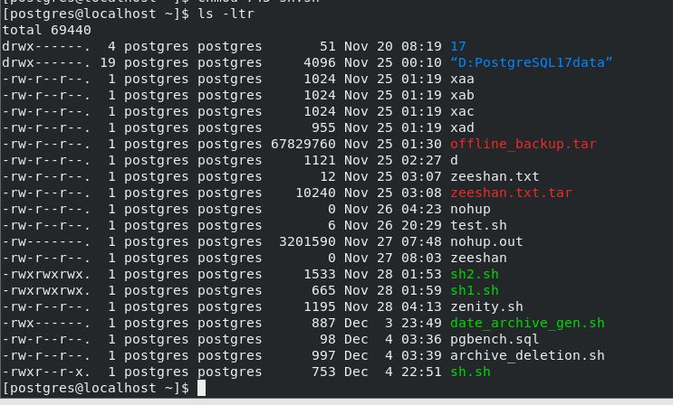
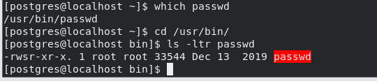
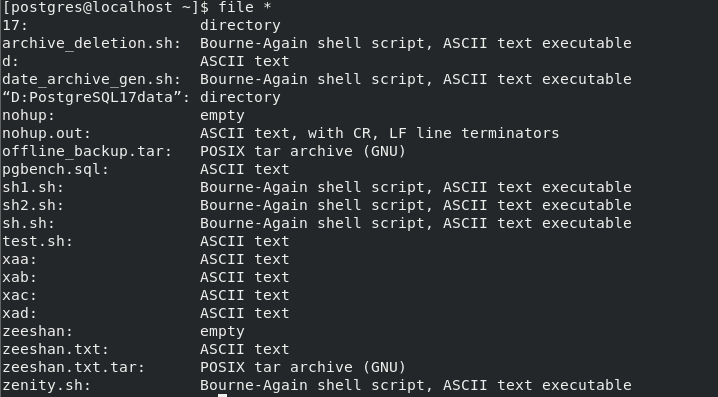

# LINUX BASICS

SHELL: shell is a command intrepeter which intrepets the command that gives you and conveys them to the kernel.

### TYPES OF SHELL

1.BOURN SHELL  
2.KORN SHELL  
3.C SHELL

### BASIC COMMAND LINE UTILITY

1. Who list all the connected users
2. Whoami list the current connected user
3. ls list all the files in current directory

- ls -l list the files with 9 columns
- ls -a list all the file directorie,hidden or unhidded files and directories
- ls -lt list all the file acoordingly the time, the latest created file will be on top
- ls -ltr list all the full in the descending order like the latest created file will be on bottom(r means reverse)
- ls p\* list all the files that filename start with p
- ls \*.backup list all the files that end with \*.backup extension
- ls -ltr -full-time
- \-R recursively
- ls -ap|grep -v "/"|grep "^\\." (used to display the hidden files)
- ls -ltR|grep ^- (used to list the total files in user home directory)
- lsof
- ls -l --time-style="+%d %b"|grep "21 Dec"

1. touch create a empty file  
   . stat filename display the access, creation , modification , change time of file
2. cat > filename create file append data and press CTRL D for save
3. cat filename for viewing the contents of the data
4. cat >> filename for appending the data in existing file and press CTRL D for save
5. cat file1 file2 > file3 it will redirect the output of file1 and file2 in file3( use >> for appending)
6. cp copy the file from one destination to another directory
7. rm remove the file or directory  
   . -r it will delete file or directory recursively  
   . -i before deletion the file or directory it will ask for confirmation  
   . -f it will delete forcefully
8. mv mv command can use for renaming the filename or transferring from one dest to another dest
9. ln create a links of files  
   . ln file 1 fil2 (hard link)  
   . ln -s file1 file2 ( soft link)

### PERMISSION ON FILES

The first field of ls -l signify the permissions on the files and also signify who can access the file. A set of nine characters denotes the file permissions.

There are three type of permissions that apply on three denotes(USERS,GROUP,OTHERS)

- READ values 4
- WRITE values 2
- EXECUTE value 1



NOW TAKING THE EXAMPLE of sh.sh file

- The first rwx denotes that the USER have the read , write and execute permission on the sh.sh file
- The second r-- denotes that the GROUP has only read permission on sh.sh file it is means that group members can only read file . it can neither change the contents of file nor execute file
- The last r-x denotes that the OTHER user has only the privilege of read and execute on the sh.sh . it has no privilege to of write and changing the contents of file.
- r+w+x weightage is 4+2+1=7
- r weightage is 4
- r+x weightage is 4+1=5

### HOW TO CHANGE THESE PERMISSIONS

- chmod chmod (change mode) utility to change the permissions of files  
  . chmod 700 file1 rwx for user , no permission for group and other  
  . chmod 574 rx for user, rwx for group and r for other user  
  . chmod +x file1 it will append the execute permission on the existing permission to USER,GROUP and OTHER  
  . chmod gu+r,uo-w file1 it is means that it will append the read permissions on the GROUP and USER but uo-w remove the permission of write from USER and OTHER  
  .chmod go=r,u=rw file1 it is means that it will remove all the permissions from GROUP and OTHER and assign only the read permission and u=rw will remove all the permission from USER and assign only read,write permission
- UMASK command  
  The umask command is essential for controlling file and directory permissions, helping manage security by restricting access to newly created files and directories. Adjusting it properly ensures that files have the appropriate level of access based on your environment.  
  <br/>by default the permission of the file is 666  
  and the directory permission is 777  
  and the umask has the values 0022 ( first zero denotes the octal number)
- **Common umask Values**

| umask | File Permissions | Directory Permissions | Description |
| --- | --- | --- | --- |
| 0000 | 666 (rw-rw-rw-) | 777 (rwxrwxrwx) | No restrictions |
| 0002 | 664 (rw-rw-r--) | 775 (rwxrwxr-x) | Typical for shared group environments |
| 0022 | 644 (rw-r--r--) | 755 (rwxr-xr-x) | Default for most systems |
| 0077 | 600 (rw-------) | 700 (rwx------) | Private files and directories |

The umask decide which file and directory have the permission after the creation

- STICKY BIT  
  The **sticky bit** in Linux is a permission setting applied to directories to control deletion rights. When the sticky bit is set, only the **owner of the file, the owner of the directory, or the root user** can delete or modify the files inside that directory, even if other users have write permissions.

This is commonly used for directories like /tmp, where multiple users have write access, but no one should be allowed to delete or modify other users' files.

**How to Use the Sticky Bit**

**Set the Sticky Bit**

You can set the sticky bit using the chmod command with the +t option or by using octal mode.

**Using chmod +t**:

```bash
chmod +t directory_name
```

**Using Octal Mode**: The sticky bit is represented by the digit 1 in the **most significant octal place**:

chmod 1755 directory_name

**Verify the Sticky Bit**

Use the `ls -ld` command to check directory permissions. When the sticky bit is set, you'll see a **t** at the end of the permissions:

```bash
ls -ld directory_name
```

Example output:

```bash
drwxrwxrwt 2 root root 4096 Dec 5 15:30 /tmp
```

The t at the end indicates the sticky bit is active.

/tmp is a real-world example of a directory with the sticky bit set.

**Sticky Bit Example**

- **1. Create a Shared Directory**

```bash
mkdir /shared
chmod 777 /shared
```

This creates a directory /shared where all users have read, write, and execute permissions.

**2. Set the Sticky Bit**

```bash
chmod +t /shared
```

Now only the owner of a file can delete it, even though other users can create files in /shared.

**3\. Test the Sticky Bit**

**Step 1: User A creates a file**

```bash
su - userA
cd /shared
echo "This is UserA's file" > fileA.txt
```

**Step 2: User B tries to delete the file**

```bash
su - userB
cd /shared
rm fileA.txt
```

Without the sticky bit: User B can delete the file because /shared has write permissions for everyone.

With the sticky bit: User B cannot delete the file. They will see an error like:

```
rm: cannot remove 'fileA.txt': Operation not permitted
```

**Step 3: User A deletes their file**

```bash
su - userA
rm fileA.txt
```

- CHOWN AND CHGRP command (ROOT COMMANDS)

The chown and chgrp commands in Linux are used to modify file ownership and group ownership.  
<br/>The chown (change owner) command changes the ownership and group of a file or directory.  
<br/>```bash
chown john file.txt
chown john:developers file.txt
chown -R john:developers /data
```  
<br/>

- The chgrp (change group) command changes the group ownership of a file or directory.  
  <br/>```bash
chgrp developers file.txt
chgrp -R developers /data
```

1. mkdir make a directory  
   . mkdir -p /u01/archive/psql create a directory recursively  
   . mkdir -m 754 batch create a directory with a default permissions of 754
2. rmdir removes the directory  
   . rmdir -p /u01/archive/psql removes the directory recursively  
   . rmdir /u01/archive/psql removes the child directory(psql)
3. tree used to display the hierarchy of directory and files
4. cd used to change directory  
   . cd ~ switch to home directory of current user  
   . cd / switch to the root directory  
   . cd - switch to latest previous directory you were in before
5. logname display current username
6. pwd displays current working directory
7. tty displays the current terminal that you are working
8. date display the current date and time  
   date '+DATE %d-%m-%y %n TIME +%HH24_%MM_%SS'  
   DATE 05-12-24  
   TIME +22H24_38M_25S  
   <br/>. date -d "+45 days" next 45 days  
   . date -d "+45 days -ago"  
   . date -date="45 days"
9. lsblk display the information about block devices  
   . lsblk -a  
   . lsblk -f
10. df (disk free) display the information about the disk usage and free of your filesystem  
    . df -h  
    . df -i  
    . df -T  
    . df -ivt
11. du ( disk usage) display the information about which files and directories exhaust the amount of memory  
    . du -h  
    . du .  
    . du -s  
    . du /tmp

Ulimit after setting the ulimit the users cannot create the files and directory above the ulitmit.  
. ulimit 1 it is means that the user cannot create the file whose is bigger than 512 bytes  
. ulimit 2097152 it is means that the user cannot create file bigger that 2097152 bytes 0r 2048 KB  
<br/>- **File size (-f)**: Maximum size of files a process can create.

- **Open files (-n)**: Maximum number of open file descriptors per process.

- **Stack size (-s)**: Maximum size of the process's stack.

- **CPU time (-t)**: Maximum CPU time a process can use.

- **Virtual memory (-v)**: Maximum amount of virtual memory a process can use.

- **Number of processes (-u)**: Maximum number of processes a user can have.

1. - **Core file size (-c)**: Maximum size of a core file (for debugging).  
   <br/>\# Set maximum number of open files  
   ulimit -n 65535  
   <br/>\# Set maximum stack size  
   ulimit -s 8192  
   \# Set maximum virtual memory  
   ulimit -v unlimited  
   <br/>
2. passwd password command is used to change the password of the users . by default it is a root level command but normal can change its own password because there is a special type of permission (SUID) set on psswd command that normal user can change its password

. which passwd (command)  
. cd /usr/bin  
. ls -ltr passwd



As seen above image the user has **rwsr** s denotes the SUID special type of permission. Due to this SUID the normal user can change only own password.

/etc/passwd file contains the information about all the users accounts.

It is a plain text file that can be read by all users but is writable only by the superuser (root).

john:x:1000:1000:John Doe:/home/john:/bin/bash

- **username**: john
- **x**: Password is stored in /etc/shadow.
- **UID**: 1000 (unique user ID for john).
- **GID**: 1000 (primary group ID for john).
- **comment**: John Doe (optional user information).
- **home_directory**: /home/john (default location for user's files).
- **shell**: /bin/bash (default shell for the user).

The /etc/shadow file in Linux is a secure system file that contains encrypted password information for user accounts, along with additional settings related to password aging and expiration.

Unlike /etc/passwd, it is accessible only by the root user.

- cal command used diplay the calendar
- file command used to display the type of file and directories whether it is file, directory, ascii file, encrypted file or empty file



- wc it is a simple and usage that count number of lines , word and character in the given file.  
  . wc -l  
  . wc -w  
  . wc -c  
  . wc -lwc
- sort The sort command in Linux is a text-processing utility used to sort lines in a file or from standard input. It organizes the input based on various criteria, such as alphabetically, numerically, or in reverse order.  
  . sort file.txt sort the lines in alphabetically ASC (user -r for DESC) NOTE: sort according to the first character of line  
  . sort -n file.txt sort numerically ASC( use -r for DESC)  
  .

| Option | Description |
| --- | --- |
| -n | Sort numerically (e.g., 2 < 10 < 100). |
| -r | Reverse the sorting order. |
| -k FIELD | Sort based on a specific field in the line. |
| -u | Output only unique lines (combine with other options like -n). |
| -f | Ignore case while sorting. |
| -b | Ignore leading blanks in lines. |
| -o FILE | Write output to a specific file. |
| -c | Check if the file is sorted; output errors if not. |
| --help | Display help for the sort command. |

- Cut used extract the specified column from the file

. cut -f 2 file.txt extract the second field of the file  
. cut -f 2,5 file.txt extract the second and fifth field of the file  
. cut -f 2,-5 file.txt extract the field from 2<sup>nd</sup> to 5<sup>th</sup> from the file  
. cut -c 2,10 file.txt extract the character from the line of the file  
**NOTE:**  
if the file is delimited by any symbol(:,;\_) or any thing so you can use the delimeter  
take a example of /etc/passwd file it is delimited by ":"  
. cat /etc/passwd|cut -d":" -f3 I have cut the 3<sup>rd</sup> column of /etc/passwd file

. cat /etc/passwd|cut -d":" -f3-7

- grep(globally search regular expression print)  
  with the help of grep you can search a patter , string , word in a file  
  <br/>. grep "string" file.txt  
  . grep -i "string" file.txt (i means ignore case)  
  . grep "string" -n file.txt ( -n represent the line number in accordance with matched string)  
  . grep -c "string" file.txt ( -c counts the matched strings)  
  . grep -l "string" \* ( -l displays all the files that have matched string)  
  . grep -n "string" ( search the string in every file and also display the number line of the string in the file)  
  . grep -v ( -v verbose)  
  . grep -w ( display the particular word)  
  . grep -w -o ( display the only word not the full line)  
  . grep -v "^\$" (display only the readable lines)  
  . grep "^\$" filename (display the blank lines)  
  . grep -e "string1" -e "string2" (you can search the multiple strings)

| Option | Description |
| --- | --- |
| -i | Ignore case during the search. |
| -r or -R | Recursively search directories. |
| -l | List only the names of files containing the pattern (not the matching lines). |
| -n | Show the line numbers along with matching lines. |
| -v | Invert the match, i.e., display lines that do _not_ contain the pattern. |
| -c | Count the number of matching lines for each file. |
| -H | Show the file name in the output (useful when searching multiple files). |
| -o | Show only the matched parts of the line, not the entire line. |
| -w | Match whole words only (the pattern must be surrounded by word boundaries). |
| -A NUM | Display NUM lines after the matched line. |
| -B NUM | Display NUM lines before the matched line. |
| -C NUM | Display NUM lines before and after the matched line (a context window). |
| --color | Highlight the matching text (usually used in combination with grep output). |

- dd command used to converting the data type  
  from ascii to encryption and lower to upper case  
  . dd if=file.txt of=newfile.txt conv=ebcdic (convert the file into encryption and user vice versa).  
  . dd if=file conv=ebcdic ( covert the file without making a new file)

EBCDIC (Extended Binary Coded Decimal Interchange Code)

- head display the first few lines of the file  
  . head file.txt (display the first 10 lines)  
  . head -n 20 file.txt (display the first 20 lines)

- tail display the last few lines  
  . tail file.txt display the last ten line  
  . tail -n 5 display the last 5 lines  
  <br/>tail -f /var/log/syslog | more wait for append the data  
  <br/>
- more The more command in Linux is a pager program used to view the contents of a file one screen at a time. It allows users to scroll through the content interactively, making it easier to read large files or long output from commands  
  <br/>. more file.txt  
  . more +20 file.txt To start viewing a file from line 20.  
  . more -15 file.txt To set the number of lines displayed per screen to 15

COMPRESSION

- compress (it is used to compress the size of the file)  
  <br/>. compress -v file.txt (compress the size of the file with .**Z** extension but you can see tha data after compression)  
  . uncompress file.txt (uncompress the file )
- gzip file.txt ( it compress the size of the file with .**gz** extension as well it will encrypt the data of the file )  
  <br/>. zcat file.txt.gz ( for seeing the contents of the file)  
  .gunzip file.txt.gz (uncompress and decrypt the file)
- bzip2 (used to compress and decrypt the file it is more preferable and powerfull the compression command )  
  <br/>. bzcat file.txt.bz2 ( seeing the contents of the file)  
  . bunzip2 file.txt.bz2 (decompress the file)
- zip ( used to archive multiple files )  
  <br/>. zip archive.zip file1.txt file2.txt file3.txt  
  . zip -r archive.zip directory_name  
  . unzip archive.zip

- tar  
  <br/>. tar -cvf newfile file.txt  
  . tar -xvf newfile /home/postgres  
  <br/>
- PIPING  
  <br/>Piping in Linux refers to the process of passing the output of one command as input to another command. This is done using the pipe operator (|). Piping allows you to combine multiple commands to perform complex tasks more efficiently by passing data between them  
  <br/>. ls | wc -l  
  . ps -aux | grep "apache"  
  . ps aux | sort -n

- tee  
  <br/>The tee command in Linux is used to read the input from standard input (stdin) and write it to both standard output (stdout) and one or more files simultaneously. It is especially useful in pipelines to capture the intermediate or final output while still displaying it on the terminal.  
  <br/>ex. ls -ltr|tee file1 file2|sort -k9 -o file3  
  <br/>
- Vi editor  
  <br/>\* MODE  
  1\. INSERT MODE  
  2\. COMMAND MODE  
  3\. EX MODE  
  <br/>\* HOW TO DELETE,COPY and PASTE THE CHARACTERS AND WORD  
  1\. x delete current cursor character  
  2\. nx delete the number of character ( n is the number of character)  
  3\. X delete the character to the left of the cursor.  
  4\. dX delete the nth number of characters to the left of the cursor  
  5\. dw delete the current cursor word.  
  6\. ndw delete the nth number of words.  
  7\. dd delete the current line.  
  8\. ndd delete the nth number of lines after the cursor.  
  9\. d0 delete the current line from the cursor to the beginning of the line.  
  10\. d\$ delete the current line from the cursor the to end of the line.  
  <br/>NOTE: this command should be execute in ex mode.  
  11\. :1,50 dd delete the line from 1<sup>st</sup> line to 50<sup>th</sup> line  
  <br/>12\. :nd deletes the nth line (ex. 10 line)  
  13\. :n mo p move the nth line and paste after the pth line (ex. 1 mo 10 the 1 line move after the 10<sup>th</sup> line)  
  14\. :m,n mo p move the line from mth to nth and paste after pth line (ex. 1,10 mo 40)  
  15\. :n co p copy the nth line and paste after pth line.  
  16\. :n,m co p copy the lines from the nth line to mth line and paste after pth line.  
  17\. :n,m w filename save the buffer from the nth line to mth line to the file.  
  18\. :n,m w >> filename overwrites the buffer of the file with nth line to mth line.  
  19\. :r filename reads the data of the file at the current cursor position.  
  20\. :r !ls execute the ls command in Vi.  
  <br/><br/>\* MOVE THE CURSOR  
  <br/>1\. 0 move the cursor to beginning of the current line  
  2\. \$ move the cursor the end of the line  
  3\. Ctrl f scroll the screen forward to the full window.  
  4\. Ctrl b scroll the screen backward to the full window.  
  5\. w  
  6\. b  
  7\. e  
  8\. G move the cursor to the last of the of the file  
  9\. nG move to the cursor to the nth line of the file  
  <br/><br/>
- Inserting the text  
  <br/>1\. a enter the text input mode and append the text after the curstor.  
  2\. A enter the text input mode and append the text at end of the line.  
  3\. i enter the text input mode and append the text at the cursor.  
  4\. I enter the text input mode and append the text at the beginning of the line.  
  5\. o enter the text input mode by opening a new line below the current line  
  6\. O enter the text input mode by opening a new line above the current line  
  <br/>

- Some basic command  
  <br/>1\. ~ change upper to lower and lower to upper by current cursor character.  
  2\. :sh temporarily return to the shell command and perform some command and return to the Vi.  
  3\. ZZ writes the buffer to file and quits Vi.  
  4\. wq writes the buffer to file and quits Vi.  
  5\. w filename and :q write the buffer to the file (newfilename) and quits Vi.  
  6\. w! filename and :q overwrites the file to the buffer and quits Vi.  
  7\. q! quit the Vi.  
  8\. u undoes the effect of the last executed command.  
  9\. U  
  10\. /"string" search the string pattern of the file  
  <br/>
- How to the search particular string and replace with another string  
  <br/>1\. 1,\$ s/"string/"string2"/g replace the 1<sup>st</sup> string to the 2<sup>nd</sup> string in the file from 1<sup>st</sup> line to end of the line.  
  1\. .,\$ s/"string/"string2"/g replace the string from the current cursor the end of the line.  
  3\. 1,. s/"string/"string2"/g replace the string from 1<sup>st</sup> line to the current cursor.  
  4\. 10,50 s/"string/"string2"/g replace the string from 10<sup>th</sup> line to 50<sup>th</sup> line.  
  <br/>5\. 1,\$ s/\[,\]/;/g  
  6\. 1,\$ s/.\*/\\U&/g (lower to upper)  
  7\. 1,\$ g/^\$/d  
  8\. 1,\$ s/^/#/g  
  9\. 1,\$ g/^/m0  
  <br/><br/>
- YANK(copy) and PASTE the line  
  <br/>1\. yw yank the current cursor word  
  2\. yy yank the current cursor line  
  3\. y0 yank the current line from the cursor to the beginning of the line.  
  4\. y\$ yank the current line from current cursor to the end of the line.  
  5\. p paste the yank buffer.  
  6\. vi +100 file open the vi editor of the file at the 100<sup>th</sup> line of the file.  
  7\. Vi +/pattern file open the vi editor of the file and the particular pattern of the file.  
  8\. view file open the editor but you can not change the contents.  
  <br/><br/><br/><br/>
- PROCESSES  
  <br/>. ps ps command shows the processes which is currently running  
  . ps -a ps -a shows the running process of all the connected users.  
  . ps -u users1 ps -u shows the users1 running processes.  
  . ps -t tty1 ps -t list all the processes which is executed on the tty1 terminal.  
  . ps -f ps -f list all the running process with additional information.  
  . ps -e ps -e list every process  
  . ps aef  
  <br/><br/>
- BACKGROUND PROCESS  
  <br/>how to execute any command and process in background  
  <br/>. sort filename > newfile & (& denotes that this process will be executed in background).  
  <br/>
- How can you take the process from background to foreground and foreground to backupground.  
  <br/>NOW take a example  
  <br/>I am going to put a process in forground  
  <br/>. sleep 100s  
  . ps -aef|grep sleep  
  . ctrl z (stopped the process)  
  . job ( job command is a utility to display the running completed stopped processes) and also take the JOBID from job command  
  . bg JOBID (this command will put the process in background)  
  <br/><br/><br/><br/><br/><br/>
- NOHUP command  
  <br/>The nohup command in Linux is used to run processes or commands in the background, ensuring they continue running even if the user logs out or the terminal is closed.  
  <br/>. nohup ./myscript.sh &  
  . ps -aef|grep myscipt.sh  
  <br/>
- KILL PROCESS  
  <br/>. kill -l list all the available options  
  . kill -9 PID The kill -9 command in Linux is used to forcibly terminate a process using its **process ID (PID)**.  
  <br/>. kill -5 PID The kill -15 command sends the **SIGTERM** signal to a process in Linux, requesting it to terminate gracefully.  
  <br/><br/>how to change process priorities  
  . ps -l display the priorities of process  
  . nice  
  .renice  
  <br/><br/>
- SCHEDULING A PROCESS  
  <br/>. at command The at command in Linux is used to schedule one-time tasks to run at a specific time in the future.  
  <br/>. at now + 5 minutes  
  . echo "Hello, World!" > /tmp/hello.txt  
  . at 2:30 PM  
  . at 8:00 AM tomorrow  
  .atq list the scheduled job  
  . atrm or at -r to remove the job  
  <br/>. batch command The batch command in Linux is used to schedule jobs to run when the system load average drops below a certain level. It is similar to the at command but focuses on scheduling tasks during low system load.  
  <br/>. batch

. echo "Batch job running!" > /tmp/batch_job.txt

. cron command  
<br/><br/>

- SED command  
  <br/>The sed command (Stream Editor) in Unix/Linux is a powerful tool for processing and transforming text. It can be used to perform basic text manipulation tasks such as searching, replacing, inserting, and deleting lines in files or streams.  
  <br/><br/>. sed 's/string1/string2/g' filename (it converts one string to another string)  
  <br/>. sed -n '3p' filename (display the 3<sup>rd</sup> line)  
  . sed -n '\$p' filename (display the last line)  
  . sed -n '2,5p' filename (display the line from 2<sup>nd</sup> to 5<sup>th</sup> )  
  . sed -n '2p;10p' filename display the 2<sup>nd</sup> and 10<sup>th</sup> line)  
  . sed -n '/string/p' filename (display the line with particular matched strings)  
  . sed -n -e '/string1/p' -e '/string2/p' (display all the lines matched with both the strings)  
  . sed -n '2,+10p' filename (display the 10 more line after 2<sup>nd</sup> line)  
  . sed '2 s/string/string2/g' (it change the string on only 2<sup>nd</sup> line)  
  . sed '2d' filename (it deletes the 2<sup>nd</sup> line)  
  . sed '2,5d') filename (it delete the line from 2<sup>nd</sup> to 5<sup>th</sup>)  
  . sed '2d;10d' filename ( it deletes the 2<sup>nd</sup> and 10<sup>th</sup> line)  
  . sed '/string/d' ( it deletes the line with matched string)  
  . sed '/^\$/d' (delete blanks line from file)  
  . sed '/^\$/!d' filename (delete readable lines not blank lines)  
  . sed '/string w filename' filename ( it append the data in the files with matched string)  
  . sed '3 r filename' file (read the contents of file at the 3<sup>rd</sup> line)  
  . sed '2 e date' filename ( execute the date command on 2<sup>nd</sup> line)  
  . sed '=' file ( give the number line to the file)  
  <br/><br/><br/><br/>
- AWK command  
  <br/>AWK stands for AHO WEIBNERGER KERNIGHAN  
  <br/><br/>The awk command in Linux is a powerful text processing tool used for pattern scanning and processing. It is designed to work with structured text data by using patterns and actions, making it ideal for data extraction, transformation, and reporting.

. awk '{}' filename (this is the syntax of awk command)  
. awk '{print \$2}' file (display the second column of the file)  
. awk '{print \$2,\$5}' file (display the column from 2<sup>nd</sup> to 5<sup>th</sup>)  
. awk '{\$NF}' file (display the last filed)  
. awk '{print NR ":" \$0}' file (give the number line)  
. awk -F":" '{print \$2}' file (display the second field with the help of delimeter)  
. awk '/string {print \$0}' file (display the contents with matched strings)  
. awk 'NR==8{print \$0}' file (display the 8<sup>th</sup> line)  
. awk 'NR=="8",NR=="155" { print \$0}' file (display the lines from 8<sup>th</sup> to 155<sup>th</sup> )  
. awl ' \$0 ~ /string {print \$0}' file  
<br/><br/><br/><br/>

- FIND command  
  <br/>The awk command in Linux is a powerful text processing tool used for pattern scanning and processing. It is designed to work with structured text data by using patterns and actions, making it ideal for data extraction, transformation, and reporting.  
  <br/>. **find . -name file.txt ( find the specific file in current working directory)  
  . find /home -name file.txt ( find the file in the home directory)  
  . find /home -iname file.txt ( ignore the case upper and lower)  
  . find / -type d -name USER ( display the the USER directory in the / root directory)  
  . find . -type f -name tec.php (display the file with name in current working directory)  
  . find . -type f -name "\*.php" (display the all the file with .php extension)  
  . find . -type f -perm 0777 -print (display all the files with 777 permissions)  
  . find . -type f -perm ! 0777 -print ( display all the files except 777 permissions )  
  . find / -perm 644  
  . find / -perm /u=r  
  . find / -perm /a=x**

**. find / -type f -perm 0777 -print -exec chmod 644 {} \\;**

**. find . -type d -perm 777 -print -exec chmod 755 {} \\;**

**. find . -type f -name "tecH.txt" -exec rm -f {} \\;**

**. find . -type f -name "\*.txt" -exec rm -f {} \\;  
. find . -type f -empty**

**. find . -type d -empty**

**. find /tmp -type f -name ".\*" (hidden files)  
. find / -user oracle -name tech.txt  
. find / -mtime 50 ( 50 days back modified file)**

**. find / -atime 50 ( last 50 days accessed file )  
. find / -mtime +50 -mtime -100**

**. find / -cmin -60 ( last hour changed file )**

**. find / -mmin -60 (last hour modified files)  
. find / -amin -60 ( last hour accessed file)**

**. find / -type f -size +100M -exec rm -f {} \\;**

**. find / -type f -name \*.mp3 -size +10M -exec rm {} \\;  
<br/>**

**ROOT level commands**

- **lsblk** display about the block devices  
  . lsblk -a (empty block as well)  
  . lsblk -f (in bytes)  
  . lsblk -m (display information about device owner, group and mode of block)  
  . lsblk -f ( display with UUID)
- **blkid** used to get information about block devices with UUID.
- **How can make a partition with parted command.  
  <br/>. parted /dev/sdb  
  . mkpart (choose primary)  
  . xfs (choose xfs filesystem)  
  . start 2048  
  . end 1000 MB.  
  . quit  
  . udevadm settle (run this command on terminal that system is ready for detect new partition and created associated device files under dev directory).  
  . mkfs.xfs /dev/sdb1 (for creating a filesystem)  
  . mount /dev/sdb1 /mnt (mount new filesystem on mnt directory)  
  <br/><br/>**
- **Now make a partition with fdisk command  
  <br/>. fdisk -l  
  . fdisk /dev/sdb  
  . p (print)  
  . n (new)  
  . t (type of filesystem)  
  . l (listing)  
  .d (delete)  
  . w (write , save and quite)  
  . mkfs.xfs /dev/sdb1  
  . partprobe  
  . mount /dev/sdb1 /mnt  
  <br/>if you want to make a permanent entry that edit a /etc/fstab file with UUID**
- **  
  <br/>\* HOW to make a partition of swap space  
  <br/>. parted /dev/sdb  
  . mkpart  
  . partition name (swap1)  
  . filesystem type( linux.swap)  
  . start 1001 MB  
  . end 1275 MB  
  . quit  
  . udevadm settle  
  . mkswap /dev/sdb1  
  . swapon /dev/sdb1  
  . mount /dev/sdb1 /mnt  
  <br/>**
- **SYSTEMD daemon manages startup of linux. It activates system resources , server daemons and other processes.  
  <br/>**
- **Daemon process are processes or utility program that run silently in the background that monitor and take care of system susbsystems to ensure that operating system runs properly.  
  <br/>. crond  
  . sshd  
  . httpd  
  . nfsd  
  <br/>. journald is the daemon process that collects the logs from various log secure like syslog.  
  . journalctl is a command line utility that helps you to interact with journal logs.  
  <br/>. journalctl -xe (latest logs)  
  . journalctl -p err (all errors)**
- **Systemctl command is command line utility that used control and manage the syste services,daemons and other processes.  
  <br/>. systemctl status sshd.service  
  . systemctl is-active sshd.service  
  . systemctl is-enabled sshd.service  
  . systemctl is-failed sshd.service  
  . systemctl start sshd.service  
  . systemctl stop sshd.service  
  . systemctl reload sshd.service  
  <br/>**

**Networking related commands  
<br/>**

- **Nmcli dev status (detailed information about all new network interfaces)**
- **ip link show or ip a (list all the network interface with ip's)**
- **cat /etc/hosts ( it is a plaint text files that maps hostname to the IP address).**
- **ip addr show ens160 (particular interface)**
- **ip -s link show ens10 (shows the statistics of particular interface)**
- **ping ( used to check the connectivity between host and server)  
  . ping ip or hostname  
  . ping -c3 ip (3 output)  
  . ping -i2 ip (interval)  
  . ping -c3 -q ip ( summary only)  
  . ping -f (send packets as fast as)  
  . ping -w 10 ip (end of summary after 10 seconds)**
- **traceroute and tracepath are the command line utility that use to displaying the possible routes for transisting of network packets.  
  <br/>ex. traceroute** [**www.google.com**](http://www.google.com)**  
  <br/>NOTE. The internet commonly used TCP(transmission control protocol) and UDP (User datagram protocol)  
  <br/>**
- **netstat command is utility that used to display detailed information about how you computer is communicating with network devices, display the network connection for TCP,UDP.  
  <br/><br/>. netstat -putan|grep :22  
  (add one new user on another terminal  
  <br/>**
- **hostnamectl command used to hostname  
  hostnamectl set-hostname oracle  
  <br/><br/>**
- **log /var/log**
- **/var/log/cron (cron jobs related logs)**
- **/var/log/boot (booting related logs)**
- **/var/log/secure (keeps the record of the logging activity)**
- **/var/log/messages ( general logs related hardware, software)**
- **/var/log/maillog (log related to the sendmail deamon)**
- **timedatectl (show current date and time on your system)**
- **timedatectl list-timezones**
- **LVM (logical volume management)  
  <br/>. physical volume (in phycial volumn just create a partitions)  
  . volume group ( it is a collection of physical volume)  
  . logical volume  
  <br/><br/>\* how to add logical volume  
  <br/>in this process we have a more than one partition from the filesystem  
  so create more than one partition from /dev/sdb named 1./dev/sdba and 2./dev/sdb2  
  <br/>. fdisk /dev/sdb  
  . p (print)  
  . n (new)  
  . t (type)  
  . w (save and quite)  
  . mkfs.xfs /dev/sdb1  
  . partprobe  
  . lsblk -f  
  <br/>now create /dev/sdb2  
  <br/>.fdisk /dev/sdb  
  . p  
  . n  
  .t  
  . w  
  . mkfs.xfs /dev/sdb2  
  . partprobe  
  <br/>\* now create physical volumes of /dev/sdb1 and /dev/sdb2  
  . pvcreate /dev/sdb1 /dev/sdb2  
  .pvs or pvdisplay  
  <br/>\*now create the volume group of physical volume  
  . vgcreate vg01 /dev/sdb1 /dev/sdb2  
  . vgs or vgdisplay  
  <br/>\* now create logical volume  
  <br/>. lvcreate -n lv01 -L 50G vg01  
  . lvs or lvdisplay  
  <br/>. ls /dev/mapper or /dev/vg01/lv01  
  <br/>. mkfs.xfs /dev/vg01/lv01  
  . mount /dev/vg01/lv01 /u01  
  <br/><br/>\*\*\* how to remove logical volume  
  <br/>. umount /u01 /dev/vg01/lv01 (unmount )  
  . lvremove /dev/vg01/lv01  
  . lvremove /dev/vg01/lv02  
  <br/>.lvs or lvdisplay  
  . vgremove vg01  
  .vgs or vgdisplay  
  <br/>. pvremove /dev/sdb1  
  . pvremove /dev/sdb2  
  . pvs or pvdisplay  
  <br/>**

**\*\*\* how to extend LVM  
<br/>. lvextend -L +5G /dev/vg01/lv01  
<br/><br/>\*\*\*GAURAV SIR  
<br/><br/>######################################################## MANAGING LINUX PARTITION (LVM) #################################################################**

**In Linux, pvs, vgs, and lvs are commands used for managing and displaying information about the Logical Volume Manager (LVM) components.**

**(1) PVS (Physical Volumes): The pvs command displays information about physical volumes. It provides a quick summary of the physical volumes in the system, showing details such as the physical volume name, volume group it belongs to, size, and status.**

**Example:**

**\[root@prd u02\]# pvs**

**PV VG Fmt Attr PSize PFree**

**/dev/nvme0n1p3 rhel lvm2 a-- 98.99g 0**

**/dev/nvme0n2 psql lvm2 a-- <15.00g 96.00m**

**(2) VGS (Volume Groups): These are collections of physical volumes that create a pool of storage out of which logical volumes can be allocated.**

**Example:**

**\[root@prd u02\]# vgs**

**VG #PV #LV #SN Attr VSize VFree**

**psql 1 1 0 wz--n- <15.00g 96.00m**

**(3) LVS (Logical Volumes): These are the virtual block devices created from the volume groups' storage pool. Logical volumes can be resized, moved, and managed independently of the underlying physical storage, providing flexibility in managing disk space.**

**Example:**

**\[root@prd u02\]# lvs**

**LV VG Attr LSize Pool Origin Data% Meta% Move Log Cpy%Sync Convert**

**lv psql -wi-ao---- 14.90g**

**root rhel -wi-ao---- 15.00g**

**swap rhel -wi-ao---- 4.00g**

**u01 rhel -wi-ao---- 79.99g**

**############################################################### Extend /u02 partition size (Method 1) #################################################**

**Step 1: Check Existing Physical volume**

**\[root@prd u02\]# pvs**

**PV VG Fmt Attr PSize PFree**

**/dev/nvme0n1 rhel lvm2 a-- 98.99g 0**

**Step 2: Add a new Hard Disk of 10GB that will be mounted on /u02**

**Step 3: Create a new Physical Volume**

**pvcreate -v /dev/nvme0n2**

**Step 4: Create a volume group**

**vgcreate psql /dev/nvme0n2**

**Step 5: Create a logical volume**

**lvcreate -L 9.9G -n lv psql**

**Step 6: Format the logical volume**

**mkfs.ext4 /dev/psql/lv**

**Step 7: Mount the logical volume to a new mount point /u02**

**mkdir /u02**

**mount /dev/psql/lv /u02**

**Step 8: Make entry in /etc/fstab file**

**Step 9: Add/Extend 5GB Hard Disk in /u02 mount point**

**Step 10: Resize the existing Physical Volume**

**pvresize /dev/nvme0n2**

**Step 11: Extend the existing Logical Volume**

**lvextend -L +5G -r /dev/psql/lv**

**#######################################################################################################################################################**

**############################################################## Extend /u02 partition size (Method 2) ###################################################**

**Step 1: Check Existing Physical volume**

**\[root@prd u02\]# pvs**

**PV VG Fmt Attr PSize PFree**

**/dev/nvme0n1 rhel lvm2 a-- 98.99g 0**

**Step 2: Add a new Hard Disk of 10GB that will be mounted on /u02**

**Step 3: Create a new Physical Volume**

**pvcreate -v /dev/nvme0n2**

**Step 4: Create a volume group**

**vgcreate psql /dev/nvme0n2**

**Step 5: Create a logical volume**

**lvcreate -L 9.9G -n lv psql**

**Step 6: Format the logical volume**

**mkfs.ext4 /dev/psql/lv**

**Step 7: Mount the logical volume to a new mount point /u02**

**mkdir /u02**

**mount /dev/psql/lv /u02**

**Step 8: Make entry in /etc/fstab file**

**Step 9: Create a Physical Volume of newly added hard disk**

**pvcreate -V psql /dev/nvme0n3**

**Step 10: format the newly added physical volume.**

**mkfs.ext4 /dev/nvme0n3**

**Step 11: Extend 15GB Harddisk to psql**

**vgextend -V psql /dev/nvme0n3**

**Step 12: Extend LV**

**lvextend -L +15G -r /dev/psql/lv**

**####################################################################################################################################################**

**apps-fileview.texmex_20241212.01_p1**

**LVM_PARTITION.txt**

**Displaying LVM_PARTITION.txt.**

**  
<br/><br/>\*\*\*FIREWALL RELATED COMMANDS  
<br/>ports related information  
<br/>**

- **ftp=20,21**
- **ssh=22**
- **telnet=23**
- **smtp=25**
- **dns=53**
- **dhcp=67,68**
- **http=80**
- **https=443  
  <br/><br/>**
- **rpm -qa|grep firewall**
- **dnf remove firewalld -y**
- **dnf install firewall -y**
- **systemctl start firewalld**
- **systemctl status firewalld**
- **systemctl enable firewalld  
  <br/>**
- **firewall-cmd -list-all (listing information about services and ports)**
- **firewall-cmd -get-services (lsiting all the services)**
- **firewall-cmd -zone=public -add-service=http -permanent**
- **firewall-cmd -reload**
- **firewall-cmd -zone=public -list-service**
- **firewall-cmd --list-ports**

### Firewall Configuration (Gaurav Sir)

```bash
# To Check OS Firewall status in Linux
systemctl status firewalld

# To check existing rules
firewall-cmd --list-all

# To allow IP address sequence and 5432 port in firewall settings:
firewall-cmd --permanent --zone=public --add-rich-rule='rule family="ipv4" source address="10.1.0.0/24" port protocol="tcp" port="5432" accept'

# To Stop and Start firewall service
systemctl stop firewalld
systemctl start firewalld

# To check existing rules (Newly added rules should be visible)
firewall-cmd --list-all
```
- apps-fileview.texmex_20241212.01_p1
- Linux_Firewall_permissions.txt
- Displaying Linux_Firewall_permissions.txt.  
  <br/>

**\*\*\* USER AND GROUP RELATED COMMAND  
<br/>**

- **id command used to display about the username,userid and group name,groupid  
  <br/>. id -g  
  . id -G  
  . id -n  
  <br/>**
- **/etc/passwd and /etc/group file contains the information about all the users and groups  
  **
- **/etc/shadow file contains the encrypted password of all the users  
  <br/>**
- **Man -k5 passwd  
  <br/>**

**\*\*how to give sudo permission to the user  
**

- **Make a entry either in /etc/sudoers or /etc/sudoers.d file  
  the sudoers.d is a directory you have to make username file and then make a directory  
  <br/>zeeshan1 ALL=(ALL) ALL  
  %group ALL=(ALL) ALL  
  <br/>\*\*\*how to manage user and group  
  <br/>. the /etc/skel contains basic structure for newly added user.this file contains basic files and directories that copied over a new users.  
  <br/>. /etc/login.defs contains basics settings for newly added user and group. The useradd,usermod,groupadd,groupmod utilites takes default values from this file.  
  **
- **useradd command line utility that used to create and manage user account.  
  <br/>. -c comment  
  . -g groupid (primary)  
  . -G groupid (secondary)  
  . -a append (when you want to add a new supplementary group)  
  . -d /home/directory  
  . -m move existing directory  
  . -s specify a particular login shell  
  . -L lock user account  
  . -U unlock user account  
  . -k for /etc/skel  
  <br/>**
- **userdel used to delete the user account but it does not delete the user home directory  
  <br/>. used with -r (userdel -r) it delete the entry from passwd file and also deletes the working directory.  
  <br/>ex. sudo useradd -m -d /custom/home/newuser -s /bin/bash -g users -G sudo,developers -p \$(openssl passwd -1 'password123') -c "John Doe" newuser  
  <br/>**
- **groupadd command used to add new groups.  
  . -g specified a group userid  
  <br/>**
- **groupmod used change the group credentials.  
  groupmod -n newname -g newgroupid groupname.  
  <br/><br/>**

**\*\*HOW TO CHANGE A PASSWORD OF A USER AND SET EXPIRY  
<br/>**

- **change command used to set some date time limit on a user passwd.  
  <br/>. change -l zeeshan display all the relevant information about user  
  <br/>- Last password change: The date when the password was last modified.**
- **- Password expires: The date when the current password will expire.**
- **- Password inactive: The number of days after password expiration before the account becomes inactive.**
- **- Account expires: The date when the user account will be disabled.**
- **- Minimum number of days between password change: The minimum interval required between password changes.**
- **- Maximum number of days between password change: The maximum allowed duration before a password must be changed.**
- **- Number of days of warning before password expires: The number of days prior to password expiration that the user will receive a warning.  
  <br/>\*\*\*options**

**. change -m set a minimum number of days  
. change -M set a maximum number of days  
. -W set a warning days  
. -d set last change date  
. -I set inactive days  
<br/>**

- **chage -d 0 zeeshan command forces the user to update its password on next login.  
  <br/>**
- **chage -E 2025-09-05 command set the expiry on 2025-09-14  
  <br/>**
- **chage -m 0 -M 80 -W 5 -I 7 zeeshan  
  <br/>command set the minimum number of days 0 , maximum no of days 80 , set warning days 5 and inactivie period 7 on Zeeshan user  
  <br/>**
- **usermod -s /sbin/login Zeeshan set no login shell to the Zeeshan user  
  <br/>**
- **how to set selinux permisions  
  <br/>. ls -Z FILE to see the selinux permisions  
  . getenforce to know about selinux permisions whether is permissive or enforcing  
  . setenforce 0 set permissive  
  . setenforce 1 set enforcing  
  <br/>either change in /etc/selinux/config**