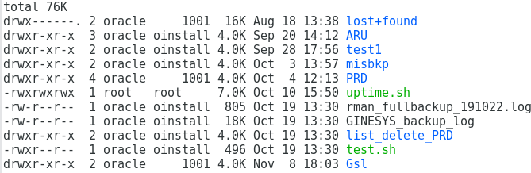

# LINUX PERMISSIONS
#### DOCUMENTATION GUIDE

1. VIEWING PERMISSION FOR FILES/DIRECTORIES
2. GRANTING PERMISSION TO FILES/DIRECTORIES
   1. LETTER NOTATION
   2. NUMBER NOTATION

### VIEWING PERMISSIONS FOR FILES/DIRECTORIES

- On Unix-like operating systems, a set of flags associated with each file determines who can access that file, and how they can access it.
- These flags are called file permissions or modes.
- The command name chmod stands for "change mode." It restricts the way a file can be accessed.
- Use command ls -l. When you do so, each file will be listed on a separate line in long format.



Understanding ls -l command

1. The first character will almost always be either a '-', which means it's a file, or a 'd', which means it's a directory.
2. The next nine characters (rw-r-r-) show the permissions of file.

- First, think of those nine characters as three sets of three characters. Each of the three "rwx" characters refer to a different operation you can perform on the file.
- The 'r' means you can "read" the file's contents.

The 'w' means you can "write", or modify, the file's contents.

The 'x' means you can "execute" the file. This permission is given only if the file is a program.

If any of the "rwx" characters is replaced by a '-', then that permission has been revoked.

- First three character represents permission that the owner has over the file.
- Next three character represents permission that group has over the file
- Last three character represents permission that everybody else has over the file

1. The next column or field specifies the number of links or directories inside this directory.
2. The next column specifies the user that owns the file, or directory.
3. Next column specifies the group that file belongs to, and any user in that group will have the permissions given in the third character set.
4. Next column specifies the size in bytes, you may modify this by using the -h option together with -l this will have the output in kb,Mb,Gb for a better understanding.
5. Next column is the date of last modification.
6. Finally last column is the name of the file.

##### Example 1


1. '-' represents type file.
2. rwx is permission for owner of file
3. r- - is permission for group.
4. r- - is permission for everyone except owner and group member.
5. oracle is the owner of the file test.sh
6. oinstall is the group name of oracle user.
7. 496 is the size of the file test.sh
8. Oct 19 13:30 represents modification date and time for file.
9. test.sh is the file name.

##### Example 2

```
drwxr-xr-x
```

A folder which has read, write and execute permissions for the owner, but only read and execute permissions for the group and for other users.

##### Example 3

```
-rw-rw-rw-
```

A file that can be read and written by anyone, but not executed at all.

##### Example 4

```
-rw-r--r--
```

A file that can be read and written by the user, but only read by the group and everyone else.

### GRANTING PERMISSION TO FILES/DIRECTORIES

Two methods for providing permissions:

- Letter notation
- Number notation

#### Letter Notation

Use letters u (owner/user), g (group) and o (other) to set permissions. r (read), w (write) and x (execute) represent the permissions to set.

Example:

```bash
$ chmod o+wx test.sh
```

This command adds write and execution permission for other users for file test.sh

```bash
$ chmod u-x test.sh
```

This command revokes execution permission from owner of file (Permission for Group and others remains unchanged)

```bash
$ chmod g=rx test.sh
```

This command gives read and execution permission for all members of group Providing combined permission in a single line:

```bash
$ chmod o+wx,u-x,g=rx test.sh
```

This command adds write permission for others, revokes execution permission from owner and grant read and execution permission to group users at the same time for file test.sh

#### Number Notation

As we said earlier, you'll often be asked to do things using numbers, such as "set 755 permissions". What do those numbers mean?

Well, each of the three numbers corresponds to each of the three sections of letters we referred to earlier. In other words, the first number determines the owner permissions, the second number determines the group permissions, and the third number determines

the other permissions.

Number notation command example:

```bash
$ chmod 777 filename
```

Each number can have one of eight values ranging from 0 to 7. Each value corresponds to a certain setting of the read, write and execute permissions, as explained in this table:

| Number | Read (R) | Write (W) | Execute (X) |
| ------ | -------- | --------- | ----------- |
| 0      | No       | No        | No          |
| 1      | No       | No        | Yes         |
| 2      | No       | Yes       | No          |
| 3      | No       | Yes       | Yes         |
| 4      | Yes      | No        | No          |
| 5      | Yes      | No        | Yes         |
| 6      | Yes      | Yes       | No          |
| 7      | Yes      | Yes       | Yes         |

So, for example:

- `777` is the same as `rwxrwxrwx`
- `755` is the same as `rwxr-xr-x`
- `666` is the same as `rw-rw-rw-`
- `744` is the same as `rwxr--r--`