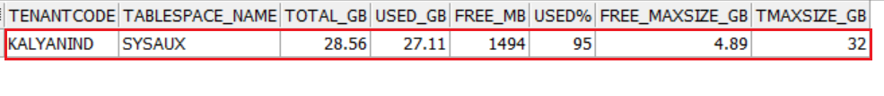
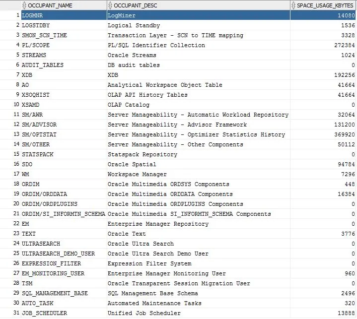
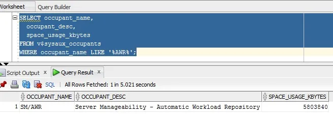
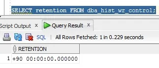
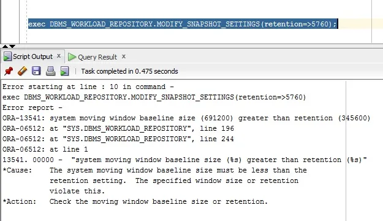
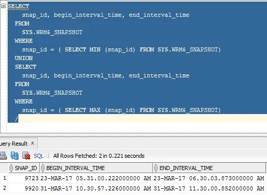

# Cleaning ORACLE SYSAUX Tablespace Usage

If the SYSAUX tablespace in an Oracle instance has grown significantly, eventually filling up the entire tablespace, and you find yourself unable to resize the tablespace to free up space, this article will help to release some used space in SYSAUX to continue normal database operations. First, we will cover some basics about SYSAUX to help understand the process better.

---

## SYSAUX Tablespace Overview

In Oracle, the SYSAUX tablespace is considered an auxiliary tablespace to the SYSTEM tablespace. It is required by Oracle as a default tablespace for many database features and products. Prior to SYSAUX, Oracle required multiple tablespaces to support the same database features and products. Thus, using the SYSAUX tablespace reduces the load on the SYSTEM tablespace.

### Restrictions on SYSAUX Tablespace
- Using the `SYSAUX DATAFILE` clause in the `CREATE DATABASE` statement, you can specify only datafile attributes in the SYSAUX tablespace.
- You cannot alter attributes like (`PERMANENT`, `READ WRITE`, `EXTENT MANAGEMENT LOCAL`, `SEGMENT SPACE MANAGEMENT AUTO`) with an `ALTER TABLESPACE` statement.
- The SYSAUX tablespace cannot be dropped or renamed.

---

## Cleanup Automatic Workload Repository (AWR Data)

To free up space when the Oracle SYSAUX tablespace is full, we can clean up AWR data. 

### Step 1: Check SYSAUX Tablespace Size

Check the size of the SYSAUX tablespace before cleanup:



### Step 2: Identify Space Occupants in SYSAUX

Run the following query to identify which occupants are consuming the most space in SYSAUX:

```sql
SELECT occupant_name, occupant_desc, space_usage_kbytes 
FROM v$sysaux_occupants;
```



AWR (SM/AWR) typically consumes a significant amount of space. You can query AWR consumption details as shown below:



### Step 3: Check and Modify AWR Retention Period

Check the current AWR retention period:

```sql
SELECT retention FROM dba_hist_wr_control;
```



If the retention is set to a high value (e.g., 90 days) and this is not required, you can reduce it. For example, to set it to 7 days (7 * 24 * 60 = 10080 minutes) with a snapshot interval of 60 minutes, execute:

```sql
EXECUTE dbms_workload_repository.modify_snapshot_settings(interval => 60, retention => 10080);
```

### Step 4: Handle Retention Period Errors (Baseline Window Size)

If you encounter an error while reducing the retention period, check the `MOVING_WINDOW_SIZE` value. Update it to the correct value and then re-execute the snapshot settings modification query:

```sql
EXEC DBMS_WORKLOAD_REPOSITORY.modify_baseline_window_size(window_size => 7);
```

To verify the updated moving window size:

```sql
SELECT moving_window_size
FROM dba_hist_baseline
WHERE baseline_type = 'MOVING_WINDOW';
```



### Step 5: Identify Old AWR Snapshots

Identify the oldest and newest AWR snapshots currently stored in the repository:

```sql
SELECT snap_id, begin_interval_time, end_interval_time
FROM SYS.WRM$_SNAPSHOT
WHERE snap_id = (SELECT MIN(snap_id) FROM SYS.WRM$_SNAPSHOT)
UNION
SELECT snap_id, begin_interval_time, end_interval_time
FROM SYS.WRM$_SNAPSHOT
WHERE snap_id = (SELECT MAX(snap_id) FROM SYS.WRM$_SNAPSHOT);
/
```



### Step 6: Drop Snapshots in the Identified Range

Execute the following command to cleanup all AWR snapshots between the desired range (e.g., snap ID 9723 to 9920):

```sql
BEGIN
  dbms_workload_repository.drop_snapshot_range(low_snap_id => 9723, high_snap_id => 9920);
END;
/
```

#### Alternative: Rebuild AWR Repositories
If the drop process above takes too long, you can connect as `SYSDBA` to drop old AWR tables and rebuild the repository tables. This method is much faster:

```sql
conn / as sysdba
@?/rdbms/admin/catnoawr.sql
@?/rdbms/admin/catawrtb.sql
```

After clearing the AWR reports, check the space freed:

```sql
SELECT occupant_name, occupant_desc, space_usage_kbytes 
FROM v$sysaux_occupants 
WHERE occupant_name LIKE '%AWR%';
```

```
OCCUPANT_NAME  OCCUPANT_DESC                                                SPACE_USAGE_KBYTES
-------------  -----------------------------------------------------------  ------------------
SM/AWR         Server Manageability - Automatic Workload Repository        35072
```

Verify tablespace capacity and free space:

```
Tablespace                Used MB    Free MB   Total MB  Pct. Free
------------------------- ---------- --------- --------- ----------
EXAMPLE                   1,219      42        1,261     3.33
SYSTEM                    2,438      634       3,072     20.64
SYSAUX                    639        211       850       24.82
USERS                     2          3         5         60
METALS                    41         359       400       89.75
UNDOTBS1                  36         609       645       94.42

6 rows selected.
```

---

## SYSAUX Tablespace Cleanup (AUDSYS Objects)

If the SYSAUX tablespace continues to fill up, check if the `AUDSYS` schema objects are the top consumers. This occurs when unified auditing is enabled, creating audit records regardless of the `audit_trail` parameter value.

> **Note:** You can run the script `$ORACLE_HOME/rdbms/admin/awrinfo.sql` to identify top consumers in the SYSAUX tablespace.

### Step 1: Identify Top Consumers in the SYSAUX Tablespace

Run the following query to list the top 5 largest segments in the SYSAUX tablespace:

```sql
COLUMN owner FORMAT A6
COLUMN segment_name FORMAT A50

SELECT * FROM (
  SELECT owner, segment_name || '~' || partition_name AS segment_name, bytes / (1024 * 1024) AS size_m
  FROM dba_segments
  WHERE tablespace_name = 'SYSAUX' 
  ORDER BY blocks DESC
) WHERE rownum < 6;
```

**Example Output:**
```
OWNER  SEGMENT_NAME                       SIZE_M
------ ---------------------------------- ----------
AUDSYS SYS_LOB0000091751C00014$$~        17808.125
AUDSYS CLI_SWP$8e0bfd86$1$1~              14296
AUDSYS CLI_TIME$8e0bfd86$1$1~             232
AUDSYS CLI_SCN$8e0bfd86$1$1~              224
AUDSYS CLI_LOB$8e0bfd86$1$1~              209
```

### Step 2: Clean the Unified Audit Trail

You can clean the unified audit trail using one of the following two options.

#### Option A: Complete Cleanup (Empty All Audit Records)

```sql
BEGIN
  DBMS_AUDIT_MGMT.CLEAN_AUDIT_TRAIL(
    AUDIT_TRAIL_TYPE        => DBMS_AUDIT_MGMT.AUDIT_TRAIL_UNIFIED,
    USE_LAST_ARCH_TIMESTAMP => FALSE,
    CONTAINER               => DBMS_AUDIT_MGMT.CONTAINER_CURRENT
  );
END;
/
```

#### Option B: Partial Cleanup (Keep Last 15 Days of Records)

Set the archive timestamp to keep the last 15 days of data:

```sql
BEGIN
  DBMS_AUDIT_MGMT.set_last_archive_timestamp(
    audit_trail_type  => DBMS_AUDIT_MGMT.audit_trail_unified,
    last_archive_time => SYSTIMESTAMP - 15,
    container         => DBMS_AUDIT_MGMT.container_current
  );
END;
/
```

### Step 3: Check Archive Timestamp Settings

Verify the configured archive timestamp settings:

```sql
COLUMN audit_trail FORMAT A20
COLUMN last_archive_ts FORMAT A40

SELECT audit_trail, last_archive_ts FROM dba_audit_mgmt_last_arch_ts;
```

```
AUDIT_TRAIL          LAST_ARCHIVE_TS
-------------------  ---------------------------------------
UNIFIED AUDIT TRAIL  18-JUL-18 02.26.17.000000 AM +00:00
```

Alternatively, you can set the archive timestamp explicitly using `TO_TIMESTAMP`:

```sql
BEGIN
  DBMS_AUDIT_MGMT.SET_LAST_ARCHIVE_TIMESTAMP(
    audit_trail_type  => DBMS_AUDIT_MGMT.AUDIT_TRAIL_OS,
    last_archive_time => TO_TIMESTAMP('10-SEP-07 14:10:10.0', 'DD-MON-RR HH24:MI:SS.FF')
  );
END;
/
```

### Step 4: Execute the Cleanup Job

Run the cleanup job using the previously defined last archive timestamp settings:

```sql
BEGIN
  DBMS_AUDIT_MGMT.CLEAN_AUDIT_TRAIL(
    audit_trail_type        => DBMS_AUDIT_MGMT.AUDIT_TRAIL_UNIFIED,
    use_last_arch_timestamp => TRUE
  );
END;
/
```

### Step 5: Flush Audit Data from Memory

```sql
EXEC DBMS_AUDIT_MGMT.FLUSH_UNIFIED_AUDIT_TRAIL;
```

### Step 6: Disable Default Unified Audit Policies

To prevent the audit trail from rapidly growing, disable default logging policies that are not required:

```sql
NOAUDIT POLICY ORA_SECURECONFIG;
NOAUDIT POLICY ORA_LOGON_FAILURES;
```

> **Note:** If needed, policies can be re-enabled later:
> ```sql
> AUDIT POLICY ORA_SECURECONFIG;
> AUDIT POLICY ORA_LOGON_FAILURES;
> ```

### Step 7: Verify Audit Cleanup Results

Log in as `SYSDBA` and count records in the unified audit trail:

```sql
conn / as sysdba
SELECT count(*) FROM unified_audit_trail;
```

```
  COUNT(*)
----------
 454543252
```

Execute a complete cleanup command if a full purge is desired:

```sql
BEGIN
  DBMS_AUDIT_MGMT.CLEAN_AUDIT_TRAIL(
    audit_trail_type        => DBMS_AUDIT_MGMT.AUDIT_TRAIL_UNIFIED,
    use_last_arch_timestamp => FALSE
  );
END;
/
```

Verify that the table has been cleaned:

```sql
SELECT count(*) FROM unified_audit_trail;
```

```
  COUNT(*)
----------
         1
```