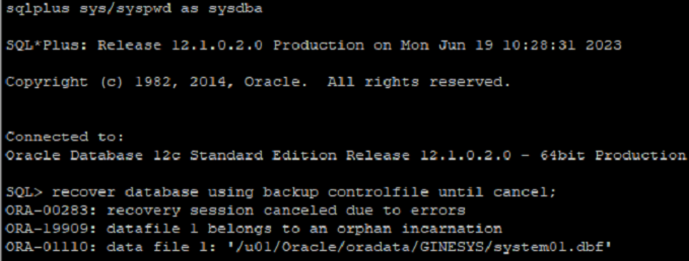
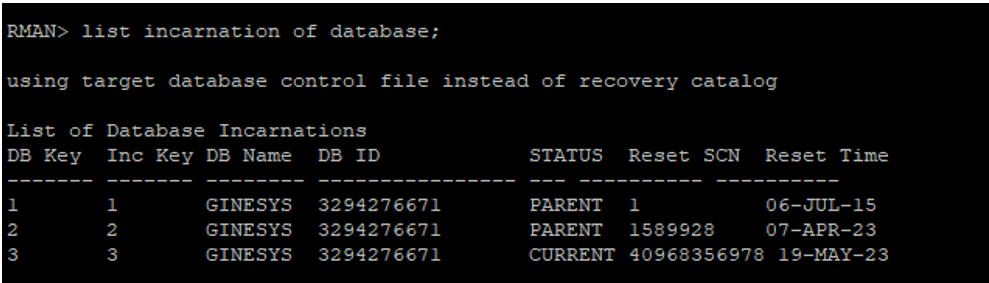
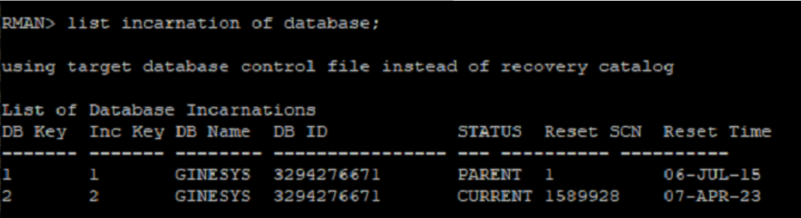
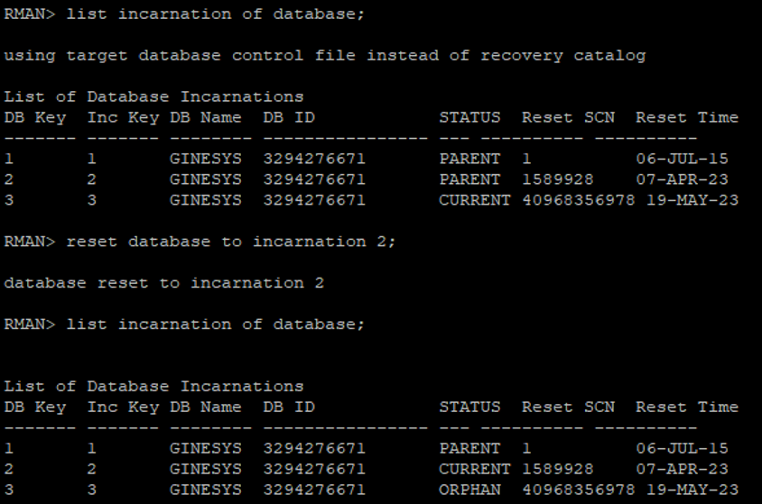
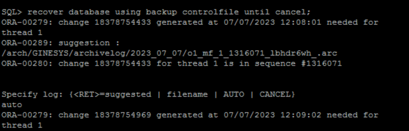

# Oracle Database Incarnation (ORA-19909)

**Scenario:** received ORA-19909 error when recovering a database on the backup server.

```sql
SQL> recover database using backup controlfile until cancel;
ORA-00283: recovery session canceled due to errors
ORA-19909: datafile 1 belongs to an orphan incarnation
ORA-01110: data file 1: '/u01/Oracle/oradata/GINESYS/system01.dbf'
```

****

## Cause of ORA-19909 error

Oracle cannot identify which database incarnation the file belongs to. The alert log contains more information.

This backup file was taken from the production server and restoration was performed on the backup server.

Check the Database Incarnation of the system on which restoration is performed.

Connect to RMAN and query list incarnation of the database;

```sql
RMAN> list incarnation of database;
```

****

Check Database Incarnation of the production database.

```sql
RMAN> list incarnation of database;
```

****

## Note:

(a) Current incarnation on backup system and production system are different.

(b) Production server has current incarnation of 2 with Reset SCN as 1589928 while backup database has incarnation of 3 with Reset SCN as 40968356978.

(c) In simple words the backup on production server was taken when incarnation of database was 2. Same backup was tried to restore on backup database which has incarnation of 3.

## Action on the ORA-19909 error

Restore a backup file that belongs to either the current or a prior incarnation of the database. If you are using RMAN to restore, RMAN will automatically select the correct backup.

Production database has incarnation 2 at the time of backup, make incarnation of backup database to 2.

Connect to RMAN on the backup database and reset incarnation to 2.

```sql
RMAN> reset database to incarnation 2;
```

****

Once incarnation has been reset, start database recovery.

```sql
SQL> recover database using backup controlfile until cancel;
```

****

## Removing orphan Entries from Incarnation (Optional)

Once the restoration system is set to Incarnation 2 we do not require Incarnation 3 anymore.

Steps to remove entry from Incarnation List:

### Step 1: First, make a backup of your current control file (both binary and trace):

```sql
SQL> alter database backup controlfile to trace as '/u01/control.txt';
Database altered
SQL> alter database backup controlfile to '/u01/control.ctl';
Database altered
```

### Step 2: shutdown and put your database in nomount mode:

```sql
SQL> shutdown immediate;
Database closed.
Database dismounted.
ORACLE instance shut down.
SQL> startup nomount;
ORACLE instance started.
Total System Global Area 627732480 bytes
Fixed Size 1346756 bytes
Variable Size 373293884 bytes
Database Buffers 247463936 bytes
Redo Buffers 5627904 bytes
```

### Step 3: Using contents of trace control file text, recreate the control file using the NORESETLOGS case:

```sql
CREATE CONTROLFILE REUSE DATABASE "GINESYS" NORESETLOGS ARCHIVELOG
MAXLOGFILES 16
MAXLOGMEMBERS 3
MAXDATAFILES 100
MAXINSTANCES 8
MAXLOGHISTORY 13080
LOGFILE
GROUP 1 '/u01/Oracle/oradata/GINESYS/redo01.log' SIZE 100M BLOCKSIZE 512,
GROUP 2 '/u01/Oracle/oradata/GINESYS/redo02.log' SIZE 100M BLOCKSIZE 512,
GROUP 3 '/u01/Oracle/oradata/GINESYS/redo03.log' SIZE 100M BLOCKSIZE 512,
GROUP 4 '/u01/Oracle/oradata/GINESYS/redo04.log' SIZE 100M BLOCKSIZE 512,
GROUP 5 '/u01/Oracle/oradata/GINESYS/redo05.log' SIZE 100M BLOCKSIZE 512,
GROUP 6 '/u01/Oracle/oradata/GINESYS/redo06.log' SIZE 100M BLOCKSIZE 512,
GROUP 7 '/u01/Oracle/oradata/GINESYS/redo07.log' SIZE 100M BLOCKSIZE 512,
GROUP 8 '/u01/Oracle/oradata/GINESYS/redo08.log' SIZE 100M BLOCKSIZE 512,
GROUP 9 '/u01/Oracle/oradata/GINESYS/redo09.log' SIZE 100M BLOCKSIZE 512,
GROUP 10 '/u01/Oracle/oradata/GINESYS/redo10.log' SIZE 100M BLOCKSIZE 512
\-- STANDBY LOGFILE
DATAFILE
'/u01/Oracle/oradata/GINESYS/system01.dbf',
'/u01/Oracle/oradata/GINESYS/GIN_TS_SUMMARY_01',
'/u01/Oracle/oradata/GINESYS/sysaux01.dbf',
'/u01/Oracle/oradata/GINESYS/undotbs01.dbf',
'/u01/Oracle/oradata/GINESYS/GIN_TS_TX_DATA_01',
'/u01/Oracle/oradata/GINESYS/users01.dbf',
'/u01/Oracle/oradata/GINESYS/GIN_TS_NOLOGGING_01',
'/u01/Oracle/oradata/GINESYS/GINOLAP01',
'/u01/Oracle/oradata/GINESYS/INDX01',
'/u01/Oracle/oradata/GINESYS/undotbs03.dbf',
'/u01/Oracle/oradata/GINESYS/undotbs02.dbf',
'/u01/Oracle/oradata/GINESYS/users10.dbf',
'/u01/Oracle/oradata/GINESYS/users09.dbf',
'/u01/Oracle/oradata/GINESYS/users08.dbf',
'/u01/Oracle/oradata/GINESYS/users07.dbf',
'/u01/Oracle/oradata/GINESYS/users06.dbf',
'/u01/Oracle/oradata/GINESYS/users05.dbf',
'/u01/Oracle/oradata/GINESYS/users04.dbf',
'/u01/Oracle/oradata/GINESYS/users03.dbf',
'/u01/Oracle/oradata/GINESYS/users02.dbf',
'/u01/Oracle/oradata/GINESYS/INDX07',
'/u01/Oracle/oradata/GINESYS/INDX06',
'/u01/Oracle/oradata/GINESYS/INDX05',
'/u01/Oracle/oradata/GINESYS/INDX04',
'/u01/Oracle/oradata/GINESYS/INDX03',
'/u01/Oracle/oradata/GINESYS/INDX02'
CHARACTER SET WE8MSWIN1252;
```

### Step 4: No recovery is needed as DB is shutdown gracefully:

```sql
SQL> RECOVER DATABASE;
ORA-00283: recovery session canceled due to errors
ORA-00264: no recovery required
```

### Step 5: Open Database

```sql
SQL> alter database open;
Database altered.
```

**Note:** Don't forget to also recreate any temporary tablespace datafile from control file trace text, set up the default RMAN configurations or to re-catalog any other information that is kept in control file.

### Step 6: Recheck database incarnation.

**Conclusion:** By systematically addressing the causes and actions related to the ORA-19909 error, you can ensure a successful recovery process and maintain the integrity of your database environment. Proactive measures such as aligning database incarnations and meticulous recovery procedures contribute to a robust and dependable database management approach.