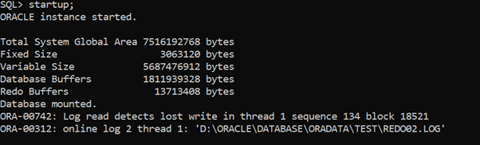
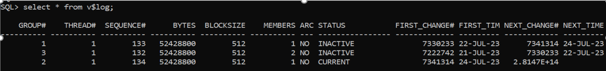
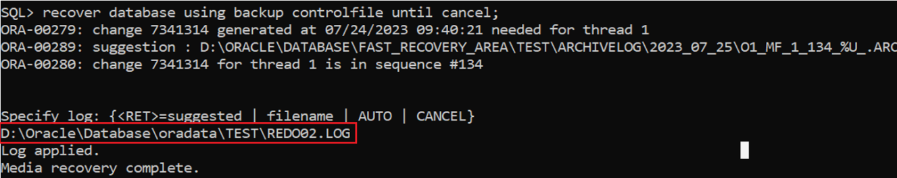
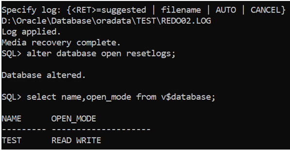
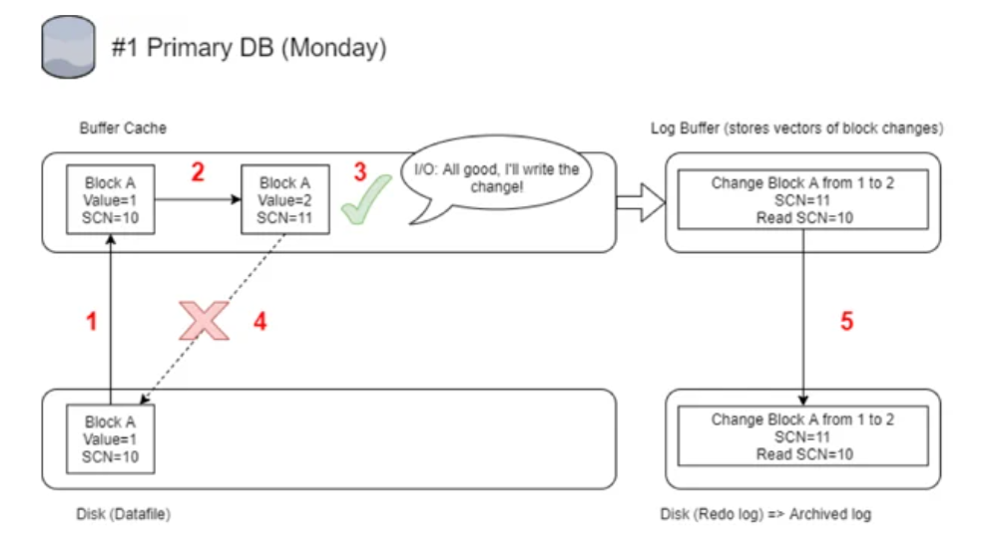

# Oracle Database Lost Write Recovery (ORA-00742,ORA-00312)

- **Scenario:** While opening the database in READ/WRITE mode following error messages were received:

```sql
ORA-32004: obsolete or deprecated parameter(s) specified for RDBMS instance

ORA-00742: Log read detects lost write in thread 1 sequence 134 block 18521

ORA-00312: online log 2 thread 1: 'D:\\ORACLE\\ORADATA\\TEST\\REDO02.LOG'
```

## Solution:

### Step 1: Open the database in the mount stage.



### Step 2: Check the status of the redo log files.



### Step 3: Start database recovery using the following command:

```sql
SQL> recover database using backup controlfile until cancel;
```

**Note:** By default, database recovery uses archived redo logs for recovery operations. However, we have mentioned recovering with redo logs instead.

### Step 4: Mention the path for REDO02.LOG file when specifying recovery. Sequence 134 requires recovery and REDO02.LOG file contains that sequence. (reference v\$log view for sequence# column)



### Step 5: Once the recovery is complete, open the database with the "RESETLOGS" option.

```sql
SQL> alter database open resetlogs;
```



## Understanding Lost Write

A Lost Write is exactly what the name says it is - when a write to disk from the buffer cache is lost. It can happen on any read-write database. When a database block is loaded to the buffer cache and is changed, the database needs to write it back to disk at some point (flushing dirty blocks). The way it's usually done is that this block is handed to the I/O subsystem and the I/O subsystem acknowledges the handover, but the write to disk itself is not done at this point. The database is OK with this acknowledgement and goes on.

After the acknowledgement and before the write happens, an error can occur - and the result is that the write will not happen on the I/O subsystem (it will get lost) and we still have the old block on the disk. But the Database still considers that the write happened.



1. Block is read from disk to buffer cache
2. Block gets changed from value=1 to value=2 (SCN of the block after change = 11)
3. IO confirms the change to the database (but the write doesn't happen at this point)
4. Write gets lost along the way and the change is never written to disk. Block A stays on the disk with old value 1 - **it's consistent and not corrupted**
5. Together with the change of the block in the buffer cache, the change is also written in the redo log file - only the vector of the change is stored (not the actual values) and read SCN of the block.

The change is recorded in redo log files and later can be applied to the database to initiate recovery and update any metadata