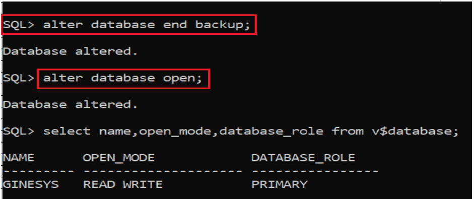

# Oracle Database Open Issue (ORA-10873)

## Scenario

Error encountered when attempting to open the database after a service interruption.

```sql
SQL> alter database open;

alter database open
*
ERROR at line 1:
ORA-10873: file 1 needs to be either taken out of backup mode or media recovered
ORA-01110: data file 1: 'D:\ORACLE\DATABASE\ORADATA\GINESYS\SYSTEM01.DBF'
```

## Solution

This error occurs because the database shut down abnormally while an online backup operation was still in progress, leaving datafiles in backup mode.

### Step 1: Check Backup Status

Bring the database to the `MOUNT` stage and check the backup status by querying the `V$BACKUP` view:

```sql
SQL> SELECT * FROM v$backup;
```

> [!NOTE]
> An `ACTIVE` status indicates that a backup is still in progress for the listed datafiles (e.g., datafiles 1, 3, 5, 6), meaning these files are currently locked in backup mode.

### Step 2: End Backup Mode

To resolve this problem, take the database out of backup mode by executing the following command:

```sql
SQL> ALTER DATABASE END BACKUP;
```



### Step 3: Open the Database

Once backup mode is disabled, open the database:

```sql
SQL> ALTER DATABASE OPEN;
```