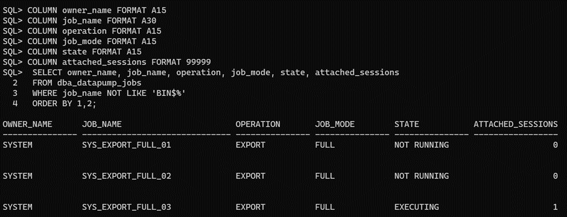
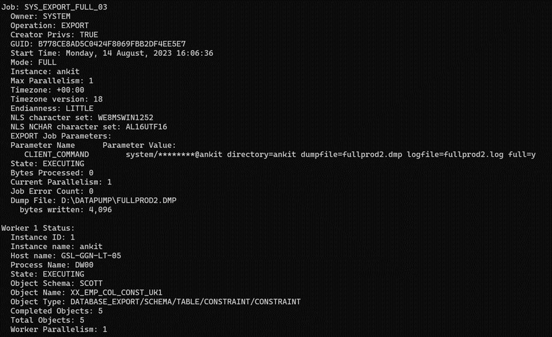
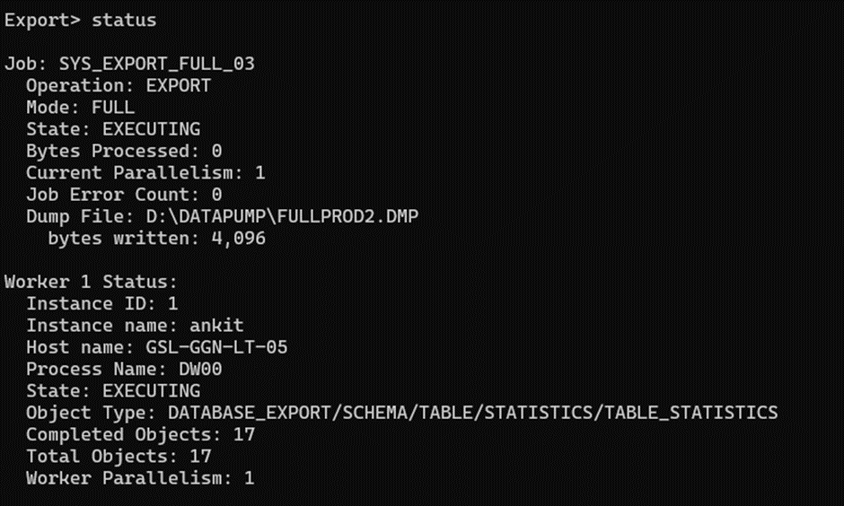

# Oracle Datapump Slowness(Scenario 1)

1. **Scenario:** The Data Pump export job, which used to be completed within 1 hour and 30 minutes, is now taking more than 5 to 6 hours. The root cause of this extended duration appears to be related to Data Pump jobs consuming excessive free space in the USERS tablespace

**Issue:** _The issue at hand revolves around Data Pump jobs leading to an unexpected free space consumption within the USERS tablespace._

1. **Solution:**

### Step 1: Identify Existing Data Pump Jobs

To begin addressing the issue, it's crucial to identify the Data Pump jobs currently active within the system.

Run the following SQL query:

```sql
SELECT owner_name, job_name, operation, job_mode, state, attached_sessions

FROM dba_datapump_jobs

WHERE job_name NOT LIKE 'BIN\$%'

ORDER BY owner_name, job_name;
```

| OWNER_NAME | JOB_NAME           | OPERATION | JOB_MODE | STATE       | ATTACHED_SESSIONS |
| ---------- | ------------------ | --------- | -------- | ----------- | ----------------- |
| SYSTEM     | SYS_EXPORT_FULL_01 | EXPORT    | FULL     | NOT RUNNING | 0                 |
| SYSTEM     | SYS_EXPORT_FULL_02 | EXPORT    | FULL     | NOT RUNNING | 0                 |
| SYSTEM     | SYS_EXPORT_FULL_03 | EXPORT    | FULL     | NOT RUNNING | 0                 |
| SYSTEM     | SYS_EXPORT_FULL_04 | EXPORT    | FULL     | NOT RUNNING | 0                 |
| SYSTEM     | SYS_EXPORT_FULL_05 | EXPORT    | FULL     | NOT RUNNING | 0                 |
| SYSTEM     | SYS_EXPORT_FULL_06 | EXPORT    | FULL     | NOT RUNNING | 0                 |
| SYSTEM     | SYS_EXPORT_FULL_07 | EXPORT    | FULL     | NOT RUNNING | 0                 |

This query retrieves information about Data Pump jobs, helping us understand their current states and attributes.

### Step 2: Confirm Jobs are Not Running

Before proceeding, ensure that the listed jobs are indeed in a _'NOT RUNNING'_ state.

### Step 3: Drop Tables

In order to mitigate the space consumption issue, it is recommended to drop the tables associated with the identified Data Pump jobs. For each job, execute the following command:

```sql
SQL> DROP TABLE &lt;OWNER_NAME&gt;.&lt;JOB_NAME&gt;;

DROP TABLE SYSTEM.SYS_EXPORT_FULL_01;

DROP TABLE SYSTEM.SYS_EXPORT_FULL_02;

DROP TABLE SYSTEM.SYS_EXPORT_FULL_03;

DROP TABLE SYSTEM.SYS_EXPORT_FULL_04;

DROP TABLE SYSTEM.SYS_EXPORT_FULL_05;

DROP TABLE SYSTEM.SYS_EXPORT_FULL_06;

DROP TABLE SYSTEM.SYS_EXPORT_FULL_07;

Replace &lt;OWNER_NAME&gt; with the owner's name (e.g., SYSTEM) and &lt;JOB_NAME&gt; with the specific job name (e.g., SYS_EXPORT_FULL_01)
```

### Step 4: Confirm Table Drops

After executing the DROP TABLE commands, verify that the tables have been successfully removed.

### Step 5: Rerun Data Pump Job

With the problematic tables dropped, it's time to rerun the Data Pump job that previously experienced the extended execution time. The issue should now be resolved, and the job should execute without encountering unnecessary space consumption.

1. **Terminating Running/Executing Data Pump Jobs:**

In the above scenario there were no running datapump jobs. Below steps provide a step-by-step guide on how to terminate running/executing Data Pump job:

### Step 1: Identity Executing Data Pump Jobs

Begin by identifying the existing Data Pump jobs that are currently executing:

```sql
SELECT owner_name, job_name, operation, job_mode, state, attached_sessions

FROM dba_datapump_jobs

WHERE job_name NOT LIKE 'BIN\$%'

ORDER BY owner_name, job_name;
```

__

This query provides a comprehensive list of Data Pump jobs that are currently executing.

### Step 2: Attaching to an Export Job

To monitor the progress of an ongoing export job, you can attach to it using the following steps:

1. Open a terminal and log in.
2. Attach to the export job using the expdp command with the 'attach' option and the job name:

```bash
expdp system/syspwd@database_name attach=SYS_EXPORT_FULL_03
```

__

### Step 3: Checking Export Job Status

To monitor the status of an attached export job, follow these steps:

1. Within the attached expdp session, use the 'status' command:

```sql
Export> status
```

__

### Step 4: Terminating an Export Job

In situations where it is necessary to terminate an ongoing export job, you can use the 'kill_job' command:

1. Within the attached expdp session, use the 'kill_job' command:

```sql
Export> kill_job
```


1. Confirm the termination by responding to the prompt: Are you sure you wish to stop this job (\[yes\]/no): yes

**Note:** When performing a datapump job, avoid closing session directly. Rather gracefully terminate the job using "ctrl+c" or as explained above.

## Conclusion:

Oracle Data Pump (expdp) offers efficient data export and import capabilities. It empowers users to initiate, monitor, and manage export jobs effectively. By following the provided steps, you can identify executing jobs, attach to them for monitoring, check their status, and if needed, gracefully terminate them using the kill_job command. It is essential to possess the required privileges and to fully comprehend the potential consequences before making use of the kill_job command.