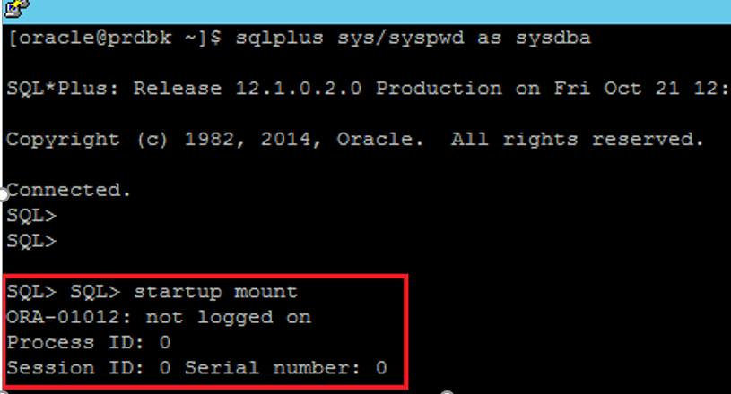
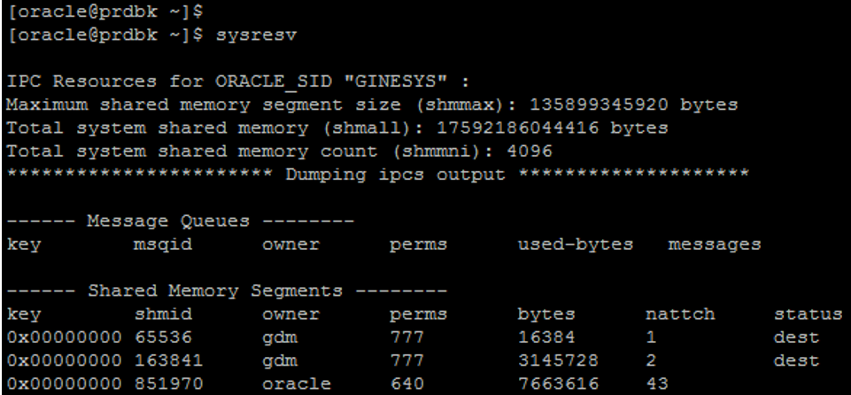
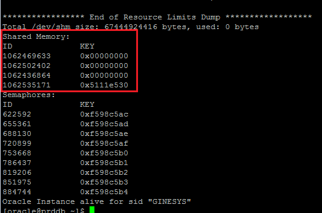
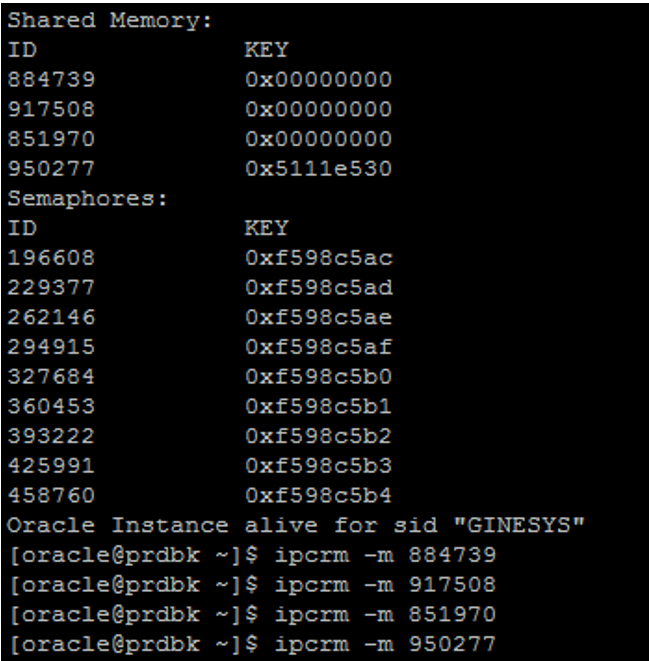
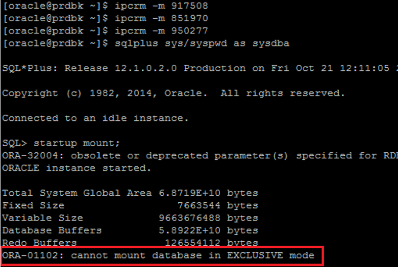
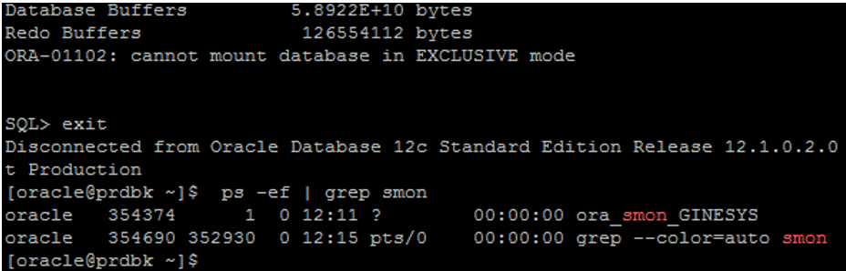
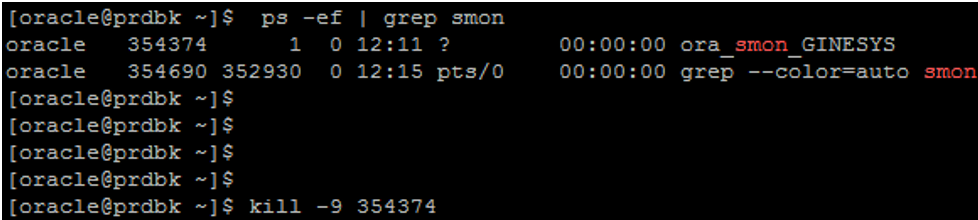
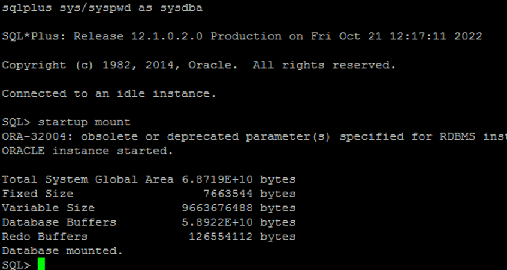

# Oracle Ora-01012: Not Logged On Error

1. **Potential Causes**

The ORA-01012 error can be caused by several issues:

- A down database.
- The system is holding down memory segments from a previous instance crash.
- File permissions in ORACLE_HOME have been changed while the database is running.
- An invalid value for the \$ORACLE_SID environment variable.
- Exceeding the "processes" initsid.ora parameter (max sessions reached)

1. **Solution for ORA-01012 error**

To resolve this error remove the orphaned shared memory segment using **sysresv** utility.

- sysresv is a Linux command. sysresv command can be used to view the currently allocated IPC(Processes communicate with each other and with the kernel to coordinate their activities.
- Linux supports a number of Inter-Process Communication (IPC) mechanism resources for shared memory.
- sysresv command will list the currently allocated IPC resources for shared memory and remove the shared memory segment using ipcrm -m command.

1. **Steps for resolving ORA-01012**

### Step 1: Try to start the database.

****

Error Log while starting database.

```sql
ORA-01012: not logged on
Process ID: 0
Session ID: Serial number: 0
```

### Step 2: Disconnect from sqlplus and run the command **sysresv** on Linux terminal:

****

### Step 3: Identify the list of shared memory processes.

****

### Step 4: Kill all Shared Memory processes

To kill these sessions run the following command:
```bash
ipcrm -m "ID"
```
****

### Step 5: Connect to sqlplus and startup the database again

****

## _Note:_

## The instance will start but database would not go to mount stage.
```sql
error: ORA-01102: cannot mount database in EXCLUSIVE mode.
```
## ORA-01102 occurs when you are mounting (opening) a database and another instance is already opened in parallel (exclusive) mode.

### Step 6: Disconnect from sqlplus and run the following command to identify already running oracle process:
```bash
ps -ef | grep smon
```

****

### Step 7: Kill ora_smon_GINESYS process using the following command:
```bash
kill -9 <PID>
```

****

### Step 8: Startup the database again

****

**Conclusion:** This document discussed the ORA-01012 error in Oracle. Causes include database problems, memory issues, crash and file permission changes. The solution involves using sysresv to remove orphaned shared memory and restarting the database.