# PostgreSQL 14 DBA Guidebook
**­­POSTGRESQL 14.8**

*Documentation Guide*

_May 2023_

## 1. Introduction to PostgreSQL

- [What is PostgreSQL?](#what-is-postgresql)
- [PostgreSQL Naming Conventions](#postgresql-naming-conventions)
- [PostgreSQL Limits](#postgresql-limits)
- [Page Layout](#page-layout)

## 2. Installing PostgreSQL on Windows/Linux

- [PostgreSQL System Requirement](#postgresql-system-requirement)
- [Installing PostgreSQL 14.8 On Windows](#installing-postgresql-148-on-windows)
- [Setting Up PostgreSQL Windows Environment](#setting-up-postgresql-windows-environment)
- [Installing PostgreSQL on Linux (Default Directory)](#installing-postgresql-on-linux-default-directory)
- [Setting Up PostgreSQL Linux Environment](#setting-up-postgresql-linux-environment-default-directory)
- [Installing PostgreSQL on Linux (Non-Default Directory)](#installing-postgresql-on-linux-non-default-directory)

## 3. PostgreSQL Architecture

- [Fundamentals of PostgreSQL Architecture](#fundamentals-of-postgresql-architecture)
- [Process and Memory Architecture](#process-and-memory-architecture)
- [Post Master Process](#postmaster-process-supervisor-process)
- [Utility Processes](#utility-processes)
- [Memory Segments](#memory-segments)
- [Physical Files](#physical-files)

## 4. Database Clusters

- [What is Database Cluster?](#what-is-database-cluster)
- [Initdb](#initdb)
- [How to Start\\Stop Cluster](#how-to-startstop-cluster)
- [Difference between Reload and Restart](#difference-between-reload-and-restart)
- [How to Restart\\Reload Cluster](#how-to-restartreload-cluster)
- [Types of Shutdown](#types-of-shutdown)
- [Pg_Controldata](#pg_controldata)

## 5. Database Directory Layout

- [Overview of Installation Directory Layout](#overview-of-installation-directory-layout)
- [Overview of Database Directory Layout](#overview-of-database-directory-layout)
- [Overview of Base Directory Layout](#overview-of-base-directory-layout)

## 6. Configuration Files

- [Postgresql.conf File](#postgresqlconf-file)
- [Pg Catalog tables to view File settings](#pg-catalog-tables-to-view-file-settings)
- [Changing parameter from Postgresql.conf File](#postgresqlconf-file)
- [Postgresql.auto.conf](#postgresqlautoconf)
- [Pg_ident.conf with sample](#pg_identconf-with-sample)
- [Pg_hba.conf with sample](#pg_hbaconf-with-sample)
- [Steps to modify Pg_hba.conf file](#steps-to-modify-pg_hbaconf-file)

## 7. Database Creation / Users / Schema / Privileges

- [Create database - Psql / createdb utility](#create-database-psql-createdb-utility)
- [Drop database - Psql/ dropdb utility](#drop-database-psql-dropdb-utility)
- [Create user - Psql/ createuser utility/ Interactive](#create-user-psql-createuser-utility-interactive)
- [Drop user - Psql/ dropuser utility](#drop-user-psql-dropuser-utility)
- [Create/Drop Schema and Search Schema Path](#createdrop-schema-and-search-schema-path)
- [Public Schema](#public-schema)
- [Privileges in PostgreSQL](#privileges-in-postgresql)
- [Grants and Revoke Access](#grants-and-revoke-access)

## 8. PSQL Commands

- [Connect to Psql](#connect-to-psql)
- [Psql Commands](#psql-commands)
- [Psql File Operations](#psql-file-operations)

## 9. Pg System Catalogs and Time Zone

- [Pg System Catalogs](#pg-system-catalogs)
- [Date & Time zones in PostgreSQL](#date-time-zone-in-postgresql)

## 10. PostgreSQL CRUD Operations

- [What is CRUD?](#what-is-crud)
- [Create operations with examples](#create-operations-with-examples)
- [Data Types in PostgreSQL](#data-types-in-postgresql)
- [Constraints](#constraints)
- [PostgreSQL Build-in Functions](#postgresql-build-in-functions)
- [Read operations and Column Aliases](#read-operations-and-column-aliases)
- [Update operations with examples](#update-operations-with-examples)
- [Delete with examples](#delete-with-examples)
- [Transaction](#transaction)
- [View, Sequences](#view-sequences)
- [Index and its Types](#index-and-its-types)

## 11. Table Inheritance and Partitioning

- [Table Inheritance](#table-inheritance)
- [Table Partitioning](#table-partitioning)
- [Copy Table](#copy-table)

## 12. Tablespace

- [Tablespace & its advantages](#tablespace-its-advantages)
- [PostgreSQL default tablespaces](#postgresql-default-tablespaces)
- [Create tablespaces](#create-tablespaces)
- [Move table from one tablespace to another](#move-table-from-one-tablespace-to-another)
- [Drop tablespaces](#drop-tablespaces)
- [Temporary tablespaces](#temporary-tablespaces)

## 13. Backup and Restore

- [Back & Types of Backup](#back-types-of-backup)
- [Logical Backup](#logical-backup)
- [Pg_dump](#pg_dump)
- [Restore backup of pg_dump using psql](#restore-backup-from-pg_dump-using-psql)
- [Restore backup of pg_dump using pg_restore](#restore-backup-from-pg_dump-using-pg_restore)
- [Pg_dumpall](#pg_dumpall)
- [Difference between pg_dump and pg_dumpall](#difference-between-pg_dump-and-pg_dumpall)
- [Backup and Restore using pg_dumpall](#backup-and-restore)
- [Compressing and splitting dump files](#compressing-and-splitting-dump-files)
- [File System backup - Offline backup mode](#file-system-backup-offline-backup-mode)
- [Continuous Archiving](#continuous-archiving)
- [Steps to set up continuous archiving](#steps-to-set-up-continuous-archiving)
- [Online Low Level API Backup](#pg_basebackup-online-backup-mode)
- [Pg_basebackup - Online backup mode](#pg_basebackup-online-backup-mode)
- [Online Backup Restore and Point in Time Recovery](#online-backup-restore-and-pitr-point-in-time-recovery)

## 14. Maintenance in PostgreSQL

- [Introduction to Maintenance](#introduction-to-maintenance)
- [Updating Planner Statistics\\Analyze](#updating-planner-statisticsanalyze)
- [Explain plan and Query Execution Cost](#explain-plan-and-query-execution-cost)
- [Data Fragmentation](#data-fragmentation)
- [Vacuum Vs Vacuum full](#vacuum-vs-vacuum-full)
- [Auto-Vacuum in PostgreSQL](#auto-vacuum-in-postgresql)
- [Transaction ID Wrap Around Failure](#transaction-id-wrap-around-failure)
- [Vacuum Freeze](#vacuum-freeze)
- [Routine Re-Indexing](#routine-re-indexing)
- [Cluster](#cluster)

## 15. PostgreSQL Upgarde

- [What is Upgrade](#what-is-upgrade)
- [Ways to Upgrade](#ways-to-upgrade)
- [Pg_upgrade utility](#pg_upgrade-utility)
- [Uninstalling PostgreSQL](#uninstalling-postgresql)

## 16. New Features and Enhancement (postgreSQL13)

- [B-Tree Deduplication](#b-tree-deduplication)
- [Incremental Sorting](#incremental-sorting)
- [Parallel Vacuum](#parallel-vacuum)
- [Trusted Extension](#trusted-extension)
- [Drop Database (Force)](#drop-database-force)
- [Track Wal_Usage](#track-wal_usage)
- [System Views](#system-views)

## 17. New Features and Enhancement (postgreSQL15)

- [Server Statistics](#server-statistics)
- [Logging Format](#logging-format)
- [Merge](#merge)
- [Roles and Setting server parameters](#roles-and-setting-server-parameters)
- [Psql \\Dconfig](#psql-dconfig-and-other-features)
- [Misc. Features](#misc-features)

## 18. PostgreSQL Replication

- [Introduction to Replication](#introduction-to-replication)
- [Reasons for Replication](#reasons-for-replication)
- [Master/Slave Configuration](#masterslave-configuration)
- [Replication Modes](#replication-modes)
- [Types of Replication](#types-of-replication)
- [Physical and Logical Replication](#types-of-replication)
- [Physical Replication (Type 1: Log Based replication)](#log-based-shipping-replication)
- [Physical Replication (Type 2: Streaming Replication)](#streaming-replication)
- [Monitoring Primary/Standby Streaming Replication](#monitoring-primary-and-standby-streaming-replication)
- [Replication Slot in Streaming Replication](#replication-slots-in-streaming-replication)
- [Synchronous mode in Streaming Replication](#synchronous-mode-in-streaming-replication)
- [Setup Primary/Standby Streaming Replication Using Repmgr](#setup-primarystandby-streaming-replication-using-repmgr)
- [Automatic failover and Node Rejoin using Repmgr](#automatic-failover-and-node-rejoin)
- [Adding New Standby Node and Standby Follow using Repmgr](#adding-new-standby-node-and-standby-follow)
- [Cascading Streaming Replication using Repmgr](#cascading-streaming-replication)
- [Streaming Replication Switchover using Repmgr](#streaming-replication-switchover)
- [Uninstall Repmgr](#uninstall-replication-manager)
- [Introduction to Logical Replication](#logical-replication)
- [Publication Vs Subscription](#logical-replication)
- [Setup Logical Replication](#setup-logical-replication)
- [Logical Replication - Test Case 1](#setup-logical-replication)
- [Logical Replication - Test Case 2](#setup-logical-replication)
- [Logical Replication - Test Case 3](#setup-logical-replication)
- [Logical Replication - Test Case 4](#setup-logical-replication)
- [Logical Replication - Test Case 5](#setup-logical-replication)

## 19. Server Parameters Tuning

- [Introduction to Server Parameters](#introduction-to-server-parameters)

**Introduction to PostgreSQL**

### What is PostgreSQL?

- PostgreSQL is a free and open source object-relational database management system(ORDBMS).
- PostgreSQL began its journey in 1986 as POSTGRES, a research project of the University of California at Berkeley.
- Michael Stonebreaker and his colleagues developed PostgreSQL.
- PostgreSQL is cross platform and runs on many operating systems such as Linux, FreeBSD, OS X, Solaris and Microsoft Windows.
- PostgreSQL features transactions with Atomicity, Consistency, Isolation, Durability (ACID) properties.
- PostgreSQL manages concurrency through multisession concurrency control (MVCC).

### PostgreSQL Naming Conventions

When working with PostgreSQL, it is recommended to follow naming conventions to ensure consistency and clarity in your database schema. Here are some common conventions:

| **Common Names** | **PostgreSQL Names**             |
| ---------------- | -------------------------------- |
| Table or Indexes | Relation                         |
| Row              | Tuple                            |
| Column           | Attribute                        |
| Data Block       | Page( on the disk)               |
| Page             | Buffer( when block is in memory) |

### PostgreSQL Limits

| **Items**              | **Upper Limit**                                                       | **Description**                               |
| ---------------------- | --------------------------------------------------------------------- | --------------------------------------------- |
| Database Size          | Unlimited                                                             |                                               |
| Number of Databases    | 4,294,950,911                                                         |                                               |
| Relations per database | 1,431,650,303                                                         |                                               |
| Relation size          | 32TB                                                                  | Default BLCKSZ of 8192 bytes                  |
| Rows per table         | Limited by the number of tuples that can fit onto 4,294,967,295 pages |                                               |
| Columns per table      | 1600                                                                  |                                               |
| Field size             | 1GB                                                                   |                                               |
| Identifier length      | 63 bytes                                                              |                                               |
| Indexes per table      | Unlimited                                                             | Constrained by maximum relations per database |
| Columns per index      | 32                                                                    |                                               |
| Partition keys         | 32                                                                    |                                               |

### Page Layout

- Page is a smallest unit of data storage.
- Every table and index is stored as an array of pages of fixed size.
- By Default, In PostgreSQL the page size is 8kb.
- We can configure different page size during compiling the server
- All pages are logically equivalent and any row can be stored in any page.

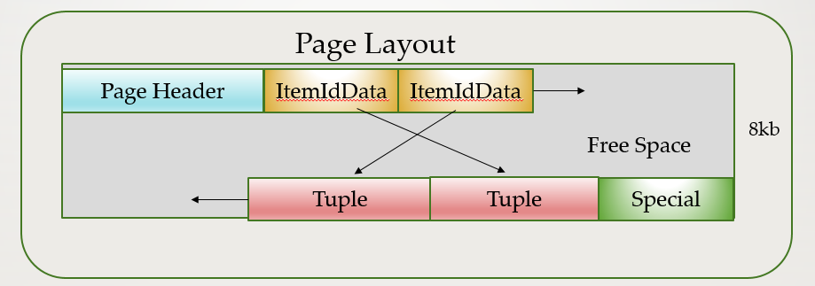

| **Items**        | **Description**                                                                                                |
| ---------------- | -------------------------------------------------------------------------------------------------------------- |
| Page Header Data | 24 Bytes Long. Contains General Information about the page, including free space pointers                      |
| ItemIdData       | Array of pairs pointing to the actual items. 4 Bytes per item.                                                 |
| Free Space       | The unallocated space, New item Pointers are allocated from the start of this area, New items from the end.    |
| Tuple            | The actual item themselves.                                                                                    |
| Special Space    | Index access method specific data. Different methods store different data. Empty is ordinary tables.(metadata) |

**Installing PostgreSQL on Windows/Linux**

### PostgreSQL System Requirement

1. Hardware Requirements:

- 1 GHz PROCESSOR
- 2 GB of RAM
- 512 MB of HDD

1. Software Requirements:

- User must have administrator privileges on Windows System
- Root or Super user access is required on Linux System

### Installing PostgreSQL 14.8 On Windows

Step 1: Go to the official PostgreSQL website by navigating to [www.postgresql.org/downloads](http://www.postgresql.org/downloads).

Step 2: On the downloads page, select your operating system as Windows.

Step 3: Click on the "Download the Installer" button to begin the download.

Step 4: Choose the appropriate version of PostgreSQL for your system. For example, you can download Version 14.8 for Win x86_64.

Step 5: Once the download is complete, locate the downloaded setup file and right-click on it. Select "Run as Administrator" to initiate the installation process with elevated privileges.

Step 6: Follow the installation wizard by selecting the desired options. You can choose the installation location, additional components, and other preferences based on your requirements.

Step 7: Wait for the installation process to complete. The installer will install PostgreSQL and its associated components on your system.

Step 8: After the installation is finished, you can access the PostgreSQL command-line interface (psql) by searching for it in the Start menu or by running it from the command prompt. Use the appropriate credentials and connection details to connect to your PostgreSQL instance.

Step 9: use command psql -U "username" -d "database_name" -p "port_number"

To access database from command prompt.

### Setting Up PostgreSQL Windows Environment

Step 1: Click on the Start button, search for "This PC" or "My PC," and right-click on it. Select "Properties" from the context menu.

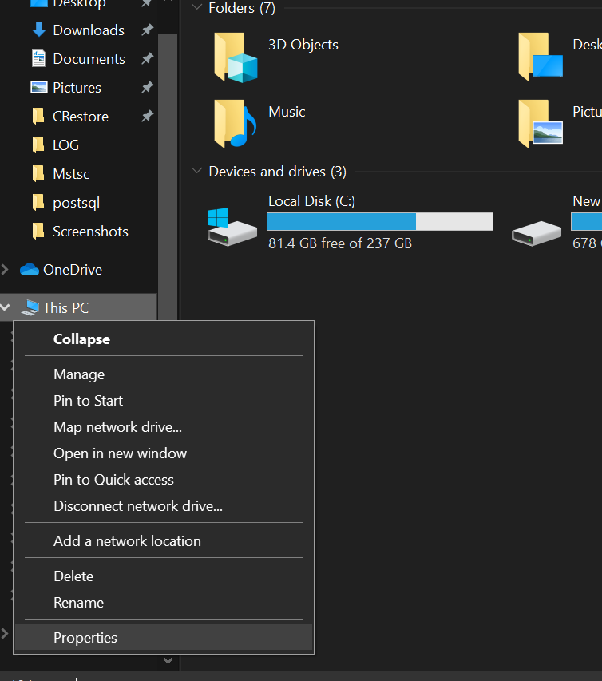

Step 2: In the System window, click on "Advanced system settings"

Step 3: In the System Properties dialog box, click on the "Environment Variables" button at the bottom.

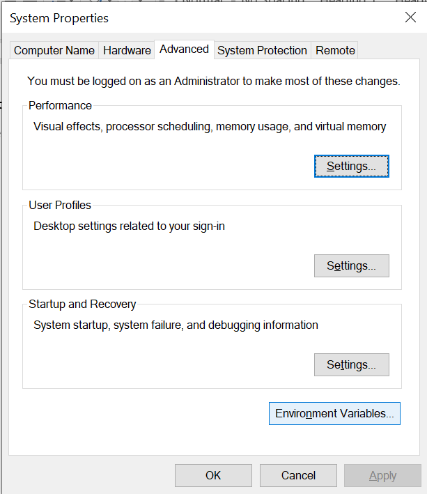

Step 4: In the Environment Variables window, locate the "Path" variable under the "System variables" section and select it. Click on the "Edit" button.

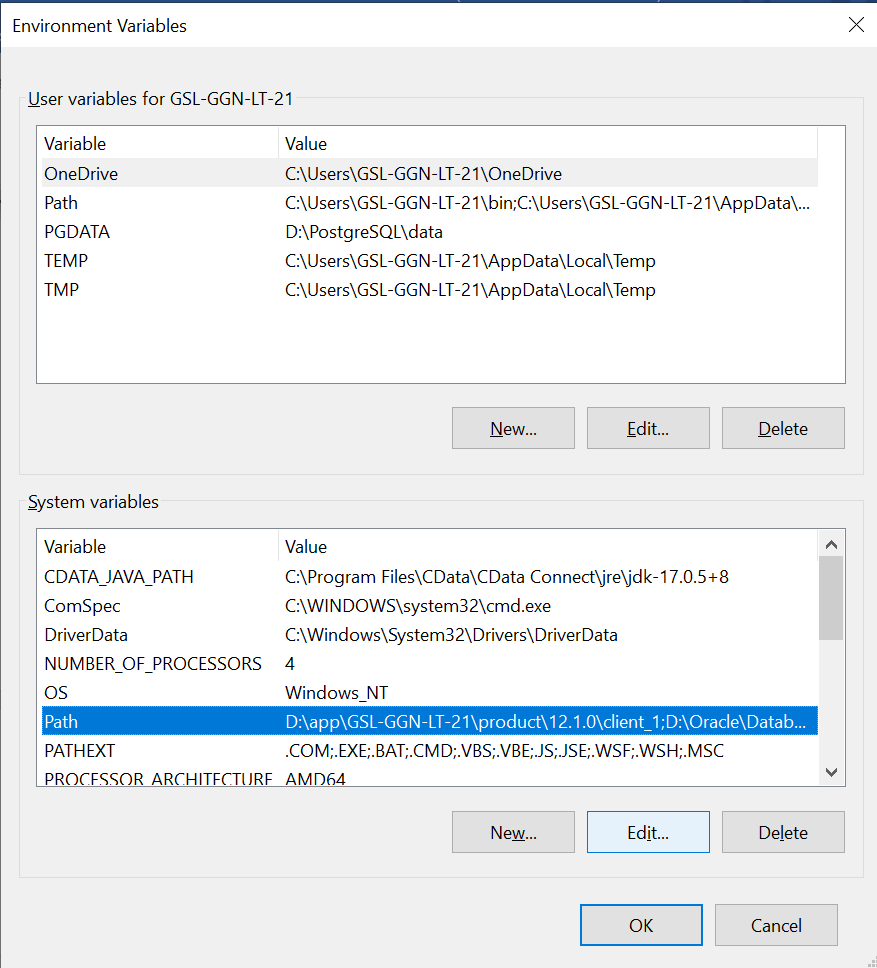

Step 5: In the Edit Environment Variable window, click on the "New" button and copy the location of the PostgreSQL bin folder (e.g., D:\\PostgreSQL\\14\\bin). Paste this location in the new line, and click "OK."

Step 6: Return to the Environment Variables window. Click on the "New" button under the "System variables" section.

Step 7: Enter "PGDATA" as the variable name (without quotes), and provide the location of the PostgreSQL data directory as the variable value. For example, if the data directory is located at "D:\\ PostgreSQL\\14\\data," enter that location as the variable value.

Step 8: Click "OK" to save the changes and close all open windows.

### Installing PostgreSQL on Linux (Default Directory)

Step 1: Open your Linux GUI as the root user.

Step 2: Go to the official PostgreSQL website by navigating to [www.postgresql.org/downloads](http://www.postgresql.org/downloads)

Step 3: On the downloads page, select your operating system as Linux.

Step 4: Choose the appropriate Linux distribution. For example, if you are using Red Hat, select Red Hat as your distribution.

Step 5: Look for the "PostgreSQL YUM Repository" section and select the appropriate values based on your system configuration.

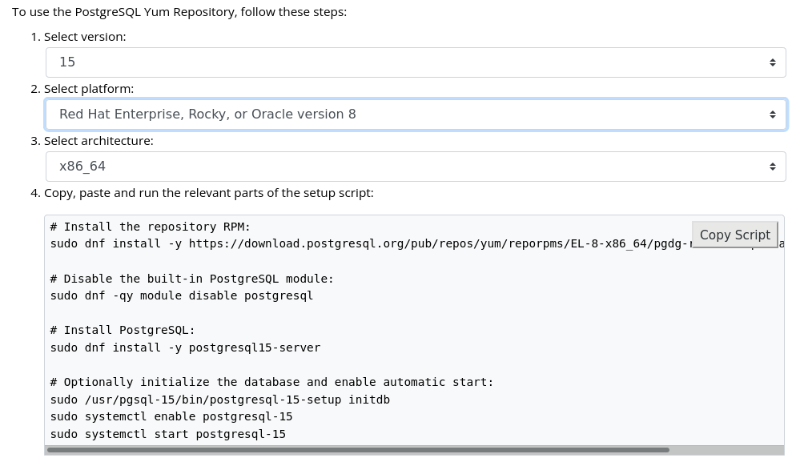

Step 6: Select the desired PostgreSQL version. In this case, choose Version 14.

Step 7: Select the platform for your Red Hat Enterprise version. For example, if you have Red Hat Enterprise version 8, select that.

Step 8: Choose the architecture that matches your system. Typically, it will be x86_64.

Step 9: A setup script will be generated based on the values you have selected. Use this script to download and install PostgreSQL 14.

Step 10: Open a Linux terminal and run the following command to install the repository RPM:

sudo dnf install -y <https://download.postgresql.org/pub/repos/yum/reporpms/EL-8-x86_64/pgdg-redhat-repo-latest.noarch.rpm>

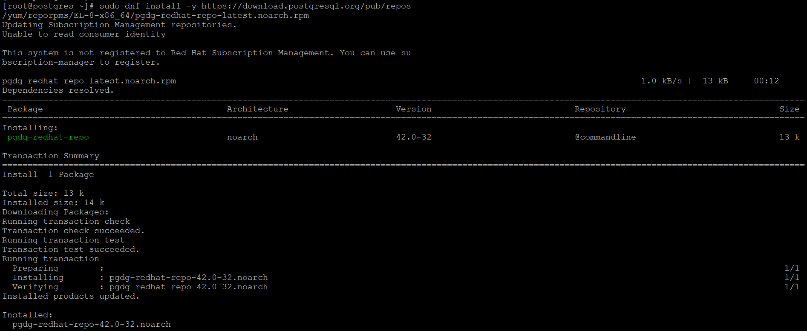

Step 11: Install PostgreSQL using the following command:

sudo dnf install -y postgresql14-server

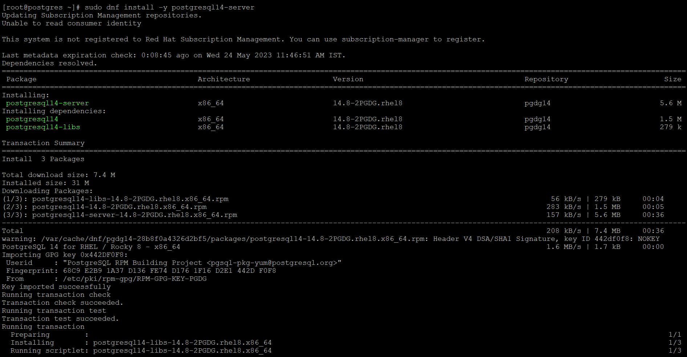

Step 12: Initialize the database and enable automatic start using the following commands:

sudo /usr/pgsql-14/bin/postgresql-14-setup initdb

sudo systemctl enable postgresql-14

sudo systemctl start postgresql-14

sudo systemctl status postgresql-14

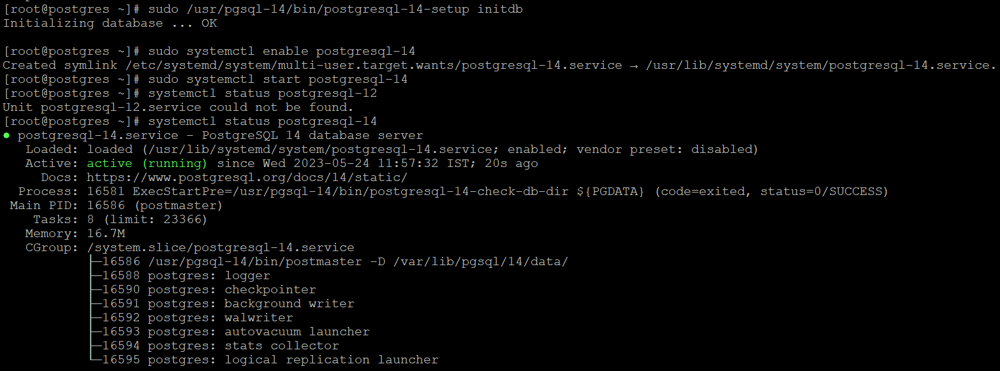

Note: Above mentioned steps will download and install PostgreSQL at default directory on Linux Operating System.

### Setting Up PostgreSQL Linux Environment (Default Directory)

Step 1: The user "postgres" is created automatically during the installation. Set up a password for the "postgres" user using the following command:

passwd postgres

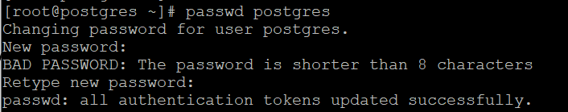

Step 2: Verify the user password by switching to the "postgres" user using the following command:

su - postgres

Step 3: Login as Postgres user on the linux terminal

Step 4: Edit bash_profile of postgres user using the following command

vi .bash_profile

Step 5: Add the below mentioned lines to the existing bash_profile.

\[ -f /etc/profile \] && source /etc/profile

PGDATA=/var/lib/pgsql/14/data

export PGDATA

\# If you want to customize your settings,

\# Use the file below. This is not overridden

\# by the RPMS.

\[ -f /var/lib/pgsql/.pgsql_profile \] && source /var/lib/pgsql/.pgsql_profile

PATH=$PATH:HOME/bin

export PATH

export PATH=/usr/pgsql-14/bin:$PATH

Step 6: Save and quit the bash_profile file.

### Installing PostgreSQL on Linux (Non-Default Directory)

Step 1: Open your Linux GUI as the root user.

Step 2: Go to the official PostgreSQL website by navigating to [www.postgresql.org/downloads](http://www.postgresql.org/downloads)

Step 3: On the downloads page, select your operating system as Linux.

Step 4: Choose the appropriate Linux distribution. For example, if you are using Red Hat, select Red Hat as your distribution.

Step 5: Look for the "PostgreSQL YUM Repository" section and select the appropriate values based on your system configuration.

Step 6: Select the desired PostgreSQL version. In this case, choose Version 14.

Step 7: Select the platform for your Red Hat Enterprise version. For example, if you have Red Hat Enterprise version 8, select that.

Step 8: Choose the architecture that matches your system. Typically, it will be x86_64.

Step 9: A setup script will be generated based on the values you have selected. Use this script to download and install PostgreSQL 14.

Step 10: Open a Linux terminal and run the following command to install the repository RPM using script generated above:

sudo dnf install -y <https://download.postgresql.org/pub/repos/yum/reporpms/EL-8-x86_64/pgdg-redhat-repo-latest.noarch.rpm>

Step 11: Install PostgreSQL using the following command:

sudo dnf install -y postgresql14-server

Step 12: If you wish to place your data in (e.g.) /u01/pgsql/14/data, create the directory with the proper rights:

mkdir -p /u01/pgsql/14/data

chown -R postgres:postgres /u01

chown -R postgres:postgres /u01/pgsql/

Step 13: Open and Customize the postgresql-14 services:

vi /lib/systemd/system/postgresql-14.service

Add the following content and save the file:

\# Location of database directory

Environment=PGDATA=/u01/pgsql/14/data/

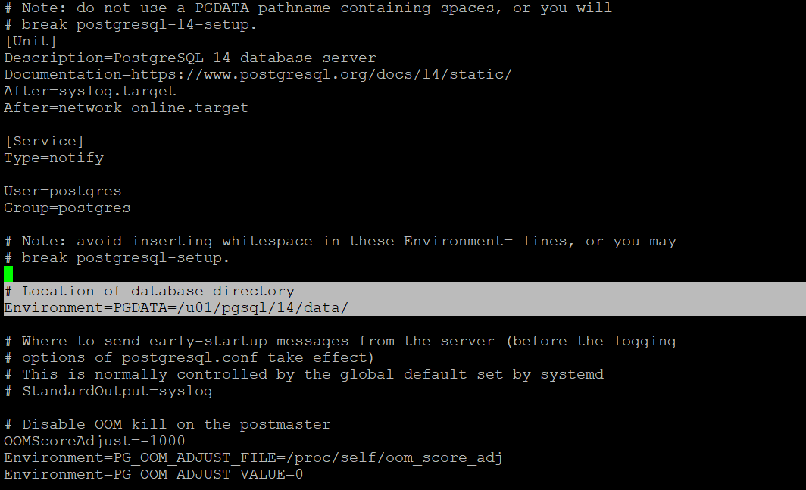

Step 14: Reload Systemd using command:

systemctl daemon-reload

Step 15: Initialize the database and enable automatic start using the following commands:

sudo /usr/pgsql-14/bin/postgresql-14-setup initdb

sudo systemctl enable postgresql-14

sudo systemctl start postgresql-14

sudo systemctl status postgresql-14

**Setting Up PostgreSQL Linux Environment (Non-Default Directory)**

Step 1: The user "postgres" is created automatically during the installation. Set up a password for the "postgres" user using the following command:

passwd postgres

Step 2: Verify the user password by switching to the "postgres" user using the following command:

su - postgres

Step 3: Login as Postgres user on the linux terminal

Step 4: Edit bash_profile of postgres user using the following command

vi .bash_profile

Step 5: Add the below mentioned lines to the existing bash_profile.

\[ -f /etc/profile \] && source /etc/profile

PGDATA=/u01/pgsql/14/data/

export PGDATA

\# If you want to customize your settings,

\# Use the file below. This is not overridden

\# by the RPMS.

\[ -f /var/lib/pgsql/.pgsql_profile \] && source /var/lib/pgsql/.pgsql_profile

PATH=$PATH:HOME/bin

export PATH

export PATH=/usr/pgsql-14/bin:$PATH

Step 6: Save and quit the bash_profile file. {. .bash_profile }

Note: Only Difference in bash_profile file for default/non_default directory is PGDATA location.

**Uninstalling Postgresql from Linux**

Stop pg services  
delete pg_data folder

As root user execute below commands:

rpm -qa|grep postgres

dnf remove postgresql16-server-16.6-1PGDG.rhel8.x86_64

**PostgreSQL Architecture**

### Fundamentals of PostgreSQL Architecture

- PostgreSQL is a relational database management system with a client-server architecture.
- PostgreSQL uses "process per-user" client/server model.
- PostgreSQL's has a set of processes and memory structures which constitutes an instance.
- Programs run by clients connect to the server instance and request read and write operations.
- Default port of PostgreSQL is 5432.

### Process and Memory Architecture

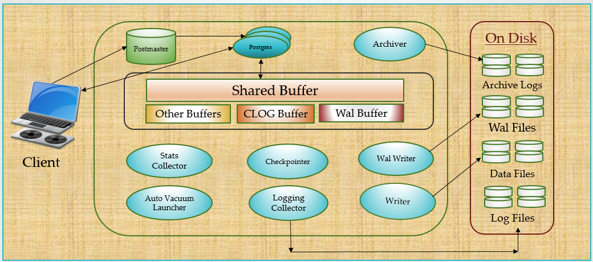

### Postmaster Process - Supervisor process

- Postmaster is the first process which gets started in PostgreSQL
- Postmaster acts as supervisor process, whose job is to monitor, start, restart some processes if they die.
- Postmaster acts a listener and receive new connection request from the client.
- Postmaster is responsible for Authentication and Authorization of all incoming request.
- Postmaster spawns a new process call Postgres for each new connection.

### Utility Processes

- Bgwriter\\Writer: Periodically writes the dirty buffer to a data file.
- Wal Writer: Write the WAL(write ahead logs) buffer to the WAL file.
- Checkpointer: Checkpoint is invoked every 5 minute(default) or when max_wal_size value is exceeded. The check pointer syncs all the buffers from the shared buffer area to the data files.
- Auto vacuum Launcher: Responsible to carry vacuum operations on bloated tables. (If Enabled).
- Statscollector: Responsible for collection and reporting of information about server activity then update the information to optimizer dictionary(pg_catalog).
- Logwriter\\Logger: Write the error message to the log file.
- Archiver (Optional): When in Archive.log mode, copy the WAL file to the specified directory.

### Memory Segments

Memory Segments of PostgreSQL are:

- Shared Buffers
- Wal Buffers
- Clog Buffers
- Work Memory (small or single table sort)
- Maintenance Work Memory
- Temp Buffers (large or big table or hash sort)

Shared Buffers

- User cannot access the data files directly to read or write any data.
- Any select, insert, update or delete to the data is done via shared buffer area.
- The data that is written or modified in this location is called "Dirty data ".
- Dirty data is written to the data files located in physical disk through background writer process.
- Shared Buffers are controlled by parameter named: shared_buffer located in postgresql.conf file.

Wal Buffers

- Write ahead logs buffer is also called as "Transaction log Buffers".
- WAL data is the metadata information about changes to the actual data, and is sufficient to reconstruct actual data during database recovery operations.
- WAL data is written to a set of physical files in persistent location called "WAL segments" or "checkpoint segments".
- Wal buffers are flushed from the buffer area to wal segments by wal writer.
- Wal buffers memory allocation is controlled by the wal_buffers parameter.

Clog and Other Buffers

- CLOG stands for "commit log", and the CLOG buffers is an area in operating system RAM dedicated to hold commit log pages.
- The commit logs have commit status of all transactions and indicate whether or not a transaction has been completed (committed).
- Work Memory is a memory reserved for either a single sort or hash table (Parameter: Work_mem)
- Maintenance Work Memory is allocated for Maintenance work (Parameter: maintenance_work_mem).
- Temp Buffers are used for access to temporary tables in a user session during large sort and hash table. (Parameter: temp_buffers).

### Physical Files

- Data Files: It is a file which is use to store data. It does not contain any instructions or code to be executed.
- Wal Files: Write ahead log file, where all transactions are written first before commit happens.
- Log Files: All server messages, including stderr, csvlog and syslog are logged in log files.
- Archive Logs(Optional): Data from wal segments are written on to archive log files to be used for recovery purpose.

Note: Parameters regarding Memory Segments:

max_wal_size

shared_buffer

wal_buffers

Work_mem

maintenance_work_mem

temp_buffers

psql -p 5433 -U "GSL-GGN-LT-21" -d postgres

select datname,oid from pg_database;

SELECT usename FROM pg_user;

select current_database();

select version();

select current_user;

show data_directory;

select current_date;

show port;

\\l \\q

\\conninfo

\\c dbaclass

select datname,dattablespace from pg_database;

select datname,oid from pg_database;

select pg_database.datname as "database name", pg_database_size(pg_database.datname)/1024/1024 as size_in_mb from pg_database order by size_in_mb;

select * from pg_settings where name like '%autovacuum%';

\\c learning adam

**Database Clusters**

### What is Database Cluster?

- Database cluster is a collection of databases that is managed by a single instance on a server.
- Initdb creates a new PostgreSQL database cluster.
- Creating a database cluster consists of creating the directories in which the data is store. We call this the" data _directory"_.
- We have to first initialize the storage area on the disk before we begin any operation on the database.
- Location of Data Directory:

Linux: /var/lib/pgsql/data (Default Installation location, Not mandatory)

Windows: C:\\Program Files\\PostgreSQL\\12\\data (Default location, Not mandatory)

### Initdb

- initdb is a command-line utility in PostgreSQL used to initialize a new database cluster. When you initialize a database cluster, you are essentially creating the necessary directory structure and files required to store and manage the data for a PostgreSQL database.
- We have to be logged in as PostgreSQL user to execute the below commands.
- There are two ways to initialize database.(initdb and pg_ctl)
- Syntax:
- initdb -D /usr/local/pgsql/data (Linux)
- initdb -D C:\\Program Files\\PostgreSQL\\12\\data -U postgres (Windows)
- pg_ctl -U postgres -D /usr/local/pgsql/data Initdb {linux}
- pg_ctl -U postgres -D "D:\\PostgreSQL\\13\\data" initdb
- \-D = refers to the data directory location.
- \-U= refers to the super user assigned to this cluster.
- \-W = we can use this option to force the super user to provide password before initialize db

### How to Start\\Stop Cluster

- Start Cluster Syntax:

Linux: systemctl start postgresql-14

Windows: pg_ctl -D "C:\\Program Files\\PostgreSQL\\12\\data" start

- Stop Cluster Syntax:

Linux: systemctl stop postgresql-14

Windows: pg_ctl stop -D "C:\\Program Files\\Postgresql \\12\\data" -m shutdown mode

Note: -m indicates shutdown modes:

For example:

1. pg_ctl stop -D "C:\\Program Files\\Postgresql \\12\\data" -m smart

smart -(quit after all clients have disconnected)

1. Windows: pg_ctl stop -D "C:\\Program Files\\Postgresql \\12\\data" -m fast

Fast -(quit directly, with proper shutdown (default))

1. Windows: pg_ctl stop -D "C:\\Program Files\\Postgresql \\12\\data" -m immediate

Immediate- (quit without complete shutdown; will lead to recovery on restart)

### Difference between Reload and Restart

- When we make changes to server parameters, we need to reload the configuration for them to take effect.
- Reload will just reload the new configurations, without restarting the service.
- Few configuration changes in server parameters, do not get reflected until we restart the service.
- Restart gracefully shutdown all activity, relinquishes the resource, close all open files and start again with new configuration.

### How to Restart\\Reload Cluster

- Syntax for Restart of Cluster:

On Linux: systemctl reload posgresql-14

On windows: pg_ctl reload

- Syntax for Reload of Cluster:

On Linux: systemctl restart postgresql-14

On Windows: pg_ctl restart

- Psql Command line:

SQL:> SELECT pg_reload_conf(); (Irrespective of Environment)

### Types of Shutdown

- Smart: the server disallows new connections, but let's existing sessions end their work normally. It shuts down only after all of the sessions terminate
- Fast :( Default): The server disallows new connections and abort their current transactions and exits gracefully.
- Immediate: Quits/aborts without proper shutdown which lead to recovery on next startup.

### Pg_Controldata

- Pg_controldata - Information about cluster.

Syntax: /usr/pgsql-14/bin/pg_controldata {Linux}

C:\\> pg_controldata -D "D:\\PostgreSQL\\data" {Windows}

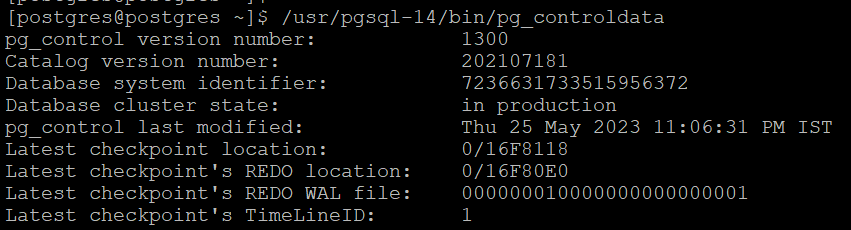

**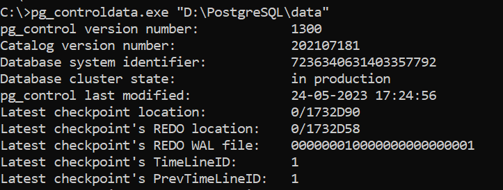**

**Database Directory Layout**

### Overview of Installation Directory Layout

- PostgreSQL is typically installed to /usr/local/pgsql or /var/lib/pgsql on linux.
- C:\\Program Files\\PostgreSQL\\&lt;version number&gt; on windows.(default location)

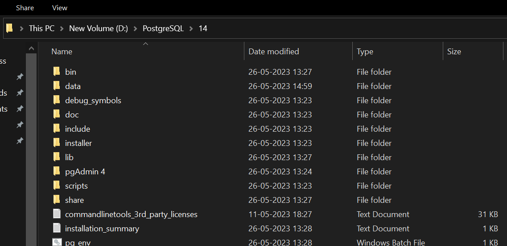

- bin-> programs (createdb, initdb,createuser,etc)
- data -> Data Directory
- Doc --> Documentation
- Include --> Header Files
- Installer -> Installer files
- Scripts --> scripts like runpsql, serverctl vbscript files
- Share -> Sample configuration files
- pgadmin - pgadmin files.

### Overview of Database Directory Layout

| Directory Name       | Description                                                                                                                                                                                                                                                                                                                                               |
| -------------------- | --------------------------------------------------------------------------------------------------------------------------------------------------------------------------------------------------------------------------------------------------------------------------------------------------------------------------------------------------------- |
| Base                 | Subdirectory containing per-database subdirectories                                                                                                                                                                                                                                                                                                       |
| Current_logfiles     | File recording the log file(s) currently  written to by the logging collector                                                                                                                                                                                                                                                                       |
| Global               | Subdirectory containing cluster-wide tables, such as pg_database,pg_tablespace,pg_index etc                                                                                                                                                                                                                                                               |
| pg_commit_ts         | Subdirectory containing transaction commit timestamp data= 9.5 and later, track_commit_timestamp                                                                                                                                                                                                                                                          |
| pg_dynshmem          | Subdirectory containing files used by the dynamic shared memory subsystem                                                                                                                                                                                                                                                                                 |
| pg_logical           | Subdirectory containing status data for  logical decoding                                                                                                                                                                                                                                                                                           |
| pg_multixact         | Subdirectory containing multitransaction status data (used for shared row locks)                                                                                                                                                                                                                                                                          |
| pg_notify            | Subdirectory containing LISTEN/NOTIFY status data                                                                                                                                                                                                                                                                                                         |
| pg_replslot          | Subdirectory containing replication slot data                                                                                                                                                                                                                                                                                                             |
| pg_serial            | Subdirectory containing information about  committed serializable transactions                                                                                                                                                                                                                                                                      |
| Log                  | All error logs kept in this directory.                                                                                                                                                                                                                                                                                                                    |
| pg_snapshots         | Subdirectory containing exported snapshots                                                                                                                                                                                                                                                                                                                |
| pg_stat              | Subdirectory containing permanent files for the statistics subsystem                                                                                                                                                                                                                                                                                      |
| pg_stat_tmp          | Subdirectory containing temporary files for the statistics subsystem                                                                                                                                                                                                                                                                                      |
| pg_subtrans          | Subdirectory containing subtransaction status data                                                                                                                                                                                                                                                                                                        |
| pg_tblspc            | Subdirectory containing symbolic links to tablespaces                                                                                                                                                                                                                                                                                                     |
| pg_twophase          | Subdirectory containing state files for prepared transactions                                                                                                                                                                                                                                                                                             |
| pg_wal               | Subdirectory containing WAL (Write Ahead Log) files                                                                                                                                                                                                                                                                                                       |
| pg_xact              | Subdirectory containing transaction commit status data, transaction metadata logs                                                                                                                                                                                                                                                                         |
| Pg_ident.conf        | User name maps are defined in the ident map file.user name map can be applied to map the operating system user name to a database user.                                                                                                                                                                                                                   |
| postgresql.auto.conf | A file used for storing configuration parameters  that are set by ALTER SYSTEM                                                                                                                                                                                                                                                                      |
| postmaster.opts      | A file recording the command-line options the server was last started.                                                                                                                                                                                                                                                                                    |
| postmaster.pid       | A lock file recording the current postmaster process ID (PID), cluster data directory path, postmaster start timestamp, port number, Unix-domain socket directory path (empty on Windows), first valid listen_address (IP address or *, or empty if not listening on TCP), and shared memory segment ID (this file is not present after server shutdown) |
| PG_VERSION           | A file containing the major version number of PostgreSQL                                                                                                                                                                                                                                                                                                  |

### Overview of Base Directory Layout

- Contains databases, that represented as directories named after their object identifier (OID).
- Template 1 always has oid 1.
- Syntax to find oid of database:

Select oid,datname from pg_database;

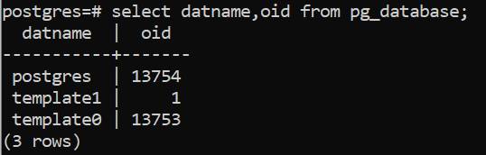

**Configuration Files**

### Postgresql.conf File

- Postgresql.conf file contains parameters to help configure and manage performance of the database server.
- Initdb installs a default copy of postgresql.conf and is usually located in data directory.
- The file follows one parameter per line format.
- Parameters which requires restart are clearly marked in the file.
- Many parameter needs a server restart to take effect.

### Pg Catalog tables to view File settings

- Pg_settings table provides access to run-time parameters of the server.
- It is a alternate interface to SHOW command.
- Pg_file_settings provide a summary of the contents of the server's configuration file.
- This view is helpful for checking whether planned changes in the configuration files will work
- Each "name = value" entry appearing in the files has a corresponding applied column.
- Pg_settings table shows all parameters defined in Postgresql.conf file.
- Pg_settings shows run-time value of parameters while pg_file_settings shows value initialized in postgresql.conf file.
- Using query select name,setting from pg_settings; will show result of all parameters of server at run-time

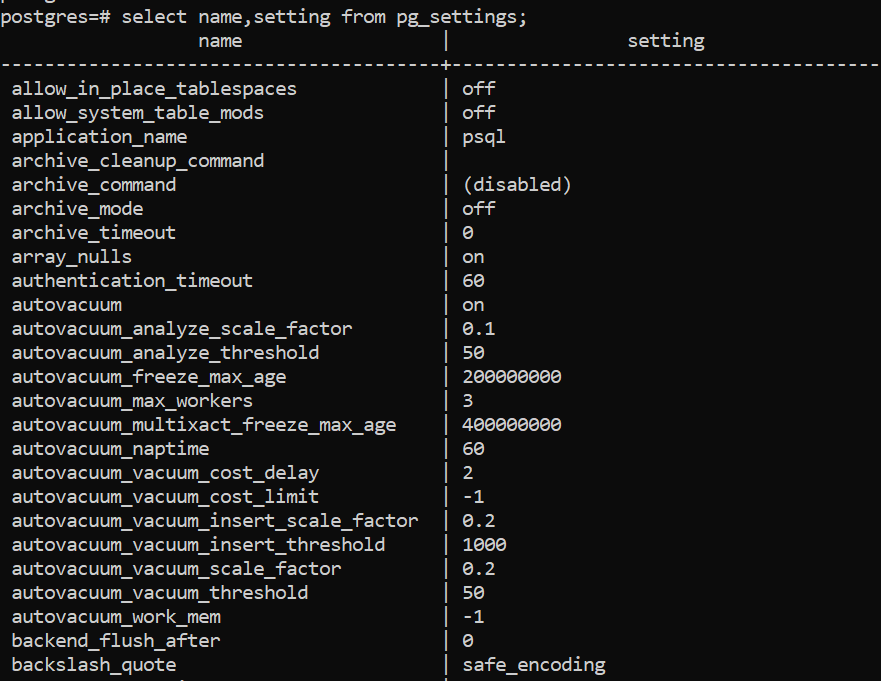

- Show command is an alternative to view parameter value from pg_settings table.

For example: To check archive_mode parameter from config file

Use any of the mentioned method:

1. Query from pg_settings;
2. Show {parameter_name}

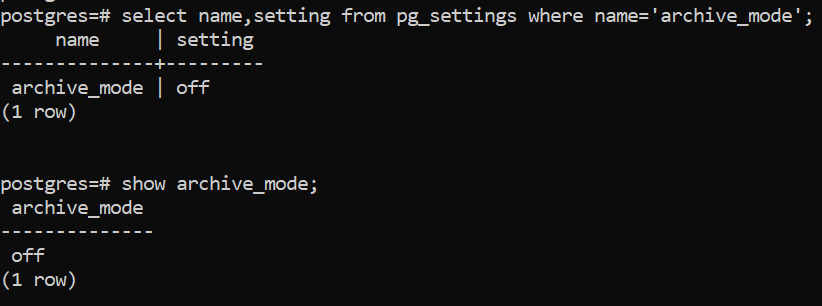

**Changing Parameter value in postgresql.conf File**

- Check the value to be modified
- Backup the file before making modifications.
- Remove the # from the parameter to edit (if the # exist)
- Check if the parameter needs a restart of postgresql server.
- Edit the existing value with desired value.
- Restart postgres
- Check the value via pg catalog tables or show command

The following example illustrates changing two parameters shared_buffers and work_mem from postgresql.config.

Step 1: Before changing verify the values of these parameters

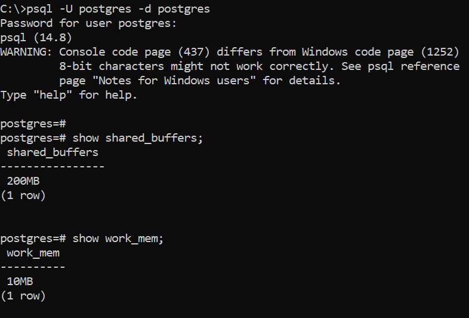

Step 2: Open config file from location: {path}\\PostgreSQL\\14\\data\\ postgresql.config and edit these parameters according to your needs.

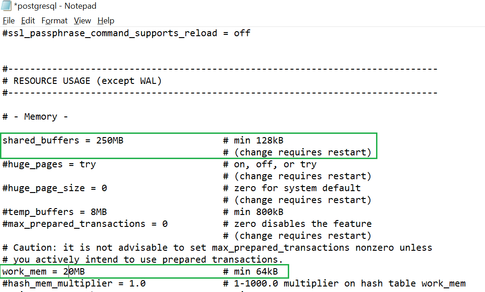

Parameters have been changed from 200MB to 250MB for shared_buffers

And 10MB to 20MB for work_mem.

_Note: Every parameter mentioned in the file also denoted whether it requires restart to be effective or not. You can see that shared_buffer parameter requires restarting the server while work_mem does not require restart and will take effect from the current session._

Step 3: After saving config file return to psql terminal and execute the following command.

select * from pg_reload_conf();

Note: _This query will reload the PostgreSQL configuration file and will change those parameters immediately that does not require restarting server, and the function will return a single row result indicating whether the reload was successful or not._

_By executing the SELECT * FROM pg_reload_conf(); query, you can reload the configuration file and apply any changes made to it without restarting the entire PostgreSQL server._

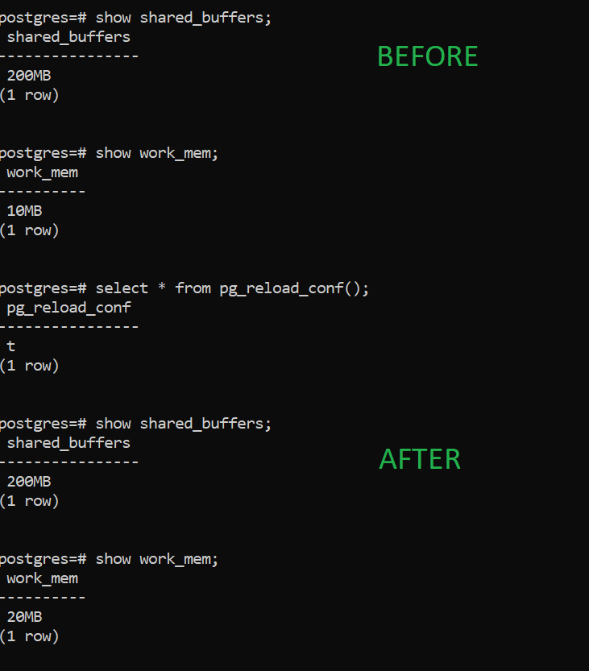

Step 4: Shared_buffers parameter is still same because the paramerter requires restart as mentioned in the config file. While work_mem was changed as soon as

Select * from pg_reload_conf(); query was executed.

For Shared_buffers parameter to take effect restart postgresql server using command from command prompt:

Pg_ctl restart

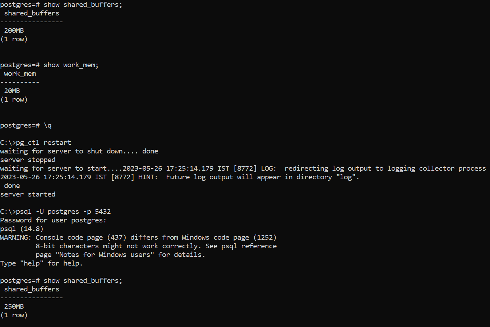

### Postgresql.auto.conf

- This file hold settings provided through Alter system command.
- Settings in postgresql.auto.conf overrides the settings in postgresql.conf.
- " Alter system" command provides a SQL-accessible means of changing global defaults.
- Syntax : ALTER SYSTEM SET configuration_parameter = 'value'
- Syntax to reset : ALTER SYSTEM RESET configuration_parameter;
- Syntax to reset all : ALTER SYSTEM RESET ALL;

The following example illustrates changing two parameters shared_buffers and work_mem using ALTER SYSTEM SET command.

- Step 1: Change the parameters using alter system set shared_buffers = '250MB';

And alter system set work_mem = '20MB';

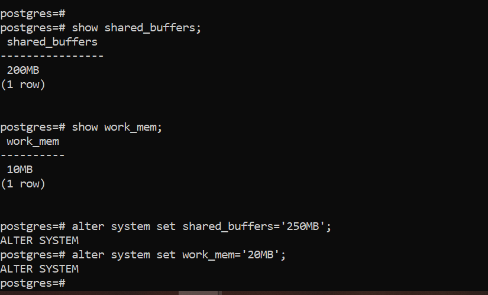

Step 2: Run command

select * from pg_reload_conf();

Step 3: check the value in postgres.conf file

There will be no changes in postgres.config file when using alter system set command

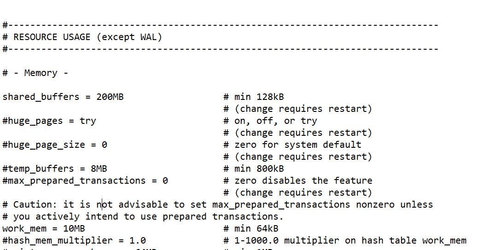

Step 3: Now query pg_file_settings. This view is helpful for checking whether planned changes in the configuration files will work or not.

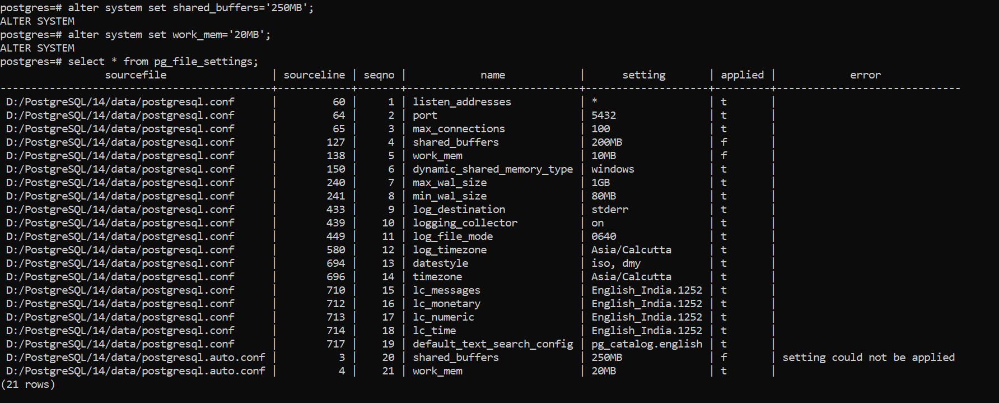

Step 4: Check the last two lines of query output. Shared_buffers and work_mem parameters are automatically added to postgresql.auto.config file

You can also check postgresql.auto.config physical file.

Note: The column applied shows whether effect of parameter is applied to server or not. shared_buffer parameter still needs restarting of postgresql server to be effective that's why it shows error: setting could not be applied.

Step 5: An individual or all parameters that are changed using alter system set command can be rolled back using command:

Alter system reset &lt;parameter_name&gt;;

Alter system reset all;

Note: If both files have the same parameter defined, PostgreSQL reads the value from postgresql.auto.conf instead of postgresql.conf. This behaviour ensures that dynamically set configuration changes are prioritized over the static configuration in postgresql.conf.

### Pg_ident.conf with Sample

This file controls PostgreSQL user name mapping. It maps external user names to their corresponding PostgreSQL user names. Configuration to indicate which map to use for each individual connection.

- Pg_ident.conf file is read on start-up and any changes needs pg_ctl reload
- Operating system user that initiated the connection might not be the same as the database user.
- User name map can be applied to map the operating system user name to a database user.
- pg_ident.conf is used in conjuction with pg_hba.conf.

**Pg_ident.conf - Sample**

Sample record in Pg_ident.config File is as follows:

\# MAP SYSTEM_USERNAME POSTGRESQL_USERNAME

sales Admin sales

test Sagar postgres

sales Sagar sales

_MAPNAME SYSTEM-USERNAME PG-USERNAME_

- MAPNAME is the map name(any chosen name) that was used in pg_hba.conf.
- SYSTEM-USERNAME is the detected user name of the client.
- PG-USERNAME is the requested PostgreSQL user name.
- The existence of a record specifies that SYSTEM-USERNAME may connect as

PG-USERNAME.

- The file shown in allows either of the system users Admin to connect as the PostgreSQL sales user, and allows the system user named Sagar to connect to PostgreSQL as either sales or postgres.

**Pg_hba.conf file**

- Enables client authentication between the PostgreSQL server and the client application.
- HBA means host based authentication.
- PostgreSQL receives a connection request it will check the "_pg_hba.conf_" file to verify that the machine from which the application is requesting a connection has rights to connect to the specified database.
- PostgreSQL rejects a connection if an entry is not found in pg_hba.conf file.
- This file controls which hosts are allowed to connect, how clients are authenticated, which PostgreSQL user names they can use, which databases they can access.

### Pg_hba.conf with sample

TYPE DATABASE USER ADDRESS METHOD

local all all 127.0.0.1/32 trust

host all all 127.0.0.1/32 md5

hostssl all all 127.0.0.1/32 reject

# Allow replication connections from localhost, by a user with the

# replication privilege.

host replication all 127.0.0.1/32 password

host replication all ::1/128 trust

1. First Cloumn is Connection Type

- "local" : The local entry is used for client connections that are initiated from the same machine that the PostgreSQL server is operating on.
- "host" : is used to specify remote hosts that are allowed to connect to the PostgreSQL server(encrypted or not). PostgreSQL's _postmaster_ backend must be running with the _\-i_ option (TCP/IP) in order for a host entry to work correctly.
- "hostssl" : is user to specify hosts (remote or local) that are allowed to connect to the PostgreSQL server using SSL
- "hostnossl" is a TCP/IP socket that is not SSL-encrypted
- "hostgssenc" is a TCP/IP socket that is GSSAPI-encrypted
- "hostnogssenc" is a TCP/IP socket that is not GSSAPI-encrypted

1. Second Column is Database

- This is the database name that the specified host is allowed to connect to. The _database_ keyword has three possible values:
- All : keyword specifies that the client connecting can connect to any database the PostgreSQL server is hosting.
- samesuer : keyword specifies that the client can only connect to a database that matches the clients authenticated user name.
- _Name : C_lient can only connect to the database as specified by _name_ .
- Multiple database can be named using comma separator list thereof.

1. Third Column User

- User is the operating system that is used to connect to PostgreSql database.
- User can be all, a user name, a group name separated with comma.

Note: Database and user names containing spaces, commas, quotes and other special characters must be quoted. Quoting one of the keywords

"all", "sameuser", "replication" makes the name lose its special character, and just match a database or username with that name.

1. Fourth Cloumn Address

- The _ip_addr_ and _netmask_ fields specify either a specific IP address, or range of IP addresses, that are allowed to connect to the PostgreSQL server.
- Range can by specified by describing an IP network with an associated netmask.
- For single IP address the _netmask_ field should be set to 255.255.255.255.

1. Fifth Column Method

- The Authentication method specifies the type of authentication the server should use for a user trying to connect to PostgreSQL.
- There are various types of authentication method
- Trust: This method allows any user from the defined host to connect to a PostgreSQL database without the use of a password, this is a dangerous condition if the specified host is not a secure machine, or provides access to users unknown to you.
- Reject : This method automatically denies access to PostgreSQL for that host or user. This can be a prudent setting for sites that you know are _never_ allowed to connect to your database server.
- Password :This method specifies that a password must exist for a connecting user. The use of this method will require the connecting user to supply a password that matches the password found in the database.
- Crypt : This method is similar to the password method. When using crypt, the password is not sent in clear text, but through a simple form of encryption. The use of this method is not very secure, but is better than using the clear text password method.
- Krb4, krb5 : This methods are used to specify Version 4 or 5 of the Kerberos authentication system.
- Ident : This method specifies that an _ident map_ should be used when a host is requesting connections from a valid IP address listed in the _pg_hba.conf_ file. This method requires one option.
- The required option may be either the special term sameuser, or a named map that is defined within the _pg_ident.conf_ file.
- There are some other authentication as well named "md5","gss", "sspi", "scram-sha-256", "peer", "pam", "ldap", "radius" or "cert".

Note: "password" sends passwords in clear text; "md5" or "scram-sha-256" are preferred since they send encrypted passwords

### Steps to Modify Pg_hba.conf file

- Stop postgresql on the source machine.
- Edit pg_hba.conf file and add the entry of client.
- Change the authentication method to Trust or md5(depending on requirement)
- Edit parameter in pg_hba.conf to listen_addresses = '*' or ip address
- Start postgres on the source machine.
- Connection psql -U postgres -h hostname from client.

Depending on the authentication method choosen the client may or maynot prompt for password.

### Create Database - Psql / createdb Utility

- Database is an organized collection of structured information, or data, typically stored and accessed electronically from a computer system.
- When you install PostgreSQL, the bin folder contains various command-line utilities for managing and interacting with the database server.
- These utilities can be called from command prompt for performing various

Database tasks without connecting to psql.

- Some Examples of these utilities are :

createdb , dropdb , createuser , dropuser etc.

- Sql command line can also be used to these tasks.
- Syntax from psql : Create database databasename owner ownername;

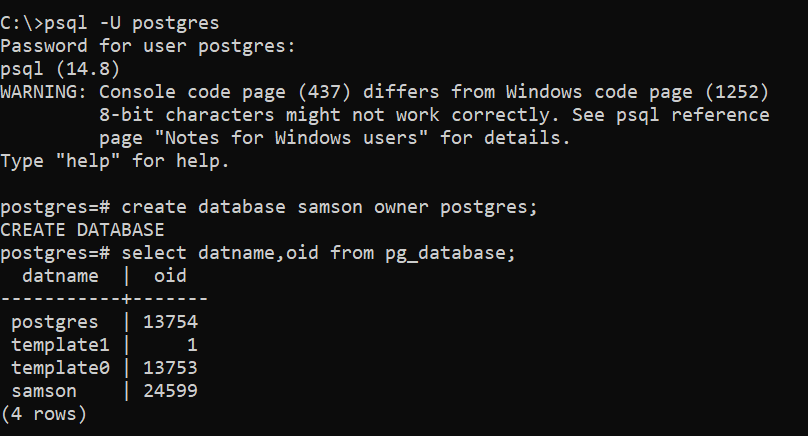

- Syntax from commandline utility : Createdb &lt;dbname&gt;

createdb -O postgres -U postgres samson

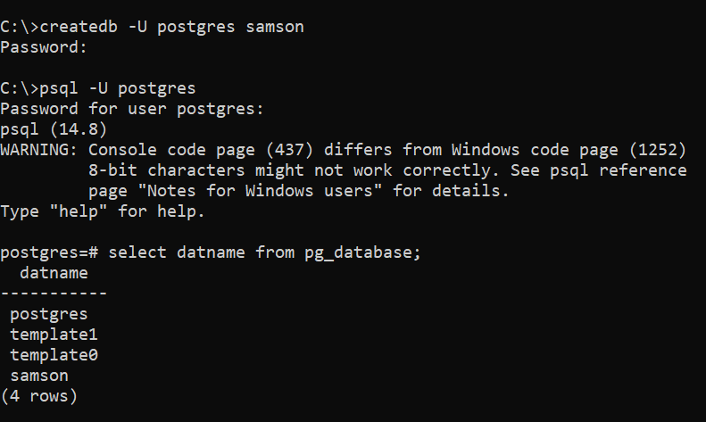

- Syntax for createdb help : createdb -help
- \\l or \\l+ psql command is used to list all database
- pg_database table also provides information about database.

### Drop database - Psql/ dropdb utility

- We can't drop the database which we are connected.
- Only superuser and user with proper privileges can drop database

Example : scott=# drop database nano;

ERROR: cannot drop the currently open database

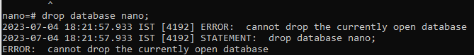 Syntax from psql : Drop database &lt;dbname&gt;.

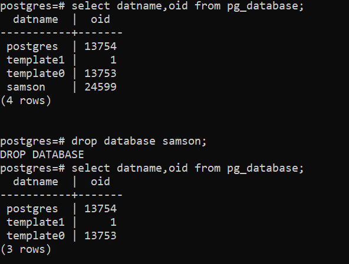

- Syntax from command line : dropdb &lt;dbname&gt;.

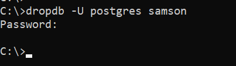

- Syntax for dropdb help : dropdb -help

### Create user - Psql/ createuser utility/ Interactive

- Db users and Operating users are completely separate
- Users name should be unique and should not start with pg_.
- Postgres super user is created by default on installation of postgresql
- Postgres user has all the privileges with grant option.
- Only super users or users with create role privilege can create a user.
- Database users are global across the cluster.
- The concept of global users means that users can connect to any node in the cluster and access any database
- Syntax from psql : create user scott login superuser password 'scott';

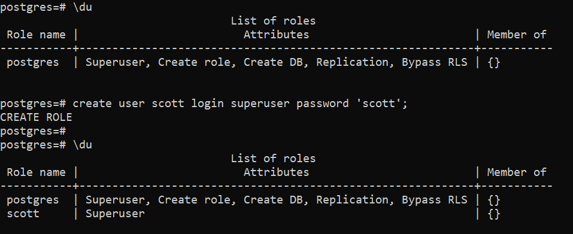

The image above indicates to create a super user scott with superuser privileges.

- Syntax from command line : createuser &lt;username&gt;

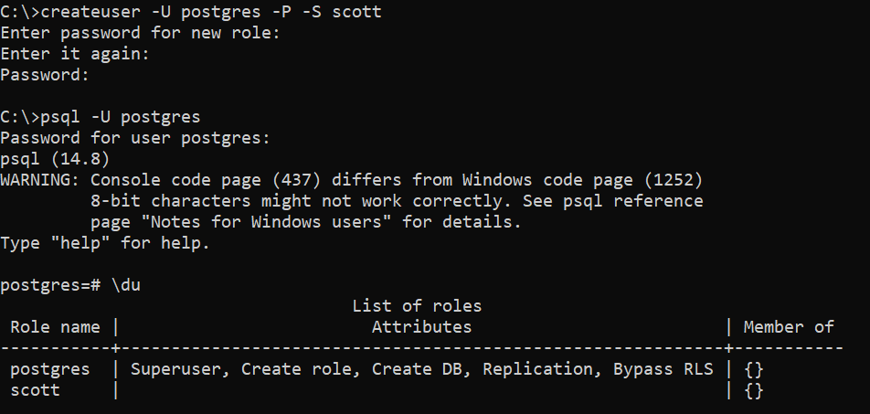

Createuser -U postgres -P -S scott

-U indicates user name to connect as (not the one to create)

\-P prompts and assign password to new role

\-S user will be created with no superuser privileges (default)

scott is the user or role created in the postgresql cluster

- Syntax for interactive user creation from command line :

Example :

createuser --interactive joe

Shall the new role be a superuser? (y/n) n

Shall the new role be allowed to create databases? (y/n) y

Shall the new role be allowed to create more new roles? (y/n) y

- Syntax for createuser help : createuser -help

### Drop user - Psql/ dropuser utility

- Syntax from psql : drop user &lt;username&gt;
- Syntax from command line : dropuser &lt;username&gt;
- Dropping a user with objects or privileges will return an error.

Example :

postgres=# drop user test1;

ERROR: role "test1" cannot be dropped because some objects depend on it

- Assign the user privileges to another user before dropping the user.

Example :

REASSIGN OWNED BY user to postgres;

Drop role username;

**Schema & its Benefits**

- Schema is a name space that contains named objects (tables, data types, functions, and operators).
- One database can have multiple schemas.
- Schemas helps us in separation of data between different applications.
- Organize database objects into logical groups to make them more manageable.
- Applications can be put into separate schemas so that they cannot collide with the names of other objects.
- One Database can be used by multiple users without interfering with each other.
- Schema are created at database level rather than cluster level. Therefore, schema with same name can be created in a cluster but should be created within different database.

### Create/Drop Schema and Search Schema Path

- To create a schema in PostgreSQL, you can use the CREATE SCHEMA statement. Here's an example of how to create a schema:

CREATE SCHEMA schema_name;

- By default, the newly created schema will be created within the current User. If you want to specify a different User, you can use the following syntax:

CREATE SCHEMA schema_name AUTHORIZATION username;

- Specified user will be the owner of schema.This user will have all privileges on the objects within the schema unless explicitly specified otherwise.
- Use command drop schema schema_name to drop a schema. You cannot drop a schema if other objects depend on that schema.

To override and drop schema with objects dependency use command:

DROP SCHEMA Schema_name CASCADE;

**Search Schema Path**

- In PostgreSQL, the search path determines the order in which schemas are searched for objects when executing queries.
- When a query references an object without specifying a schema, PostgreSQL looks for the object in the schemas listed in the search path, in the specified order, until it finds a matching object.
- **Show search_path;** command shows search path for any object and searches for objects in the specified schemas in the order they appear in the search path.
- Search path can be set at session level , user level, database level and cluster level
- For example below image shows result as $user , public. Default "$user" is a special option that says if there is a schema that matches the current user (i.e SELECT SESSION_USER;), then search within that schema. If not found in $user then search in public schema.

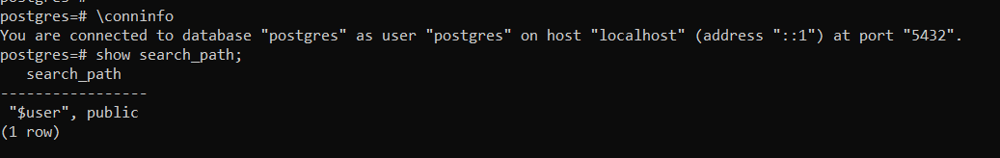

- You can alter serach path by

Test1=# SET search_path TO test1,public;

main, ginssot, ginview, ginarchive, gateway, public

### Public Schema

- The "public" schema is a default schema that is created when you initialize a new database.
- It is the default location where tables, views, functions, and other objects are created if no specific schema is specified.
- The "public" schema is accessible to all users by default, and any user can create objects within this schema unless specific restrictions are imposed.
- It serves as a common space for objects that are intended to be shared and accessed by multiple users in the database.
- For example :

Create table employee will create a table called employee in public schema by default because no schema is mentioned.

To create employee table in another schema(nano) use command:

Create table nano.table_name

### Privileges in PostgreSQL

- Privilege is a right to execute a particular type of SQL statement, or a right to access another user's object.
- There are two types of privileges - Cluster level and Object level
- Cluster Level Privileges are granted by super user.
- It can be granted during create user or by altering an existing user.
- Object Level Privileges are granted by super user or the owner of the object or someone with grant privileges.
- Privileges allow a user to perform particular actions on a database object, such as tables, view or sequence.

### Grants and Revoke Access

The following example illustrates different types of database level and object level Grants:

- Grant USAGE on schema:

GRANT USAGE ON SCHEMA schema_name TO username;

- Grant on all tables for DML statements: SELECT, INSERT, UPDATE, DELETE

GRANT SELECT, INSERT, UPDATE, DELETE ON ALL TABLES IN SCHEMA schema_name TO username;

- Grant all privileges on all tables in the schema:

GRANT ALL PRIVILEGES ON ALL TABLES IN SCHEMA schema_name TO username;

- Grant all privileges on all sequences in the schema:

GRANT ALL PRIVILEGES ON ALL SEQUENCES IN SCHEMA schema_name TO username;

- Column level access:

GRANT SELECT (col1),UPDATE(col1) on mytable TO USER;

The following examples illustrates cluster level grants:

- Grant permission to create database;

ALTER USER USERNAME CREATEDB;

- Make a user superuser

ALTER USER MYUSER WITH SUPERUSER;

- Revoke superuser status:

ALTER USER USERNAME WITH NOSUPERUSER;

- Grant CONNECT to the database:

GRANT CONNECT ON DATABASE database_name TO username;

The following examples illustrates revoking grants from user

- Revoke Delete/update privilege on table from user

REVOKE DELETE, UPDATE ON products FROM user;

- Revoke all privilege on table from user

REVOKE ALL ON products FROM user;

- Revoke select privilege on table from all users(Public)

REVOKE SELECT ON products FROM PUBLIC;

### Psql Commands

### Connect to Psql

- Psql is a terminal-based front-end to PostgreSQL.
- It enables the users to query postgreSQL interactively and see the query results.
- Connect to Specific Database with user and password

Syntax: psql -d database -U user -W (-d =Database,-U = User, -W = Password)

- Connect to Database on a different host/machine.

Syntax : psql -h host -d database -U user -W (-h=Hostname)

- Connect using SSL Mode

Syntax : psql -U user -h host "dbname=db sslmode=require" (sslmode =authentication method)

**Psql Commands Example**

- Switch connection to a new database

postgres=# \\c test1

You are now connected to database "test1" as user "postgres".

- List available databases

postgres=# \\l (use \\l+ command for more additional information)

- List available tables

postgres=# \\ dt

- Describe a table

postgres=# \\d table_name

- List available schema (+ to get more info)

postgres=# \\dn

- List available functions(+ to get more info)

postgres=# \\df

- Clear terminal command window

postgres=# \\! cls

- Clear terminal command linux

postgres=# \\! clear

- Display Os spectific command

postgres=# \\! df -h

- List available views(+ to get more info)

postgres=# \\dv

- List users and their roles(+ to get more info)

postgres=# \\du

- List available sequence(+ to get more info)

postgres=# \\ds

- Execute the previous command

postgres=# \\g

- Command history

postgres=# \\s

- Save Command History to file:

postgres=# \\s filename

- Get help on psql commands

postgres=# \\?

- Turn on\\off query execution time

postgres=# _\\timing_

- Edit statements in editor

postgres=# \\e

- Edit Functions in editor

postgres=# \\ef

- set output from non-aligned to aligned column output.

postgres=# _\\a_

- Formats output to HTML format.

postgres=# _\\H_

- Connection Information

postgres=# _\\conninfo_

- Quit psql

postgres=# _\\q_

- Reload config file

pg_reload_conf();

- _List tablespace_

postgres=# _\\db_

- _Display_

postgres=# _\\x_

### Psql File Operations

- Run sql statements from operating system file.

psql -d test1 -U test1 -f test1.sql ( command line) where -f is path to file

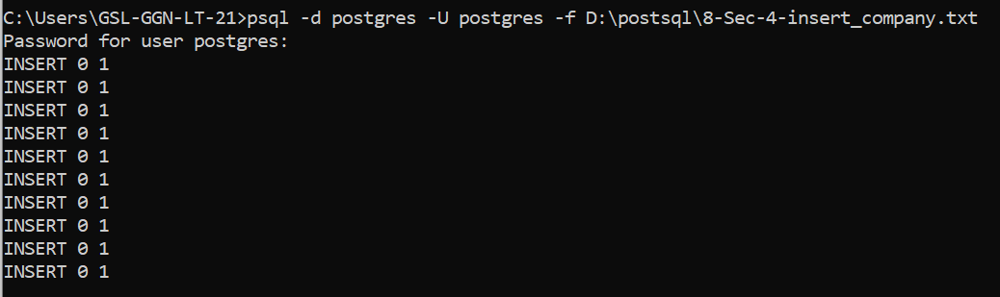

- Send the output to a file.

postgres=# \\o &lt;filename&gt;

postgres=# select * from your_query;

Note: \\o without any file name will stop recording output to file.

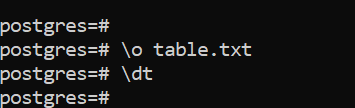

- Save query buffer to filename.

postgres=# \\w filename

postgres=# select * from your_query;

- Turn off auto commit on session level

postgres=# \\set AUTOCOMMIT off

Use command rollback; to revert back changes when autocommit is off.

postgres=# rollback;

- In PostgreSQL, by default, each SQL statement is executed within its own transaction. This means that each statement is treated as a separate transaction and is automatically committed unless an error occurs.
- A new session will automatically result in auto commit on after disabling autocommit for current session.

**Pg System Catalogs and Time Zone**

### Pg System Catalogs

| Name                    | Description                            |
| ----------------------- | -------------------------------------- |
| pg_database             | Stores general database info           |
| pg_stat_database        | Contains stats information of database |
| pg_tablespace           | Contains Tablespace information        |
| pg_operator             | Contains all operator information      |
| pg_available_extensions | List all available extensions          |
| pg_shadow               | List of all database users             |
| pg_stats                | Planner stats                          |
| pg_timezone_names       | Time Zone names                        |
| pg_locks                | Currently held locks                   |
| pg_tables               | All tables in the database             |
| pg_settings             | Parameter Settings                     |
| pg_user_mappings        | All user mappings                      |
| pg_indexes              | All indexes in the database            |
| pg_views                | All views in the database.             |

**Important Pg Catalog Queries**

- select * from pg_database; --Stores general database info
- select * from pg_stat_database; --Contains stats information of database
- select * from pg_tablespace; --Contains Tablespace information
- select * from pg_operator; --Contains all operator information
- select * from pg_available_extensions; --List all available extensions
- select * from pg_shadow; --List of all database users
- select * from pg_stats; --Planner stats
- select * from pg_timezone_names; --Time Zone names
- select * from pg_locks; --Currently held locks
- select * from pg_tables; --All tables in the database
- select * from pg_settings; --Parameter Settings
- select * from pg_settings WHERE Name='max_connections';
- select * from pg_user_mappings; --All user mappings
- select * from pg_indexes; --All indexes in the database
- select * from pg_views; --All views in the database.
- select current_Schema(); --Find current schema
- select current_user; --Find current User
- select current_database(); --Find current Database
- select current_setting('max_connections'); -- Find current setting of parameter
- select pg_backend_pid(); --Current User id process
- select pg_postmaster_start_time(); -- Postmaster start time
- select version (); --PostgreSql version
- select pg_is_in_backup(); --If backup is running or not

### Date & Time zone in PostgreSQL

- Current Date and time with timezone

select now () as current;

- Current Date with typecast as timestamp

SELECT NOW ()::timestamp;

- Add 1 hour to existing date and time

SELECT (NOW () + interval '1 hour') AS an_hour_later;

- To Find next day date and time

SELECT (NOW () + interval '1 day') AS this_time_tomorrow;

- To deduct 2 hours and 30 minutes from current time

SELECT now() - interval '2 hours 30 minutes' AS two_hour_30_min_ago;

**PostgreSQL CRUD Operations**

### What is CRUD?

- **CRUD** is an acronym for the below mentioned database operations:
- **C**reate or add new entries.
- **R**ead, retrieve, search, or view existing entries.
- **U**pdate or edit existing entries.
- **D**elete, deactivate, or remove existing entries.

### Create operations with examples

Create command can be used to create various types of objects in the database.

Examples:

Create TABLE tablename (Columns datatype);

CREATE TABLE table_name

(

column1 datatype \[ NULL | NOT NULL \],

column2 datatype \[ NULL | NOT NULL \],

CONSTRAINT constraint_name UNIQUE (col1, col2, ... col_n)

);

### Data Types in PostgreSQL

- PostgreSQL offers a rich set of native data types for users
- Character types such as char, varchar, and text.
- Numeric types such as integer and floating-point number.
- Boolean.
- Temporal types such as date, time, timestamp, and interval.
- Array for storing array strings, numbers, etc.
- JSON stores JSON data.
- Special types such as network address and geometric data.

### Constraints

- Constraints are the rules enforced on data columns on table. These are used to prevent invalid data from being entered into the database.
- This ensures the accuracy and reliability of the data in the database.
- Constraints can be defined at column level or table level.
- Table level constraints are applied to the whole table.
- Column level constraints are applied only to one column
- We can create constraints during creation of table or use alter command to modify an existing table.

**Types of Constraints**

| Constraint Name | Descritpion                                                                          |
| --------------- | ------------------------------------------------------------------------------------ |
| NOT NULL        | Ensures that a column cannot have NULL value.                                        |
| UNIQUE          | Ensures that all values in a column are different.                                   |
| PRIMARY         | Uniquely identifies each row/record in a database table                              |
| FOREIGN         | Constrains data based on columns in other tables.                                    |
| CHECK           | The CHECK constraint ensures that all values in a column satisfy certain conditions. |

### PostgreSQL Build-in Functions

| Build In Functions      | Examples                                                                                                  |
| ----------------------- | --------------------------------------------------------------------------------------------------------- |
| Aggregate Fuctions      | Avg(), Count(),Max(),Min(),Sum()                                                                          |
| String Fuctions         | Chr, Concat, format, Initcap,Lower,Rtrim,Ltrim,Substring,Upper                                            |
| Date and Time Functions | Age(Timestamp), now(),Current_date,current_time,  Current_timestamp,  transaction_timestamp() |
| Comparison Operators    | &lt;,&gt;,&lt;=.&gt;=,=, !=                                                                               |
| Mathematical Operators  | +,-,*,/,abs(X), ceil(),floor(),mod(y,x),round(numeric)                                                   |

### Read operations and Column Aliases

- Retrieving data from all columns in the table.
- Retrieve data from single column in the table.
- Select distinct rows using DISTINCT operator.
- Sort rows using ORDER BY clause.
- Filter rows using WHERE clause.
- Group rows into groups using GROUP BY clause
- An **Alias** is a substitute for a table or **column**
- Syntax

**SELECT** column_name **AS** alias_name **FROM** table_name conditions... ;

### Update operations with examples

- UPDATE changes the values of the specified columns in all rows that satisfy the condition.
- Only the columns to be modified need be mentioned in the SET clause.
- Columns not explicitly modified retain their previous values
- SYNTAX with example:

UPDATE table_name SET kind = 'Dramatic' WHERE kind = 'Drama';

UPDATE weather SET temp_lo = temp_lo+1, temp_hi = temp_lo+15, prcp = DEFAULT

WHERE city = 'San Francisco' AND date = '2003-07-03';

- Note: If where condition is eliminated then all rows in the table is modified
- You must have the UPDATE privilege on the table, or at least on the column(s) that are listed to be updated

### Delete with examples

- DELETE deletes rows that satisfy the WHERE clause from the specified table.
- If the WHERE clause is absent, the effect is to delete all rows in the table.
- The result is a valid, but empty table.
- Difference between DELETE and TRUNCATE is that TRUNCATE removed DDL while DELETE keeps DDL of objects.
- Examples

DELETE FROM films USING producers

WHERE producer_id = producers.id AND producers.name = 'foo';

DELETE FROM films;

DELETE FROM film

WHERE producer_id IN (SELECT id FROM producers WHERE name = 'foo');

### Transaction

- Transactions are units or sequences of work accomplished in a logical order.
- It is performed either manually or automated by some program.
- Transaction controls ensures data integrity and Consistency.
- Every Transaction has a Begin statement followed with the action.
- Commit or Rollback are used to control the flow of the transaction.
- The COMMIT command is the transactional command used to save changes invoked by a transaction to the database.
- ROLLBACK command is the transactional command used to undo transactions that have not already been saved to the database.

### View, Sequences

- View is a logical table that represents data of one or more underlying tables through a Select statement.
- view helps simplify the complexity of a query because you can query a view, which is based on a complex query, using a simple SELECT statement.
- View provides a consistent layer even the columns of underlying table changes.
- It does not store a data by itself and is created on the fly on user request.
- Syntax:

CREATE VIEW view_name AS query;

**Sequence**

- Sequence is a special type of data created to generate unique numeric identifiers in the PostgreSQL database.
- CREATE SEQUENCE creates a new sequence number generator. This involves creating and initializing a new special single-row table with the name sequence name.
- Functions like nextval, currval, and setval to operate on the sequence.
- Syntax: CREATE SEQUENCE serial START number;

### Index and Its Types

- Indexes are primarily used to enhance database performance.
- CREATE INDEX constructs an index on the specified column(s) of the specified table.
- An index allows the database server to find and retrieve specific rows much faster.
- Multiple fields can be specified if the index method supports multicolumn indexes
- Syntax: CREATE UNIQUE INDEX title_idx ON table(Column_name)

**Types of Indexes**

| Index Name                         | Description                                                                                                                          |
| ---------------------------------- | ------------------------------------------------------------------------------------------------------------------------------------ |
| B-Tree (Default)                   | handle equality and range queries on data that can be sorted.                                                                        |
| Hash Indexes                       | useful for equality comparisons, hash index whenever an indexed column is involved in a comparison using the = operator              |
| Generalized Inverted Indexes (GIN) | Inverted indexes. GINs are good for indexing array values as well as for implementing full-text search.                              |
| Generalized Search Tree (GiST)     | Useful for geometric data types, as well as full-text search.GiST indexes are also capable of optimizing "nearest-neighbor" searches |
| SP-GiST                            | Used for a wide range of different non-balanced disk-based data structures, such as quadtrees, k-d trees, and radix trees.           |
| BRIN (Block Range Indexes)         | store summaries about the values stored in consecutive physical block ranges of a table.                                             |

**Table Inheritance and Partitioning**

### Table Inheritance

- Table inheritance allows child table to inherit all the columns of the parent master table.
- A child table can have extra fields of its own in addition to the inherited columns.
- Query references all rows of that master table plus all of its children tables.
- "only" keyword can be used to indicate that the query should apply only to a particular table and not all tables.
- Any update or delete on parents table without "only" keyword affects the records in child table.

Example Illustrating Inheritance

1. Create a table called orders.
2. Table contains five columns

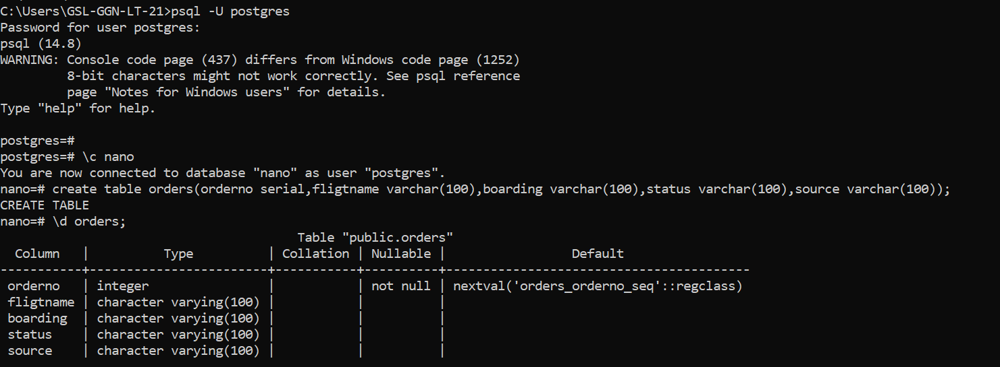

1. Create a table called online_bookings that will inherit table orders.

Note: Orders is parent Table while online_bookings is child table that is

Inheriting data from parent table

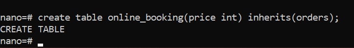

1. Similarly create table agent_booking that will also inherit orders table

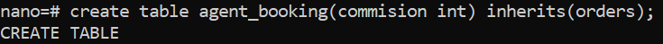

1. Insert a record into Orders (orders is parent table)

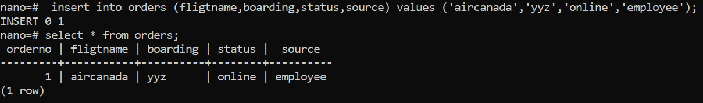

1. Insert two records in child table online_booking

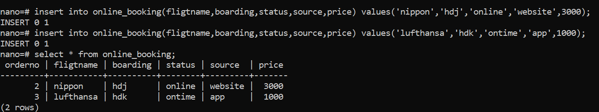

1. Insert two records in agent_booking table

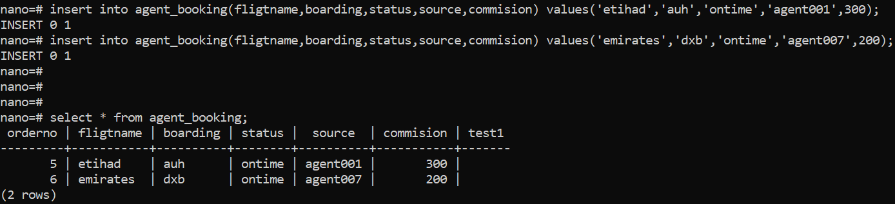

1. Query orders table

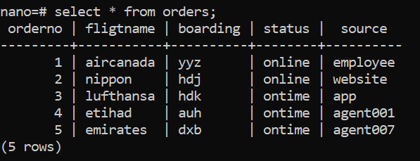

Note: Orders table Shows its own data, data from child table i.e from order_booking and agent_booking table as well.

But Child tables (order_booking and agent_booking) does not shows orders data when queried.

Only Column structure,data type,constraints are copied to child table from parent table that's why there is no data of orders in child tables.

If you want the child table to contain the same rows as the parent table, you would need to explicitly insert the data into the child table

1. Orders table shows data from all child tables. To view the record of only orders table excluding child tables use the keyword only.

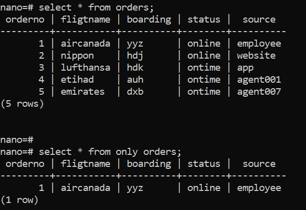

1. Using query update orders set status='offline'; will change status for orders table and its child tables. 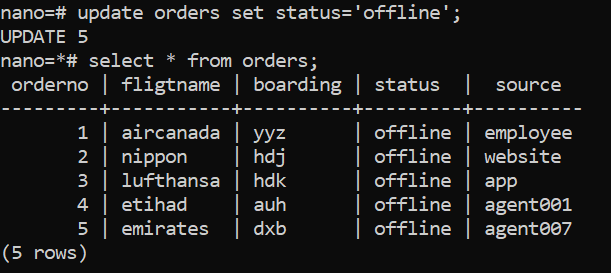
2. To change record of only orders table(parent)

Use the query instead: update only orders set status 'offline';

**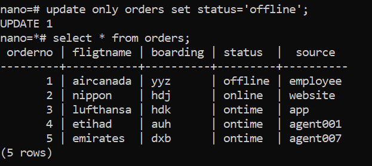**

### Table Partitioning

- Table Partitioning means splitting a table into smaller pieces.
- Table Partitioning holds many performance benefits for tables that hold

large amount of data.

- PostgreSQL allows table partitioning via table inheritance.
- Each Partition is created as a child table of a single parent table
- PostgreSQL implements range and list partitioning methods

Example Illustrating Table Partition

1. Create table bookings

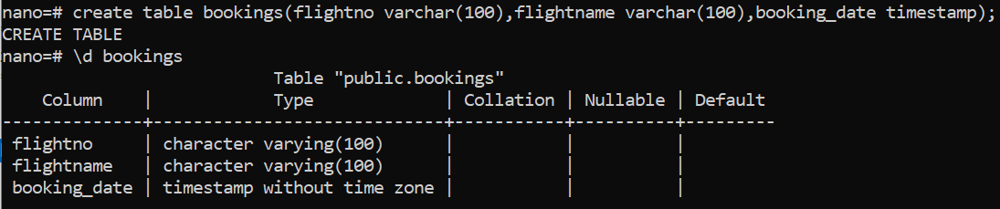

1. Create child tables that will inherit table bookings:

create table jan_bookings(check(booking_date >= '2020-01-01' and booking_date <='2020_01_31')) inherits(bookings);

create table feb_bookings(check(booking_date >= '2020-02-01' and booking_date <='2020_02_29')) inherits(bookings);

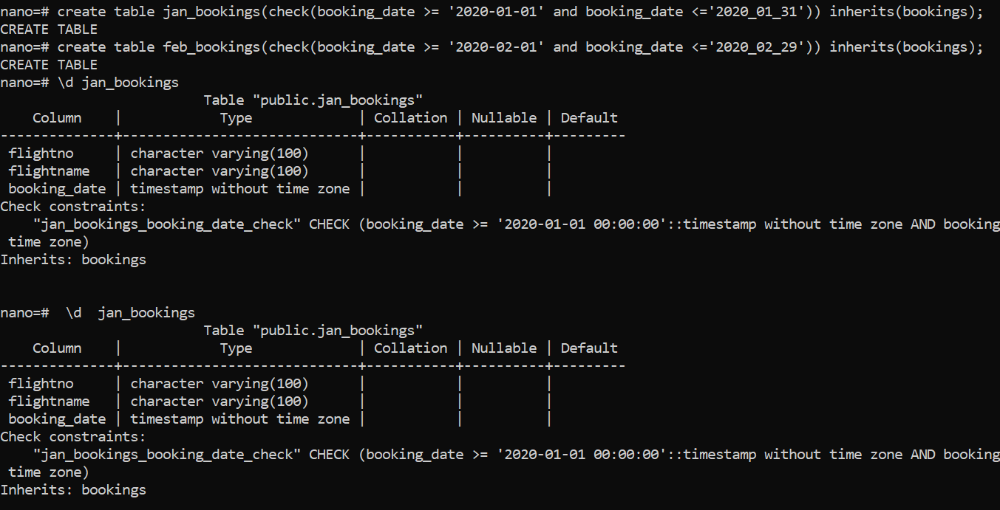

1. Create index on child tables

create index jan_idx on jan_bookings using btree (booking_date);

create index feb_idx on feb_bookings using btree (booking_date);

1. Create a function called on_insert() that will check condition and insert data accordingly.

create or replace function on_insert() returns trigger

as

$$

begin

if(new.booking_date >= date '2020-01-01' and new.booking_date <= date '2020_01_31') then

insert into jan_bookings values(new.*);

elsif (new.booking_date >= date '2020-02-01' and new.booking_date <= date '2020_02_29') then

insert into feb_bookings values(new.*);

else

raise exception 'Enter valid booking date';

end if;

return null;

end;

$$ Language plpgsql;

This function will check if inserted new booking date is between 01 Jan and 31 Jan then insert data into jan_bookings child table

If date is between 01 Feb and 29 Feb then insert new record in feb_bookings child table and so on we can create a table for each month as per desire.

Raise error if no date from Jan or Feb is found.

1. Create a trigger

create trigger booking_entry before insert on bookings for each row execute procedure on_insert();

This trigger will be active before inserting any new record in bookings (parent Table) and will execute on_insert() function that was created before.

1. Now let's insert some records in bookings Table

Entry 1: Insert into bookings values ('dxb102','emirates','2020-01-10');

Entry 2: Insert into bookings values ('dxb103','lufthansa','2020-02-23');

Entry 3: Insert into bookings values ('dxb104','british','2020-02-08');

Entry 4: Insert into bookings values ('dxb105','nipon','2020-01-19');

Entry 5: Insert into bookings values ('dxb105','nipon','2020-03-19');

Result:

Entry1 will insert data into jan_bookings table rather than bookings table.

Entry 2 will insert data into feb_bookings child table

Entry 3 will insert data into feb_bookings table

Entry 4 will insert data into jan_bookings

Entry 5 will raise error because date is of March and is not defined in function

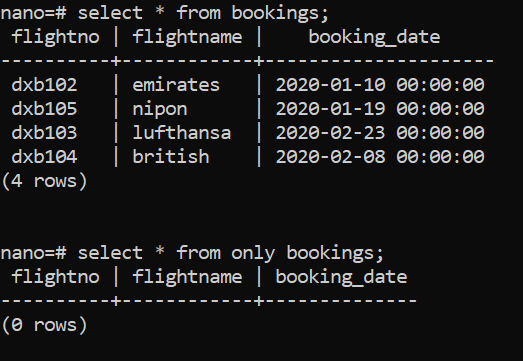

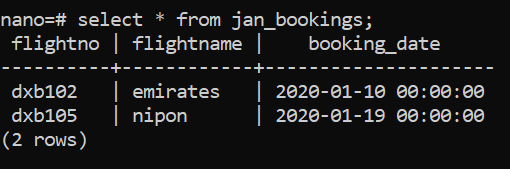

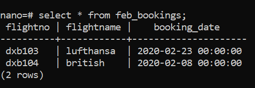

### Copy Table

- Copy Table is used to copy the structure of a table along with data.
- Unlike Inheritance table , copy table does not have any relationship with the base table.
- If you want the child table to contain the same rows as the parent table, you would need to explicitly insert the data into the child table.

Syntax with data:

CREATE TABLE new_table AS TABLE existing_table_name;

Syntax without data:

CREATE TABLE new_table AS TABLE existing_table WITH NO DATA;

**Tablespace**

### Tablespace & its advantages

- PostgreSQL stores data logically in tablespaces and physically in datafiles.
- PostgreSQL uses a tablespace to map a logical name to a physical location on disk.
- Tablespace allows the user to control the disk layout of PostgreSQL.
- Statistics of database objects usage to optimize the performance of databases.
- Allocate data storage across devices to improve performance.
- WAL files object on fast media and archive data on slow media.

### PostgreSQL default tablespaces

- Default comes with two out of the box tablespaces namely pg_default and pg_global
- pg_default tablespace stores all user data.
- pg_global tablespace stores all global data.
- pg_default tablespace is the default tablespace of the template1 and template0 databases.
- All newly created database uses pg_default tablespace, unless overridden by a TABLESPACE clause while CREATING DATABASE.

Location of Default Tablespaces is data directory.

### Create tablespaces

- Syntax for creating tablespace: (ensure the location exist)

create tablespace TEST location ' D:\\PostgreSQL\\14\\Tablespace ';

- Syntax for creating a table on a newly created tablespace

create table test1(studid int,stuname varchar(50)) tablespace hrd;

- Query to find which tablespace the table belong to

Syntax : select * from pg_tables where tablespace='hrd';

or

select * from pg_tables where tablename='test1';

### Move table from one tablespace to another

- Syntax :

alter table test1 set tablespace pg_default

- Check whether the table is moved successfully to another tablespae

Syntax : select * from pg_tables where tablename='test1'

- Find physical location of the table

Syntax : select pg_relation_filepath('test1');

- Find physical location of the tablespace

Syntax : select spcname ,pg_tablespace_location(oid) from pg_tablespace;

### Drop tablespaces

- Dropping a tablespace all the reference from the system automatically.
- We cannot drop a tablespace which is not empty.
- Find objects associate with the tablespace

Syntax : select * from pg_tables where tablespace = 'hrd';

- Drop tablespace

Syntax : drop tablespace hrd;

- Query pg system catalog view to check the tablespace is dropped.

Syntax : select * from pg_tablespace;

### Temporary tablespaces

- Temporary tables and indexes are created by PostgreSQL when it needs to hold large datasets temporarily for completing a query. EX: Sorting
- Temporary tablespace does not store any data and their no persistent file left when we shutdown database.
- How to create temporary tablespace

Syntax : CREATE TABLESPACE temp01 OWNER ownername LOCATION '\\opt\\app\\hrd\\'

- Set temp_tablespaces=temp01 in postgresql.conf and reloaded configuration.
- PG will automatically create a subfolder in the above location when a temp table is created.
- When we shutdown the database the temp files will be delete automatically.

### Backup and Restore

### Back & Types of Backup

- Backup is a copy of data taken from the database and can be used to reconstruct in case of a failure.
- Backups can be divided into Logical backups and Physical backups.
- Logical Backups are simple and the textual representation of the data in the databases.
- These text statements can be used to recreate postgres cluster, database or table.
- Physical backups are backups of the physical files used in storing and recovering of database, such as datafiles, wal files and archive files.

Physical backups are further divided as online backup and offline backup.

### Logical Backup

- Logical Backups are simple and the textual representation of the data in the databases.
- It supports various output forms like plain text(default),tar and custom binary format.
- Sql dumps creates a consistent copy of database as of the time of execution.
- Small database are perfect candidates for logical backups.
- pg_dump and pg_dumpall utilities are used to perform logical dumps.
- pg_dump --help displays the options which can be used to customize of dumps.

### Pg_dump

- Backup single database from postgres instance

Syntax: pg_dump -d nano > /backup/ nano_backup {linux}

Syntax: pg_dump -d nano -U postgres > D:\\user_backup\\test1 {windows}

- We can use any standard editor to view the extracted file ( Vi or notepad)
- The above example creates a backup file in readable plane format which is also default option for pg_dump
- To create a backup file in custom binary format(non-plane text) use syntax:

Syntax: pg_dump -Fc -d dvdrental > D:\\user_backup\\test1

Where -F = output file format

c = custom

d = directory

t = tar

p = plain text

### Restore Backup from pg_dump Using Psql

- To restore backup from pg_dump you must create same empty database manually.
- You can use psql interface to restore plain text pg_dump backup
- To restore a backup of custom binary format use utility pg_restore

Example Illustrating pg_dump backup and restore (plain text)

Step 1: Check list of databases (we will take backup of dvdrental database)

Step 2: use pg_dump utility to take backup of dvdrental database in plain text

Syntax: pg_dump -U postgres -d dvdrental > d:\\user_backup\\dvdrental_backup

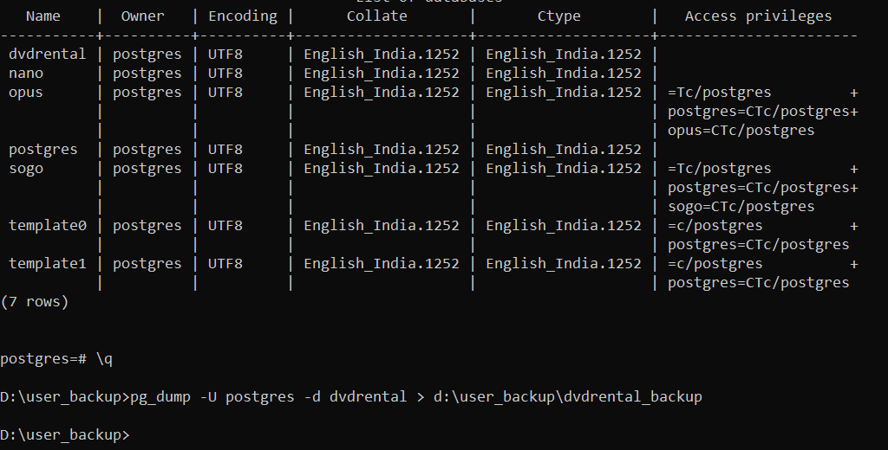

Step 3: Drop database dvdrental from postgres cluster

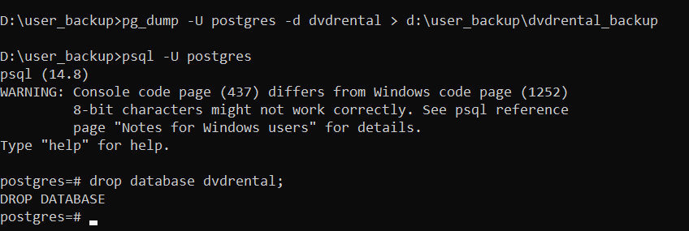

Step 4: Before restoring backup, a blank database of same name must be created

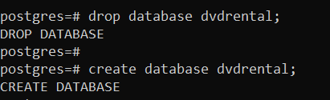

Step 5: Restore dvdrental rental backup using psql interface because backup is in plain text format

Syntax: psql -U postgres -d dvdrental < D:\\user_backup\\dvdrental

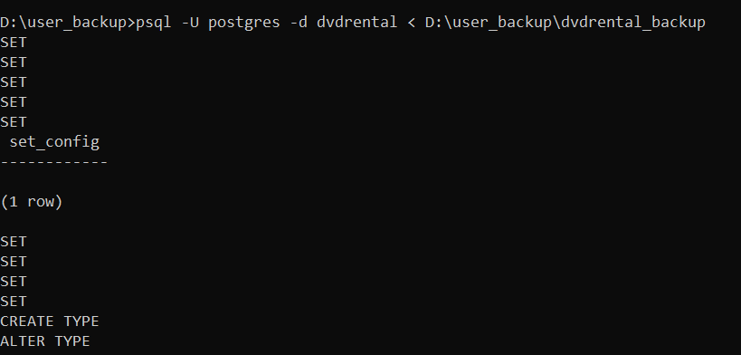

### Restore Backup from pg_dump Using pg_restore

- pg_dump supports multiple output formats such as plain-text SQL (-Fp), custom binary (-Fc), directory format (-Fd), or tar archive (-Ft)
- Pg_dump backup in plain text can be restored using psql interface.
- For pg_dump file in custom binary format pg_restore utility is used
- You cannot restore pg_dumpall backup using pg_restore because pg_dumpall only takes backup in plain text

Example Illustrating backup and restore using pg_restore.

Step 1: Take dvdrental database backup using pg_dump in custom binary format

(-Fc represents format in custom)

pg_dump -U postgres -Fc -d dvdrental >D:\\Pg_dump\\dvdrental_backup

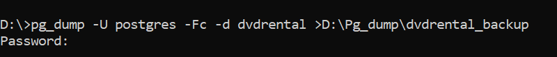

Step 2: Drop database dvdrental and create a blank database dvdrental.

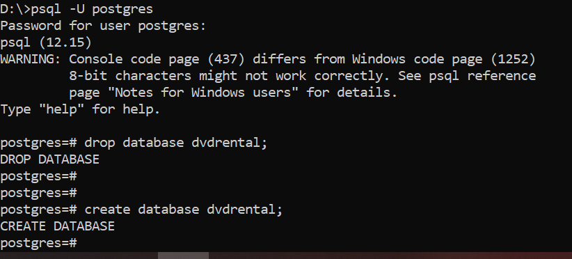

Step 3: Restore dvdrental database using pg_restore

pg_restore -U postgres -d dvdrental D:\\Pg_dump\\dvdrental_backup

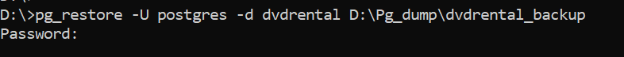

- We can also restore a single table from a full pg_dump

file without restoring the entire database.

- This scenario is really helpful when we lose a particular table accidentally or due to user mistake.

Syntax:

pg_restore -t august -d dvdrental test1.dump

### Pg_dumpall

- Pg_dumpall -- extract a PostgreSQL database cluster into a script file
- This backup includes all databases in a cluster

Syntax: pg_dumpall -U postgres > "/backup/clusterall.sql" {linux}

Syntax: pg_dumpall -U postgres > "D:\\user_backup\\allbackup" {windows}

- We can use any standard editor to view the extracted file ( Vi or notepad)
- pg_dumpall --help displays the options which can be used to customize of dumps.
- You cannot restore a single database from backup of pg_dumpall

### Difference between pg_dump and pg_dumpall

| Pg_dump                                                                                                                                                                                                     | Pg_dumpall                                                                                                                                                                          |
| ----------------------------------------------------------------------------------------------------------------------------------------------------------------------------------------------------------- | ----------------------------------------------------------------------------------------------------------------------------------------------------------------------------------- |
| pg_dump allows you to back up individual database only                                                                                                                                                      | pg_dumpall is used to back up all databases within a PostgreSQL cluster.                                                                                                            |
| Example:  pg_dump -d dvdrental -d nano > D:\\user_backup\\test1  If you mention multiple databases during pg_dump command it will only take backup of one database mentioned at last i.e. nano. | pg_dumpall -d dvdrental -d nano > D:\\user_backup\\test1  Even if you mention selected database in pg_dumpall command for ex: 2 out of 100, it will backup all 100 databases) |
| pg_dump supports multiple output formats such as plain-text SQL (-Fp), custom binary (-Fc), directory format (-Fd), or tar archive (-Ft)                                                                    | pg_dumpall generates plain-text SQL output (-g flag) only                                                                                                                           |
| When using pg_dump, you need to perform a separate restore operation for each database backup file.                                                                                                         | pg_dumpall generates a single output file that can be used to restore all databases at once                                                                                         |
| You can use psql interface to restore plain text pg_dump and pg_restore utility to restore custom binary format pg_dump backup file                                                                         | You can only use psql interface to restore pg_dumpall backup because it is in plain text format only.(pg_restore requires file to be in custom format )                             |

Example Illustrating pg_dumpall backup and restore

Step 1: Take cluster level backup using pg_dumpall

Note: If you have 10 databases in your cluster, you will be asked for writing password 10 times because postgres user will connect 10 different databases to take backup. To avoid writing password each time you can set password before starting pg_dumpall backup with command:

set PGPASSWORD=postgres

Now for current cmd session this password is saved and you will not be prompted to type password again

pg_dumpall -U postgres > "D:\\user_backup\\cluster_backup"

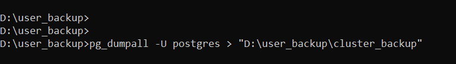

Step 2: Initialize a new cluster on PostgreSQL server

Initdb "D:\\PostgreSQL\\14\\data"

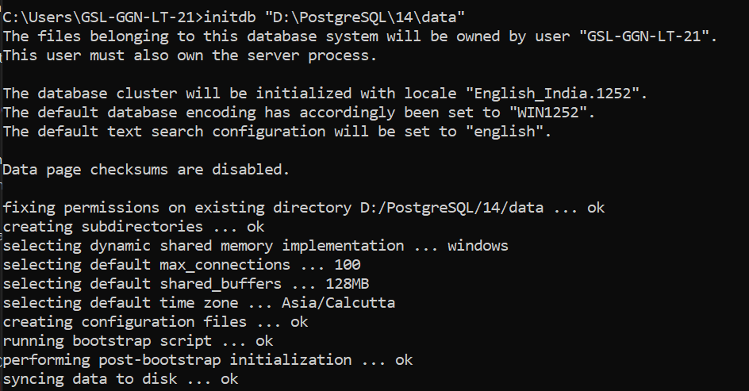

Step 3: Once a fresh/blank cluster is created all you need to do is restore pg_dumpall backup. Initiate backup restore using psql interface

psql -U postgres < D:\\user_backup\\ cluster_backup

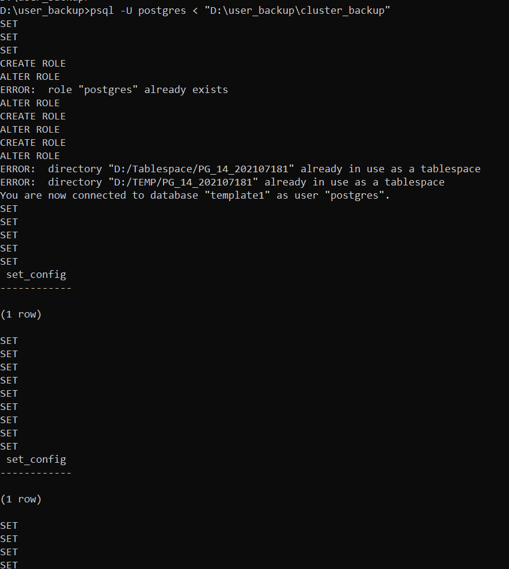

**Compression and splitting Dump Files**

### Compressing and Splitting Dump Files

- Dumps grows exponentially when dealing with large databases
- We can use any standard compression utility to compress the dump like gz

Syntax : pg_dump test1 | gzip >/backup/test1backup.gz

- Compression using gzip only works on linux platform. To use compression on windows perform backup and compress using windows utilities like 7z,rar.

**Splitting**

- We can split the dumps into smaller chunks of desirable size for easy maintenance.

Syntax: pg_dumpall |split -b 1k - /backup/all_database_backup_split

- | (pipe): The pipe symbol is used to redirect the output of the pg_dumpall command to the input of the next command (split).
- split: The split command is a Unix/Linux utility used to split a file into smaller parts. In this case, it is used to split the output from pg_dumpall into smaller files.
- \-b 1k: This option specifies the maximum size for each split file. In this example, -b 1k indicates that each split file will have a maximum size of 1 kilobyte. You can adjust this value as per your requirements like 1M , 1G

### File System Backup - Offline Backup Mode

- The database server must be shut down in order to get a usable backup.
- The database server must be shutdown before restoring the data.
- Partial restore or Single table restore not possible.
- This approach is suitable only for complete backup or complete restoration of the entire database cluster.
- "Consistent snapshot" of the data directory is considered a better approach than file system level backup.

Syntax: tar -cvzf data_backup.tar "D:\\PostgreSQL\\14\\data"

Example Illustrating Offline Backup and Restore(windows)

\--Offline Backup

Step 1: Check If the PosgreSQL server is running or not.

Pg_ctl status

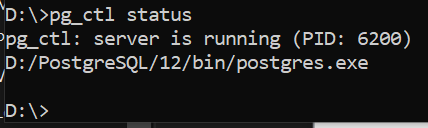

Step 2: Stop PostgreSQL Server

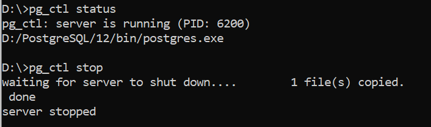

Step 3: Take Offline Backup using tar

tar -cvzf data_backup.tar "D:\\PostgreSQL\\12\\data"

tar": It refers to the tar utility, which is used for creating and manipulating tar archives.

"c": It specifies that we want to create a new archive.

"v": It stands for "verbose" and displays detailed information about the extraction process.

"f": It indicates that the next argument specifies the tar archive file to work with.

data_backup.tar represents name of archive file

"D:\\PostgreSQL\\12\\data" represents the path which will be archived

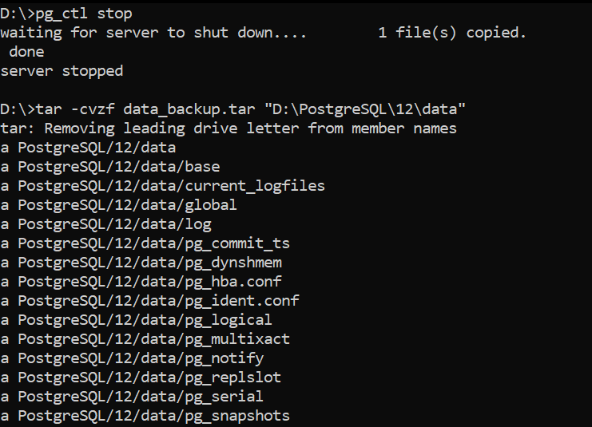

\--Offline Restore

Step 4: Let's suppose you have a new system with freshly installed PostgreSQL.

Go to Postgresql installation directory and create a empty folder named data while giving proper permissions to the directory

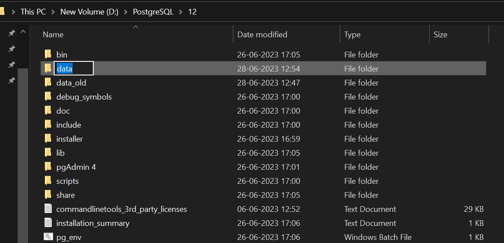

Step 5: Copy backup to your new server and extract it into data folder. (make sure that PostgreSQL services are off while extracting backup)

tar xvf D:\\data_backup.tar -C "D:\\RESTORE"

tar": It refers to the tar utility, which is used for creating and manipulating tar archives.

x": It specifies the operation of extracting files from the archive.

"v": It stands for "verbose" and displays detailed information about the extraction process.

"f": It indicates that the next argument specifies the tar archive file to work with.

"D:\\data_backup.tar" is path to archived backup file

\-C "D:\\RESTORE" represents the path to extract the backup

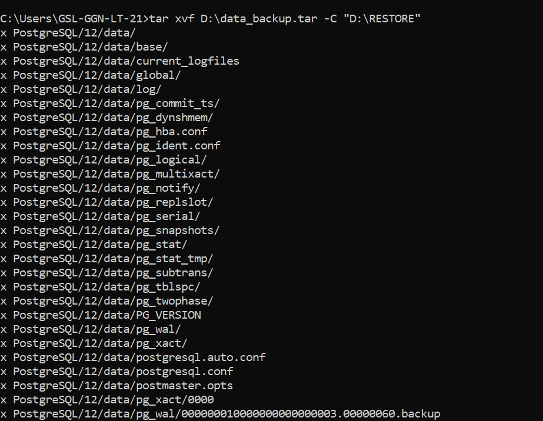

Step 6: Rearrange folder placement according to environment path from OS and Start PostgreSQL

server: pg_ctl start

You can also perform same activity on linux server with slight change in directory structure only. All steps are same on linux as well.

Performing Offline Backup

1. pg_ctl stop

pwd is /backup

1. tar -cvzf data_backup.tar /var/lib/pgsql/14/data

Performing Offline Restore

1. Pg_ctl stop
2. On new server create data folder in PostgreSQL installation directory with proper permissions.
3. tar -xvf data_backup.tar /var/lib
4. Rearrange folder placement according to environment path from OS
5. pg_ctl start

### Continuous Archiving

- Continuous Archiving is the process of archiving Write Ahead Log (WAL) files.
- Archived WAL files are copied to some other location.
- Useful in performing PITR (Point in time recovery).
- To set up archiving change archive mode and archive command parameters from postgresql.conf file.

### Steps to set up continuous archiving

Step 1: Check If Postgresql cluster is in archive mode or not.

Show archive_mode;

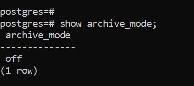

Step 2: Turn off PostgreSQL server.

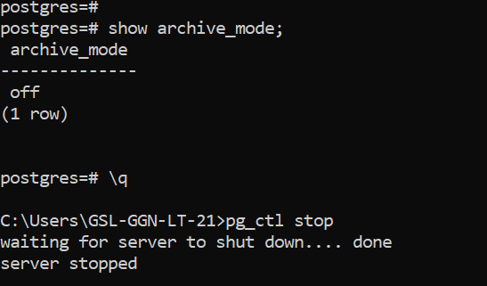

Step 3: Open postgresql.conf file and change following parameters:

wal_level = replica

archive_mode = on # enables archiving; off, on, or always

\# (change requires restart)

archive_command = 'copy "%p" "D:\\\\archivedir\\\\%f"' { for windows}

archive_command = 'cp -i %p /backup/arch/%f' { for linux}

Note: create a folder called archivedir in D drive before changing parameter which will contain archive files

Step 4: Start PostgreSQL server

pg_ctl start

Step 5: Check archive mode:

show archive_mode;

Note: If you want to stop archival then just comment all three parameter in config file wal_level,archive_mode,archive_command and restart the PostgreSQL server.

### Pg_basebackup - Online backup mode

- pg_basebackup is used to take base backups of a running PostgreSQL database cluster. (Online)
- This backup can be used for PITR or Replication.
- It automatically puts and take out the database from backup mode.
- Backups are always taken of the entire database cluster and cannot be used for single database or objects.
- Pg_basebackup require empty folder on OS to take backup.
- pg_basebackup --help

Syntax: pg_basebackup -D &lt;backup directory location&gt; -Ft -z -P -Xs

\-Ft: Specifies the format of the backup. -Ft indicates that the backup will be in tar format.

\-z: Enables compression of the backup. The -z option tells pg_basebackup to compress the backup files using gzip.

\-P: Enables progress reporting. With this option, pg_basebackup will display progress information during the backup process.

\-Xs: Includes a small amount of transaction log files required for a consistent backup. This option ensures that the backup is in a consistent state at the time of backup.

{ windows tar backup}

pg_basebackup -h localhost -p 5432 -U postgres -D "C:\\basebackup" -Ft -z -P -Xs

{windows plain backup}

pg_basebackup -D "D:\\user_backup\\bkp" -Fp -P -Xs

{linux tar backup}

pg_basebackup -p 5432 -D /backup/bkp2 -Ft -z -P -Xs

{linux plain backup}

pg_basebackup -U postgres -D /backup/bkp -Fp -P -Xs

### Online Backup Restore and PITR (Point in Time Recovery)

- Database must be in archive mode
- Specify archive command parameter in postgresql.conf file to enable archive location.
- Take online base backup using utility pg_basebackup
- Restore pg_basebackup data folder using tar utility
- Specify parameter restore command to copy archive files to wal folder
- Optionally include parameter recovery_target_time to perfrom PITR
- Excluding parameter recovery_target_time will peform complete recovery of all the archives that are present in wal folder
- Create a recovery file in postgresql installation location
- Start server

Example Illustrating performing pg_basebackup, restoring pg_basebackup and performing point-in-time-recovery using continuous archiving {windows}

Step 1: Ensure Cluster is in archive mode. If not convert cluster to continuous archiving. We have a table root1 which has 150 records before backup

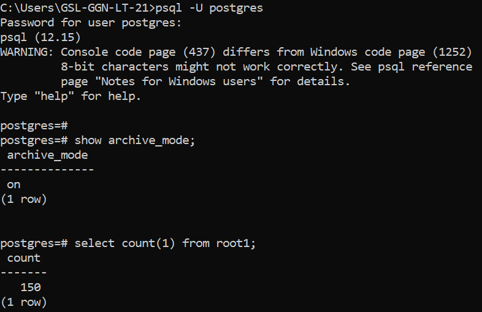

Step 2: Perform online backup using pg_basebackup. Make sure to take backup in an empty directory

pg_basebackup -U postgres -D "D:\\pg_dump" -Ft -P -Xs {windows}

pg_basebackup -U postgres -D /backup/bkp2 -Ft -P -Xs {linux}

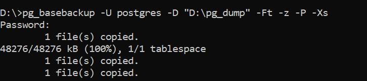

Backup files are created in D:\\pg_dump\\

Step 3: Insert some records in root1 table and generate archive files. Now total records in root1 tables are 250.(archive generated at time 12:22.

Select pg_switch_wal();

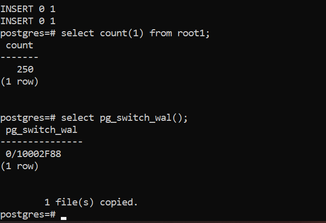

Step 4: Insert Some more records in root1 table and similarly generate another archive.(archive generated at time 12:24 with 350 records in root1 table)

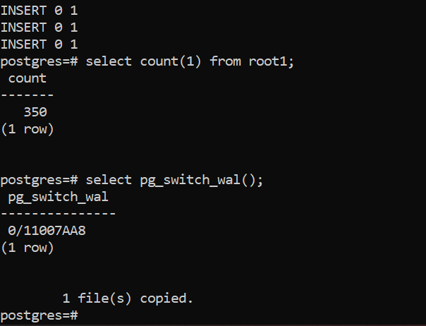

Step 5:. Shutdown postgresql server

Pg_ctl stop

Step 6: Delete or rename data folder in postgresql installation location and create a new folder data while providing necessary permissions on the folder.

Step 7: restore pg_basebackup file. If backup is plain backup all you need to do is copy backup to data folder. But if it is tar backup you need to extract it.

tar xvf base.tar.gz -C "D:\\PostgreSQL\\12\\data" {windows}

tar xvf base.tar.gz -C /var/lib/pgsql/14/data {linux}

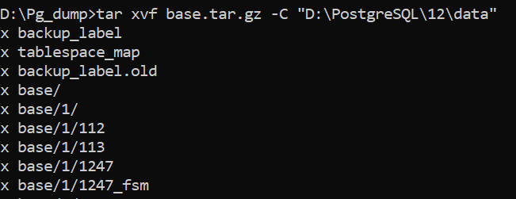

Step 8: Modify following 2 parameters in postgresql.conf file

1. restore_command = 'cp /mnt/server/archivedir/%f %p' {Linux}

restore_command = 'copy "D:\\\\archivedir\\\\%f" "%p"' {Windows}

1. recovery_target_time= '2023-06-29 12:22:00'

Note: I have set recovery_target_time till 12:22 which will recover until record count in root1 were 250. Also specify seconds in recovery_target_time by checking archive modified time from OS.

If you do not specify recovery_target_time or if this parameter is commented out, all of the archive files will be used for recovery and in that case the record count will be 350 rows.

### There are multiple archive recovery method. Use as per need.

Recovery_Target = immediate ( This parameter specifies the recovery should end as soon as a consistent state is reached).

Recover_Target_Lsn = This parameter specifies the LSN pf the wrote-ahead log location up to which the recovery will proceed.

Recovery_Target_Name = This parameter specifies the named restore point(create with pg_create_restore_point) to which recovery will proceed.

Recovery_Target_Time = This parameter specifies the time stamp up to which recovery will proceed.

Recovery_Target_Xid = The parameter specifies the transaction ID upto which recovery will proceed.

Recovery_Target_Inclusive = Specifies whether to stop the recovery just after the target is reached(on) or just before the recover target(off). Default is On.

Step 9: In Data directory create recovery.signal file

Go to data directory from command prompt and type:

type nul >> "recovery.signal" {same for linux and windows}

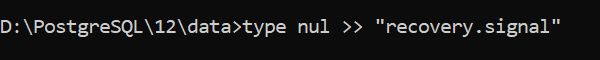

Step 10: Start PostgreSQL server:

Pg_ctl start

Step 11: Check database cluster log.

Database is ready to accept read only connection. Because point in time recovery was performed so we need to issue below command to allow database to accept connections.

Select pg_wal_replay_resume();

Note:If no recovery_target_time was mentioned then cluster will open to read/write connection ,i,e no need to issue above command in that case.

Check recovery.signal in data folder. It will also be removed automatically if no recovery_target_time was mentioned and recovery was successful. Automatic Deletion of recovery.signal indicates successful open connection of database

When recovery_target_time is mentioned, issuing pg_wal_replay_resume() will automatically delete recovery.signal file.If not deleted, it indicates incomplete cluster recovery

Step 12: Issue command:

Select pg_wal_replay_resume();

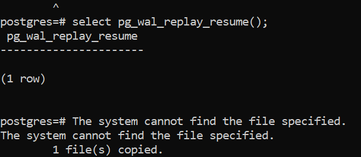

Step 13: Check alert log.

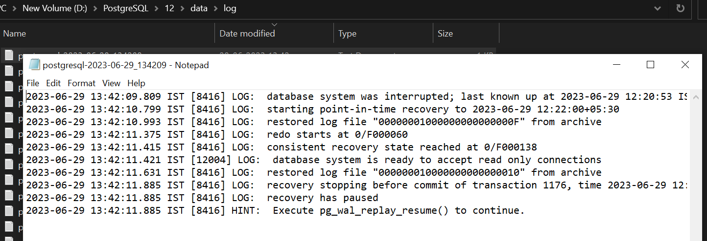

Step 14: Crosscheck record count of root1 table

Example Illustrating performing pg_basebackup, restoring pg_basebackup and performing point-in-time-recovery using continuous archiving {Linux}

Prerequisite:

Ensure Archive Mode is turned on and archiving is happening.

How to recover database using online pg_basebackup:

Example:

Step 1:Create a table and insert few records, update or delete ( perform some transaction which can be archived)

I have created a table named test1 and did few operations on it like insert and update.

Currently my table has 5 rows.

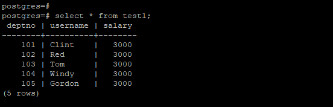

Step 2:Verify archive log folder whether all wal files are archived.

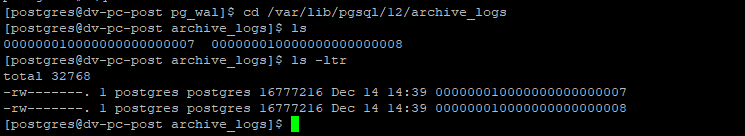

Step 3:Perform a log switch to archive the current log

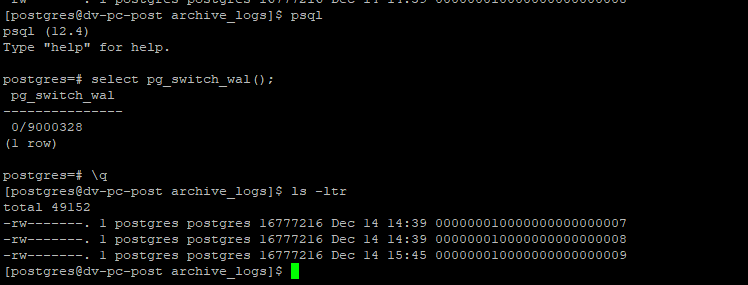

As you can see the current log is archived as well.

Step 4: Take a pg_basebackup of the entire cluster. Using the below command. This generates 2 tar files

One is of the entire data and other one is wal files(pg_wal.tar)

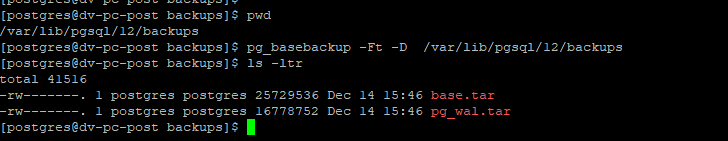

Step 5: Stop the cluster and delete the data folder (we are going to mimic a crash here were we lost our data folder).

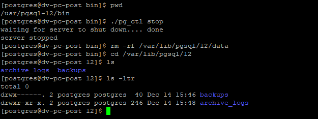

Step 6: Now we are going to restore the data folder using the backup which we took.

First create data folder in the same location where we removed.

Second move in to the data folder and create pg_wal folder.

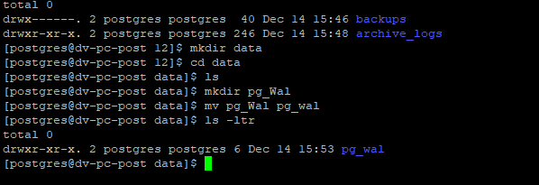

Let us start with the restore of data folder and wal files using the pg_basebackup which we took.

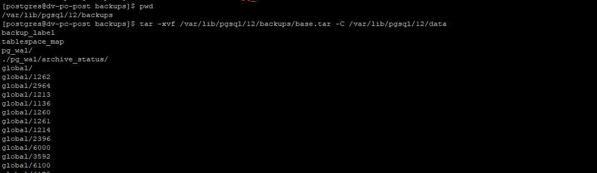

This will create all the data inside the data folder. Log in to data folder and check whether all the folder and files are there.

Now let us restore the wal files from wal backup.

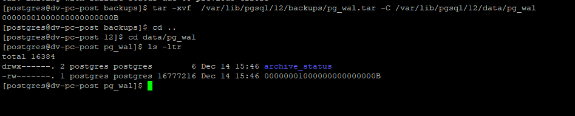

You can see that the wal files is restored in the pg_wal folder.

Step 7: Now we need to ensure that the database is consistent and tell our database server to copy files from our archived location to WAL file location. For this we need to edit postgresql.conf file.

**Add the following entry in postgresql.conf**

Restore_command = 'cp/var/lib/pgsql/12/archive_logs/%f %p'

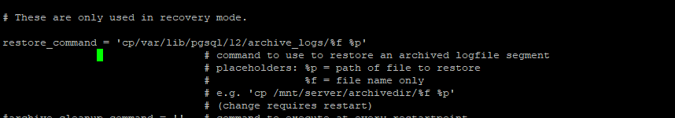

Step 8: Start the cluster. (Remember all this while the cluster was down).

You may get error like this when you start ( Permission error on data directory)

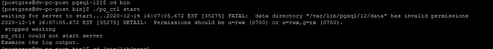

Just change the permission on data directory to 700

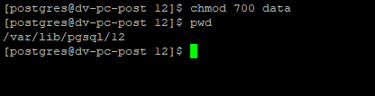

And start the cluster again

The cluster started successfully. Let us check whether the table test1 with 5 records exist or not.

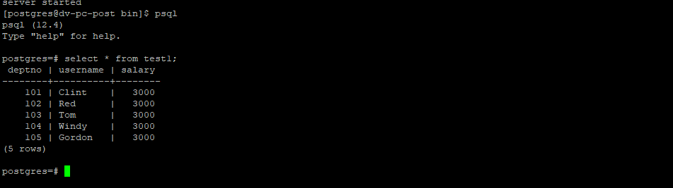

So we have successfully deleted and restored our database using pg_basebackup.

**PITR**

Let us try now to a PITR.

Step 1: We will use the same table to perform PITR. I will be adding few more to the existing table to generate archives.

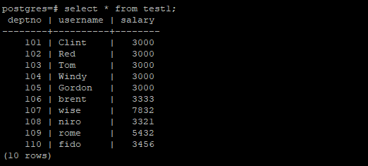

Switch the current archive log.

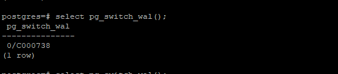

Now check the archive log folder whether we got any new archives.

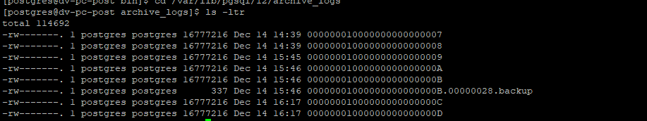

We can see that there are many new archives which are generated in the archive log folder.

Step 2:

Take a fresh pg_basebackup.

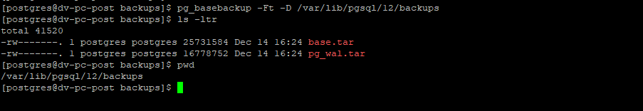

Step 3:

Now insert few more rows after that backup in the test1 table. Before my row count was 10 now it is 15 records.

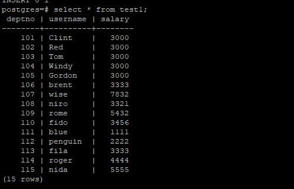

My task is to restore the database when the table was with 10 records.

Step 4:

Now I will mimic a crash by deleting my data directory.

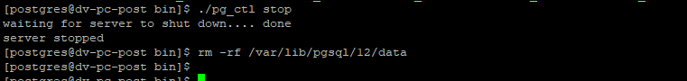

I have removed my data directory.

Step 5:

Restore the database from the backup which we took @ step 2.

Make sure we create the data and pg_wal folder before we start the restore.

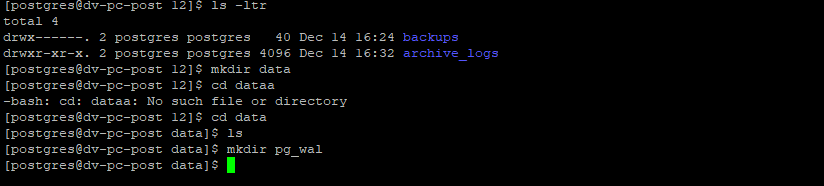

Start the restore operation

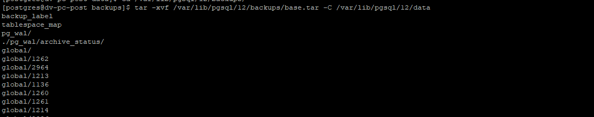

**ONLY DATA DIRECTORY SHOULD BE RESTORED. DON'T RESTORE PG_WAL TAR.**

Recovery file will guide the Point in time to backup.

Step 6: I have to recover my database till the point of 10 records. So I will check the archive log which was generated by that time.

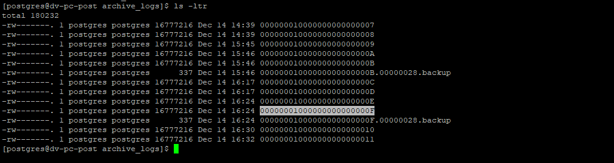

So I am going to recover my database till 16:24 before I did my pg_basebackup. There are few additional archive files @ 16:30 and 16:32 which hold the new 5 records. I don't want that.

Step 7:Create recovery.signal file inside /data folder.

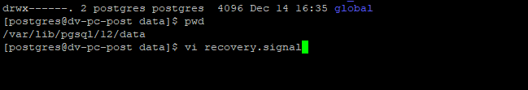

And add the following entries in the file

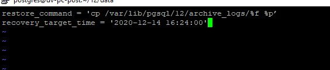

And save the file using wq!. These two parameters are very important for PITR . If we don't add these two parameters all the archive files will be applied and instead of 10 rows we will get 15 rows.

Copy the two commands in postgresql.conf file as well as

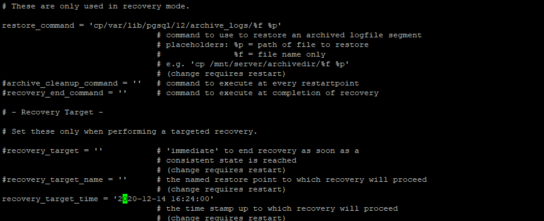

Step 8: Now start the cluster and it will recover the database till the specified time. Ensure to Change the permission on data folder to 700

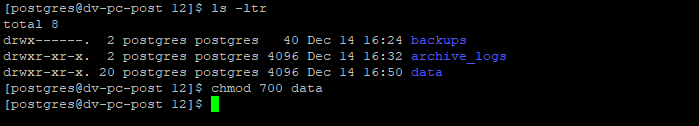

Step 9: Start the cluster

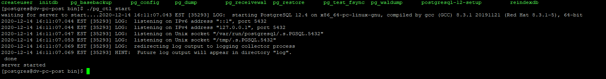

Step 10: Check how many rows are there in table test1.

**Maintenance in PostgreSQL**

### Introduction to Maintenance

- All databases require some kind of maintenance tasks be performed regularly to achieve optimum performance.
- Maintenance task are ongoing and repetitive which are ideally automated and schedule from cronjob scripts(linux) and task scheduler(windows).
- PostgreSQL provides the following maintenance option:

Updating Planner Statistics\\Analyze

Vacuum

Routine Reindexing

Cluster

### Updating Planner Statistics\\Analyze

- PostgreSQL query planner relies on statistical information about the contents of tables in order to generate good plans for queries.
- These stats are gathered by Analyze command, which keeps the stats up- to-date about the current state of the table.
- Analyze command collects information about size, row count, average row size and row sampling information.
- Inaccurate or stale stats can mislead optimizer to choose plans which might degrade database performance.
- Tables with heavy update/delete need to be analyzed on a regular basis to ensure optimal performance is achieved.
- We can run Analyze command automatically by enabling autovaccum daemon or can run the analyze command manually.

Understanding Analyze/Query explain plan

Step 1: We have a empty table tel_directory

create table tel_directory (cust_id varchar(10),cust_name varchar(50),state varchar(10),zip integer);

Step 2: Stop Auto-vacuum on tel_directory table because auto vacuum will automatically analyze and gather statistics for table

alter table tel_directory SET (autovacuum_enabled=false);

Step 3: Check if auto vacuum is stopped or not.

select reloptions from pg_class where relname='tel_directory';

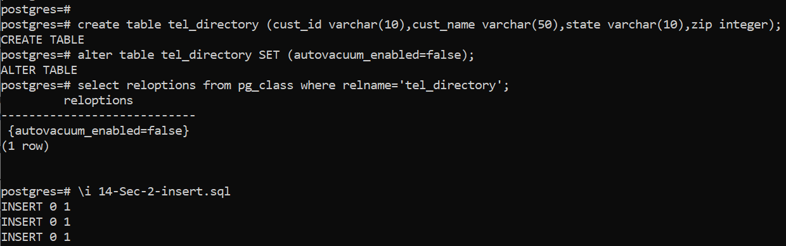

Step 4: Insert records in tel_directory table and check explain plan for execution of query on tel_directory table

Use syntax explain {your query}

query explain select * from tel_directory;

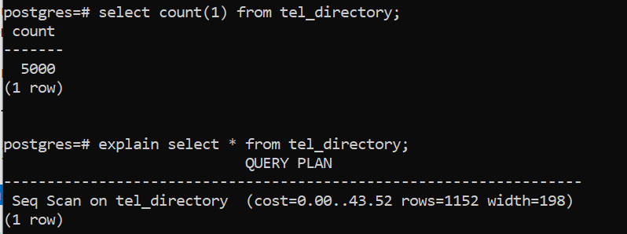

Note: You can see result of explain. Rows=1152 width=198 which is inaccurate because we have 5000 rows in tel_directory table.

Step 5: Analyze table tel_directory for accurate stats.

Syntax: Analyse {table_name}

Analyse tel_directory;

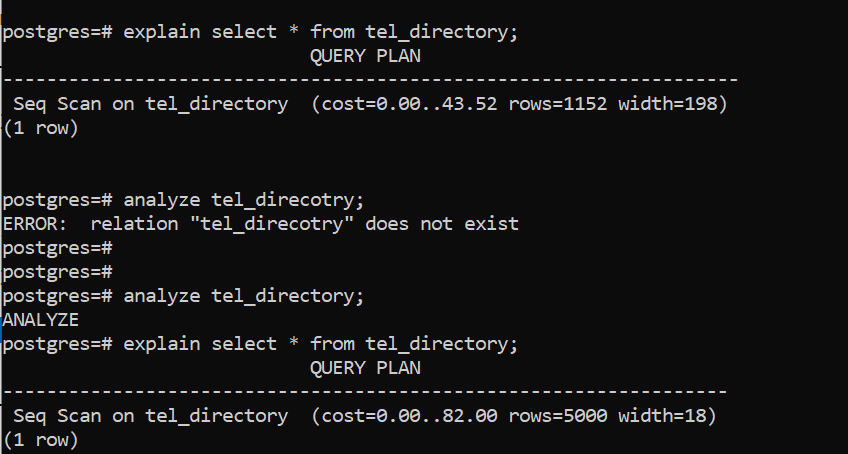

Note: after analyse, cost is increased from 43 to 82 and so does rows and width of table. Now stats are accurate

If auto vacuum was enabled table would automatically be analyzed.

You can re enable (turn on) auto vacuum using:

alter table tel_directory SET (autovacuum_enabled=true);

You can further analyse and add index on table to improve performance.

Example

Step 1: explain select * from tel_directory where state in ('TX','NJ','NY');

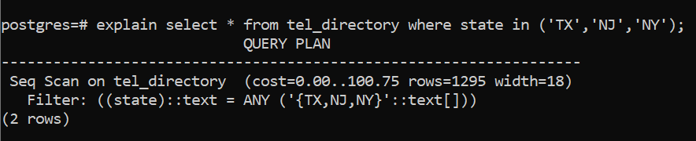

Step 2: Create index for table tel_directory.

create index telidx on tel_directory(state);

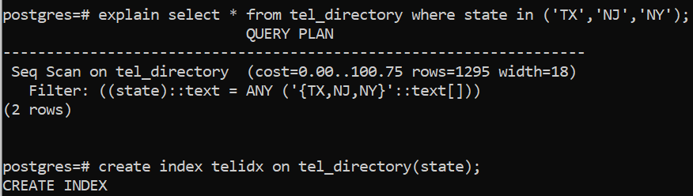

Step 3: Check explain plan for same query now.

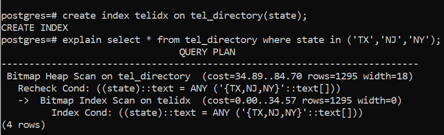

### Explain plan and Query Execution Cost

- EXPLAIN PLAN statement displays execution plans chosen by the optimizer for SELECT, UPDATE, INSERT, and DELETE statements.

Example : explain select * from &lt;tablename&gt;;

- Cost of Query execution

Cost = number of pages * seq_page_cost + number of rows* cpu_tuple_cost

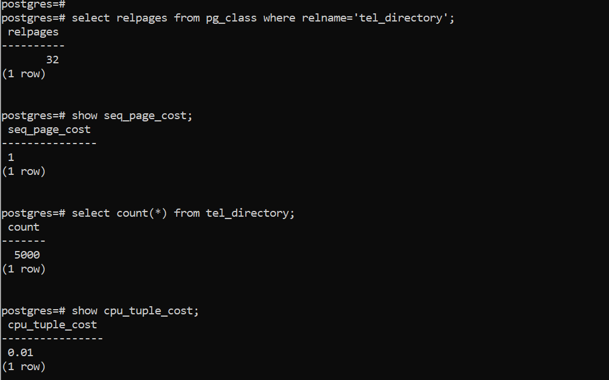

Relpages=32

Seq_page_cost=1

Number of rows=5000

Cpu_tuple_cost=0.01

Cost=32*1+5000*0.01=82 { for tel_directory table }

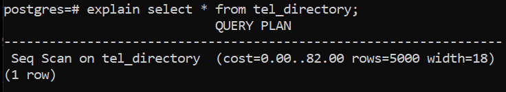

### Data Fragmentation

- Fragmentation is often called bloat in **PostgreSQL.**
- PostgreSQL in line with **Multiversion concurrency control** (MVCC) does not UPDATE or DELETE a row directly from the disk
- These rows are marked as old versions.
- Tuples that are deleted or obsoleted by an update are not physically removed from their table; they remain present until a VACUUM is done.
- As the old version become obsolete and keep piling up. This causes fragmentation and bloating in the table.
- Tables or Indexes become bigger than their actual size.

### Vacuum Vs Vacuum full

| Vacuum                                                                                                                                                | Vacuum full                                                                                                                                   |
| ----------------------------------------------------------------------------------------------------------------------------------------------------- | --------------------------------------------------------------------------------------------------------------------------------------------- |
| Updated/deleted are marked as old/dead tuples and are not deleted from table causing bloating. VACUUM reclaims storage occupied by dead tuples\\rows. | VACUUM FULL rewrites the entire contents of the table into a new disk file with no extra space.                                               |
| Deleted and obsolete tuples are removed when vacuum is done.                                                                                          | Compacts/pack together tables and reclaims more space.                                                                                        |
| Extra free space is not returned to the operating system it's just kept available for re-use for other objects                                        | Unused space to be returned to the operating system                                                                                           |
| No exclusive lock on table.                                                                                                                           | Takes much longer than regular vacuum and places exclusive lock on the tables.                                                                |
| Frequently updated tables are good candidates for vacuuming.                                                                                          | full vacuum takes extra disk space, since it writes a new copy of the table and doesn't release the old copy until the operation is complete. |
| Syntax vacuumdb                                                                                                                                       | Syntax vacuumdb -f                                                                                                                            |

Example performing vacuum and vacuum full.

Step 1: We have 5000 records in tel_directory table which occupies size of 280Kb.

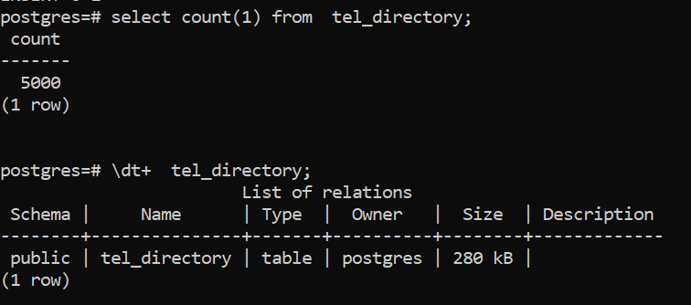

Step 2: Disable auto vacuum and delete some records in tel_directory

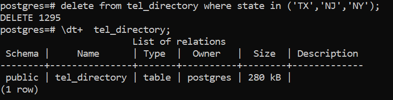

The size of tel_directory is still 280Kb as deleted tuples are marked old but not deleted from table.

Step 3: Insert Some more records in tel_directory table. Notice size of table is increased to 352 Kb with some dead tuples.

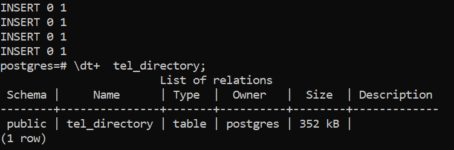

Step 4: Perform vacuum on table tel_directory.

vacuum(verbose) tel_directory; {optionally use vacuumdb utility}

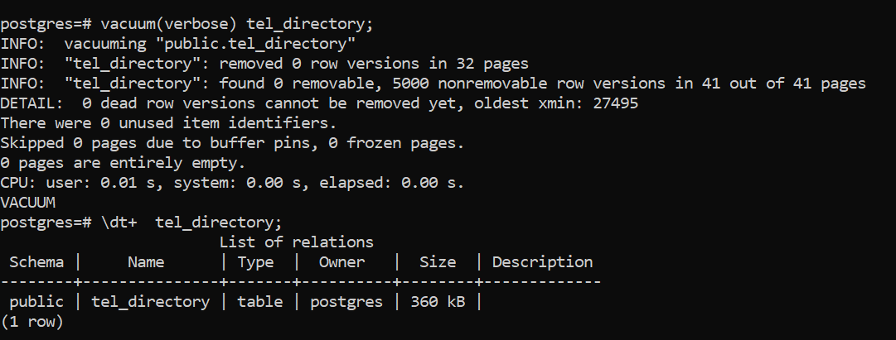

Step 5: Perform vacuum full on table tel_directory.

vacuum(full,verbose) tel_directory; {optionally use vacuumdb utility}

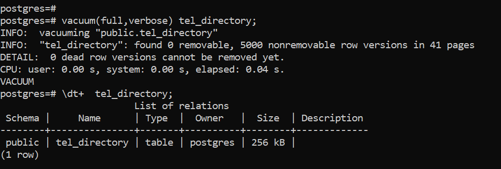

Notice the significant decrease in size of table. The size is reclaimed on hard disk as well.

To perform vacuum on database using vacuumdb utility

Vacuumdb -U postgres -d postgres

To perform vacuum full on database using vacuumdb utility

vacuumdb -f -U postgres -d postgres

### Auto-Vacuum in PostgreSQL

- Autovacuum feature is used to automate the execution of VACUUM and ANALYZE commands.
- autovacuum checks for tables that have had a large number of inserted, updated or deleted tuples based on statistics collection.
- autovacuum launcher is in charge of starting autovacuum worker processes for all databases
- launcer will start once worker within each database every autovacuum_naptime seconds.
- Workers check for inserts, update and deletes and execute vacuum and analyze if needed.
- View Autovaccum settings

select * from pg_settings where name like '%autovacuum%'

### Transaction ID Wrap Around Failure

- Multiversion concurrency control (MCC or MVCC), is a Concurrency Control method commonly used by dbms to provide concurrent access to the database
- MVCC depends on transaction ID numbers.
- Transaction IDs have limited size (32 bits)
- Cluster that runs for a long time (more than 4 billion transactions) would suffer transaction ID wraparound.
- The XID or transaction ID will wrap around to zero.
- Transactions that were in the past appear to be in the future - which means their output become invisible.
- To void this situation, it is necessary to vacuum every table in every database at least once every two billion transactions.

select datname,age(datfrozenxid),current_setting('autovacuum_freeze_max_age') from pg_database order by 2 desc;

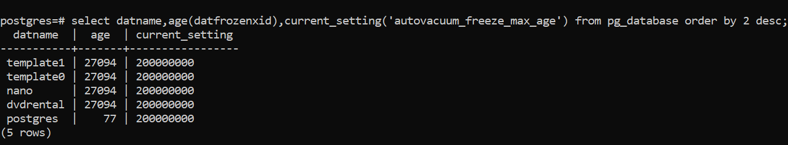

### Vacuum Freeze

- Vacuum freeze is a special kind of vaccum, which marks rows as frozen.
- Vacuum Freeze marks a table's contents with a very special transaction timestamp that tells postgres that it does not need to be vacuumed, ever.
- Postgres reserves a special XID called FrozenTransactionId.
- FrozenTransacationId is always considered older than normal XID
- Vaccum_freeze_min_age controls how old an XID value has to be before it's replaced with FrozenXID
- VACUUM normally skips pages that don't have any dead row versions, but those pages might still have row versions with old XID values
- vacuum_freeze_table_age ensure all old XIDs have been replaced by FrozenXID, a scan of the whole table is needed.
- vacuumdb -F table or database

### Routine Re-Indexing

- Insert, updates and delete operations fragments the index over a period of time.
- A Fragmented index will have pages where logical order based on key value differs from the physical ordering inside the data file.
- Heavily fragmented indexes can degrade query performance because additional I/O is required to locate data to which the index points.
- Reindex rebuilds an index using the data stored in index table and eliminates empty spaces between pages
- Syntax : reindex index &lt;index_name&gt;;

How to perform reindexing

- You must enable / download extension in order to use reindexing
- Query select * from pg_available_extensions; and look for pgstattuple
- To install the extension use command:

yum install postgresql12-contrib {linux}

create extension pgstattuple; {windows}

- Check status of indexes using extension pgstattuple

select * from pgstatindex('id_comp');

- Reindex any index using command:

reindex index id_comp;

### Cluster

- CLUSTER instructs PostgreSQL to cluster the table specified by table_name based on the index specified by index_name.
- When a table is clustered, it is physically reordered based on the index information.
- Clustering is a one-time operation: when the table is subsequently updated, the changes are not clustered
- An Access Exclusive lock is acquired.
- Cluster lowers disk access and speeds up query when accessing a range of indexed values.
- Cluster should not be executed during peak hours in production environment.
- Syntax for cluster:

CLUSTER table USING index_name;

How to Cluster a Table

Step 1: Create a table 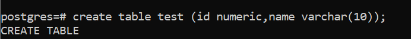

Step 2: Insert some records

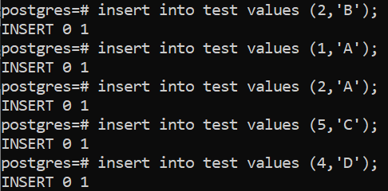

Step 3: Query table test

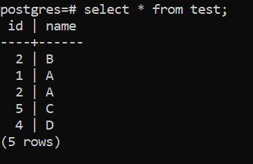

Note: In the given example, the order of the results retrieved from the SELECT statement without any specific ordering specified would be non-deterministic. The database system may return the rows in any order it finds appropriate, which may not necessarily match the order in which the rows were inserted. To order data we must use order by clause.

select * from test order by id;

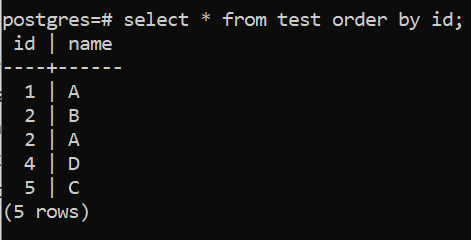

Step 4: Create index on id column of test table.

create index idx_test_id on test(id);

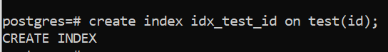

Step 5: Cluster table test using index use command:

cluster test using idx_test_id;

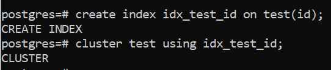

Step 6: Query again from test table

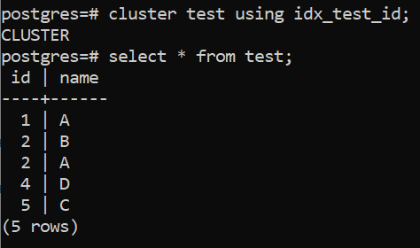

Note: Now existing data in table will automatically appear in order without specifying order by clause. This process will help in query retrieval speed.

Cluster only works for existing data, newly added data after clustering a table will appear in non-deterministic way.

**PostgreSQL Upgarde**

### What is Upgrade

- Upgrading database from one PostgreSQL release to a newer one.
- PostgreSQL version numbers consist of a major and a minor version number. Ex: 10.1.
- _Major_ releases of PostgreSQL, the internal data storage format is subject to change.
- Minor releases never change the internal storage format and are always compatible with earlier and later minor releases of the same major version number.
- Before PostgreSQL version 10.0, version numbers consist of three numbers. Ex: 9.5.6
- Reasons for Upgrade:

Security Fixes

Enhanced Features

Resolved Bugs and Other Issues

Reduced Costs

End of Support

### Ways to Upgrade

- Upgrading Data via pg_dumpall
- Upgrading Data via pg_upgrade
- Upgrading Data via Replication

### Pg_upgrade utility

- Pg_Upgrade (formerly called pg_migrator) allows data stored in PostgreSQL data files to be upgraded to a later PostgreSQL major version without the data dump/reload.
- Primary used for major PostgreSQL version upgrades.
- Major PostgreSQL releases regularly add new features that often change the layout of the system tables, but the internal data storage format rarely changes.
- pg_upgrade perform rapid upgrades by creating new system tables and simply reusing the old user data files.
- pg_upgrade does its best to make sure the old and new clusters are binary-compatible
- **Syntax:**

/usr/pgsql-12/bin/pg_upgrade --old-bindir=/usr/pgsql-10/bin

\--new-bindir=/usr/pgsql-12/bin --old-datadir=/var/lib/pgsql/10/data

\--new-datadir=/var/lib/pgsql/12/data --Link/Clone

\-b, --old-bindir : old bin directory

\-B, --new-bindir : new bin directory

\-d, --old-datadir : old data directory

\-D, --new-datadir : new data directory

\-k, --link : Use hard links instead of copying files to the new cluster

\--clone : Use efficient file cloning instead of copying files to

the new cluster. {default}

\-c, --check : check clusters only, don't change any data

Example Illustrating an upgrade from PostgreSQL 13 to PostgreSQL 14. {windows}

Step 1: Check whether PostgreSQL 12 is running or not and also find the location of data and bin directory.

Step 2: Based on your backup strategy perform full cluster backup of old server. We will use pg_dumpall for this example

pg_dumpall -U postgres > "D:\\Pg_dump\\cluster13"

OR

pg_basebackup -D "D:\\user_backup\\bkp" -Fp -P -Xs

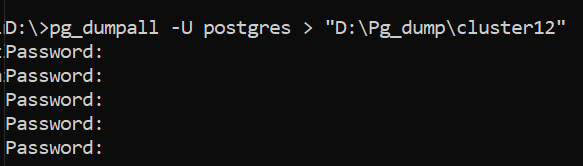

Step 3: Download and Install PostgreSQL 14 {Refer to Chapter 2}.

Note: Remember to change port number during installation.

Step 4: Check the location Old and New installed PostgreSQL. Version and Version 14 are both available at installation location. (grant proper permission to folders)

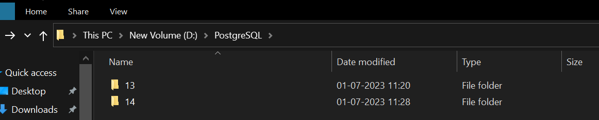

Step 5: Initialize a new cluser using Initdb on new Version i.e. 14

initdb "D:\\PostgreSQL\\14\\data" -U postgres

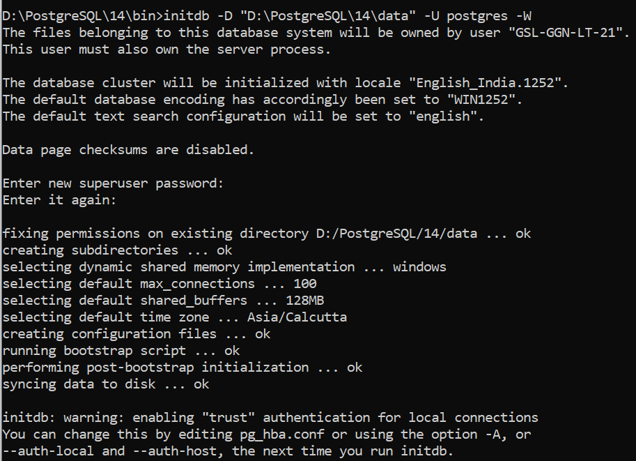

Step 6: Check if new PostgreSQL 14 server is running. It should be turned off.

Ensure the application is down and no connections can be made to PostgreSQL. If needed block connection from pg_hba.conf file.

Step 7: Run pg_upgrade utility from bin folder of PostgreSQL 14

D:\\PostgreSQL\\14\\bin\\pg_upgrade -U postgres --old-bindir="D:\\PostgreSQL\\13\\bin" --new-bindir="D:\\PostgreSQL\\14\\bin" --old-datadir="D:\\PostgreSQL\\13\\data" --new-datadir="D:\\PostgreSQL\\14\\data" "-p 5432" "-P 5433" --check

Performing Consistency Checks on Old Live Server

\------------------------------------------------

Checking cluster versions ok

connection to server at "localhost" (::1), port 5432 failed: fe_sendauth: no password supplied

Failure, exiting

Step 8: You need to specify password for user postgres. Pg_utility itself does not provide option to type password in its command so you need to set explicitly at command prompt using command:

Set PGPASSWORD=your_password

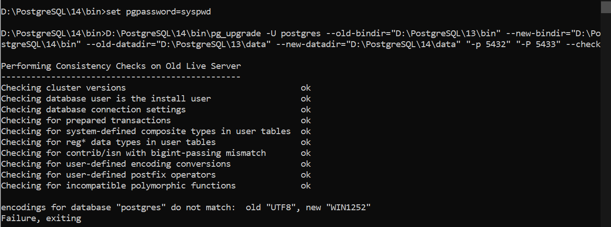

Note: encodings for database "postgres" do not match: old "UTF8", new "WIN1252"

Step 9: To resolve character set issue you need to re initiate Initdb utility.

By default, when creating cluster using Initdb in PostgreSql 14

Character set WIN1252 is used. Need to change to UTF8 to match old

PostgreSQL 12. Delete old cluster of PostgreSQL 14 and Add -E=UTF8 during intidb initialization

initdb -D "D:\\PostgreSQL\\14\\data" -U postgres -W -E=UTF8

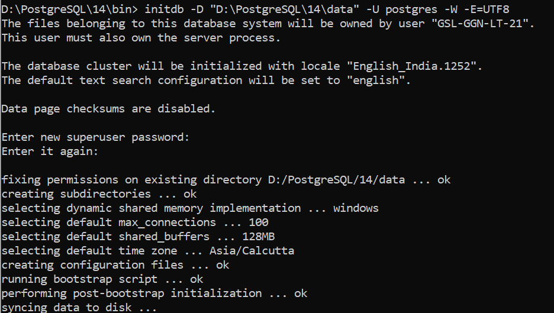

Step 10: Perform pg_upgrade check again. Both clusters are compatible now.

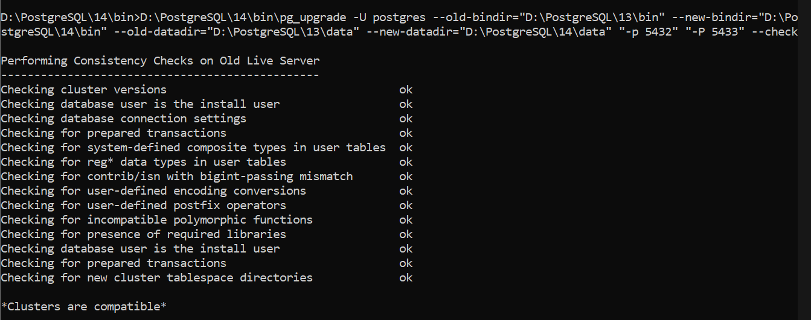

Step 11: Before starting pg_upgrade make sure both postgresql server are down

pg_upgrade process requires exclusive access to the data directories of both the old and new clusters to perform the necessary checks and data migration

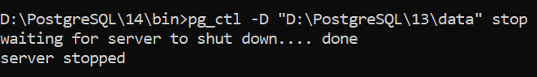

Step 12: Perform pg_upgrade. Just remove --check option from pg_upgrade option to start upgrade process.

D:\\PostgreSQL\\14\\bin\\pg_upgrade -U postgres --old-bindir="D:\\PostgreSQL\\13\\bin" --new-bindir="D:\\PostgreSQL\\14\\bin" --old-datadir="D:\\PostgreSQL\\13\\data" --new-datadir="D:\\PostgreSQL\\14\\data" "-p 5432" "-P 5433"

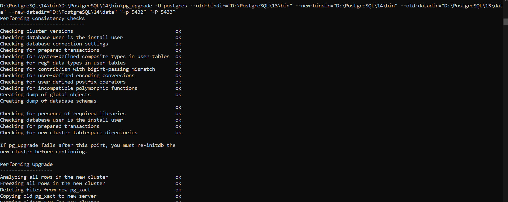

Step 13: At the end of upgrade process it will advise you to run vacuumdb to perform analyse on complete cluster.

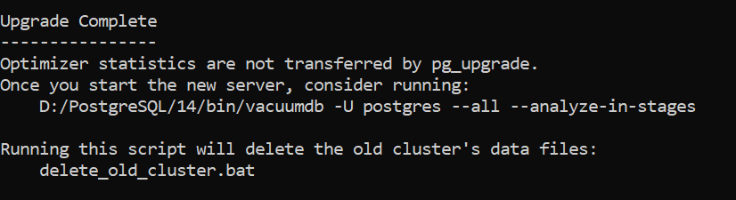

Step 14: Start the new PostgreSQL 14 server.

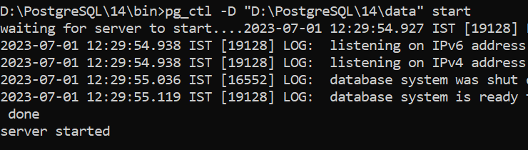

Step 15: Run vacuumdb utility for new cluster.

vacuumdb -U postgres --all --analyze-in-stages

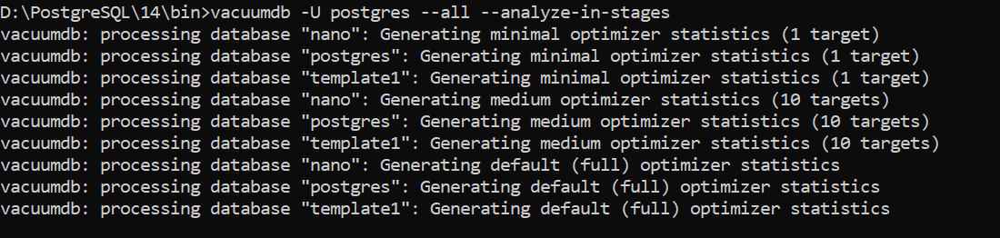

Step 16: Connect to PostgreSQL 14 and check version, your data.

Select version();

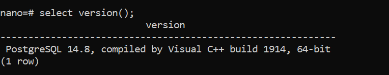

Step 17: Uninstall old PostgreSQL 13 - (Purely your choice if you want to drop it right away or want to keep it for some time) software and old postgresql-13 data directory.

### Uninstalling PostgreSQL

- Open PostgreSQL installation location.

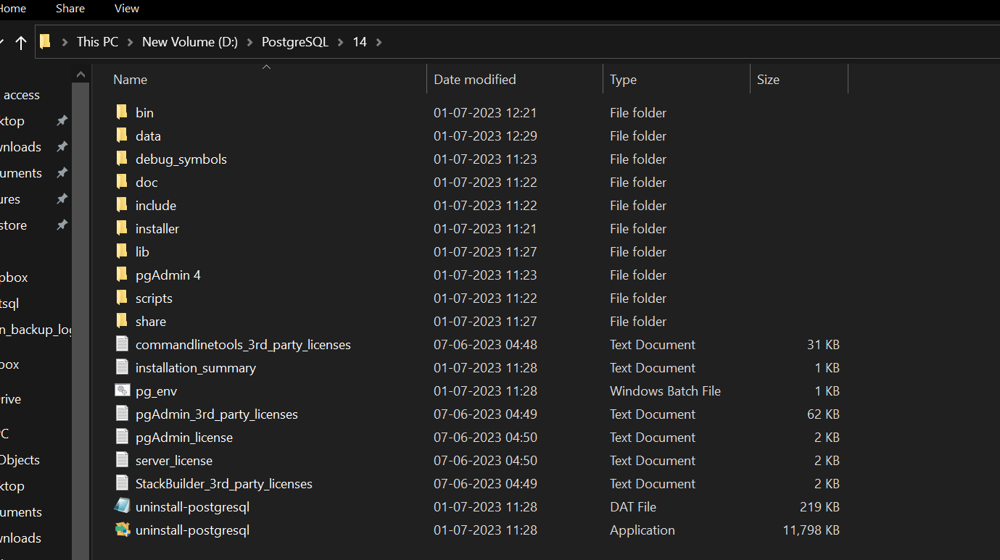

- Run application uninstall-postgresql.exe
- Remove individual/complete component as per your requirement
- Data folder will not be removed from uninstaller application. You have to delete it manually.
- Also remove any environment variable

OS path environment variable

PGDATA environment variable

**New Features and Enhancement (PostgreSQL 13)**

### B-Tree Deduplication

- Merging of duplicate values together and forming a single list for each value. So, key value appears only once.
- Ex: Before: 'Key A' ,(1,1), 'Key A',(1,2) ,'Key A', (1,3)
- Now: 'Key A' (1,1)(1,2)(1,3)
- Deduplication results in a smaller index size for indexes with repeating entries
- Ram is efficiently used when the index is cached in shared buffers.
- Improved performance for queries that uses index scanning.
- Index bloating and Routine Index vacuum overhead is reduced.
- Users upgrading with Pg_Upgrade will need to use ["REINDEX](https://www.postgresql.org/docs/13/sql-reindex.html)" to make an existing index use this feature.

Example:

create table testv13(a int,b text);

insert into testv13(b) select 'toronto' from generate_series(1,10000);

select * from testv13;

create index testv13_idx on testv13(b);

\\di+

check the index size

### Incremental Sorting

**I**ncremental sorting, which accelerates sorting data when data that is sorted from earlier parts of a query are already sorted.

Example: index on c1 and you need to sort dataset by c1, c2. Then incremental sort can help you because it wouldn't sort the whole dataset, but sort individual groups whose have the same value of c1 instead. The incremental sort is extremely helpful when you have a LIMIT clause.

Example

create table testv3(a int,b int);

insert into testv3(a,b) select x,x from generate_series(1,10000000) _(x);

select * from testv3;

select count(*) from testv3;

create index testv3_idx on testv3(a);

explain select * from testv3 order by a;

explain select * from testv3 order by a,b;

### Parallel Vacuum

- VACUUM reclaims storage occupied by dead tuples
- Tuples that are deleted or obsoleted by an update are not physically removed from their table; they remain present until a VACUUM is done.
- Max_parallel_maintenance_workers , Min_parallel_index_scan_size parameter governs parallel vacuum
- The degree of parallelization is either specified by the user or determined based on the number of indexes that the table has.
- AutoVacuum for Append only transactions.

Syntax : VACUUM (PARALLEL 2, VERBOSE) &lt;TableName&gt;

### Trusted Extension

- Can install extensions without super user privileges if we have create privilege on database.

Ex : plperl,pgcrypto and ltree.

### Drop Database (Force)

DROP DATABASE DBNAME WITH (FORCE);

select datid,datname,pid,usename,application_name from pg_stat_activity;

### Track Wal_Usage

EXPLAIN (ANALYZE, WAL, COSTS OFF) UPDATE testv3 SET b = 123;

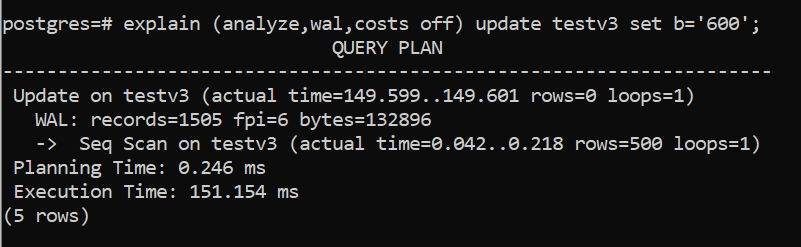

### System Views

- Pg_stat_activity to report a parallel worker's leader process.
- Pg_stat_progress_basebackup to report the progress of streaming base backups.
- Pg_stat_progress_analyze to report ANALYZE progress.
- Pg_shmem_allocations to display shared memory usage.

**New Features and Enhancement (PostgreSQL 15)**

### Server Statistics

- Stats Collector process has been effectively removed from the architecture.
- Statistics are now stored in dynamic shared memory.
- pg_stat_tmp is no longer used to write shared statistics data on temporary files.
- In Postgresql-15, stats updates are first accumulated locally in each process as marked as pending.
- This stats are later flushed to shared memory on commit.
- Information on the shared memory area for statistics can be obtained by searching

the pg_backend_memory_contexts view.

Syntax: SELECT name, total_bytes, free_bytes, used_bytes FROM pg_backend_memory_contexts WHERE name LIKE 'PgStat%' ;

### Logging Format

- Log_Destination parameter has a new supported value called "json log".
- Postgresql logs can be logged in json format using the jsonlog value.
- This provides the user an option to generate "structured log" that can be used by other utilities for storage and analysis.
- The other possible values are stderr, csvlog and syslog.
- We can set more than one value in log_destination using comma separation.
- We can set the parameter value the postgresql.conf file or on the server command line using ALTER SYSTEM.

### Merge

- MERGE provides a single SQL statement that can conditionally INSERT, UPDATE or DELETE rows, a task that would otherwise require multiple procedural language statements.
- It performs actions that modify rows in the target_table_name, using the data_source.
- There is no separate privilege for MERGE, the user should have appropriate DML on the target table.
- When DO NOTHING is specified, the source row is skipped.
- MERGE is not supported if the target_table_name is a materialized view or foreign table.

MERGE INTO customer_history c

USING daily_orders d

ON (c.customer_id = d.customer_id)

WHEN MATCHED THEN

UPDATE SET -- Existing customer, update the order count and the timestamp of order.

order_count = c.order_count + 1,

last_order_id = d.order_id

WHEN NOT MATCHED THEN -- New entry, record it.

INSERT (customer_id, last_order_id, order_center, order_count, last_order)

VALUES (customer_id, d.order_id, d.order_center, 1, d.order_time);

### Roles and Setting Server Parameters

- New Roles like pg_read_all_data and pg_write_all_data has been provided.
- pg_read_all_data can read all data (tables, views, sequences), as if having SELECT rights on those objects, and USAGE rights on all schemas, even without having it explicitly.
- Pg_write_all_data can write all data (tables, views, sequences), as if having INSERT, UPDATE, and DELETE rights on those objects, and USAGE rights on all schemas, even without having it explicitly.
- Pg_read_all_settings allows a user to view all configuration visible only to super users.

### Psql \\Dconfig and Other Features

- Psql client includes a \\dconfig command for inspecting and finding the values of configuration parameters.
- UNIQUE NULLS NOT DISTINCT feature has been introduced. Nulls on unique indexes / constraints will cause NULL values to be treated distinctly.
- Pg_Basebackup has compress option, we can now specify the compression method and compression level.

Syntax :

pg_basebackup --compress=none --format=tar -D back.1

pg_basebackup --compress=zstd:level=9,workers=2 --format=tar -D back.2

### Misc. Features

- Exclusive backup function name used to start/end online backup has changed.

Operation PostgreSQL 14 PostgreSQL 15

Start backup pg_start_backup pg_backup_start

Stop backup pg_stop_backup pg_backup_stop

- VACUUM: The execution log of the VACUUM VERBOSE statement has changed significantly. Average read rate, buffer usage, WAL output information, etc. have been added.
- Roles can now be granted permission to change specific parameters through the ALTER SYSTEM statement.

Syntax:

GRANT ALTER SYSTEM ON PARAMETER log_statement TO demo

| **Role**              | **Allowed Access**                                                                                                       |
| --------------------- | ------------------------------------------------------------------------------------------------------------------------ |
| pg_read_all_settings  | Read all configuration variables, even those normally visible only to superusers.                                        |
| pg_read_all_stats     | Read all pg_stat_* views and use various statistics related extensions, even those normally visible only to superusers. |
| pg_stat_scan_tables   | Execute monitoring functions that may take ACCESS SHARE locks on tables, potentially for a long time.                    |
| pg_database_owner     | None. Membership consists, implicitly, of the current database owner.                                                    |
| pg_signal_backend     | Signal another backend to cancel a query or terminate its session.                                                       |
| pg_read_server_files  | Allow reading files from any location the database can access on the server with COPY and other file-access functions.   |
| pg_write_server_files | Allow writing to files in any location the database can access on the server with COPY and other file-access functions.  |

**PostgreSQL Maintenance Queries**

**Long Running Query For More Than 1 Min**

SELECT pid, now() - pg_stat_activity.query_start AS duration

FROM pg_stat_activity

WHERE state = 'active' AND pid <> pg_backend_pid()

AND now() - pg_stat_activity.query_start > interval '1 minute'

ORDER BY duration DESC;

**BLOCKING SESSION**

SELECT

d.datname AS database_name,

a.pid AS blocked_pid,

l.mode AS lock_mode,

l.locktype,

l.relation::regclass AS locked_relation,

bl.pid AS blocking_pid

FROM

pg_stat_activity AS a JOIN pg_locks AS l ON a.pid = l.pid

JOIN pg_locks AS bl ON l.locktype = bl.locktype

AND l.relation = bl.relation AND l.pid != bl.pid

JOIN pg_database AS d ON a.datid = d.oid

WHERE l.mode <> 'AccessShareLock'

AND bl.mode <> 'AccessShareLock'

ORDER BY d.datname, a.pid;

**KILL SESSION**

SELECT pg_cancel_backend(PID);

SELECT pg_cancel_backend(3184);

**DATABASE SIZE**

SELECT

pg_database.datname as database,

pg_size_pretty(pg_database_size(pg_database.datname)) AS size

FROM pg_database

WHERE datistemplate=false

AND pg_database_size(pg_database.datname) > 0;

**TABLE SIZE EXCLUDING THEIR INDEX SIZE**

SELECT

table_name,

pg_size_pretty(pg_total_relation_size(table_name)) as table_size

FROM information_schema.tables

WHERE table_schema not in ('pg_catalog', 'information_schema')

AND table_type='BASE TABLE'

ORDER BY pg_total_relation_size(table_name) DESC;

**TABLE VACUUM /ANALYZE STATUS**

SELECT psut.relname,

to_char(psut.last_vacuum, 'YYYY-MM-DD HH24:MI') as last_vacuum,

to_char(psut.last_autovacuum, 'YYYY-MM-DD HH24:MI') as last_autovacuum,

to_char(pg_class.reltuples, '9G999G999G999') AS n_tup,

to_char(psut.n_dead_tup, '9G999G999G999') AS dead_tup,

to_char(CAST(current_setting('autovacuum_vacuum_threshold') AS bigint)

\+ (CAST(current_setting('autovacuum_vacuum_scale_factor') AS numeric)

* pg_class.reltuples), '9G999G999G999') AS av_threshold,

CASE

WHEN CAST(current_setting('autovacuum_vacuum_threshold') AS bigint)

\+ (CAST(current_setting('autovacuum_vacuum_scale_factor') AS numeric)

* pg_class.reltuples) < psut.n_dead_tup

THEN '*'

ELSE ''

END AS expect_av

FROM pg_stat_user_tables psut

JOIN pg_class on psut.relid = pg_class.oid

ORDER BY 1;

**DATABASE CONNECTION INFO**

SELECT

datname as database ,usename as user ,client_addr,state, count(*) as total_connections,query

FROM pg_stat_activity

WHERE pid<>pg_backend_pid()

GROUP BY usename,client_addr,datname,state,query;

**PROCEDURE TO COUNT TABLE RECORDS OF A SCHEMA{postgresql}**

CREATE TABLE table_counts (

table_name TEXT,

record_count BIGINT

);

DO

$$

DECLARE

table_name TEXT;

record_count BIGINT;

BEGIN

FOR table_name IN (SELECT schemaname || '.' || tablename FROM pg_tables WHERE schemaname NOT LIKE 'pg_%' AND schemaname <> 'information_schema')

LOOP

EXECUTE 'SELECT COUNT(*) FROM ' || table_name INTO record_count;

INSERT INTO table_counts (table_name, record_count) VALUES (table_name, record_count);

END LOOP;

END

$$;

**PROCEDURE TO COUNT TABLE RECORDS OF A SCHEMA{Oracle}**

CREATE TABLE table_counts (

table_name VARCHAR2(128),

record_count NUMBER

);

DECLARE

v_table_name VARCHAR2(128);

v_record_count NUMBER;

BEGIN

FOR t IN (SELECT table_name FROM user_tables)

LOOP

v_table_name := t.table_name;

EXECUTE IMMEDIATE 'SELECT COUNT(*) FROM ' || v_table_name INTO v_record_count;

INSERT INTO table_counts (table_name, record_count) VALUES (v_table_name, v_record_count);

END LOOP;

COMMIT;

END;

/

SELECT count(*) AS table_count

FROM information_schema.tables

WHERE table_schema = 'opus';

#################### Total Connections ####################

select state,count(*) from pg_stat_activity

\--where state is not null

group by state;

**PostgreSQL Replication**

### Introduction to Replication

- The Process of copying data from a PostgreSQL database server to another server is called PostgreSQL Replication.
- The intent is to make one or more standby servers ready to take over operations if the primary server fails.
- The Source database server which sends the data is usually called the Master server.
- The Server receiving the copied data is called the Replica/Standby server.

### Reasons for Replication

- High availability: refers to the ability of having an up to date copy of your database at all times. This means that in the event of a failure of your main database, the standby copy can be promoted to main and you can start receiving traffic.
- Load balancing: practice of distributing incoming requests to your application in a way that is balanced so that no particular database experiences an uneven workload. With replication, this is possible since multiple copies of the data exist at any point in time.
- Disaster recovery: is the need for effective disaster recovery in the event of a systemic failure.
- Data Migration: To upgrade database server hardware or patches

### Master/Slave Configuration

**** ****

Hot standby Warm standby

(Read Only) (non-readable)

 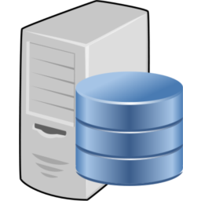

Master Server Slave Server

Hot standby : Slave Server is open for read only connection.

Warm standby: Only Wal files are applied on Slave Server and is not available for read only connection.

Master Server: Production /Current Working server.

Slave Server: Backup/Standby Server

### Replication Modes

Asynchronous Mode of Replication

- transactions on the master server can be declared complete when the changes have been done on just the master server.
- These changes are then replicated to the replicas later in time.
- The replica servers can remain out-of-sync for a certain duration, which is called a _replication lag_.

Synchronous Mode of Replication

- Ttransactions on the master database are declared complete only when those changes have been replicated to all the replicas.
- replica servers must all be available all the time for the transactions to complete on the master.
- If for any reason slave server is unreachable, master server will stuck and wait for slave server to be available.

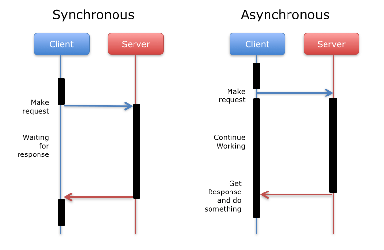

**Replication Modes**

Single-Master Replication

- Changes to table rows in a designated master database server are replicated to one or more replica servers.
- The replicated tables in the replica database are not permitted to accept any changes (except from the master).
- Single-Master Replication is also called unidirectional, since replication data flows in one direction only, from master to replica.

Multi-Master Replication

- Changes to table rows in more than one designated master database are replicated to their counterpart tables in every other master database.
- In this model conflict resolution schemes are often employed to avoid problems like duplicate primary keys.
- Multi-Master Replication is also called bidirectional, Since replication data flows in both the directions.

### Types of Replication

1. Physical Replication:

- File-based log shipping
- Streaming replication
- Physical replication replicates all databases.
- Cannot Replicate between two different major versions or platforms.

1. Logical Replication:

- Replicating data objects and their changes based upon their replication identity (usually a primary key).
- Support table-level data synchronization.

Consolidating multiple databases into one single entity. (Analytics)

**Physical Replication**

There are two types of physical replication

1. Log Based Shipping Replication
2. Streaming Replication

### Log Based Shipping Replication

Master server: 192.168.4.46

Slave server : 192.168.4.153

Step 1: Initial Setup Master Database

- Shutdown Master database
- Ensure that Postgresql is running with administrator privileges
- Modify the content of postgres.conf file and edit parameters archive_on, archive_command and archive_timeout

archive_mode = on

archive_command = 'copy "%p" "\\\\\\\\192.168.4.153\\\\arch\\\\f%"' --- this is the ip of the standby server

archive_command = 'copy "%p" "\\\\\\\\10.70.1.6\\\\arc\\\\%f" && copy "%p" "F:\\\\arc\\\\%f"'

archive_timeout = 60

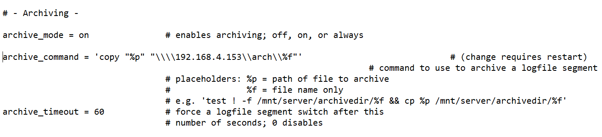

archive_command will copy all the wal files to slave serve's arch folder

Step 2: Initial Setup Standby Database

create postgres user at os level with Administrative priviledges

Ensure that postgresql is running with administrator privileges

Share a folder name arch from slave server network to master server network with proper permissions on folder.

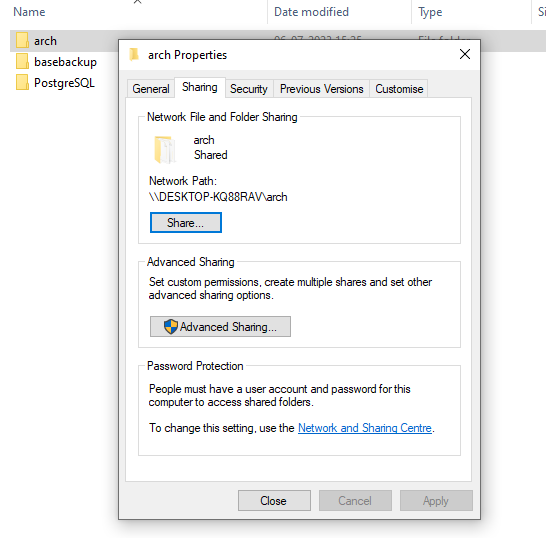

Step 3: Shutdown postgresql on standby

Step 4: Delete all the contents of /Data directory

Step 5: Startup postgresql on Master database and start psql

Step 6: Start backup

select pg_start_backup('dbreplication');

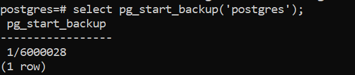

Step 7: Copy Data directory for master to slave server.

Step 8: End backup on master.

select pg_stop_backup();

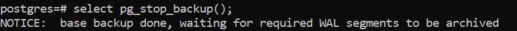

Step 9: Comment out archive_on, archive_command and archive_timeout parameters in postgresql.conf in standby server.

Step 10: Setup recovery command in postgresql.conf

Syntax : 'copy "D:\\\\arch\\\\%f" "%p"'

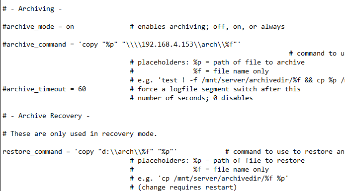

Step 11: create a recovery.signal file in data directory on standby server

Fsutil file createnew standby.signal 0

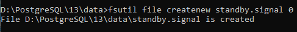

Step 12: Startup cluster on standby server.

Pg_ctl start

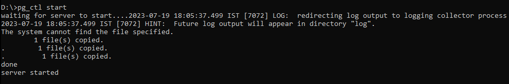

Step 13: Check log file

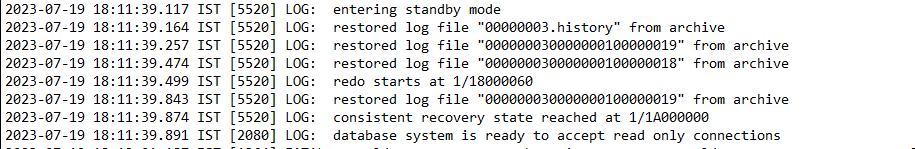

Cluster is ready to accept read only connection. If anything other than this message is received there must be misconfiguration during setup of log based replication.

Note: you cannot perform any ddl or dml operation, doing so will result in error because standby cluster is open in read mode only.

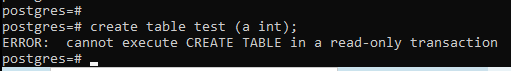

Performing failover

Step 14: If for some reason master cluster is out of service or you want to make your slave server as new master server.

Run the following command:

Select pg_promote(); {it will promote salve cluster from read only to read/write}

Check if standy.signal file exist or not. If it did not exist means cluster is open in read/write mode. You can also check log

Example Illustrating Log Based Shipping Replication {Linux}

Step1 :Postgres user must be created on both server {master and slave}

su - postgres

Step 2: Make slave server password less

ssh-keygen

need to copy the ssh key to standby

ssh-copy-id postgres@192.168.1.9

check ssh is working or not

ssh 192.168.1.9

Step 3: Shutdown the master database on primary

systemctl stop postgresql-13

Step 4: modify the postgres.conf

archive_mode = on

archive_command = 'rsync -a %p postgres@192.168.1.9:/var/lib/pgsql/12/archivedir/f%' --- this is the ip of the standby server

archive_timeout = 60

Step 5: setup standby

cd /var/lib/pgsql/13/

mkdir archivedir

systemctl stop postgresql-13

su -postgres

Step 6: Delete all data files from standby server.

cd /var/lib/pgsql/12/data

rm -rf *

Step 7: On primary start postgresql server and start backup

select pg_start_backup('dbrep');

Step 8: Copy data folder from primary to standby

rsync -avz /var/lib/pgsql/12/data/* [postgres@192.168.1.9:/var/lib/pgsql/12/data/](mailto:postgres@192.168.1.9:/var/lib/pgsql/12/data/)

Step 9: Stop pg backup

select pg_stop_backup;

Step 10: Check data folder on standby and also check archive directory that will be received from primary.

Step 11 modify the postgres conf on standby

Comment out archive_on, archive_command and archive_timeout parameters in postgresql.conf in standby server.

restore_command= 'cp /var/lib/pgsql/12/archivedir/%f %p'

Step 12: create a standby.signal file

cd /var/lib/pgsql/12/data

touch standby.signal

Step 13: start postgresql sever and check log file.

cd /var/lib/pgsql/12/data/log

tail -300f postgresql-wed.log -- latest log file

Failover is same on both platforms.

### Streaming Replication

- WAL record chunks are streamed by database servers to keep data in sync.
- The standby server connects to the master to receive the WAL chunks.
- The WAL records are streamed as they are generated.
- The streaming of WAL records need not wait for the WAL file to be filled.
- This allows a standby server to stay more up-to-date than is possible with file-based log shipping.
- By default, streaming replication is asynchronous even though it also supports synchronous replication.

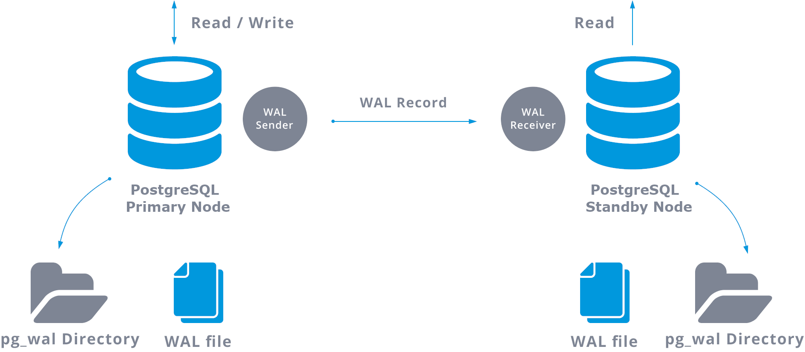

Replication Parameters

- Wal_level : Replica - determines how much information is written to the WAL. The default value is replica, which writes enough data to support WAL archiving and replication, including running read-only queries on a standby server.
- Wal_log_hints = on - required for pg_rewind capability when standby goes out of sync with master.
- Max_wal_senders = integer - Specifies the maximum number of concurrent running WAL sender processes). The default is 10. value 0 means replication is disabled.
- Wal_keep_segments :integer - Specifies the minimum number of past log file segments kept in the pg_wal directory, in case a standby server needs to fetch them for streaming replication. If a standby server connected to the sending server falls behind by more than wal_keep_segments segments, the sending server might remove a WAL segment still needed by the standby, in which case the replication connection will be terminated.
- hot_standby = on - Enables read only connection on the node when it is in standby role. This is ignored when the server is running as master. Standby server will begin accepting read only connections once the recovery has brought the system to a consistent state.

Replication Slots

- Replication slot is used to retain the WAL files when the standby goes offline or disconnected.
- Master server uses replication slots to keeps track of how much the standby lags and retain the WAL it needs files until the standby reconnects again.
- Replication slots came in with PostgreSQL 9.4, before that wal_keep_segment parameter use to govern how many wal files need to be maintained.
- Replication slots have to been created manually and the default value is 10.
- PostgreSQL Replication slots are of two types:
- Physical replication slots
- Logical replication slots

Example Illustrating Streaming replication on windows:

Primary/master: 192.168.4.46

Standby/slave: 192.168.4.153

Step 1: On Master setup the following postgres config

listen_addresses - *

wal_level - Replica

hot_Standby. - On

Step 2: create or alter a user to use replication encrypted password:

Create user postgres with replication encrypted password 'abc';

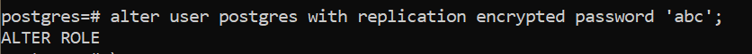

Step 3: Modify pg_hba.conf and specify the ip address of the both master and standby with md5 method

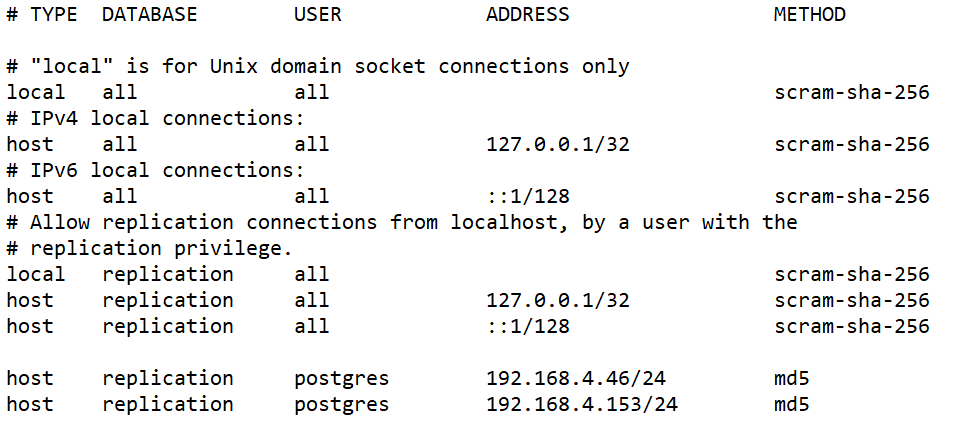

Step 4: Reload/restart the configuration

On Standby

Step 5: Stop postgresql database on Standby

Step 6: Delete all the files under data directory

Step 7: Run pg_basebackup to clone the standby instance

Pg_basebackup -h 192.168.4.46 -U postgres -p 5432 -D "D:\\PostgreSQL\\13\\data" -Fp -Xs -P -R -C -S pgstandby

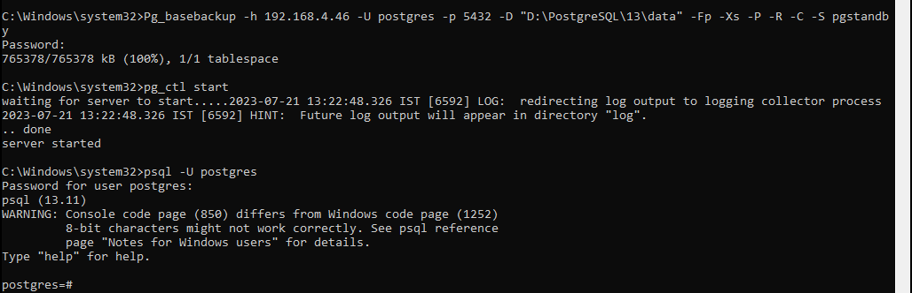

Note: here -s pgstandby represents a replication slot.

Step 8: start the pgsql from service

Step 9: Test replication by creating table in primary and checking standby.

### Monitoring Primary and Standby Streaming Replication

On Primary

- Check stream replication slots information

select * from pg_replication_slots;

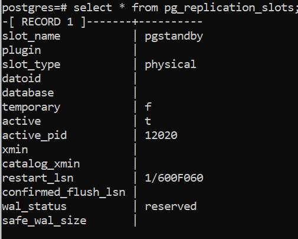

- Check PG replication status

select * from pg_stat_replication;

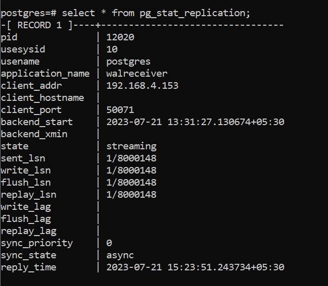

Note: 0 lag indicates no gap between primary and secondary.

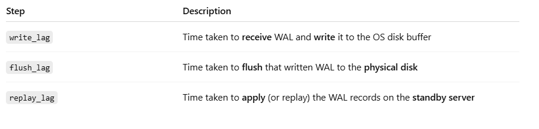

On Standby

- Check if secondary cluster is in recovery mode or not.

select * from pg_is_in_recovery();

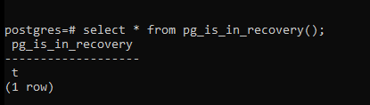

- Check current lsn on primary

select * from pg_current_wal_lsn();

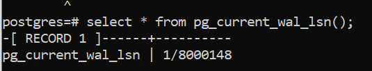

- Check last received lsn on standby

select * from pg_last_wal_receive_lsn();

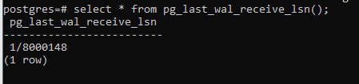

In standbby

select pg_wal_lsn_diff('0/C0197F8','0/B000110');

select round(67213032/pow(1024,2.0),2) missing_in_mb;

In primary

lsn with physical file name

select pg_walfile_name('0/C019918');

### Replication Slots in Streaming Replication

- In primary, slot is created at time of streaming replication, also can be created later.
- To create a replication slot, you can use the pg_create_physical_replication_slot or pg_create_logical_replication_slot functions, depending on whether you are using physical or logical replication.
- For Physical replication use:

SELECT pg_create_physical_replication_slot('slot_name');

- For Logical Replication use:

SELECT pg_create_logical_replication_slot('slot_name', 'pgoutput');

- Unused replication slots can accumulate over time and consume memory in the primary server. Always ensure that any unused replication slots are removed using the pg_drop_replication_slot function:

SELECT pg_drop_replication_slot('slot_name');

### Synchronous mode in Streaming Replication

- On Primary query

select * from pg_stat_replication;

Sync state is async

- Record first commit in standby then in primary in sync mode

To change sync_state from async to sync state.

alter system set synchronous_standby_names to '*';

now check the postgres.auto.conf file

- Restart the primary from service and check sync state again.

select * from pg_stat_replication;

- To disable sync streaming replication comment the parameter synchronous_standby_names
- Issue command ALTER SYSTEM RESET synchronous_standby_names; to remove the parameter entry from post

Important Note:

1\. Using hot_standby=on will allow you to perfrom read only operations on replication server.

2\. To disallow read only operations or to put your replication cluster in complete recovery mode, comment parameter hot_standby on replication cluster and bounce back the cluster.

3\. Specifying -R option in pg_basebackup command will create a recovery.conf file on replication server.

4\. The replication connection info is written to postgresql.auto.conf file on replication server. Modify if any network related changes are planned.

5\. By default, streaming replication will be in async mode. To convert streaming replication to sync mode issue command:

alter system set synchronous_standby_names to '*'; or you can directly modify postgresql.conf file (primary server).

6\. To revert back to async mode use command ALTER SYSTEM RESET synchronous_standby_names; or if you have directly modified postgresql.conf file , you need to comment the parameter and bounce back the cluster.

7\. To promote a replication server , issue command select pg_promote();

**Introduction to Repmgr**

- Repmgr is an open-source tool suite for managing replication and failover in a cluster of PostgreSQL servers.
- It supports and enhances PostgreSQL's built-in streaming replication.
- Repmgr provides single read/write primary server and one or more read-only standbys containing near-real time copies of the primary server's database.
- Repmgrd daemon is used to actively monitors servers in a replication cluster.

<table><tbody><tr><th>
<strong>Repmgr</strong>
</th><th>
<strong>Repmgrd</strong>
</th></tr><tr><td><ul><li>A command-line tool used to perform administrative tasks such as:</li></ul></td><td><ul><li>daemon which actively monitors servers in a replication cluster and performs the following tasks:</li></ul></td></tr><tr><td>
Setting up standby servers
</td><td>
Monitoring and recording replication performance
</td></tr><tr><td>
promoting a standby server to primary
</td><td>
Performing failover by detecting failure of the primary and promoting the most suitable standby server
</td></tr><tr><td>
Switching over primary and standby servers
</td><td>
Provide notifications about events in the cluster to a user-defined script which can perform tasks such as sending alerts by email
</td></tr><tr><td>
Displaying the status of servers in the replication cluster
</td><td></td></tr></tbody></table>

Repmgr Terminologies

- _Replication cluster_: Refers to the network of PostgreSQL servers connected by streaming replication.
- _Node_: A node is a single PostgreSQL server within a replication cluster.
- _Upstream node_: The node a standby server connects to, in order to receive streaming replication. This is either the primary server, or in the case of cascading replication, another standby.
- _Failover_: This is the action which occurs if a primary server fails and a suitable standby is promoted as the new primary. The repmgrd daemon supports automatic failover to minimize downtime.
- Switchover: a suitable situation in which standby is promoted and the existing primary server is removed from the replication cluster in a controlled manner.
- Witness server**:** repmgr provides functionality to set up a so-called "witness server" to assist in determining a new primary server in a failover situation with more than one standby. The witness server itself is not part of the replication cluster, although it does contain a copy of the repmgr metadata schema.

### Setup Primary/Standby Streaming Replication Using Repmgr

Primary cluster data location /var/lib/pgsql/14/data (192.168.4.237)

Secondary cluster with data location /var/lib/pgsql/14/data (192.168.4.173)

Step 1: check postgresql installation version. I have installed postgresql 14

Step 2: Install repmgr on both servers

yum list modules repmgr14*

yum -y install repmgr14.x86_64

Note: above commands did not work for me. Below commands worked

curl <https://dl.enterprisedb.com/default/release/get/14/rpm> | sudo bash

sudo dnf repolist

sudo dnf install repmgr14 --nobest

Step 3: Check postgresql status

systemctl status postgresql-14

Step 4: For Primary:

Modify the following parameters in postgresql.conf file

Max_wal_senders=10

Max_replication_slots=10

Wal_level= replica

Hot_standby = on

Archive_command ='bin/true'

Listen_addresses='*'

Shared_preload_libraries= 'repmgr'

Wal_log_hints= on

Step 5: Start Postgres on primary

Step 6: On primary Create user repmgr with superuser privilege and database repmgr with owner repmgr user

Create user repmgr with superuser; Or createuser -s repmgr

Create database repmgr owner repmgr; Or createdb repmgr -O repmgr

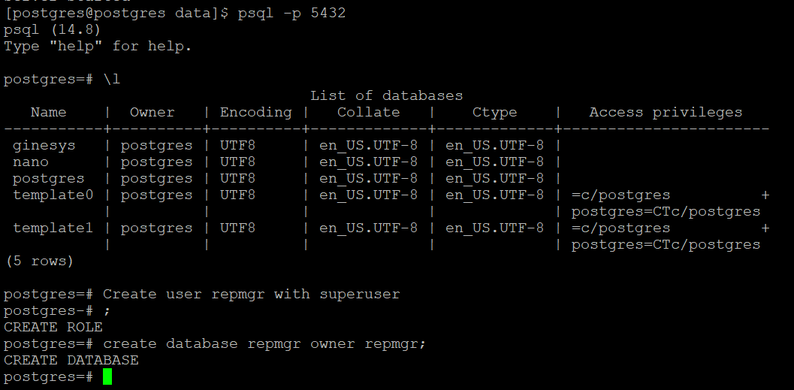

Step 7: On primary Configure pg_hba.conf and include repmgr

host repmgr repmgr 192.168.4.0/32 trust

host replication repmgr 192.168.4.0/32 trust

Step 8: Create a repmgr file at any path with any name.

I have created file called repmgr.conf at path /var/lib/pgsql/14/repmgr.conf

Step 9: Add the below lines to repmgr.conf file.

node_id=1

node_name=primary

conninfo='host=192.168.4.237 user=repmgr password=abc dbname=repmgr connect_timeout=2'

data_directory='/var/lib/pgsql/14/data'

failover=automatic

promote_command='/usr/pgsql-14/bin/repmgr standby promote -f /var/lib/pgsql/14/data/repmgr.conf --log-to-file'

follow_command='/usr/pgsql-14/bin/repmgr standby follow -f /var/lib/pgsql/14/data/repmgr.conf --log-to-file --upstream-node-id=%n'

pg_bindir='/usr/pgsql-14/bin'

log_file='/var/lib/pgsql/14/data/repmgr.log'

Step 9: Register primary server to repmgr

repmgr -f /var/lib/pgsql/14/data/repmgr.conf primary register

Step 10: Check if primary is registered to repmgr.

repmgr -f /var/lib/pgsql/14/repmgr.conf cluster show

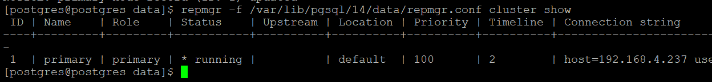

Step 11: create replication slots for standby server

select pg_create_physical_replication_slot('standby') {create replication slot}

select * from pg_replication_slots; {check replication slots}

SELECT pg_drop_replication_slot('replication_slot_name'); {drop replication}

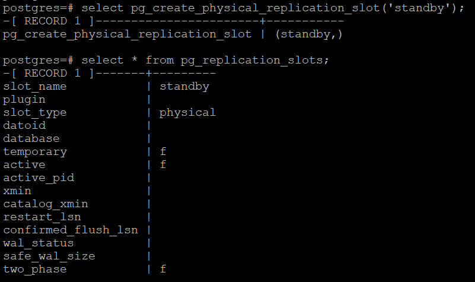

Add entry in primary server hba config file

host replication repmgr 192.168.4.173/32 trust

Step 12: Create repmgr file in standby server

I have created file called repmgr.conf at path /var/lib/pgsql/14/repmgr.conf

Step13: Add the below lines to repmgr.conf file.

node_id=2

node_name=standby

conninfo='host=192.168.4.173 user=repmgr dbname=repmgr connect_timeout=2'

data_directory='/var/lib/pgsql/14/data'

failover=automatic

promote_command='/usr/pgsql-14/bin/repmgr standby promote -f /var/lib/pgsql/14/data/repmgr.conf'

follow_command='/usr/pgsql-14/bin/repmgr standby follow -f /var/lib/pgsql/14/data/repmgr.conf --log-to-file --upstream-node-id=%n'

pg_bindir='/usr/pgsql-14/bin'

log_file='/var/lib/pgsql/14/repmgr.log'

Step 14: On standby run a dry test for cloning.

repmgr -h 192.168.4.237 -U repmgr -f /var/lib/pgsql/14/repmgr.conf standby clone --dry-run

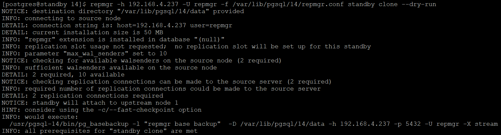

Step 15: Start the clone of standby server

From above command just remove - -dry-run keyword to start cloning process.

repmgr -h 192.168.4.237 -U repmgr -f /var/lib/pgsql/14/repmgr.conf standby clone 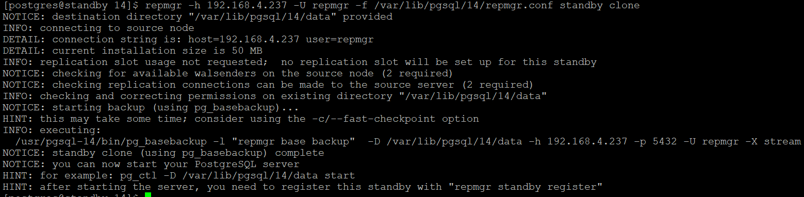

Step 16: Start postgresql server on standby server and check log.

Step 17: Register standby server with repmgr

repmgr -f /var/lib/pgsql/14/repmgr.conf standby register

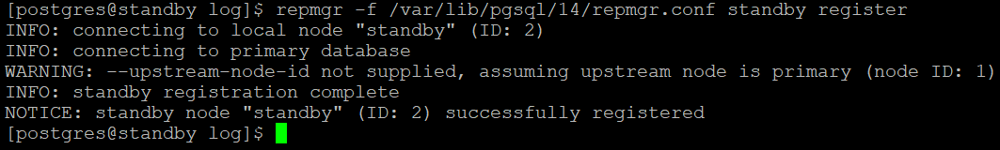

Step 18: Verify whether standby server is register with repmgr and standby is following primary:

repmgr -f /var/lib/pgsql/14/repmgr.conf standby register

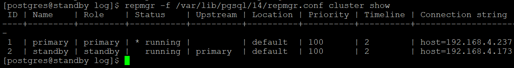

Node1 has role of primary

Node 2 has role of standby

Node 2 is upstreaming to primary

Both nodes are in running state.

Step 19: Start repmgrd service on primary and standby 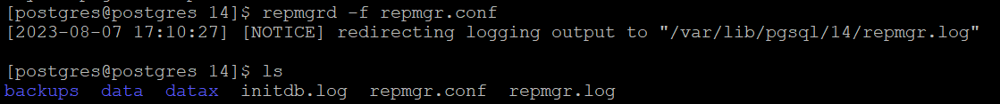

### Automatic Failover and Node Rejoin

Primary:192.168.4.237

Standby: 192.168.4.173

Scenario: Stop primary so that standby will automatically become primary. After that making old primary as new standby.

Step 1: Verify the current status of nodes and the roles

repmgr -f /var/lib/pgsql/14/repmgr.conf cluster show

Step 2: Shutdown postgresql on primary server and verify the repmgrd logs

Open log location on both primary and standby

tail -300f repmgr.log

Step 3: Verfiy the current state of standby, it will automatically be promoted to primary.

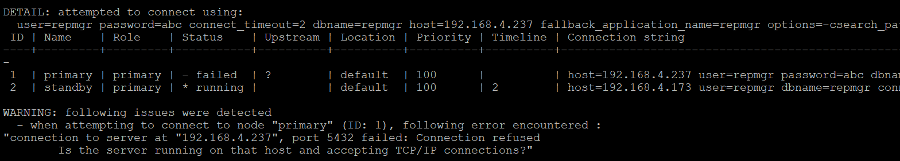

Step 4: Once the issue with primary server has been resolved and it is again started, check status of repmgr on primary.

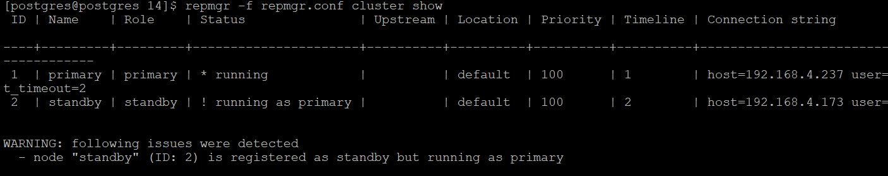

Note: Primary is up but standby is running as primary.

Step 5: Stop the primary database which has recovered from failure.

Step 6: Set /usr/pgsql-14/bin in the bash profile.

Export PATH=/us/pgsql-14/bin:$PATH

Step 7: Rejoin the node. On Standby server (which is the new primary) perform a checkpoint

repmgr -f /var/lib/pgsql/14/repmgr.conf node service --action=restart --checkpoint

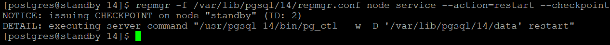

Step 8: Now execute node join on primary with dry run to check

repmgr node rejoin -f /u01/pgsql/12/repmgr.conf -d 'host=192.168.4.173 user=repmgr dbname=repmgr' --force-rewind --config-files=postgresql.conf,postgresql.local.conf --verbose --dry-run

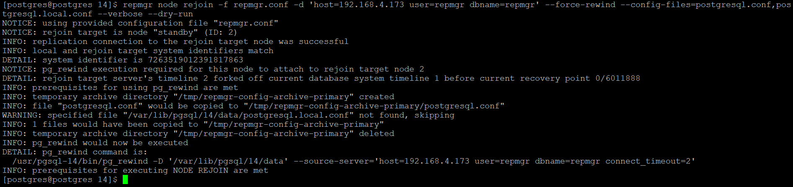

Note: Add replication entry for primary on standby hba file

Step 9: Perform the node join operation (remove dry run from above command)

repmgr node rejoin -f /u01/pgsql/12/repmgr.conf -d 'host=192.168.4.173 user=repmgr dbname=repmgr' --force-rewind --config-files=postgresql.conf,postgresql.local.conf -verbose

Step 10: Now check cluster status

Streaming has been reversed. Now primary has a role of standby and upstreaming to standby.

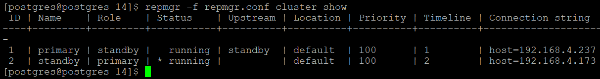

### Adding New Standby Node and Standby Follow

**Objective:**

Node 1 Node 2

Primary: 192.168.4.237

Standby 1: 192.4.173

Standby 2: 192.4.180

Step 1: On primary add pg_hba entry for new standby1

host repmgr repmgr 192.168.4.129/32 trust

host replication repmgr 192.168.4.129/32 trust

Step 2: create file repmgr.conf and add following:

**node_id=3**

**node_name=standby1**

conninfo='host=192.168.4.129 user=repmgr dbname=repmgr connect_timeout=2'

data_directory='/var/lib/pgsql/14/data'

failover=automatic

promote_command='/usr/pgsql-14/bin/repmgr standby promote -f /var/lib/pgsql/14/repmgr.conf'

follow_command='/usr/pgsql-14/bin/repmgr standby follow -f /var/lib/pgsql/14/repmgr.conf --log-to-file --**upstream-node-id=1'**

pg_bindir='/usr/pgsql-14/bin'

log_file='/var/lib/pgsql/14/repmgr.log'

Step 2: Run a dry run to test the configuration on new standby 2

repmgr -h 192.168.4.173 -U repmgr -f /var/lib/pgsql/14/repmgr.conf standby clone --dry-run

Step 3: Start the clone of standby server

repmgr -h 192.168.4.173 -U repmgr -f /var/lib/pgsql/14/repmgr.conf standby clone

Step 4: Start postgresql on new standby server and register standby server with repmgr

repmgr -f /var/lib/pgsql/14/repmgr.conf standby register

Step 4: Verify whether standby server is register with repmgr and standby is following primary

repmgr -f /var/lib/pgsql/14/repmgr.conf cluster show

Step 5: Ensure repmgrd is running on all the servers

repmgrd -f /var/lib/pgsql/14/repmgr.conf

### Cascading Streaming Replication

Objective:

Node 1

Node 2

We will make standby 1 follow standby instead of primary

Step 1: Unregister repmgr on standby1

Repmgr -f /var/lib/pgsql/14/repmgr.conf standby unregister

**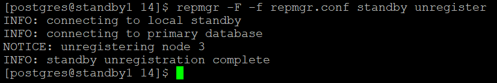**

Step 2: Check repmgr cluser , entry for node3 will be removed.

Step 3: Check cluster status on primary as well and delete pg data from standby 1

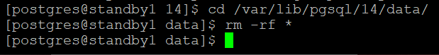

Step 4: Open repmgr.conf file and edit the following line

Change upstream node id to 2 instead of 1

where node1=primary and node2=standby

**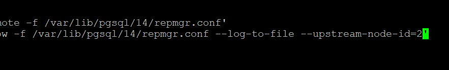**

Step 5: Dry run on standby 1 for standby clone

repmgr -h 192.168.4.173 -U repmgr -f /var/lib/pgsql/14/repmgr.conf standby clone --upstream-node-id=2 --dry-run

Step 6: Start cloning

repmgr -h 192.168.4.173 -U repmgr -f /var/lib/pgsql/14/repmgr.conf standby clone --upstream-node-id=2

Step 7: Check cluster status

repmgr -f /var/lib/pgsql/14/repmgr.conf cluster show

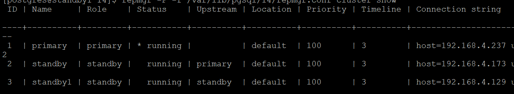

Standby 1 is following or upstreaming to standby instead of primary

### Streaming Replication Switchover

Objective: To Switch over from primary to second

Difference between switchover and failover is that switchover is planned while failover is unexpected due to power issue etc.

Instances :

Primary:192.168.4.237

Standby:192.168.4.173

Step 1: Add pg_bindir='/usr/pgsql-12/bin/' in repmgr.conf file on both primary and standby nodes

Step 2: Ensure ssh is enabled between both the nodes and we are able to connect without any password

Step 3: Start a dry run to ensure that the standby check all required parameters and also the sibilings.

On standby run following:

repmgr standby switchover -f /var/lib/pgsql/14/repmgr.conf --siblings-follow --dry-run

Step 4: Once prerequisite for switchover are met remove dry run to execute switchover

repmgr standby switchover -f /var/lib/pgsql/14/repmgr.conf --siblings-follow

Step 5: Check cluster status.

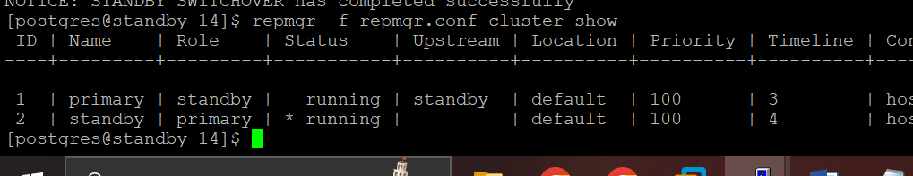

Repeat the same steps on primary to make this process reversible

### Uninstall Replication Manager

Step 1: first go to Standby

repmgr -f /var/lib/pgsql/14/repmgr.conf standby unregisted

repmgr -f /var/lib/pgsql/14/repmgr.conf cluster show

Step 2: Stop postgresql cluster

Pg_ctl stop

Step 3: Delete data folder

Step 4: As root user run command:

Yum remove repmgr-14

Step 5: Remove data folder in standby, reinitialize data folder to populate new files without repmgr.

Step 6: Unregister Primary

repmgr -f /var/lib/pgsql/14/repmgr.conf primary unregister

Yum remove repmgr-14

### Logical Replication

- Logical replication is a method of replicating data objects and their changes, based upon their replication identity (usually a primary key).
- Logical replication allows fine-grained control over both data replication and security.
- Logical replication uses a publish and subscribe model with one or more subscribers subscribing to one or more publications on a publisher node.
- Subscribers pull data from the publications they subscribe to and may subsequently re-publish data to allow cascading replication or more complex configurations.
- Logical Replication replicates data objects based upon their replication identity (generally a primary key or unique index).
- Destination server can be used for writes. You can have different indexes and security definition.
- Logical Replication has cross-version support. Unlike Streaming Replication, Logical Replication can be set between different versions of PostgreSQL.
- Publications can have several subscriptions
- Logical Replication can be used for migrations and upgrades
- Consolidate multiple databases into a single database for analytical purposes.
- Replicate data between different major versions of PostgreSQL.
- Send incremental changes in a single database or a subset of a database to other databases.
- Sharing a subset of the database between multiple databases.
- Different group of users can access replicated data.
- Tables must have primary key or unique key
- Logical replication does not replicate schema/DDL.
- Tables must have the same full qualified name between publication and subscription.
- Subscriptions can have more columns or different order of columns, but the types and column names must match between Publication and Subscription.
- Super user privileges needed to add all tables

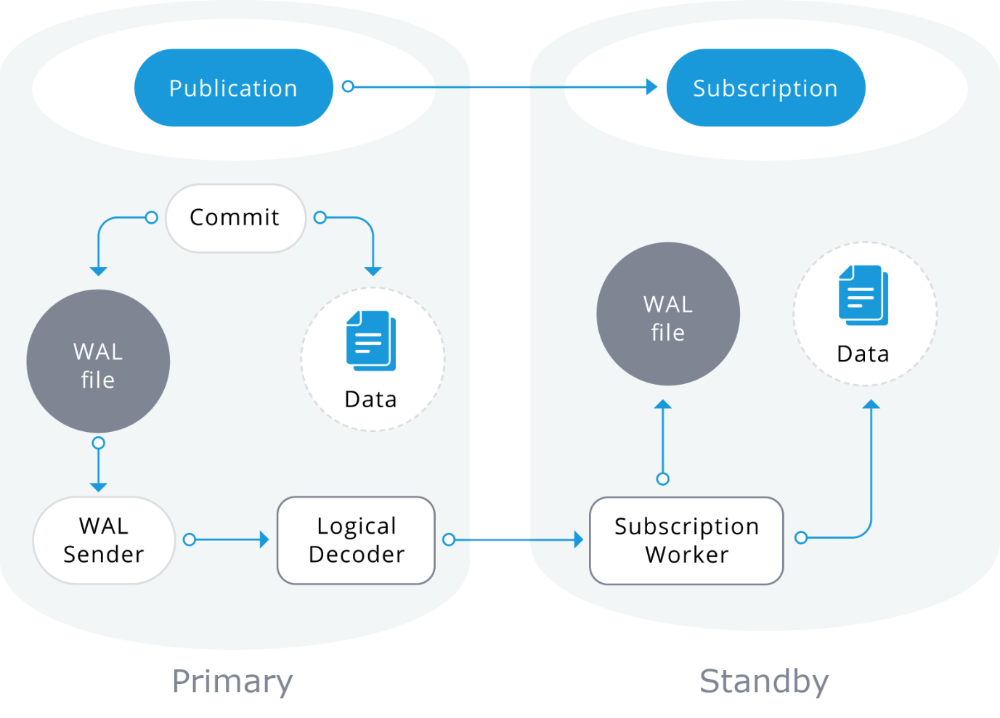

| **Publication**                                                                                                                              | **Subscription**                                                                                                                                                 |
| -------------------------------------------------------------------------------------------------------------------------------------------- | ---------------------------------------------------------------------------------------------------------------------------------------------------------------- |
| Publication can be defined on the master server and the node on which it is defined is referred to as the "publisher"                        | Subscription can be defined on the destination server and the node on which it is defined is referred to as the "subscriber"                                     |
| Publication is a set of changes from a single table or group of tables. It is at database level and each publication exists in one database. | The connection to the source database is defined in subscription.                                                                                                |
| Multiple tables can be added to a single publication and a table can be in multiple publications.                                            | Once a subscription is created, Logical replication copies a snapshot of the data on the publisher database                                                      |
| If we choose the "ALL TABLES" option which needs a super user privilege**.**                                                                 | Subscription is added using CREATE SUBSCRIPTION and can be stopped/resumed at any time using the ALTER SUBSCRIPTION command and removed using DROP SUBSCRIPTION. |

### Setup Logical Replication

Step 1: On Master/Publication server modify the following parameters in postgresql.conf file

Listen_address='*'

Wal_level=logical

Port=5432

Step 2: Modify pg_hba.conf file and add the publication/subscription node ipaddress

host all repuser 192.168.4.153/32 md5 ---destination

host all repuser 192.168.4.46/32 md5 ---source

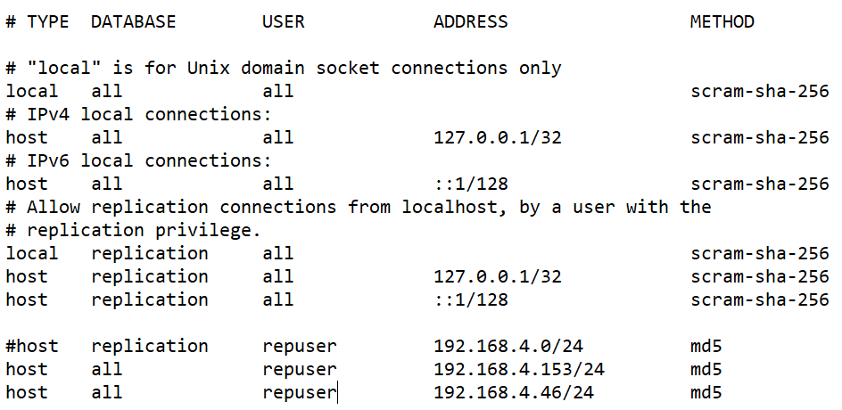

Step 3: Create superuser named repuser with encrypted password

Create user repuser superuser encrypted password 'abc';

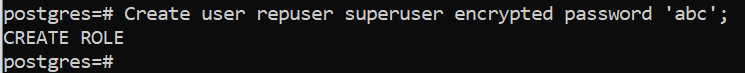

Step 4: Restart postgresql on Master/Publication.

Step 5: Assign role repuser to database.

alter database learning owner to repuser;

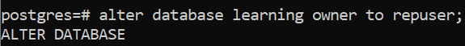

Step 6: Connect to learning database with repuser and create a table reptab1 with primary key;

\\c learning repuser

create table reptab1(sno int primary key,sname varchar(20));

insert into reptab1 values (1,'mike');

insert into reptab1 values (2,'kris');

insert into reptab1 values (3,'smith');

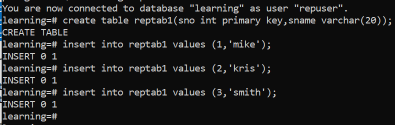

Step 7: Create publication either or single table or all tables.

create publication mypub FOR table reptab1;

or

create publication mypub FOR ALL TABLES;

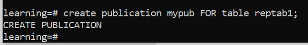

Step 8: Check created publication:

\\dRp

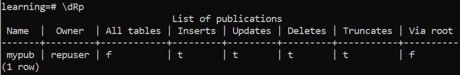

Step 9: On Slave/Subscription

Create database learning and create all table structure which will be replicated.

Note: Logical replication does not replicate DDL.

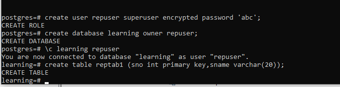

Step 10: Create subscription

CREATE SUBSCRIPTION mysub CONNECTION 'host=192.168.4.46 dbname=learning user=repuser password=abc' PUBLICATION mypub;

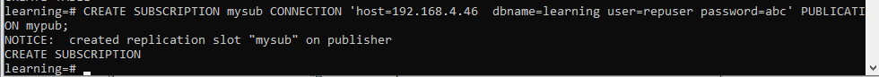

Step 11: Insert data on primary and check if it created on standby

insert into reptab1 values (4,'jone');

Step 12: Check replication status on primary

select * from pg_stat_replication;

\\dRp

Step 13: Check replication status on standby.

select * from pg_stat_subcription;

\\dRs

**LOGICAL REPLICATION WITH 2 DATABASES ON SAME CLUSTER**

**Step1 :**

In the configuration file set:

postgresql.conf:

Listen_address='*'

Wal_level=logical

Port=5432

**Step 2:**

pg_hba.conf:

local replication all

host replication all 127.0.0.1/32 trust

host replication all ::1/128 trust

**Step 3:**

In the source database:

CREATE PUBLICATION repl FOR TABLE public.src;

select * from pg_catalog.pg_publication;

select * from pg_stat_replication; (will show no data until sub is created)

**Note 1:**

As per regular steps for logical replication, the create subscription will hang endlessly

CREATE SUBSCRIPTION sub_test CONNECTION 'dbname=dbname host=localhost port=5432 user=postgres password=12345' PUBLICATION repl_name;

And pgAdmin spins endlessly. Even if the computer is left for the weekend, it couldn't finish.

You are probably setting up logical replication between two databases in the same database cluster. That makes CREATE SUBSCRIPTION hang forever, as the documentation describes:

Creating a subscription that connects to the same database cluster (for example, to replicate between databases in the same cluster or to replicate within the same database) will only succeed if the replication slot is not created as part of the same command. Otherwise, the CREATE SUBSCRIPTION call will hang. To make this work, create the replication slot separately (using the function pg_create_logical_replication_slot with the plugin name pgoutput) and create the subscription using the parameter create_slot = false. This is an implementation restriction that might be lifted in a future release.

**Step 4:**

connect to the primary database and create the slot:

SELECT pg_create_logical_replication_slot('sub_test', 'pgoutput');

**Step 5:**

connect to the standby database and run:

CREATE SUBSCRIPTION sub_test CONNECTION 'dbname=dbname host=localhost port=5432 user=postgres password=12345' PUBLICATION repl_name WITH (create_slot = false);

**Note 2**

The major difference when performing logical replication between two different PostgreSQL clusters, you do not need to manually create a replication slot. Here's why:

1. Automatic Slot Creation in a Different Cluster
   - When you run the CREATE SUBSCRIPTION command in the destination database (subscriber), it automatically requests the source database (publisher) to create a replication slot.
   - The slot is created on the source cluster and holds the WAL changes for the subscriber.
2. Slot Persistence in the Same Cluster vs. Different Clusters
   - Same Cluster Replication (Source DB → Destination DB in the same PostgreSQL instance):
     - The slot must be created manually using pg_create_logical_replication_slot(), because the CREATE SUBSCRIPTION command cannot create a slot in the same cluster due to an implementation restriction.
   - Different Clusters Replication (Source and Destination are in different PostgreSQL instances):
     - The subscription automatically creates a replication slot on the source.
     - You do not need to run pg_create_logical_replication_slot() manually.

### Logical Replication

**Test Case 1: How to add a table to existing publication.**

Step :1 Create a table in master database.

Create table reptab2(deptno int primary key,deptname varchar(20),city varchar(20));

insert into reptab2 values (1,'hr','Toronto');

insert into reptab2 values (2,'finance','Nowyork');

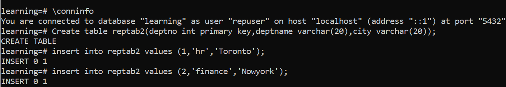

Step 2: create same table DDL in slave database.

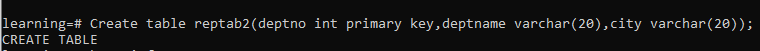

Note: you can change column order

Step 3: Add table to existing publication.

Alter publication mypub add table reptab2;

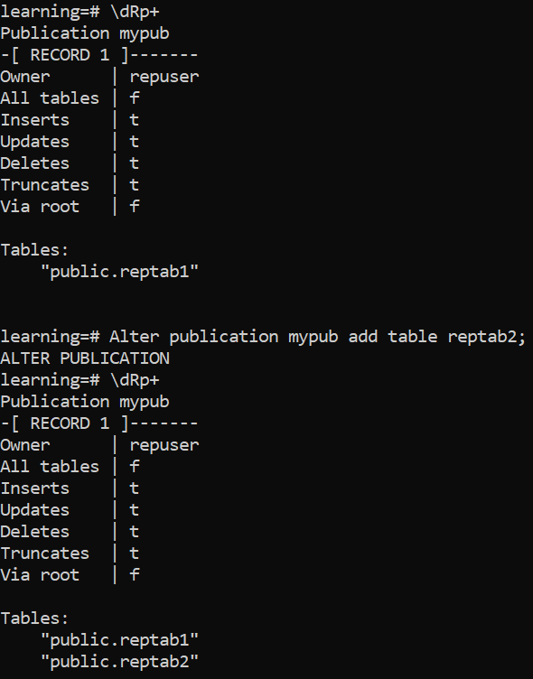

Step 4: Insert records in reptab2 table.

Note: Data will not be visible for reptab2 table on subscription unless you refresh subscription.

Step 5: Refresh subscription and view the changed data

\\dRs

ALTER SUBSCRIPTION mysub REFRESH PUBLICATION;

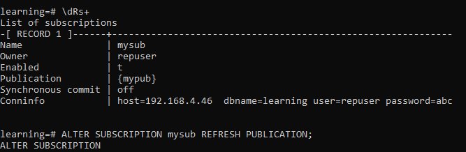

Step 6: check data on both primary/standby.

Step 7: Modify publication to allow only insert and updates and no deletes

ALTER PUBLICATION mypub SET (publish='insert,update');

Note: With the given ALTER PUBLICATION command, you can delete records in the publication (the source table), but those deletions will not be propagated to the subscription (the target table on subscribers). Only INSERT and UPDATE operations will be replicated to the subscribers.

### Logical Replication

**Test Case 2: Add Table Without Primary Key to Publication**

Step 1: Connect to learning database using repuser and create a table without primary key. Keep the unique column not null.

create table reptab3(billno int not null,billname varchar(20),city varchar(20));

insert into reptab3 values (1,'mike','Toronto');

insert into reptab3 values (2,'kris','Toronto');

insert into reptab3 values (3,'helen','Montreal');

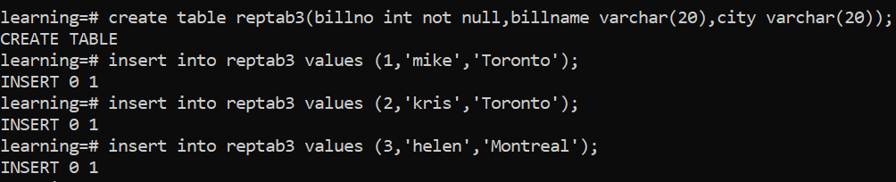

Step 2: create similar table DDL in Standby.

Step 3: Add reptab3 table to existing publication mypub.

Alter publication mypub add table reptab3;

Step 4: Refresh subscription on destination/ Subscriber

ALTER SUBSCRIPTION mysub REFRESH PUBLICATION;

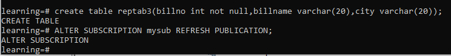

Step 5: Check reptab3 table records on publication and subscriber.

Step 6: Try to update record on publisher

update reptab3 set city='abc' where billno=3;

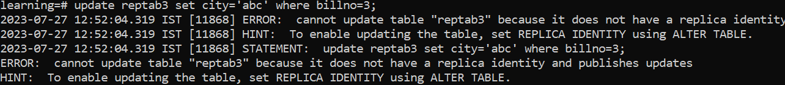

Step 6: Because no primary key is defined replica identity gives error upon updation.

Alter table reptab3 on publisher with full identity

ALTER TABLE reptab3 REPLICA IDENTITY FULL;

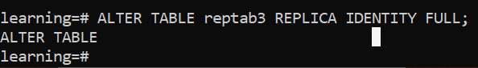

Note : Understanding replica identity

DEFAULT: This is the default behavior and means that the replica identity is determined based on the table's PRIMARY KEY. If the table has a primary key, the replica identity will be set to DEFAULT. If there is no primary key defined, the replica identity will be NOTHING.

NOTHING: This means that the table does not have a replica identity, and therefore, updates or deletes on the replica will not be allowed. In other words, the table is read-only on the replica side.

FULL: This setting means that the replica identity is set to include all columns of the table, effectively making every column part of the replica identity. This allows the replica to uniquely identify rows based on all their columns, not just the primary key.

Step 8: Try updating table records after modifying replica identity

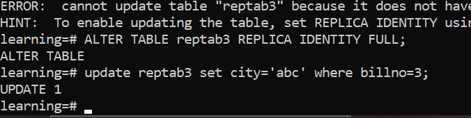

### Logical Replication

**Test Case 3: How to alter a column of an existing publication and subscription.**

Step 1: Add new column in existing table of publication

Alter table reptab2 add column deptbuild varchar(20);

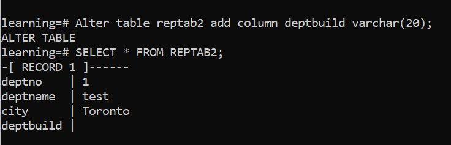

Step 2: Check in standby/Subscription

select * from Reptab2;

check also in latest log

Step 3: Disable subscription on destination/Subscription and add column

ALTER SUBSCRIPTION mysub DISABLE;

Alter table reptab2 add column deptbuild varchar(20);

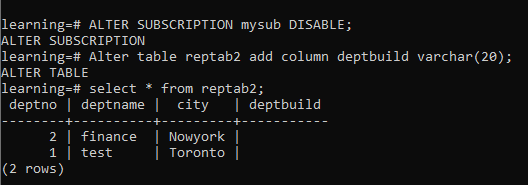

Step 4: Update records on primary

update reptab2 set deptbuild='hrbuld' where deptno=1;

update reptab2 set deptbuild='financebuld' where deptno=2;

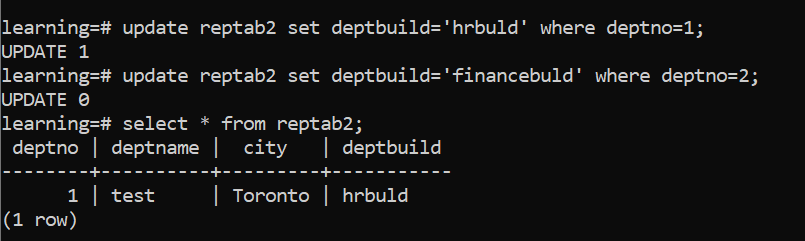

Step 5: Enable subscription on destination

ALTER SUBSCRIPTION mysub ENABLE;

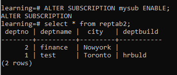

Step 6: Check data on both publication and subscription.

### Logical Replication

**Test Case 4: How to setup cascading replication**

Logical cascading replication

Database A -> Primary Database (Publisher)

Database B -> Intermediate Subscriber, publisher Database A

Database C -> Final Subscriber, publisher Database B

Step 1: We have two subscriber standby1 and standby2

Standby 1 is subscriber for primary and standby 2 is subscriber for standby 1

make change in standby1

Modify the following parameters in postgresql.conf file

Listen_address='*'

Wal_level=logical

Port=5432

Step 2: Modify pg_hba.conf file and add the publication/subscription node ipaddress

host all logstd 192.168.1.8/32 md4 ---destination

host all logstd 192.168.1.9/32 md4 ---source

Step 3: Restart postgresql on standby

pg_ctl stop

pg_ctl start

Step 4: create user in standby1

Create user logstd superuser encrypted password 'abc';

Step 5: Create publication and add table to it.

Create publication mystd1;

Alter publication mystd1 add table reptab2;

Step 6: On Standby2 create a database stdtarget

create database targetdb2;

Note: logical replication can also work for different database from different PostgreSQL server even on different architecture

It also works within in same PostgreSQL server with different database

Step 7: Connect to stdtarget and create the table structure of reptab2.

create table reptab2(deptno int primary key,deptname varchar(20),city varchar(20),deptbuld varchar(20));

Step 8: Create subscription from standby1 to standby

Create subscription mysub2 connection 'host=192.168.1.8 dbname=targetdb user=logstd password=abc' publication mystd1;

Step 9: Check on standby 1

select * from pg_replication_slots;

\\dRp

Select * from pg_stat_replication

Step 10: Insert row in primary and check whether it is replicated in standby1 and standby1.

insert into reptab2 values(3,'IT',Montreal','ITBULD');

Select * from reptab2;

### Logical Replication

**Test Case 5: How to remove subscription and publication.**

Steps:

1. Drop table and subscription.

drop table reptab2;

2)Drop database stdtarget. (optional)

drop subcription mysub2;

drop database tragetdb2;

3)Verify replication slot in primary/standby whether they are deleted or not.

in standby1

select * from pg_replication_slots;

4)Drop publication which was serving the dropped subscription.

\\dRp

drop publication mystd1;

5)Repeat the same steps to remove all publication and subscription.

**Server Parameters Tuning**

### Introduction to Server Parameters

- Parameter tuning is a process.
- Server configuration parameters affect the behavior of the database system.
- 'Out of Box' settings are not suitable for all environments.
- Not all systems are designed the same.
- User interaction with the parameters can be segregated as:

Via Configuration File

Via SQL

Via the Shell

**Memory Parameters: Shared Buffers**

- Shared Buffers is the amount of ram that can be allocated to shared buffers.
- Ideally contains pages being modified or read
- Shared Buffers uses LRU algorithm to flush the pages from this area.
- Pg_buffercache extension shows what is inside shared_buffers.
- Pg_stat_statements show the block hit and read for each sql.
- pg_statio_user_tables and pg_statio_user_indexes views to see what is in the cache.

**Work Mem**

- Work Mem is used for Complex Sorting or hash tables.
- In-memory sorts are much faster than sorts spilling to disk.
- Default Value is 4MB.
- Memory allocated for each sort operations (ORDER BY, DISTINCT) and merge joins
- Setting this parameter globally can cause very high memory usage as this parameter is used by per user sort operation.
- Work Mem * Total Sort Operations for all sort operations

**Maintenance_Work_mem**

- Maintenance_work_mem is a memory setting used for maintenance tasks.
- Default value is 64MB.
- Setting a large value helps in tasks like:

VACUUM

RESTORE

CREATE INDEX

ADD FOREIGN KEY

ALTER TABLE.

**Wal_Buffers**

- The amount of shared memory used for WAL data that has not yet been written to disk.
- PostgreSQL writes its WAL (write ahead log) record into the buffers and then these buffers are flushed to disk.
- The contents of the WAL buffers are written out to disk at every transaction commit,
- Default Size is 16MB.
- Higher value is ideal for concurrent connections.

**Effective_Cache_Size**

- Effective_cache_size provides an estimate of the memory available for disk caching.
- It is just an estimate; no exact actual memory is allocated.
- It instructs the optimizer the amount of cache available in the kernel.
- Lower value will discourage the query planner to use indexes, even if they are helpful.
- Default value is 4GB.
- lower value prefers sequence scans over index scans.

**Checkpoint_timeout**

- Maximum time between automatic WAL checkpoints, in seconds
- Default value is 5 Minutes.
- Increasing this parameter can increase the amount of time needed for crash recovery.
- Frequent check pointing results in continuous writes to disk.
- More volume of data written to wal logs when checkpoint interval are less.
- Shutdown may take more time when this value is increased.
