**TABLE OF CONTENT**

1. [**SOURCE CODE INSTALLATION AND SEGREGATION OF PG FILES**](#SOURCE_CODE_CSTOM_INSTALLATION)
2. [

## INTRODUCTION TO PERFORMANCE TUNING](#INTRO_TO_PT)
3. [

## TUNE CONFIGURATION PARAMETERS](#TUNE_CONFIG_PARAM)
   1. **SHARED BUFFERS**
   2. **WORK_MEM**
   3. **MAINTENANCE WORK_MEM**
   4. **AUTOVACUUM WORK_MEM**
   5. **MAX CONNECTIONS**
   6. **IDLE CONNECTIONS**
   7. **EFFECTIVE_CACHE_SIZE**
   8. **ADDITIONAL INFORMATION: PG_STAT_ACTIVITY**
4. [

## CHECKPOINT TUNING](#CHECKPOINT)
5. **MVCC AND AUTO VACUUM**
6. **TUNING AUTO VACUUM PARAMETERS**
7. **QUERY OPTIMIZATION**
   1. **QUERY STATEMENT PROCESSING.**
   2. **COMPONENTS OF EXPLAIN PLAN.**
   3. **EXPLAIN ACCESS METHODS**
   4. **INDEX OPTIMIZATION**
   5. **OPTIMIZER AND STATISTICS.**
   6. **QUERY TUNING.**

## SOURCE CODE CUSTOM INSTALLATION

Steps for Postgresql Source Installation 16.2

1. Download the source file:

<https://www.postgresql.org/ftp/source/>

1. Prerequisites:

yum install readline-devel

yum install -y zlib-devel

yum install -y install gcc

yum install -y make

yum install -y libicu-devel

1. Extract tar file and check configure:

tar -xvf postgresql-16.2.tar.gz

cd postgresql-16.2

./configure -help

1. Create postgres user and required directories: (all pg directories are in different location)

useradd -d /home/postgres/ postgres

passwd postgres

id postgres

mkdir -p /u01/app/16.2/init

mkdir -p /u02/app/16.2/data

mkdir -p /u03/app/16.2/wal_files

mkdir -p /u04/app/16.2/archive_logs

mkdir -p /u05/app/16.2/temp_files

1. Configure PostgreSQL:

cd postgresql-16.2

. /configure --prefix=/u01/app/16.2/init

1. Build postgreSQL using make command:

cd postgresql-16.2

make

or

make world (everything including contrib, documentation and man pages)

or

make world-bin (everything, except documentation).

1. Install postgreSQL using make install command:

make install

or

make install-world

or

make install-world-bin

1. Build contrib module:

cd contrib

make

1. Install contrib module:

make install

1. ) Check Bin Folder pg_config for directory structure:

cd /u01/app/16.2/init/bin

./pg_config

1.  Change ownership from root to postgres:

chown -R postgres:postgres /u01/app/16.2/init

chown -R postgres:postgres /u02/app/16.2/data

chown -R postgres:postgres /u03/app/16.2/wal_files

chown -R postgres:postgres /u04/app/16.2/archive_logs

chown -R postgres:postgres /u05/app/16.2/temp_files

1.  Initialize postgreSQL data directory:

sudo su - postgres

cd /u01/app/16.2/init/bin

./initdb -D /u02/app/16.2/data

1.  Check the content of DATA Directory and Start Database:

cd /u02/app/16.2/data

ls -ltr

cd /u01/app/16.2/init/bin

./ pg_ctl -D /u02/app/16.2/data start

1.  Set Environment Variables and Connect to psql and check.

export LD_LIBRARY_PATH=/u01/app/16.2/init/lib:$LD_LIBRARY_PATH

export PATH=/u01/app/16.2/init/bin:$PATH

postgres# psql

- Source Code distribution can be used to customize and build PostgreSQL in Linux.
- Source code can be found in <https://www.postgresql.org/ftp/source/>
- PostgreSQL files

1. **Moving Wal folder**

- Shutdown PostgreSQL to ensure there is no corruption.
- Copy WAL directory to new file path/location using rsync
- Rename pg_wal to pg_wal-backup in the Postgres data directory($PG_DATA)
- Create a symbolic link to the new path to pg_wal in the Postgres data directory ($PG_DATA)
- Update permissions of the symbolic link to be owned by postgres user.
- Start Postgres and verify that you can connect to the database.
- Delete old pg_wal directory in $PG_DATA

**Steps for Moving Wal_files from $PGDATA to New Location**

a) Create Postgresql Directory

mkdir -p /u03/app/16.2/wal_files

b) Change ownership to postgres

chown -h postgres:postgres /u03/app/16.2/wal_files

c) Stop postgresql

./pg_ctl stop

d)rsync all files from $PGDATA/pg_wal to new location

rsync -av /u02/app/16.2/data/pg_wal/* /u03/app/16.2/wal_files

e) Check all files are synced

ls -la /u03/app/16.2/wal_files

f) Take a backup of pg_wal folder

mv /u02/app/16.2/data/pg_wal /u02/app/16.2/data/pg_wal-backup

g) Create a Symbolic link

sudo ln -s /u03/app/16.2/wal_files/ /u02/app/16.2/data/pg_wal

h) Start Postgresql

./pg_ctl start

i) Verify DB connection using your db credentials/information

psql -h localhost -U postgres -p 5432

select pg_switch_Wal() ( check wal files in new location)

j) Remove the old folder

rm -rf /u02/app/16.2/data/pg_wal-backup

1. **Moving Temp files**

- Work_mem(4MB) is the memory area used by queries for operations such as JOINS, ORDER BY, DISTINCT, Hash Joins and Merge joins.
- Large Sort Operations which do not fit in the small work_mem often gets spilled to the disk and temporary files are created during execution.
- Temp files are created in data directory ($PGDATA/base/pgsql_tmp) and if you have huge temp file(s) it could fill up the data directory.
- Temp Files can will compete with I/O for all the other objects in this PostgreSQL cluster since they are residing in the same PG_DATA directory.
- Temp files are only kept around for the duration of a query. Once the query finishes or cancels, the temp files are cleaned up.
- Temp_tablespaces specifies tablespaces in which to create temporary objects (temp tables and indexes on temp tables) when a CREATE command does not explicitly specify a tablespace.
- Temporary files for purposes such as sorting large data sets are also created in these tablespaces.
- The default value is an empty string, which results in all temporary objects being created in the default tablespace of the current database.

**Moving TEMP Files/Tables From Default Location to New Location:**

1. create temporary table test1 ( empno int);
2. select pg_relation_filepath('test1');
3. mkdir -p /u05/app/16.2/ Temp_files
4. create tablespace temp1 location '/u05/app/16.2/temp_files';
5. alter system set temp_tablespaces = 'temp1';
6. show temp_tablespaces;
7. select pg_reload_conf();
8. create temporary table test2 ( empno int);
9. select pg_relation_filepath('test2');
10. **Moving Default Tablespace**

- Tablespace is basically a directory in Postgresql which contains data files.
- Postgresql Cluster has two tablespaces (Pg_default and Pg_Global)
- Pg_Default is a base sub directory and Pg_global is a global subdirectory
- All required user objects (Tables,Indexes,Materialized views etc) are stored in this datafiles on a physical storage in Pg_default
- Catalog tables and its indexes which are used across the cluster are stored in pg_global.
- Default_tablespace parameter sets the tablespace to be used by default, in which the database objects (tables and indexes) will be created.
- By default, the variable has an empty string value, which means that all database objects will be created in the pg_default tablespace.
- If we specify some value in the parameter and it turns out that such a tablespace does not exist, then there will be no error, and all database objects will be created in the pg_default tablespace

**Moving Default tablespace From Default Location to New Location:**

There are three scenarios for moving default tablespace to another location

_Scenario 1:_ I already have PostgreSQL installed and running and want to ensure all my future objects are created in new tablespace.

- Create Tablespace on new location. Syntax: Create tablespace &lt;tablespace name&gt;

LOCATION 'u01/PSQL/16/DATA'

- Change default_tablespace parameter in postgresql.conf to tablespace name and restart Postgresql (all new objects will be created in new location)
- move old objects from pg_default to respective tablespaces.

_Scenario 2:_ I have just installed PostgreSQL and yet to create a database.

Create Tablespace on new location, make it as default_Tablespace and create database. All objects go in the default tablespace from start.

or

CREATE DATABASE sales OWNER salesapp TABLESPACE sales; (Good for Multiple Databases).

_Scenario 3:_ I Already have multiple databases storing objects on pg_default. I want to have different tablespace for each database.

- Don't disturb default_Tablespace parameter in postgresql.conf.
- Create Tablespaces in new location.
- Alter database &lt;dbname&gt; SET TABLESPACE &lt;tablespace name&gt; (do this for each database).
- move old objects from pg_default to respective tablespaces.

## INTRODUCTION TO PERFORMANCE TUNING

- **Performance tuning** is the process of making adjustments to various parts of a system to improve its overall speed, efficiency, and responsiveness. It involves identifying and removing bottlenecks, optimizing resource usage, and ensuring that the system operates at its peak potential.
- **Database performance tuning** specifically refers to the set of actions that Database Administrators (DBAs) undertake to maintain the smooth and efficient operation of databases. These actions may involve both proactive measures, like routine maintenance, and reactive measures, such as troubleshooting slow queries or resolving unexpected issues.
- It is important to remember that **performance tuning is a process, not a one-time task**. Continuous monitoring and optimization are essential to keep up with the evolving needs of the database as data grows and user patterns change.

**What Causes Database Bad Performance:**

1. Bad Queries:
   - Poorly written or inefficient SQL queries can consume excessive resources and slow down the database. Common problems include:
     - Lack of proper filters (WHERE clauses) causing full table scans.
     - Use of suboptimal query structures or complex joins that could be simplified.
     - Redundant or repeated queries that could be combined.
   - Solutions include analyzing and rewriting inefficient queries, using explain plans (EXPLAIN ANALYZE), and breaking down complex queries into simpler, more efficient ones.
2. Excessive Resource Usage:
   - High CPU, memory, and I/O utilization can strain the database server, resulting in slower performance for all users. This can be due to a high number of concurrent connections, large transactions, or background processes consuming resources.
   - Monitoring tools can help identify resource hogs, and adjusting workload distribution or scaling the server resources can help alleviate these issues.
3. Inefficient Indexes:
   - Proper indexing is critical for fast data retrieval. A lack of indexes, excessive or redundant indexes, and improperly maintained indexes can lead to slow query performance.
   - Indexes should be created and maintained based on query patterns and should be evaluated periodically to ensure that they are effectively supporting the workload without adding unnecessary overhead.
4. Slow Read-Write Speeds:
   - The speed at which data is read from or written to disk significantly impacts performance. If the underlying storage system is slow, even optimized queries and configurations may not yield satisfactory performance.
   - Solutions include upgrading to faster storage (e.g., SSDs), using RAID configurations for better I/O performance, and ensuring that read and write caches are properly configured.
5. Misconfigured Parameters:
   - Database parameters control how the database allocates memory, manages connections, and performs operations. Misconfigured parameters such as work_mem, shared_buffers, and effective_cache_size can lead to suboptimal performance.
   - Tuning these parameters based on the available system resources and workload profile can significantly improve database responsiveness and efficiency.

**Techniques for Optimal Database Performance:**

1. Tune Configuration Parameters:
   - Properly configuring database settings is essential for maximizing performance. This includes:
     - Adjusting memory allocation parameters like shared_buffers, work_mem, and maintenance_work_mem.
     - Setting the correct values for max_connections and connection pooling to avoid resource contention.
     - Tuning checkpoint settings (checkpoint_timeout, checkpoint_completion_target) to balance write activity and disk I/O.
   - Each database system (e.g., PostgreSQL, MySQL, Oracle) has its own set of configurable parameters, and DBAs should tailor these to the specific needs of their workload.
2. Query Optimization:
   - Analyze and improve query performance using tools such as EXPLAIN or EXPLAIN ANALYZE to understand the execution plan and identify bottlenecks.
   - Techniques for query optimization include:
     - Reducing the use of complex subqueries and replacing them with simpler joins or temporary tables.
     - Adding or optimizing WHERE clauses to reduce the number of rows processed.
     - Using LIMIT and OFFSET for pagination to prevent large result sets from overwhelming the system.
3. Database Index Management:
   - Indexes speed up data retrieval but come at the cost of additional storage and slower write performance. Proper index management includes:
     - Creating indexes for columns frequently used in WHERE, JOIN, GROUP BY, and ORDER BY clauses.
     - Removing unused or redundant indexes that consume resources.
     - Periodically rebuilding or reorganizing indexes to prevent fragmentation and maintain their effectiveness.
   - Using composite indexes for multi-column filtering can further improve query performance when properly aligned with query structures.
4. Data Defragmentation:
   - Over time, data inserts, updates, and deletes can lead to fragmentation within the database. Fragmentation results in data being stored in non-contiguous blocks, increasing the time needed for reads.
   - Techniques to address this include:
     - **VACUUM** in PostgreSQL, which reclaims storage and compacts data.
     - **REORGANIZE** and **REBUILD** commands in other databases to clean up table structures.
   - Regular maintenance helps keep data structures optimized and speeds up data access.
5. Manage and Maintain System Resources:
   - Proper allocation and monitoring of CPU, memory, and I/O usage are critical to ensure optimal database performance.
   - DBAs should use monitoring tools to track resource usage and identify any processes that are causing excessive load.
   - Implementing resource management practices such as workload balancing, scaling up resources, or scheduling heavy tasks during low-usage periods can help maintain database health.
6. Data Partitioning:
   - Partitioning large tables can improve query performance by allowing the database to scan only relevant portions of the table rather than the entire dataset.
   - Partitioning can be done based on key columns such as date ranges, regions, or other logical divisions that align with query patterns.
   - Types of partitioning include **range partitioning**, **list partitioning**, and **hash partitioning**, depending on the use case and database system.
7. Schedule Maintenance Tasks:
   - Routine maintenance tasks help keep the database in optimal condition and prevent performance degradation. These tasks include:
     - Running **ANALYZE** to update statistics, allowing the optimizer to make better decisions.
     - **VACUUM** in PostgreSQL to remove dead tuples and reclaim space.
     - **Rebuilding indexes** periodically to keep them compact and efficient.
     - Scheduling backups, defragmentation, and other essential database health checks during off-peak hours to minimize impact on regular operations.

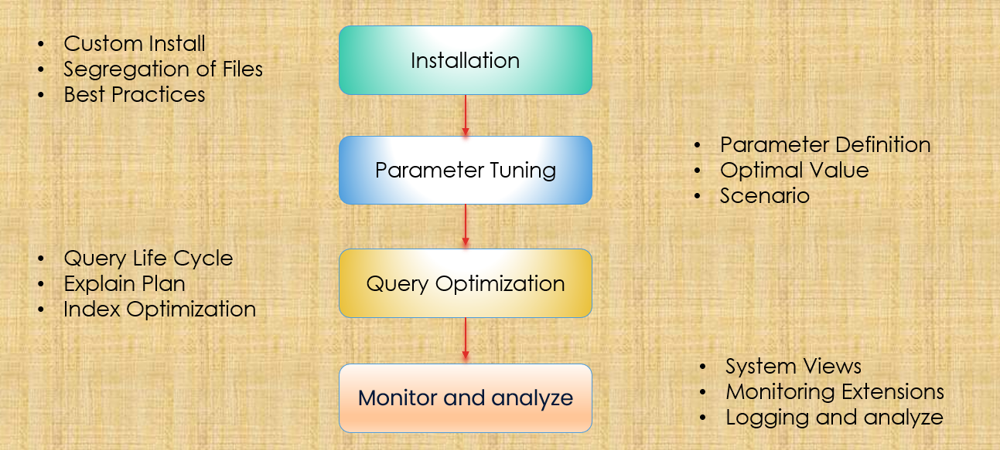

## TUNE CONFIGURATION PARAMETERS

There are four major memory parameters that requires proper understanding for tuning

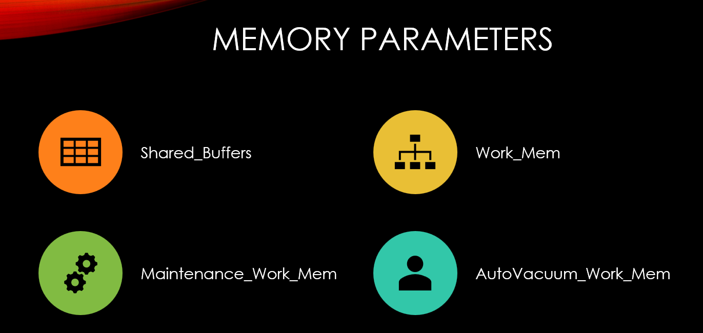

These four parameters are explained below:

1\. **SHARED_BUFFERS**

- It is a parameter that determines how much memory is dedicated to the server for caching data.
- The value for shared_buffers should never be set to reserve all of the system RAM for Postgresql.
- The Default Value is 128MB.
- 25%- 40% of Ram is considered optimal for Shared_Buffers.
- Clock sweep algorithm controls Buffer Allocation and Eviction.

## 1.1 Understanding Read/Write path in Detail

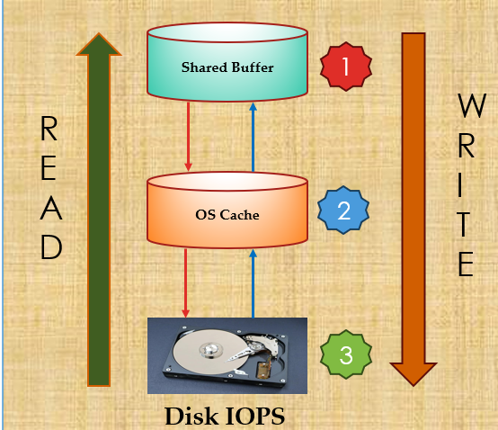

**Read Path**: The **read path** describes the flow of data when a database query or application requests data from storage.

- **Shared Buffer**: The database first checks the shared buffer (in-memory cache) for the requested data.
- **OS Cache**: If not found in the shared buffer, it checks the OS cache, which holds recent file data managed by the OS.
- **Disk**: If still not found, data is read from disk, then loaded into the OS cache and shared buffer for faster access in future requests.

**Write Path:** The **write path** describes the data flow when data is modified or written to storage.

- **Shared Buffer**: Modifications are first made in the shared buffer as dirty pages.
- **OS Cache**: During a flush, dirty pages move from the shared buffer to the OS cache, where the OS temporarily stores them.
- **Disk**: Finally, the OS cache flushes the data to disk in bulk, ensuring data is permanently stored.

Note: At **system startup**, the **shared buffer** and **OS cache** are empty, so both the **read path** and **write path** initially depend on disk. The diagram illustrates read/write path at system startup

So, at system startup,

Read path = Disk -> os cache -> shared buffer

Write path = shared buffer -> os cache -> Disk

Note: The data that is present in shared buffers will also be available in os cache

## 1.2 Inside Shared buffer

Imagine a database system with a **128MB shared buffer** that is completely full. The system needs to load a new page (8kb) into memory due to a recent query, but there's no free space left in the shared buffer. How will the new pages be loaded into shared buffer? And what happens to the existing pages in the shared buffer?

To make room, the system employs the **Clock Sweep Algorithm** to identify which page can be evicted and replaced by the new one.

What is Clock sweep Algorithm?

The Clock Sweep algorithm is a memory page replacement policy often used by database systems (like PostgreSQL) to manage pages in memory.

**Key Concepts of the Clock Sweep Algorithm**

1. **Pages and Reference Bits**:
   - In memory, data is divided into "pages." Each page has an associated **reference bit** (or **use bit**), which is set to 1 whenever the page is accessed.
   - This reference bit helps track how recently each page has been used without requiring an elaborate tracking structure.
2. **Clock Hand (Pointer)**:
   - The algorithm uses a pointer, often called the **clock hand**, which moves through pages in a circular manner, "sweeping" across all pages.
   - This pointer checks the reference bits of each page and determines which pages should be kept and which ones should be evicted when space is needed.

Note: A page in shared buffer gets a counter value each time it is accessed. The maximum that a page counter can reach is 5.

Let's go through a detailed example with a Clock Sweep algorithm using a multi-bit counter (0 to 5) for each page. We'll include various scenarios of page access patterns and how the algorithm handles them. Suppose we have four pages (A, B, C, D) in memory, each with a counter initially set to zero.

**Initial State:**

- **Pages in memory**: A, B, C, D
- **Initial counters**: A(0), B(0), C(0), D(0)
- **Maximum counter value**: 5
- **Clock hand starting at page A**

1. **page A is accessed**:

- Page A is accessed, so its counter increments to 1.
- Current counters: A(1), B(0), C(0), D(0).

1. **page B is accessed twice**:

- Page B is accessed twice in quick succession, so its counter increments to 2.
- Current counters: A(1), B(2), C(0), D(0).

1. **page C is accessed five times**:

- Page C is accessed frequently, so its counter reaches the maximum of 5.
- Current counters: A(1), B(2), C(5), D(0).

1. **Clock Sweep Begins and Decrements Counters**
2. **Clock hand sweeps to A**:

- Page A has a counter of 1, so the clock hand decrements it to 0 and moves to B.
- Current counters: A(0), B(2), C(5), D(0).

1. **Clock hand moves to B**:

- Page B has a counter of 2, so the clock hand decrements it to 1 and moves to C.
- Current counters: A(0), B(1), C(5), D(0).

1. **Clock hand moves to C**:

- Page C has a counter of 5, the maximum value, indicating recent and frequent access. The clock hand decrements it to 4 and moves to D.
- Current counters: A(0), B(1), C(4), D(0).

1. **Clock hand moves to D**:

- Page D has a counter of 0, so it's selected for eviction (eviction refers to the removal of the page)
- A new page (say E) is loaded into D's position, and its counter is set to 1 after the initial access.
- Current counters: A(0), B(1), C(4), E(1) (where D is now page E).

1. **Frequent access to page A**:

- Page A is accessed frequently and repeatedly over the next few cycles.
- Its counter increases with each access, eventually reaching 5.
- Current counters: A(5), B(1), C(4), E(1).

1. **Clock hand moves to A (already at max counter)**:

- Page A has a counter of 5, so the clock hand decrements it to 4 and moves to B.
- Current counters: A(4), B(1), C(4), E(1).

1. **Clock hand moves to B**:

- Page B has a counter of 1, so the clock hand decrements it to 0 and moves to C.
- Current counters: A(4), B(0), C(4), E(1).

1. **Clock hand moves to C**:

- Page C has a counter of 4, so the clock hand decrements it to 3 and moves to D.
- Current counters: A(4), B(0), C(3), E(1).

1. **Clock hand moves to E (formerly D)**:

- Page E has a counter of 1, so the clock hand decrements it to 0 and moves back to B.

1. **Clock hand revisits B** (counter is 0, evicts B):

- Since page B's counter is 0, it is evicted, making room for a new page (say F) which is loaded with an initial counter of 1.
- Current counters: A(4), F(1) (where B is now F), C(3), E(0).

1. **Counter Reaches 0 After Multiple Cycles**

- As the clock hand continues sweeping, pages with high counters like A and C get gradually decremented. Pages with lower access frequency eventually reach a counter of 0 and are replaced.
- Each time the clock hand revisits pages, it decrements counters, simulating a "decay" in the importance of pages over time. This approach gives heavily accessed pages more time in memory, while infrequently accessed pages are evicted sooner.

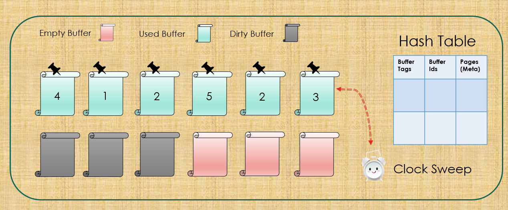

- Refer to the above diagram to link the concept of clock sweep algorithm
- **Empty buffers** can be directly used.
- **Used buffers** are retained if recently accessed or evicted if they have low relevance.
- **Used buffers** are **pinned** in the shared buffer to ensure data consistency and to prevent pages currently in use from being evicted prematurely. Pinning is a mechanism that marks a page as actively accessed
- **Pinned pages are skipped** by the clock hand as it sweeps through the buffer, ensuring they are not evicted while they are still in use.
- Once a page is no longer actively accessed (i.e., the pin is removed), the clock hand can consider it for eviction if its reference bit is 0, allowing it to free up space for new pages.
- **Dirty buffers** require a flush to disk before eviction.

## 1.3 EXPLAIN (ANALYZE,BUFFERS)

**EXPLAIN (ANALYZE)**: This command displays the execution plan that the PostgreSQL planner generates for the supplied statement. The execution plan shows how the table(s) referenced by the statement will be scanned - by plain sequential scan, index scan, etc. - and if multiple tables are referenced, what join algorithms will be used to bring together the required rows from each input table.

**EXPLAIN (ANALYZE,BUFFERS)**: The BUFFERS option for EXPLAIN (ANALYZE) lets you track what Postgres calls buffer usage. That's telling you what type of data Postgres is reading or writing and which of that data was in cache vs had to be fetched from the operating system, which might be actually from disk or might be from the operating system cache.

Example usage of Explain with buffers option

explain (analyze,buffers) select * from pgbench_branches where bid=34;

Check Buffers output:

Buffers: Shared read=2

it says shared read, meaning data is coming from disk and also see the execution time.

Again, run the same query

explain (analyze,buffers) select * from pgbench_branches where bid=34;

now data is available in shared buffer

Check Buffers output:

Buffers: Shared hit=2

it means data is coming from shared buffer and check the execution time.

## 1.4 BUFFER RING

In PostgreSQL, large tables or indexes often require **sequential scans** to retrieve all rows or search through data sequentially. However, when these scans load large amounts of data into memory, they can **overwhelm the shared buffer cache** by occupying memory slots that are also used by other queries. This leads to **cache pollution** where frequently accessed pages are evicted to make room for pages from the large scan. As a result, performance for other queries that rely on cached data degrades, increasing disk I/O and slowing down the system.

To address this issue, PostgreSQL uses a **Buffer Ring** (or Ring Buffer) specifically for large sequential scans. The Buffer Ring limits the number of buffer slots available to a single scan, preventing it from flooding the shared buffer cache.

Goal of Buffer ring is:

1. Allocates a limited number of buffer pages (typically 32) for large sequential scans.
2. Uses a **circular overwrite policy** to recycle pages within the Buffer Ring, ensuring memory efficiency without spilling into the shared buffer cache.
3. Minimizes cache pollution and ensures that other frequently accessed data remains available in memory for concurrent queries.

Example:

We have a table named pgbench_account with size of 641 MB. Our shared_buffer size is 128 MB. Now we are going to select this table into shared buffer.

explain (analyze,buffers) select * from pgbench_accounts;

The query is executed first time so data is coming from disk. We will get shared read

Check Buffers:

Buffers: Shared read=2

run the query second time

explain (analyze,buffers) select * from pgbench_accounts;

Check Buffers:

Buffers: Shared hit=32 read=81989

Notice how shared hit is only 32. 32 pages *8 kb =256KB. So, only 256 kb is allocated for a single run and other 81989 pages are coming from the disk. That means for a large sequential scan of a table, all of its data is not directly populated into the shared buffer instead only 32 pages are loaded into shared buffer.

now again run the query third time

explain (analyze,buffers) select * from pgbench_accounts;

Check Buffers:

Buffers: Shared hit=64 read=81957

32 pages are again read making a total of 64 pages in shared hit. Each time 32 pages will be read for sequential scan queries This process is called buffer ring.

1.5 **PG_BUFFERCACHE**

- The pg_buffercache extension/module provides a means for examining what's happening in the shared buffer cache in real time.
- The use is restricted to superusers and roles with privileges of the pg_monitor role. Access may be granted to others using GRANT.

**Test Cases:**

**How to install pg_buffercache: (Linux user please install contrib module)**

1. \\dx
2. Create extension pg_buffercache;

**Check database buffercache for all cache blocks in each database:**

SELECT CASE WHEN c.reldatabase IS NULL THEN ''

&nbsp; WHEN c.reldatabase = 0 THEN ''

&nbsp; ELSE d.datname

&nbsp; END AS database,

&nbsp; count(*) AS cached_blocks

FROM pg_buffercache AS c

&nbsp; LEFT JOIN pg_database AS d

&nbsp; ON c.reldatabase = d.oid

GROUP BY d.datname, c.reldatabase

ORDER BY d.datname, c.reldatabase;

**Check how many blocks are empty/dirty/clean:**

SELECT buffer_status, sum(count) AS count

&nbsp; FROM (SELECT CASE isdirty

&nbsp; WHEN true THEN 'dirty'

&nbsp; WHEN false THEN 'clean'

&nbsp; ELSE 'empty'

&nbsp; END AS buffer_status,

&nbsp; count(*) AS count

&nbsp; FROM pg_buffercache

&nbsp; GROUP BY buffer_status

&nbsp; UNION ALL

&nbsp; SELECT * FROM (VALUES ('dirty', 0), ('clean', 0), ('empty', 0)) AS tab2 (buffer_status,count)) tab1

&nbsp; GROUP BY buffer_status;

**Issue Checkpoint:** (Run the above query again and check how many pages are dirty)

Checkpoint;

**In the current database how many table are cache and how many buffer used.**

SELECT n.nspname, c.relname, count(*) AS buffers

FROM pg_buffercache b JOIN pg_class c

ON b.relfilenode = pg_relation_filenode(c.oid) AND

b.reldatabase IN (0, (SELECT oid FROM pg_database

WHERE datname = current_database()))

JOIN pg_namespace n ON n.oid = c.relnamespace

GROUP BY n.nspname, c.relname

ORDER BY 3 DESC

LIMIT 10;

**Inspect Individual table in buffer cache.**

SELECT * FROM pg_buffercache WHERE relfilenode = pg_relation_filenode('pgbench_history');

**Inspect buffer cache for tables and indexes which are cache:**

SELECT c.relname, c.relkind, count(*)

&nbsp; FROM pg_database AS a, pg_buffercache AS b, pg_class AS c

&nbsp; WHERE c.relfilenode = b.relfilenode

&nbsp; AND b.reldatabase = a.oid

&nbsp; AND c.oid >= 16384

&nbsp; AND a.datname = 'postgres'

&nbsp; GROUP BY 1, 2

&nbsp; ORDER BY 3 DESC, 1;

**Inspect buffer cache to know how much portion of table/index is buffered, in percentage and in terms of relation:**

SELECT

c.relname,

pg_size_pretty(count(*) * 8192) as buffered,

round(100.0 * count(*) /

(SELECT setting FROM pg_settings

WHERE name='shared_buffers')::integer,1)

AS buffers_percent,

round(100.0 * count(*) * 8192 /

pg_table_size(c.oid),1)

AS percent_of_relation

FROM pg_class c

INNER JOIN pg_buffercache b

ON b.relfilenode = c.relfilenode

INNER JOIN pg_database d

ON (b.reldatabase = d.oid AND d.datname = current_database())

GROUP BY c.oid,c.relname

ORDER BY 3 DESC

LIMIT 10;

**Find all blocks and their usage count:**

SELECT

c.relname, count(*) AS buffers,usagecount

FROM pg_class c

INNER JOIN pg_buffercache b

ON b.relfilenode = c.relfilenode

INNER JOIN pg_database d

ON (b.reldatabase = d.oid AND d.datname = current_database())

GROUP BY c.relname,usagecount

ORDER BY c.relname,usagecount;

**Distribution of blocks based on usage_count:**

SELECT usagecount, count(*)

FROM pg_buffercache

GROUP BY usagecount

ORDER BY usagecount;

**How much percentage of table/index is cache and how much % is hot:**

SELECT c.relname,

count(*) blocks,

round( 100.0 * 8192 * count(*) / pg_table_size(c.oid) ) "% of rel",

round( 100.0 * 8192 * count(*) FILTER (WHERE b.usagecount > 3) / pg_table_size(c.oid) ) "% hot"

FROM pg_buffercache b

JOIN pg_class c ON pg_relation_filenode(c.oid) = b.relfilenode

WHERE b.reldatabase IN (

0, (SELECT oid FROM pg_database WHERE datname = current_database())

)

AND b.usagecount is not null

GROUP BY c.relname, c.oid

ORDER BY 2 DESC

LIMIT 10;

## 2 \. WORK_MEM

- The amount of memory to be used by internal sort operations and hash tables before writing to temporary disk files.
- Sort operations are used for order by, distinct and merge join operations. Hash tables are used in hash joins and hash-based aggregation.
- Limit acts as a primitive resource control, preventing the server from going into swap due to overallocation
- Complex query, several sort or hash operations might be running in parallel, and each operation will generally be allowed to use as much memory as this value
- The default value is four megabytes (4MB).
- The memory limit for a hash table is computed by multiplying work_mem by hash_mem_multiplier.

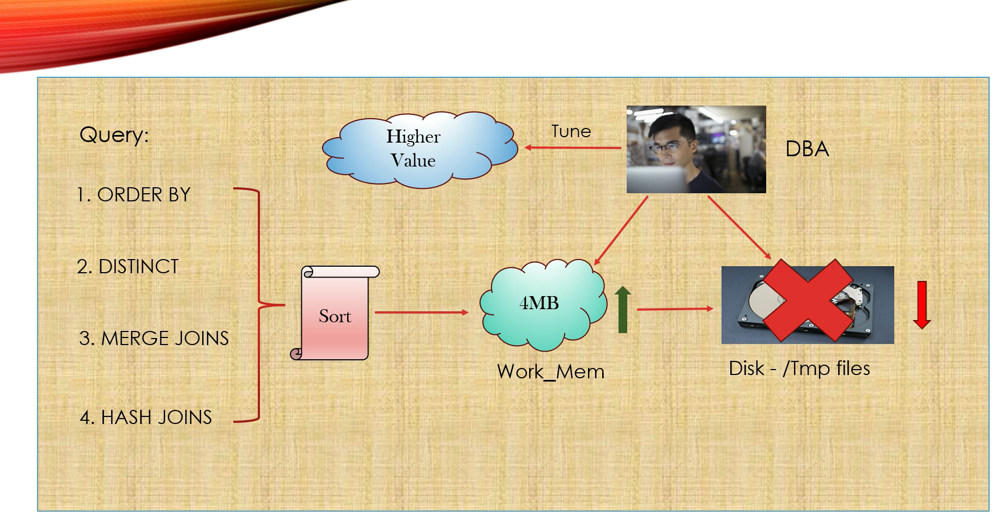

- This diagram illustrates how query processing and memory usage work in PostgreSQL, particularly focusing on operations such as ORDER BY, DISTINCT, MERGE JOINS, and HASH JOINS, and how these are affected by the work_mem setting.
- **Work_Mem** is the memory allocated for complex operations like sorts, hash tables, and other intermediate processing. By default, this is often set to a low value (e.g., 4 MB), which is depicted in the diagram.
- When work_mem is not large enough, PostgreSQL writes temporary files to disk (e.g., in the /tmp directory). This is depicted in the diagram with the arrow pointing towards the disk with a cross (X) sign, indicating that disk I/O can be costly in terms of performance.
- The **DBA** is responsible for monitoring and tuning work_mem and other settings to balance between available system memory and query performance.
- If there are too many files in /tmp for sort operation it is a sign that work_mem needs tuning. Gradually increase work_mem value and check os space usage for temp files.
- It's tough to get the right value for work_mem perfect, but often a sane default can be something like 64 MB.
- A well-known formula to set work_mem suggests:

25% of the total system memory/ max_connections

- Another way to check if work_mem is sufficient or not is by setting the parameter

**log_temp_files** to a specific value. If a query that is using temp files exceeds this value and generated more temp files, the query will be captured

and logged in my error log file.

_Note: If you find that only couple of queries are taking high temp size, we can sit with developer and ask them to set work_mem at session level/query level for 1 or 2 query rather than at cluster level._ or we can set at user level

ALTER ROLE usernameA SET work_mem TO '1GB'

RESET work_mem;

Example illustrating Explain plan and work_mem

Work Mem: 4MB Default

select a.aid from pgbench_accounts a, pgbench_accounts b where a.bid=b.bid order by a.bid limit 10;

Check Explain for the query

Worker 0: Sort Method: external merge Disk :29112kb

Worker 1: Sort Method: external merge Disk :27648kb

exection time : 1180.614 ms

increase the work_mem at session level

SET work_mem = '64MB';

select a.aid from pgbench_accounts a, pgbench_accounts b where a.bid=b.bid order by a.bid limit 10;

Explain again and check sorting is still happening in disk

Worker 0: Sort Method: external merge Disk :27408kb

Worker 1: Sort Method: external merge Disk :27920kb

exection time : 992.937 ms

increase the work_mem at session level

SET work_mem = '128MB';

select a.aid from pgbench_accounts a, pgbench_accounts b where a.bid=b.bid order by a.bid limit 10;

Explain the query and check sorting is happening in memory now

Worker 0: Sort Method: quicksort memory :98963kb

Worker 1: Sort Method: quicksort memory :98627kb

exection time : 959.404 ms

Note: If you find that 1 or 2 queries in your application is still using high disk sort even after increasing work_mem it is advisable to talk with developer and ask them to set work_mem at session level/query level for 1 or 2 query not at cluster level.

1. **MAINTENANCE WORK_MEM**

- Maximum amount of memory to be used by maintenance operations, such as VACUUM, CREATE INDEX, and ALTER TABLE ADD FOREIGN KEY.
- The Default value is 64Mb.
- Only one of these operations can be executed at a time by a database session.
- Larger settings might improve performance for vacuuming and for restoring database dumps.
- Each auto vacuum worker process uses maintenance_work_mem for its operation by default.
- Autovacuum_max_workers times the memory may be allocated on each auto vacuum run.
- We can instruct auto vacuum not to use maintenance_work_mem by setting a value for autovacuum_work_mem.

Recommendations

- Sets the limit for the amount that autovacuum, manual vacuum, bulk index build and other maintenance routines are permitted to use.
- Setting it to a moderately high value will increase the efficiency of vacuum and other operations.
- Applications which perform large ETL operations may need to allocate up to 1/4 of RAM to support large bulk vacuums.
- Note that each autovacuum worker may use this much, so if using multiple autovacuum workers you may want to decrease this value so that they can't claim too much RAM
- Recommended:

1\. 50mb for 1G of system memory =32*50mb=1600mb (for 32 gb ram)

2\. 512 mb for 32g and 2g for 64g>

- Create index and add foreign key at session level-- it is one time activity so we can set at session level
- By default, auto_vaccum_work_mem is disabled and uses maintenance_work_mem
- As a rule, vacuuming can utilize up to a maximum of one gig of memory

Max_worker default value is 3, so total of 3gb memory can be used by auto vacuum (1 gb for each worker)

1. **AUTOVACUUM WORK_MEM**

- Specifies the maximum amount of memory to be used by each autovacuum worker process.
- Default is -1. (-1 implies that autovacuum work_mem will be same as maintenance work_mem)
- autovacuum is only able to utilize up to a maximum of 1GB of memory.
- Setting autovacuum_work_mem to a value higher than that has no effect on the number of dead tuples that autovacuum can collect while scanning a table.
- maintenance_work_mem will be used if autovacuum_work_mem is not configured.

Recommendations

Set a limit on this which is based on the number of autovacuum workers you expect to have running.

**EFFECTIVE_CACHE_SIZE**

- Sets the planner's assumption about the effective size of the disk cache that is available to a single query.
- This cache is a combination of PostgreSQL cache and filesystem cache.
- Higher parameter value makes it more likely index scans will be used.
- lower Parameter value makes it more likely sequential scans will be used.
- The parameter is only for estimation purpose and does not actually allocate memory.
- The Default value is 4Gb.
- Conservative estimate of 50% of ram is considered optimal or Aggressive 70%.

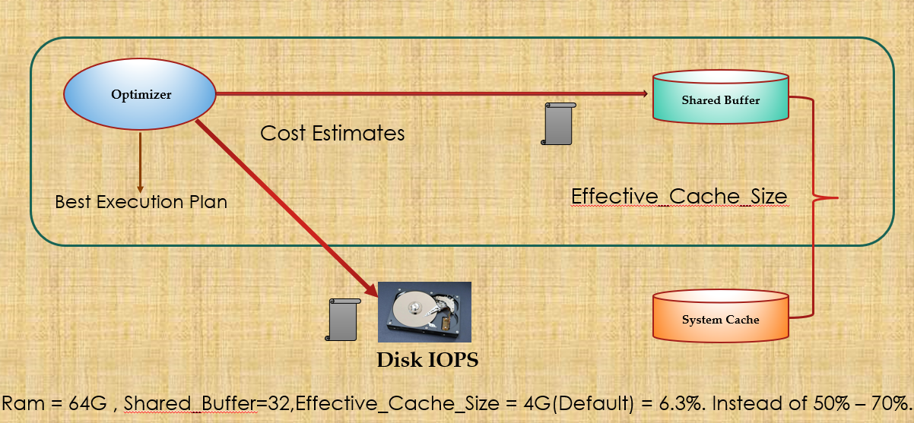

**The Data Flow and Explanation:**

Optimizer's Decision Process:

- The optimizer uses cost estimates to determine whether data can be accessed from memory (using shared buffers and the system cache) or if disk I/O is needed.
- If the effective_cache_size is set correctly (e.g., reflecting 50% to 70% of total RAM), the optimizer can make more accurate decisions, leveraging memory for faster data access.

Current Settings (Based on the Diagram):

- RAM: 64 GB.
- Shared Buffer: 32 GB (enough space for significant data caching).
- Effective Cache Size: 4 GB (default setting, low compared to total RAM).
- With these settings, the optimizer might not utilize the full memory potential, leading to reliance on Disk IOPS for query execution. This results in suboptimal query performance due to unnecessary disk reads.

Some additional parameters / configuration / monitoring view which is essentially important for tuning of better performance.

**MAX CONNECTIONS**

- The maximum number of concurrent connections to the database server.
- The default is typically 100 connections.
- Set to the maximum number of connections that we expect to need at peak load.
- Each connection uses shared_buffer memory, as well as additional non-shared memory
- Once the limit is reached application will throw "system out of memory" error.

Question:

1\. What basis do we set this number (max connections)?

Answer: check with pg_bench, put the load and monitor the system resource.

2\. Why not keep the connection to unlimited or extreme high value?

Answer: choke the system resource with denial-of-service attack

3\. How to effectively use the available connection limit?

Answer: there are some other parameters which is explained on next page.

4\. The number of max_connection seems too low to my requirements. What can i do if i need more connection?

Answer: use connection pooling

5\. what happens if the parameter is poorly managed?

Answer: system will crash, out of memory error and run out of available connection

**IDLE CONNECTIONS**

- A Connection can be active and doing some work or it can be idle.
- Idle connection refers to a connection that has been established between a client application and the database server but is not currently executing any queries or transactions.
- Connection can be idle if client application opens a connection but does not immediately execute any queries, or when a query or transaction is completed but the connection is not explicitly closed by the client.
- Idle connections can have an impact on the performance and scalability of a PostgreSQL database, as they consume server resources such as memory and CPU time, even though they are not actively processing any queries.

Note on Testing and Monitoring workload:

- Pg_bench extension can be used to run benchmark test with varying workload models and multiple concurrent database sessions.
- Average Transaction rate along with System resources usage like CPU and Memory Can be used in conjunction to arrive at acceptable number.
- Connection pooling can be used to Increase and effectively handle PostgreSQL connections.
- Pg_stat_activity is system view that stores PostgreSQL connection & activity stats.

Some other parameters related to connections

| **Parameter**                       | **Definition**                                                                                                                          | **Apply_Level**     |
| ----------------------------------- | --------------------------------------------------------------------------------------------------------------------------------------- | ------------------- |
| idle_session_timeout                | Terminate any session that has been idle                                                                                                | Interactive Session |
| idle_in_transaction_session_timeout | Terminate any session that has been idle within an open transaction for longer than the specified amount of time.                       | Interactive Session |
| tcp_keepalives_idle                 | specifies the number of seconds of inactivity, after which a keepalive message will be sent to the client by the PostgreSQL server.     | Server Level        |
| tcp_keepalives_interval             | This is the number of seconds after which the TCP keepalive message will be retransmitted if there is no acknowledgment from the client | Server Level        |
| tcp_keepalives_count                | This is the number of keepalive messages that can be lost before the client connection is considered as "dead". And terminated.         | Server Level        |
| client_connection_check_interval    | detect whether the connection to the client has gone away or not.                                                                       | Server Level        |
| authentication_timeout              | &nbsp;If a would-be client has not completed the authentication protocol in this much time, the server closes the connection.           | Server Level        |

alter user mike set idle_session_timeout='5min';

alter user mike set idle_in_transaction_session_timeou='5s'; - 10 sec

set idle_in_transaction_session_timeout to '3000';

begin;

select pg_sleep(5);

now query anything

select * from pg_stat_activity;

got disconnected

set idle_session_timeout to '7000';

select * from test2;

now query anything

select * from pg_stat_activity;

got disconnected

we can define these parameter at server level and here database server sent messgae to he application server

tcp_keepalives_idle=300 -5 minutes

tcp_keepalives_interval = 20 seconds - Tcp keepalive messge transmitted to client

tcp_keepalives_count=5

client_connection_check_interval= 5 seconds

**ADDITIONAL INFORMATION: PG_STAT_ACTIVITY**

**pg_stat_activity** is a system view in PostgreSQL that provides real-time information about active and recently active sessions (connections) to the database. It is extremely useful for monitoring database activity, diagnosing performance issues, and identifying slow or problematic queries.

Purpose of pg_stat_activity

- **Monitoring Active Connections**: Displays details about each active session, including the user, database, and current query being executed.
- **Performance Diagnostics**: Helps identify long-running queries or processes that may be causing performance bottlenecks.
- **Connection Management**: Assists in monitoring and managing the number of active connections to the database.

Useful Pg_stat_activity Queries for Monitoring Connections:

1)**Number of connected user**:

SELECT usename AS username

FROM pg_stat_activity

where usename!=''

GROUP BY usename;

1. **Which user and how many concurrent connections**:

SELECT usename AS username, count(*) AS concurrent_statements

FROM pg_stat_activity

WHERE state = 'active'

GROUP BY usename;

1. **If you need to figure out where the connections are going, you can break down the connections by database.**

SELECT datname, numbackends FROM pg_stat_database;

1. **investigate connections to a specific database**

SELECT * FROM pg_stat_activity WHERE datname='postgres';

1. **All active connections but not the current query**:

SELECT

age(clock_timestamp(), query_start),

usename,

datname,

query

FROM pg_stat_activity

WHERE

state != 'idle'

AND query NOT ILIKE '%pg_stat_activity%'

ORDER BY age desc;

1. **All processes that are not idle but do have a wait event**:

SELECT

usename,

datname,

query,

wait_event_type,

wait_event

FROM pg_stat_activity

WHERE

state != 'idle'

AND wait_event != '';

1. **Query backend_type equal to client_backend**.

SELECT * FROM pg_stat_activity WHERE backend_type = 'client backend';

1. Query to find start, state,state_change,pid and duration

SELECT pid, now() - query_start AS duration, query_start, state_change, state, query FROM pg_stat_activity WHERE backend_type = 'client backend';

1. **Session which are running for more 10 seconds and are not idle**

select

now()-query_start as runtime,

pid as process_id,

datname as db_name,client_addr,client_hostname,

query

from pg_stat_activity

where state!='idle'

and now() - query_start > '10 seconds':: interval

order by 1 desc;

1.  **Kill connections based on time frame:**

SELECT pg_terminate_backend(pid)

FROM pg_stat_activity

WHERE datname = 'Database_Name'

AND pid <> pg_backend_pid()

AND state in ('idle', 'idle in transaction', 'idle in transaction (aborted)', 'disabled')

AND state_change < current_timestamp - INTERVAL '15' MINUTE;

1.  **Postgres kill all idle in transaction**

SELECT pg_terminate_backend(pid)

FROM pg_stat_activity

WHERE datname='db'

AND state = 'idle in transaction';

1.  **To kill all active connections to a PostgreSQL database**

SELECT

pg_terminate_backend(pid)

FROM

pg_stat_activity

WHERE

datname ='postgres'

AND

leader_pid

IS NULL;

1.  **query to kill all connections except for yours:**

SELECT

pg_terminate_backend(pid)

FROM

pg_stat_activity

WHERE

datname =

'postgres'

AND

pid != pg_backend_pid()

AND

leader_pid

IS NULL;

1.  **To terminate all connections to all databases in a Postgres server(except yours)**

SELECT

pg_terminate_backend(pid)

FROM

pg_stat_activity

WHERE

pid != pg_backend_pid()

AND

datname

IS NOT NULL

AND

leader_pid

IS NULL;

1.  **specific session**:

select pid, query from pg_stat_activity where datname = current_database();

select pg_terminate_backend(123);

## CHECKPOINT TUNING

- It is a point in the write-ahead log sequence at which all data files have been updated to reflect the information in the log.
- Checkpoint ensure that all the dirty buffers created up to a certain point are sent to disk so that the WAL up to that point can be recycled.
- Checkpoint can be triggered when checkpoint_timeout value is reached, max_wal_size is reached, when a Super user issues a checkpoint command or pg_start_backup, CREATE DATABASE, or pg_ctl stop|restart)

**Checkpoint Parameters**

_(a)_ **_Checkpoint_timeout_** : Maximum time between automatic WAL checkpoints. The default is ten minutes (10min). Increasing this parameter can increase the amount of time needed for crash recovery.

Checkpoint timeout =10 min (default)

Idle Value: 20 min/30 min

Pros: Setting less checkpoint_timeout value

1. Faster after-crash recovery, since less work will need to be redone.

2. If no WAL has been written since the previous checkpoint, new checkpoints will be skipped even if checkpoint_timeout has passed.

Cons: Checkpoint requirement of flushing all dirty data pages to disk can cause significant I/O load causing huge performance impact.

For Example: If your Checkpoint_timeout is set at every 24 hours. The last Checkpoint was at 12pm. Let's say the system Crash at @4pm.

The database recovery will include Disk + 4 hours of change/wal logs.

The more interval between two checkpoints, the more time is required for recovery.

The less interval between two checkpoints, the less time is required for recovery but with increased I/O.

_(b)_ **_Max_wal_size_** : Maximum size to let the WAL grow during automatic checkpoints. This is a soft limit; WAL size can exceed max_wal_size under special circumstances, such as heavy load, a failing archive_command or archive_library, or a high wal_keep_size setting.

Important points regarding max_wal_size:

- Maximum size to let the WAL grow during automatic checkpoints.
- Once the limit is reached a checkpoint is requested and the space is recycled.
- Ensure Majority of checkpoints should be timed based checkpoints rather than requested ones.
- Increasing this parameter can increase the amount of time needed for crash recovery.
- Use "pg_stat_bgwriter" to monitor the number of requested and timed checkpoints.

_(c)_ **_Checkpoint_completion_target_**: Specifies the target of checkpoint completion, as a fraction of total time between checkpoints. The default is 0.9, which spreads the checkpoint across almost all of the available interval, providing fairly consistent I/O load.

- Example: If checkpoint_timeout is set to 10 minutes and checkpoint_completion_target is set to 0.9, PostgreSQL will distribute workload and aim to complete the checkpoint within 9 minutes (90% of 10 minutes). This leaves the final 1 minute (10% of the interval) as a buffer before the next checkpoint starts.

**PG_STAT_BGWRITER: MONITORING CHECKPOINT OCCURANCE**

pg_stat_bgwriter is a view which provides metrics about how PostgreSQL flushes dirty buffers to the disk.

There are 3 ways how the dirty buffers are flushed.

(a) Checkpoint (buffer_checkpoint)

(b) Background_Writer (buffer_clean)

(c) Backends (buffer_backends)

A comparison of buffers_checkpoint, buffers_clean, and buffers_backend is insightful for understanding the distribution of writes during checkpoints, by the background writer, and in backend sessions, respectively.

(a) Checkpoint (buffer checkpoint) -> Timed or Requested.

Timed checkpoints basically happens when the checkpoint_timeout is achieved and this is basically desirable.

Requested checkpoints are inherently unpredictable and mostly happens if max_wal_size is breached.

Tip:

Aim to keep majority of checkpoints as timed checkpoints and reduce requested checkpoint. This can be achieved by setting a max_wal_size to a higher value or if the checkpoint_timeout value is too large. We can go ahead and reduce the timing of checkpoint_timeout.

checkpoint_write_time: Total time spent in the checkpoint processing portion when writing files to disk, in milliseconds.

checkpoint_sync_time: Total time spent in the checkpoint processing portion when synchronizing files to disk, in milliseconds.

Checkpoint (buffer_checkpoint): Number of buffers written by checkpoints.

Tip:

For Better Performance it is advisable to have a majority of buffers written to the disk during checkpoints. so a higher number for buffer_checkpoint is preferable over backends or by the background writer.

(b) Background_Writer (buffer_clean): Number of buffers written by the background writer process. A high buffers_clean value implies effective workload reduction during checkpoints by the background writer. There are three parameters that work in sync with bg_writer for proper checkpointing.

bgwriter_delay: 200ms

This parameter sets the time interval (in milliseconds) between each round of the background writer's activity.

bgwriter_lru_maxpages: 100

This parameter specifies the maximum number of dirty buffers the background writer is allowed to write in a single round.

bgwriter_lru_multiplier: 2

This multiplier determines how aggressively the background writer should clean dirty buffers based on recent buffer usage.

**How These Parameters Work Together:**

- **bgwriter_delay** controls how often the background writer wakes up and checks the buffer pool.
- **bgwriter_lru_maxpages** limits how many dirty buffers the background writer can write in one cycle, ensuring that it doesn't monopolize disk I/O.
- **bgwriter_lru_multiplier** determines the number of buffers the background writer attempts to clean based on recent usage, allowing it to adapt dynamically to the system's needs.

(c) Backends (buffer_backends) : Number of buffers written directly by the backend. High buffers_backend can also indicate extensive bulk insert or update operations. Ensure to keep buffers_backend as low as possible, as high values suggest that PostgreSQL sessions are taking on tasks typically handled by the background writer. This might indicate a need for more shared_buffers, or a more aggressive background writer configuration, by adjusting bgwriter_lru_maxpages, bgwriter_lru_multiplier, and reducing bgwriter_delay.

Note:

stats_reset: Time at which these statistics were last reset.

Command to Reset Statistics

Select pg_stat_reset_shared('bgwriter');

| **PG_STAT_BGWRITER columns** | | |
| --- | | | --- | --- |

| Name                  | Type                     | Description                                                                                                                                                   |
| --------------------- | ------------------------ | ------------------------------------------------------------------------------------------------------------------------------------------------------------- |
| checkpoints_timed     | bigint                   | Number of scheduled checkpoints that have been performed.                                                                                                     |
| checkpoints_req       | bigint                   | Number of checkpoints that have been performed actively.                                                                                                      |
| checkpoint_write_time | double precision         | Total time spent in the checkpoint processing portion when writing files to disk, in milliseconds.                                                            |
| checkpoint_sync_time  | double precision         | Total time spent in the checkpoint processing portion when synchronizing files to disk, in milliseconds.                                                      |
| buffers_checkpoint    | bigint                   | Number of buffers written by checkpoints.                                                                                                                     |
| buffers_clean         | bigint                   | Number of buffers written by the background writer process.                                                                                                   |
| maxwritten_clean      | bigint                   | Number of times that cleanup scanning stops because the background writer process writes too many buffers.                                                    |
| buffers_backend       | bigint                   | Number of buffers written directly by the backend.                                                                                                            |
| buffers_backend_fsync | bigint                   | Number of times that the backend calls fsync (usually, even if the backend executes these write actions, the background writer process processes them again). |
| buffers_alloc         | bigint                   | Number of buffers allocated.                                                                                                                                  |
| stats_reset           | timestamp with time zone | Time at which these statistics were last reset.                                                                                                               |

Note:

The maxwritten_clean metric shows the frequency at which the background writer halts due to reaching its maxpages limit. If the value is high, try to increase bgwriter_lru_maxpages for flushing more writes per round.

checkponts types:

select checkpoints_timed,checkpoints_reg from pg_stat_bgwriter;

find average checkpoint per minut

select

totabl_checkpoints,

seconds_since_start/total_checkpoints/60 as minutes_between_checkpoints

from

(select

extract(epoch from (now()-pg_postmaster_start_time())) as seconds_since_start,

(checkpoints_timed+checkpoints_reg) as total_checkpoints

from pg_stat_bgwriter

) as sub;

reset statistics

select pg_stat_reset_shared('bgwriter');

**MVCC AND AUTO VACUUM**

Implementation of MVCC (Multi-Version Concurrency Control) in PostgreSQL is different and special when compared with other RDBMS. MVCC in PostgreSQL controls which tuples can be visible to transactions via versioning.

**What is versioning in PostgreSQL?**

Let's consider the case of an Oracle or a MySQL Database. What happens when you perform a DELETE or an UPDATE of a row? You see an UNDO record maintained in a global UNDO Segment. This UNDO segment contains the past image of a row, to help database achieve consistency. (the "C" in A.C.I.D). For example, if there is an old transaction that depends on the row that got deleted, the row may still be visible to it because the past image is still maintained in the UNDO. If you are an Oracle DBA reading this blog post, you may quickly recollect the error ORA-01555 snapshot too old. What this error means is-you may have a smaller undo retention or not a huge UNDO segment that could retain all the past images (versions) needed by the existing or old transactions.

You may not have to worry about that with PostgreSQL.

Then how does PostgreSQL manage UNDO?

In simple terms, PostgreSQL maintains both the past image and the latest image of a row in its own Table. **It means, UNDO is maintained within each table.** And this is done through versioning. Now, we may get a hint that, every row of PostgreSQL table has a version number. And that is absolutely correct. In order to understand how these versions are maintained within each table, you should understand the hidden columns of a table (especially **xmin**) in PostgreSQL.

Understanding the Hidden Columns of a Table

When you describe a table, you would only see the columns you have added, like you see in the following log.

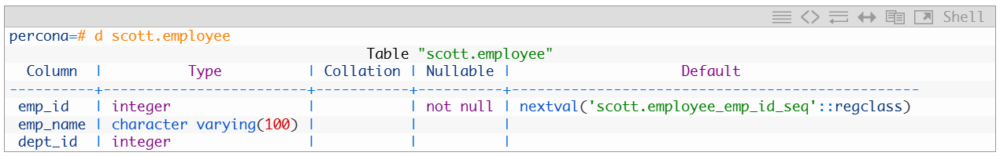

However, if you look at all the columns of the table in pg_attribute, you should see several hidden columns as you see in the following log.

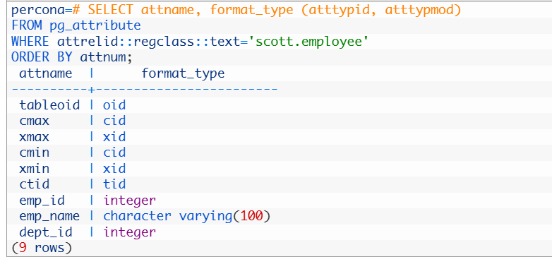

**tableoid**: Contains the OID of the table that contains this row. Used by queries that select from inheritance hierarchies.

**xmin**: The transaction ID (xid) of the inserting transaction for this row version. Upon update, a new row version is inserted. Let's see the following log to understand the xmin more.

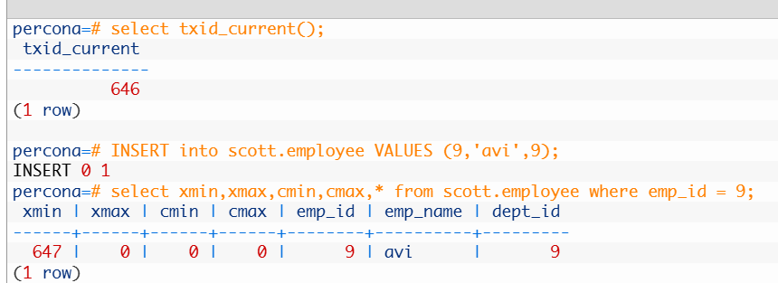

As you see in the above image, the transaction ID was 646 for the command =>

select txid_current(). Thus, the immediate INSERT statement got a transaction ID 647. Hence, the record was assigned an xmin of 647. This means, no transaction ID that has started before the ID 647, can see this row. In other words, already running transactions with txid less than 647 cannot see the row inserted by txid 647.

**xmax**: This value is 0 if it was not a deleted row version. Before the DELETE is committed, the xmax of the row version changes to the ID of the transaction that has issued the DELETE. Let's observe the following log to understand that better.

**On Terminal A:** We open a transaction and delete a row without committing it.

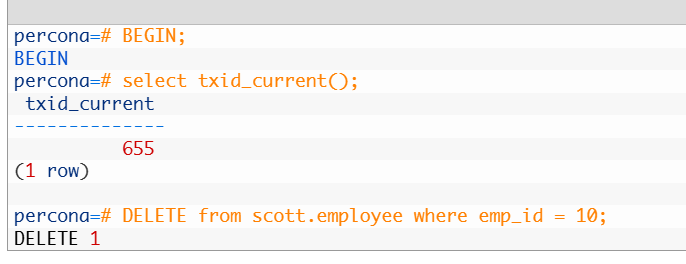

On Terminal B: Observe the xmax values before and after the delete (that has not been committed).

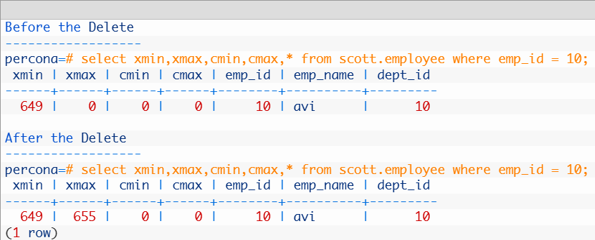

As you see in the above image, the xmax value changed to the transaction ID that has issued the delete. If you have issued a ROLLBACK, or if the transaction got aborted, xmax remains at the transaction ID that tried to DELETE it (which is 655) in this case.

Now that we understand the hidden columns xmin and xmax, let's observe what happens after a DELETE or an UPDATE in PostgreSQL.

Let's see the following example to understand

We'll insert 10 records to the table : scott.employee

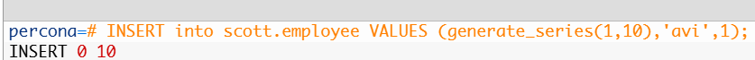

Now, let's DELETE 5 records from the table.

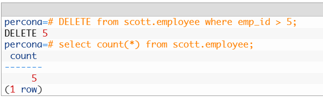

Now, when you check the count after DELETE, you would not see the records that have been DELETED. To see any row versions that exist in the table but are not visible, we have an extension called pageinspect. The pageinspect module provides functions that allow you to inspect the contents of database pages at a low level, which is useful for debugging purposes. Let's create this extension to see the older row versions those have been deleted.

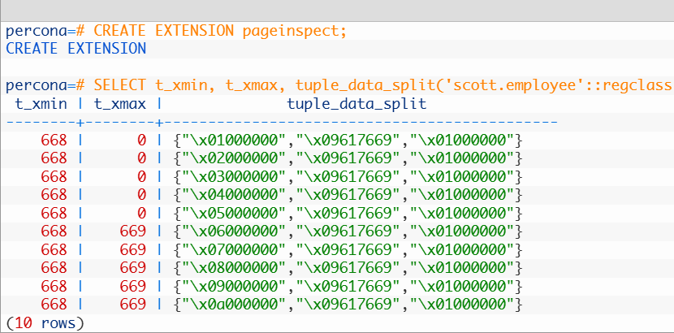

Now, we could still see 10 records in the table even after deleting 5 records from it. Also, you can observe here that t_xmax is set to the transaction ID that has deleted them. These deleted records are retained in the same table to serve any of the older transactions that are still accessing them.

We'll take a look at what an UPDATE would do in the following example.

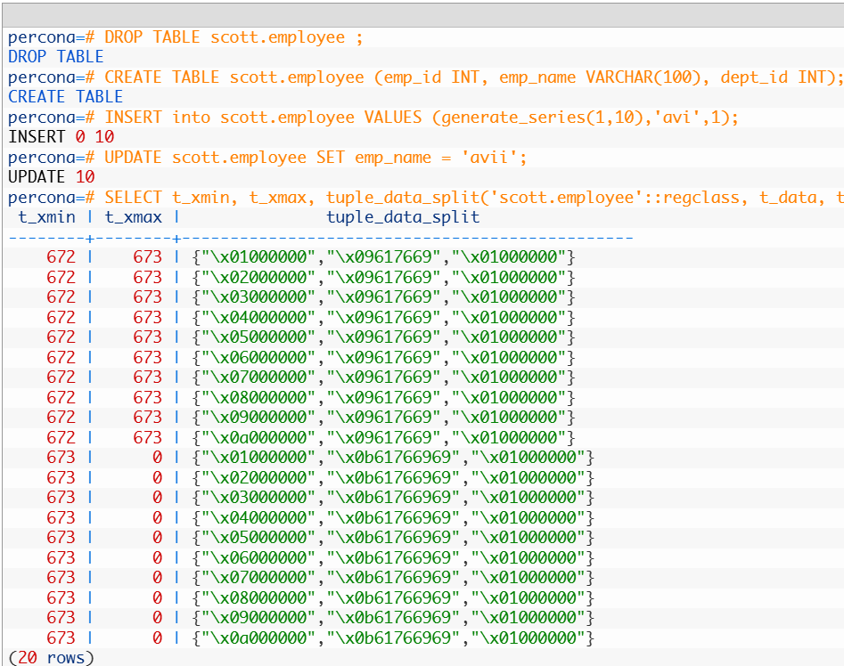

An UPDATE in PostgreSQL would perform an insert and a delete. Hence, **all the records being UPDATED have been deleted and inserted back with the new value**. Deleted records have non-zero t_xmax value.

**VACUUM in PostgreSQL**

- As seen in the above examples, every such record that has been deleted but is still taking some space is called a **_dead tuple_**.
- Once there is no dependency on those dead tuples with the already running transactions, the dead tuples are no longer needed. Thus, PostgreSQL runs VACUUM on such Tables.
- VACUUM reclaims the storage occupied by these dead tuples.
- The space occupied by these dead tuples may be referred to as _Bloat_.
- VACUUM scans the pages for dead tuples and marks them to the free space.
- Upon VACUUM, this space is not reclaimed to disk but can be re-used by future inserts on this table.
- Running a VACUUM is a non-blocking operation. It never causes exclusive locks on tables
- This means VACUUM can run on a busy transactional table in production while there are several transactions writing to it.

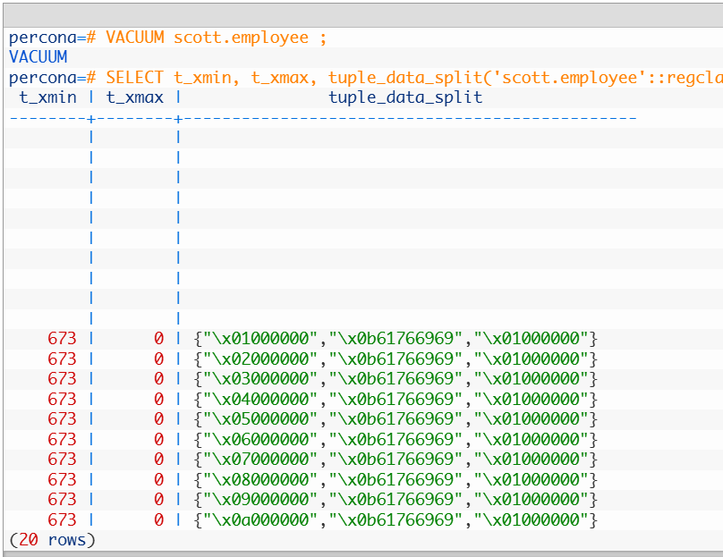

In the above image, you might notice that the dead tuples are removed and the space is available for re-use. However, this space is not reclaimed to filesystem after VACUUM. Only the future inserts can use this space.

- If you would need to reclaim the space to filesystem in the scenario where we deleted all the records you may run VACUUM FULL.
- VACUUM FULL rebuilds the entire table and reclaims the space to disk.
- BEWARE: VACUUM FULL is not an ONLINE operation. It is a blocking operation.
- You cannot read from or write to the table while VACUUM FULL is in progress.

**Note:** VACUUM FULL can only reclaim space from operating system. Although, **a normal vacuum can also reclaim space from OS, if there are pages with no more live tuples after the high-water mark**, the subsequent pages can be flushed away to the disk by VACUUM

VACUUM does an additional task. **All the rows that are inserted and successfully committed in the past are marked as frozen**, which indicates that they are visible to all the current and future transactions. We will be discussing frozen xid in detail in our section.

**FROZEN XID: Preventing Transaction ID Wraparound in PostgreSQ**L

**What is Xid?**

- An XID (Transaction ID) is a unique identifier that PostgreSQL assigns to every transaction when it starts.
- Each transaction (whether it's an INSERT, UPDATE, DELETE, or SELECT within a transaction block) gets its own XID.
- XID are always incremental (think of this as scn number in oracle)

When a transaction starts, PostgreSQL assigns it an XID. If three transactions occur in sequence:

Transaction 1 (maybe a select) might get XID 5000.

Transaction 2 (maybe a delete) will get XID 5001.

Transaction 3 (maybe another select) will get XID 5002.

Let's suppose current xid is 50,000

The transaction age for transaction 1 will be 50,000-5000 i.e 45000

The transaction age for transaction 2 will be 50,000-5001 i.e 44999

The transaction age for transaction 3 will be 50,000-5002 i.e 44998

The transaction age of a row or a transaction refers to how old the transaction is in relation to the current XID.

It is calculated as the difference between the current XID and the XID of the transaction that last modified the row.

So, Transaction Age=Current XID−Row XID

- PostgreSQL uses a 32-bit XID, meaning the maximum number of unique transaction IDs is about 4 billion
- Once this limit is reached, the XID will wrap around
- Each transaction is assigned a xid number, the number can only go upto 4 billion and after that xid counter starts from 0 again and counter restarting from 0 is termed as wrap around.

**How Vacuum helps with transaction age?**

Example Scenario:

Imagine you have a PostgreSQL table that stores employee data. Over time, various transactions (inserts, updates, deletes) happen in this table, and each transaction gets assigned a unique transaction ID (XID). PostgreSQL uses this XID to track changes to data in the table.

Initial State:

Let's say the current transaction ID (XID) is 1000, and you perform a few transactions:

Transaction 1001: You insert a new row for an employee.

Transaction 1002: You update a salary for an employee.

Transaction 1003: You delete an employee record.

Now, the XID is at 1003, and the database knows that some of the data is associated with these transactions.

if the current transaction ID is 3000:

The insert in Transaction 1001 now has an age of 3000 - 1001 = 1999 transactions.

The update in Transaction 1002 has an age of 3000 - 1002 = 1998 transactions.

The delete in Transaction 1003 has an age of 3000 - 1003 = 1997 transactions.

Now, let's say you run a VACUUM operation on this table when the current transaction ID is 3000. The VACUUM process does the following:

**Cleans up Dead Tuples:** It marks rows from old transactions that are no longer needed (e.g., from the delete operation) as reusable space.

**Freezes Old XIDs:** If a row's transaction ID (XID) is sufficiently old, PostgreSQL "freezes" it. This essentially means that the row's XID is set to a special frozen state.

Let's assume that after running VACUUM, the row inserted in Transaction 1001 is old enough to be frozen. So, the row now has become frozen. This means it no longer contributes to the transaction age calculation.

Now, if the current transaction ID is still 3000:

The row inserted by Transaction 1001 now has an age of 0 because it's frozen.

The row updated by Transaction 1002 still has an age of 3000 - 1002 = 1998 transactions. (why was this row not frozen? the concept is explained in next section)

The row deleted by Transaction 1003 no longer exists because VACUUM cleared it.

**How will vacuum calculate what xid to mark freeze based on transaction age?**

For that you need to understand two PostgreSQL parameters:

autovacuum_freeze_max_age:

This is the most critical parameter in determining how old a transaction must be before it gets frozen.

It specifies the maximum transaction age (in terms of transaction ID) that a table can reach before a freezing VACUUM is triggered.

The default value is typically 200 million transactions. (20 crore)

vacuum_freeze_min_age:

This controls the minimum age a transaction ID must reach before VACUUM starts freezing it.

It prevents PostgreSQL from freezing very recent transactions that are not yet in danger of wraparound.

The default value is 50 million transactions. ( 5 crore)

Example:

Let's say we have the following configuration:

autovacuum_freeze_max_age = 200 million (20 crore)

vacuum_freeze_min_age = 50 million (5 crore)

Current State:

Current XID: 500,000,000 (500 million) (50 crore)

Row 1 XID: 100,000,000 (transaction age = 400 million) (40 crore)

Row 2 XID: 300,000,000 (transaction age = 200 million) (20 crore)

Row 3 XID: 450,000,000 (transaction age = 50 million) (5 crore)

During VACUUM:

1\. For row1

Since this age (50 crore) is greater than both vacuum_freeze_min_age (50 million)(5 crore) and autovacuum_freeze_max_age (200 million) (20 crore), PostgreSQL will freeze this XID during the VACUUM process.

2\. For row2

This transaction age (20 crore) is exactly at the autovacuum_freeze_max_age, so PostgreSQL will also freeze this row's XID to prevent it from getting too old.

3\. For row3

This transaction age (5 crore) is equal to vacuum_freeze_min_age, so PostgreSQL may freeze this row's XID, but it's not mandatory unless the age grows beyond this value.

Note:

- What happening is we have determined vacuum_freeze_min_age = 50 million (5 crore) means if any transaction age is older than this value the xid is eligible for freeze but this depends on postgres whether it wants to freeze or not
- When a transaction age is older than autovacuum_freeze_max_age = 200 million (20 crore) then postgres will force a vacuum to freeze old xid and prevent wrap around.
- If a transaction reaches 2 billion it is an alarming situation that your database or table related to that transaction age needs to be vacuumed. In that case PostgreSQL will run vacuum on its own.
- If auto vacuum is stopped and no vacuuming is being performed, when the transaction reaches 4 billion, the database will be in read mode only and it will be necessary to vacuum at that stage.
- When we execute vacuum (verbose,analyze) it does not automatically include freeze in it, either run vacuum (verbose,freeze) if auto vacuuming is off.
- or let the parameter decide (vacuum_freeze_min_age and autovacuum_freeze_max_age) so that whenever vacuum or auto vacuum runs it will freeze older xids.

**TUNING AUTO VACUUM PARAMETERS**

Parameters for auto vacuum process

**autovacuum_max_workers**

- Specifies the maximum number of autovacuum processes (other than the autovacuum launcher) that may be running at any one time.
- The default is 3.
- If you have an installation with many tables or with some tables which autovacuum takes hours to process, you may want to add additional autovacuum workers so that multiple tables can be vacuumed at once.
- Be conservative, though, each autovacuum worker will utilize a separate CPU core, memory and I/O.

**autovacuum_naptime**

- Specifies minimum time that postgresql wait between each auto vacuum.
- In each round the daemon examines the database and issues VACUUM and ANALYZE commands as needed for tables in that database.
- Decrease this to 30s or 15s if you have a large number (100's) of tables
- if you otherwise see from pg_stat_user_tables that autovacuum is not keeping up.

**autovacuum_vacuum_threshold**

- Sets the minimum number of dead tuples that must exist in a table before the **autovacuum** process considers vacuuming it.
- Autovacuum will start vacuuming a table only if the number of dead tuples exceeds this value. It acts as a baseline number to trigger vacuuming, irrespective of table size.
- This parameter ensures that very small tables can still be vacuumed even if they have only a few dead tuples.
- default is 50

**autovacuum_vacuum_scale_factor**

- Sets a scale factor based on the size of the table that, when combined with autovacuum_vacuum_threshold, helps determine when vacuuming should be triggered.
- default is 0.2, which represents 20%
- The formula for determining when a table should be vacuumed is:

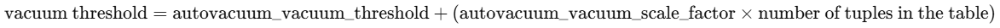

For example, if autovacuum_vacuum_threshold is 50, autovacuum_vacuum_scale_factor is 0.2, and the table has 10,000 tuples, the vacuum threshold is: 50+(0.2×10,000)

50+(0.2×10,000) =50+2,000=2,050

Autovacuum will run when the number of dead tuples in the table exceeds 2,050.

**autovacuum_analyze_threshold**

- Sets the minimum number of inserted, updated, or deleted tuples that must exist before the **autovacuum** process considers analyzing a table.
- default is 50
- Similar to autovacuum_vacuum_threshold, this parameter ensures that even small tables are analyzed when they meet the threshold for changes. This helps keep the statistics used by the query planner up to date for optimal query performance.

**autovacuum_analyze_scale_factor**

- Works alongside autovacuum_analyze_threshold to determine the number of modified tuples required to trigger an **analyze** operation on a table.
- default is 0.1, which represents 10%
- formula for determining whether a table should be analyzed is

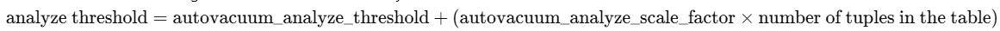

**autovacuum_vacuum_cost_limit**

- The amount of work autovacuum does in one cycle.
- Specifies the cost limit value that will be used in automatic VACUUM operation.
- controls the amount of CPU and I/O resources that an autovacuum worker can consume.
- If you set the value of autovacuum_vacuum_cost_limit too high, the autovacuum process might consume too many resources and slow down other queries.
- If you set it too low, the autovacuum process might not reclaim enough space, which causes the table to become larger over time.
- **Default Value**: 200 pages

**autovacuum_vacuum_cost_delay**

- Number of milliseconds that autovacuum is asleep after it has reached the cost limit specified by the autovacuum_vacuum_cost_limit parameter.
- Specifies the cost delay value that will be used in automatic VACUUM operations.
- If autovacuum is having too much of a performance impact on running queries, you might want to increase this setting.
- If we want autovacuum process to be more aggressive we can decrease the delay.
- **Default Value**: 20 milliseconds (1 second =1000 miliseconds)

**Tuning Tips:**

- **Lowering autovacuum_vacuum_cost_limit**: Reduces the amount of work autovacuum can do in one go, leading to more frequent pauses but potentially lower I/O impact.
- **Increasing autovacuum_vacuum_cost_delay**: Increases the pause time between work, which helps reduce I/O but may slow down the completion of autovacuum tasks.
- **High-Performance Systems**: You might want to increase the autovacuum_vacuum_cost_limit and reduce autovacuum_vacuum_cost_delay to make autovacuum more aggressive if your system can handle the load without performance degradation.
- PostgreSQL database tables are auto-vacuumed by default when 20% of the rows plus 50 rows are modified.
- Tables are auto-analyzed when a threshold is met for 10% of the rows plus 50 rows.
- The default auto-vacuum analyze, and vacuum settings are sufficient for a small deployment, but the percentage thresholds take longer to trigger as the tables grow larger. Performance degrades significantly before the auto-vacuum vacuuming and analyzing occurs.
- You can set autovacuum threshold values at table level rather than cluster level.

ALTER TABLE warehouse_ltd SET (autovacuum_vacuum_scale_factor = 0.1);

ALTER TABLE warehouse_ltd SET (autovacuum_vacuum_threshold = 500);

ALTER TABLE warehouse_ltd SET (autovacuum_analyze_scale_factor = 0.1);

ALTER TABLE warehouse_ltd SET (autovacuum_analyze_threshold = 500);

Scenario Based auto vacuum configuration and example

Scenario 1:

Autovacuum_max_worker=3

Autovacuum_Nap_time= 1min

5 databases in cluster

1 worker spawn = 1 database and 1 table

autovacuum come in picture. one minute is passed and the worker is still working because

Autovacuum_Nap_time= 1min

2 worker= 2 database and 1 table

Autovacuum_Nap_time again elapsed again one more min passed and still working

Then auto vacuum launcher launches the third worker

3 worker= 3 database and 1 table

now other databases have to wait to complete the earlier task

If you have 50 databases in a cluster, then obviously three workers are not going to help

maybe 8 or 10 workers should help but beware more workers means more resource consumption.

You can decrease the nap time to 30s, it might help a little but it in this scenario the issue was with max worker

Scenario 2:

we have one database with large table

1 database

1 worker =1 table

2 worker = 2 table

here we can increase the max worker and reduce the nap time

Scenario 3:

autovacuum_vaccum_cost_limit\\vacuum_cost_limit=200 (200 pages)

autovacuum_cost_vacuum_delay= 2ms (this is the amount of sleep time b/w two cost limits)

vacuum_cost_page_hit=1 (cost of page hit means data is found in shared buffer/memory)

vacuum_cost_page_miss=2 (cost of page miss means data is found on the disk)

vacuum_cost_page_dirty=20 (data is found in shared buffer and dirtied)

when a vacuum runs and search for a page and if a page is available and found in shared buffer is call hit with cost 1 and if missed, found in disk with a cost 2 and assume a page is found in shared buffer and dirty, then assigned value is 20

We know that 1000ms = 1 sec

how many times can a vacuum go to sleep or delay.

1000/2 = 500 (time/autovacuum_cost_delay)

Auto vacuum will only run for half a second (500 ms)

- If data is found in shared buffer

Formula: (autovacuum_vaccum_cost_limit / vacuum_cost_page_hit) * autovacuum_run_duration * 8k (page size)

(200/1) * 500 * 8k =782mb/sec

- If found all pages in disk

(200/2) * 500 * 8k =390mb/sec

- If found all pages in shared buffer and dirty

(200/20) * 500 * 8k =39mb/sec

This much data will be vacuumed with default settings

Let's suppose we increase autovacuum_vaccum_cost_limit from 200 pages to 1000 pages

(1000/1) * 500 * 8k =3.9G/sec

Note:

We can schedule how aggressive we want our auto vacuum to process but it comes with a cost of I/O. Plan accordingly.

Set cost limit to a higher value for aggressive approach.

Set cost limit to 200 for moderate vacuum approach.

Mixed approach: we can schedule low values during peak hours and after peak hours with cron job we can aggressively run it

we can set these parameters at fly level so there is no need to restart the database

**Auto Vacuum Common Issues and Resolutions:**

How Autovacuum cost is calculated:

Autovacuum reads pages looking for dead tuples, and if none are found, autovacuum discards the page.

When autovacuum finds dead tuples, it removes them. The cost is based on:

- vacuum_cost_page_hit: Cost of reading a page that is already in shared buffers and doesn't need a disk read. The default value is set to 1.
- vacuum_cost_page_miss: Cost of fetching a page that isn't in shared buffers. The default value is set to 2.
- vacuum_cost_page_dirty: Cost of writing to a page when dead tuples are found in it. The default value is set to 20.

**Common Issues and Solutions:**

Issue 1: Autovacuum running slow:

1. Tables are getting vacuum slow and Vacuum process constantly appear in pg_stat_activity.

SELECT query FROM pg_stat_activity WHERE backend_type = 'autovacuum worker';

Resolution :

1. maintenance_work_mem \\Autovacuum_work_mem: Increase to allow each autovacuum worker process to store more dead tuples while scanning a table.
2. autovacuum_vacuum_cost_delay:Decrease to reduce cost limiting sleep time and make vacuuming faster.
3. autovacuum_vacuum_cost_limit: Increase the cost to be accumulated before vacuum will sleep, thereby reducing sleep frequency and making vacuum go faster.

(Good for Large number of Databases in Cluster).

1. autovacuum_max_workers Increase to allow more parallel workers to be triggered by autovacuum.

Issue 2: Autovacuum not happening enough.

1. SELECT relname, last_vacuum, last_autovacuum FROM pg_stat_user_tables;

Resolution:

1. autovacuum_vacuum_scale_factor Lower the value to trigger vacuuming more frequently, useful for larger tables with more updates / deletes.
2. autovacuum_vacuum_insert_scale_factor Lower the values to trigger vacuuming more frequently for large, insert-heavy tables.

Issue 3: Autovacuum is consuming too much system resource.

1. Spike in system resources memory/ Disk i-o
2. Slow other query performance.

Resolution:

1. Increase autovacuum_vacuum_cost_delay and reduce autovacuum_vacuum_cost_limit if set higher than the default of 200.
2. Reduce the number of autovacuum_max_workers if it's set higher than the default of

Issue 4: Vacuum does not clean up dead rows efficiently.

1. Tables are not getting vacuum properly and dead rows still show up.

Resolution:

1. Check for long running transaction which block vacuum process.
2. Termination long running transaction helps in freeing up dead tuples for deletion.
3. Query to check long running transaction.

SELECT pid, age(backend_xid) AS age_in_xids,

now () - xact_start AS xact_age,

now () - query_start AS query_age,

state,

query

FROM pg_stat_activity

WHERE state != 'idle'

ORDER BY 2 DESC

LIMIT 10;

**Queries for Monitoring Autovacuum:**

1)Find if Auto vacuum is turned on or not:

SELECT name, setting FROM pg_settings WHERE name='autovacuum';

1. Find how many dead rows are in a table:

SELECT relname, n_dead_tup FROM pg_stat_user_tables;

1. Find if Track-Count is turned on or not (Enables collection of statistics on database activity)

SELECT name, setting FROM pg_settings WHERE name='track_counts';

1. Check if Autovacuum is enabled at table level:

SELECT reloptions FROM pg_class WHERE relname='Tablename';

1. Check parameter settings related with autovacuum.:

SELECT * from pg_settings where category like 'Autovacuum';

1. Find when was a table last vacuum/Auto vacuumed:

SELECT relname, last_vacuum, last_autovacuum FROM pg_stat_user_tables;

1. To check progress of a running vacuum:

select * from pg_stat_progress_vacuum;

1. Dead Tuples percentage /Last Autovacuum.

select schemaname, relname, n_dead_tup, n_live_tup, round (n_dead_tup: float/n_live_tup: float*100) dead_pct, autovacuum_count, last_vacuum,last_autovacuum,last_autoanalyze,last_analyze from pg_stat_all_tables where n_live_tup >0;

1. Tables currently qualify for vacuum:

SELECT *

,n_dead_tup > av_threshold AS av_needed

,CASE

WHEN reltuples > 0

THEN round(100.0 * n_dead_tup / (reltuples))

ELSE 0

END AS pct_dead

FROM (

SELECT N.nspname

,C.relname

,pg_stat_get_tuples_inserted(C.oid) AS n_tup_ins

,pg_stat_get_tuples_updated(C.oid) AS n_tup_upd

,pg_stat_get_tuples_deleted(C.oid) AS n_tup_del

,pg_stat_get_live_tuples(C.oid) AS n_live_tup

,pg_stat_get_dead_tuples(C.oid) AS n_dead_tup

,C.reltuples AS reltuples

,round(current_setting('autovacuum_vacuum_threshold')::INTEGER + current_setting('autovacuum_vacuum_scale_factor')::NUMERIC * C.reltuples) AS av_threshold

,date_trunc('minute', greatest(pg_stat_get_last_vacuum_time(C.oid), pg_stat_get_last_autovacuum_time(C.oid))) AS last_vacuum

,date_trunc('minute', greatest(pg_stat_get_last_analyze_time(C.oid), pg_stat_get_last_autoanalyze_time(C.oid))) AS last_analyze

FROM pg_class C

LEFT JOIN pg_namespace N ON (N.oid = C.relnamespace)

WHERE C.relkind IN (

'r'

,'t'

)

AND N.nspname NOT IN (

'pg_catalog'

,'information_schema'

)

AND N.nspname !~ '^pg_toast'

) AS av

ORDER BY av_needed DESC ,n_dead_tup DESC;

**QUERY OPTIMIZATION**

**Statement Processing**

**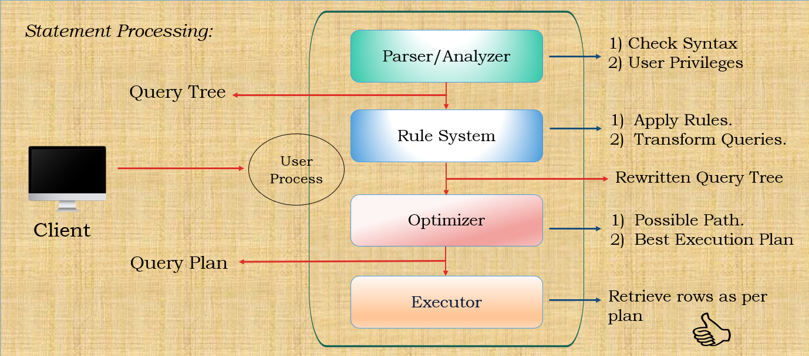**

- Parse: Check Syntax, Break query in tokens, Generate Parse Tree and Identify Query type.
- Optimizer/Planner: Generates optimal plan, Uses Database Statistics, Calculate Query cost, Choose best Plan.
- Execute: Execute Query based on execution plan.

**EXPLAIN PLAN**

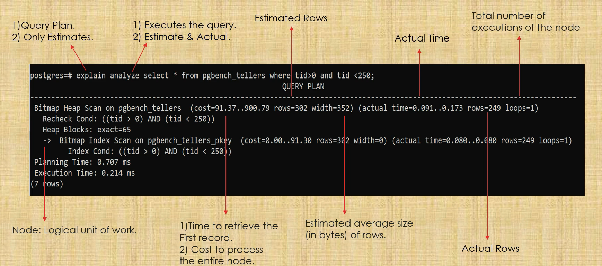

\--new addition 29-04-2026

Full syntax for EXPLAIN: EXPLAIN (analyze, verbose, costs, settings, buffers, wal, timing, summary, format text)

This diagram explains how to interpret the output of an EXPLAIN ANALYZE query in PostgreSQL, which helps in understanding the performance and execution plan of a SQL query. Here's a detailed breakdown of each point indicated in the image:

1. **Query Plan & Only Estimates**:
   - This portion of the EXPLAIN command without ANALYZE only provides estimated costs, rows, and other details about the query execution without actually running it.
2. **Executes the Query & Estimate & Actual**:
   - When you use EXPLAIN ANALYZE, the database actually runs the query and reports both the estimated and actual performance metrics, such as cost and time.
3. **Estimated Rows**:
   - This indicates the number of rows the planner estimates will be returned or processed at each step of the execution plan.
4. **Actual Time**:
   - The actual time taken (in milliseconds) to execute this specific node in the query plan. It shows both the time to start retrieving the first record and the time taken to complete processing for that node.
5. **Total Number of Executions of the Node (Loops)**:
   - The number of times this particular step or node in the execution plan was executed. For example, if a node is executed in a loop, the loops value will be more than one.
6. **Node: Logical Unit of Work**:
   - Each entry in the query plan is referred to as a "node." It represents a distinct operation or step (e.g., an index scan, a join, etc.) in the execution of the query.
7. **Time to Retrieve the First Record & Cost to Process the Entire Node**:
   - The cost has two parts:
     - The cost to get the first row (startup cost).
     - The cost to execute and complete processing for the entire node (total cost).
   - The cost values in the format (cost=startup..total) represent this.
8. **Estimated Average Size (in Bytes) of Rows**:
   - This indicates the estimated average width or size (in bytes) of the rows returned by that node.
9. **Actual Rows**:
   - The actual number of rows processed by this node during execution.

**Query Plan Structure**:

- The main node here is a **Bitmap Heap Scan** on the pgbench_tellers table.
- This node includes:
  - **Recheck Condition**: Conditions that need to be rechecked during retrieval.
  - **Heap Blocks**: The number of blocks of data that were read.
- The sub-node, **Bitmap Index Scan**, provides details about scanning the index pgbench_tellers_pkey with specific conditions.

**Additional Information**:

- **Planning Time**: The time taken to plan the execution before running the query.
- **Execution Time**: The total time it took to execute the query and return results.

These details help in performance tuning by showing the disparity between estimated and actual values, which could indicate areas where optimization is needed.

**SCANS**

There are four types of scans in database:

Sequential scans (seq scan)

Index scans

Bitmap index/heap scan

Index only

- - - 1. Sequential scans (seq scan)

The seq scan operation scans the entire relation (table) as stored on disk (like table access full). It is always possible to perform a seq scans on a relation: regardless of the relation schema, size, constraints, and existence of index(es).

The following are characteristics of a seq scan:

1. Fast to star up (sequential I/O is much faster than random access).
2. Each block is read only once.
3. Produces unordered output.

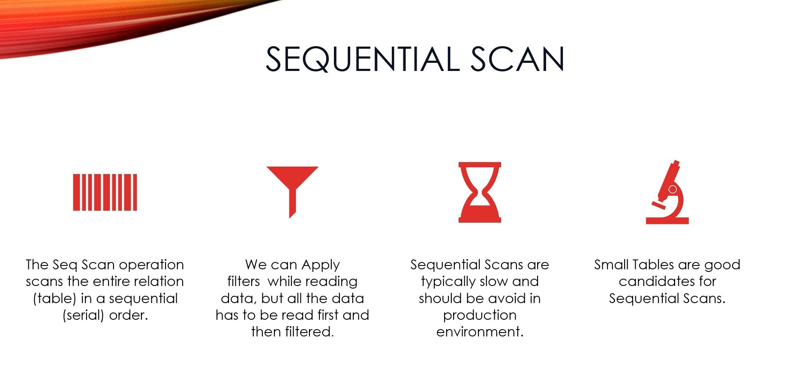

Example Statement:

Explain analyze select * from pgbench_tellers;

Or

Explain analyze select * from pgbench_tellers where bid=30;

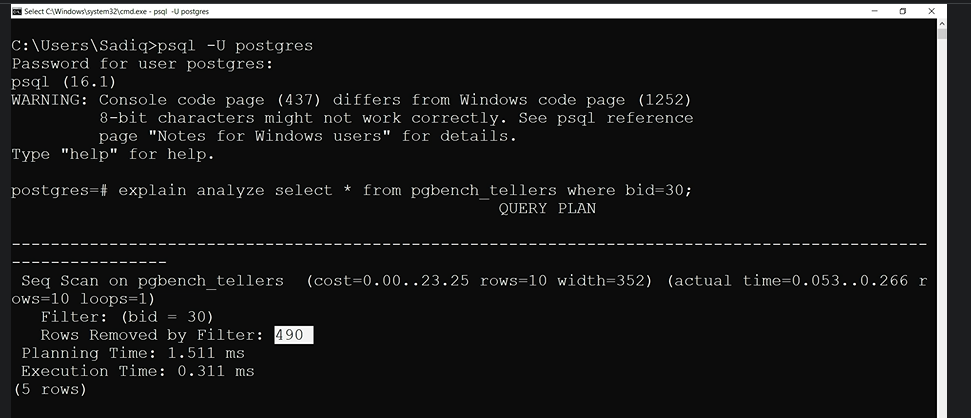

Table have 500 records. By seq scan it is reading all the data, but out of that I need only ten rows.

The remaining or waste they are removed by the filter. So, if you see a large amount of data removed by the filter, it means that your query is not efficient. And mab by it is time that you think about introducing an index in your bid column.

- - - 1. Index scans:

The index scan performs a B-tree traversal, walk through the leaf nodes to find all matching entries and fetches the corresponding table data. IT is like an index range scan followed by a table access by index rowed operation

The following are the characteristics of an index scan:

1. Random access is much slower than sequential I/O.
2. Requires additional I/O to access index.
3. Potentially reads the same block multiple times.
4. Produces ordered output.

Statement:

Explain analyze select * from pgbench_tellers where tid=204;

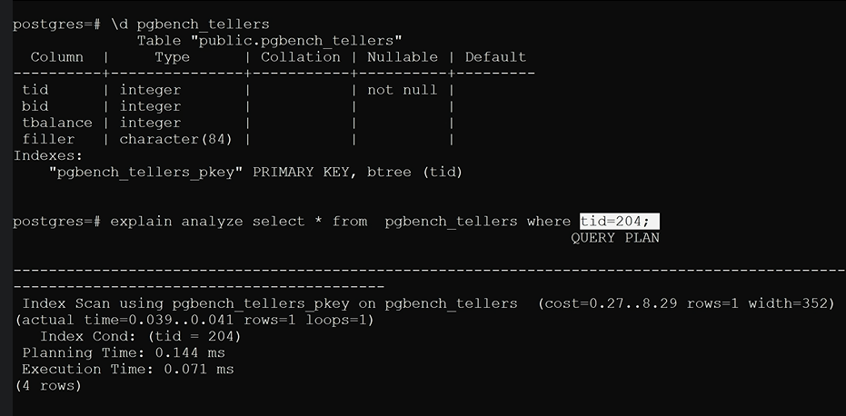  
So, index scan is very efficient if you are looking for a specific data or a small amount of data on a specific category. I want to add one point, it does hold some space. It does require some kind of maintenance. We have to be very careful when we create an index to many indexes will also hamper the performance. Because we need to think about insert update and delete.

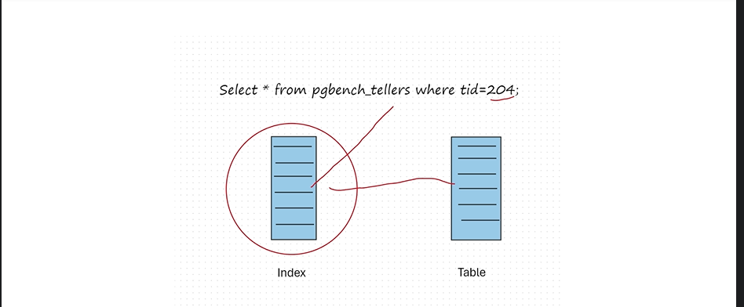

- - - 1. Bitmap index/heap scan:

A plan index scan fetches one tuple-pointer at a time from the index, and immediately visits that tuple in the table. A bitmap scan fetches all the tuple-pointers from the index in one go, sorts them using an in-memory "bitmap" data structure, and then visits the table tuples in physical tuple-location order.

The following are the characteristics of a bitmap index/heap scan:

1. Sequential I/O with index selectivity.
2. Slow to start up, as all index tuples are read and sorted.
3. Often select for IN and =ANY (array) operators, as well as low selectivity index scans.
4. Can combine multiple indexes.
5. Produces unordered output.

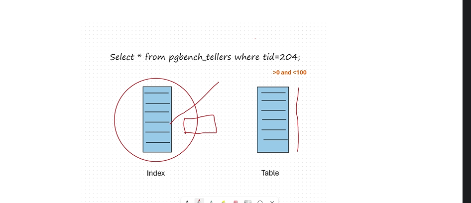

Explain analyze select * from pgbench_tellers where tid >0 and tid < 100;

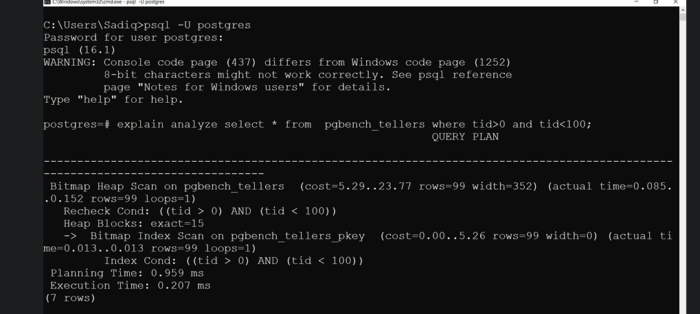

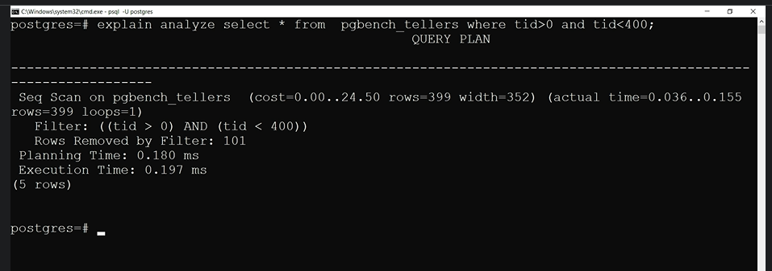

It will go directly for sequential scan because you are asking for 80% of the table data.

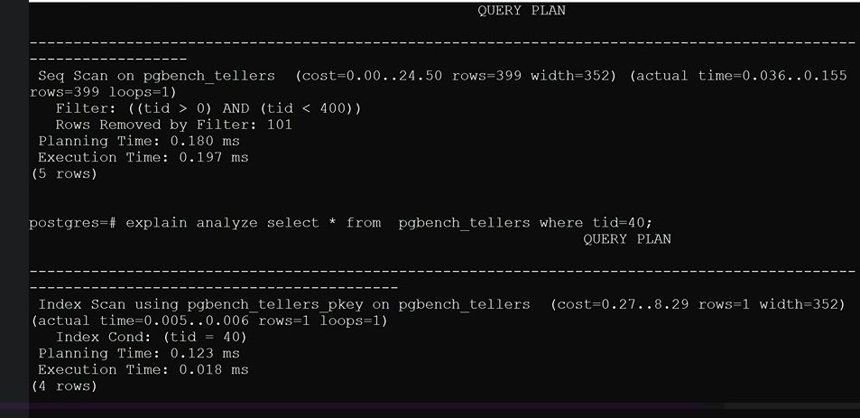

It is going for index scan due to condition or your request.

- - - 1. Index only

The index only scan performs a B-tree traversal and walks through the leaf nodes to find all matching entries. There is no table access needed because the index has all columns to satisfy the query.

**Statements:**

Explain analyze select count (*) from pgbench_tellers where tid< 300;

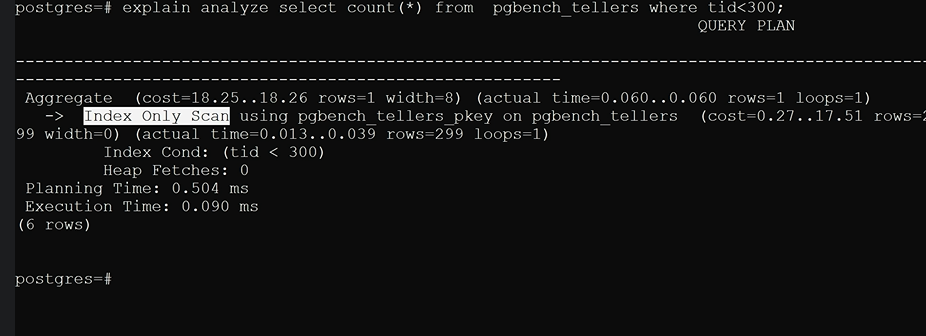

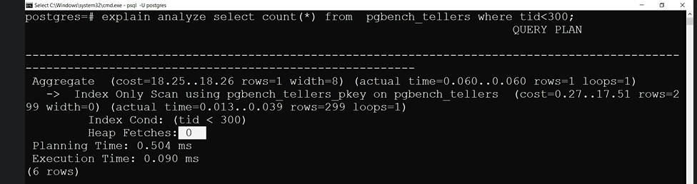

Heap fetches mean at the time of selecting record someone has changed the page(block). That pages come under the heap fetches.

**JOINS TEST CASE**

Sample Data:

create table emp (deptid int,empid int);

create table dept (deptid int, salary int);

insert into emp(deptid,empid)

select n,random()*1000

from generate_series(1,50000) n;

insert into dept(deptid,salary)

select n,random()*1000

from generate_series(1,20000) n;

**Nested Loop:**

nested loop: Joins two tables by fetching the result from one table and querying the other table for each row from the first.

- - The least performant form of join.
    - Fast to produce first record.
    - Negative performance possible if the second child is slow.
    - Only join capable of executing CROSS JOIN.
    - Only join capable of inequality join conditions.

Statement:

explain analyze select * from emp e, dept d where e.deptid < d.deptid;

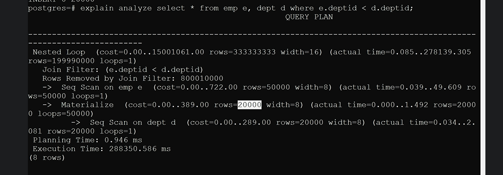

The query completed successfully and as expected it took some time.

Let us first try to understand what is nested loop in this execution query.

So, there are two important components.

- One is the outer table and another one is inner table.
- Node which you see with sequential scan on employee. This is the outer table.
- This table sequential scans on department D which is the inner table.

Let us go one by one to understand how it works.

- sequential scan on employee, which is a router table, is scanned by PostgreSQL.
- And for each row in this table, it is trying to scan the inner table for matching rows.
- So, 50,000 rows are being tried to match with 20,000 rows to see if there is any kind of matching rows, depending

There is a section of materialize in above image of explain. What is materialized node?

- Materialized node saves the data in the memory as it reads, and then return the data for each subsequent pass.
- Which means 20,000 rows which are scanned (materialized) in memory, so that when we are doing the check from outer table to inner table, these materialized results can be checked and it is faster that way.
- This is how you read the nested loop.

_Note: The performance of the loop purely depends on the number of rows which you are going to have in your outer table, okay, because that many number of times it has to scan your inner table for matching records._

Ques: Can we do any kind of performance tuning on this?

Answer: Well, yes, there is a possibility we can do some performance tuning, but not on the outer table because it has to scan each and every row, and that is the result set based on which we are matching in the inner set. The matching part or inner part can be tuned to get the records faster. How to do that? Well, what we can do is in the inner table we can create an index.

create index idx_dept1 on emp(deptid);

Now let's go ahead and execute this query again.

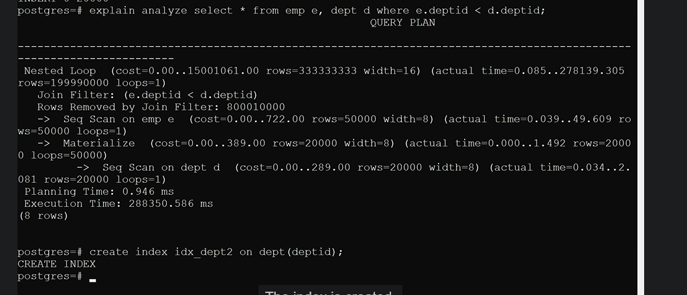

see the difference. Now it is literally four times faster than before. And you can see that index which was created here ID Department two is being used, went through an index scan. It still did 50,000 loops, which is supposed to do because there are 50,000 rows here.

Now if you see the number of rows removed by the joint filter is high, it is extremely high. So, in this case you can even consider having an index on your employee table also. create index idx_dept2 on dept(deptid);

**Hash Joins:**

hash joins: The hash join loads the candidate records from one side of the join into a hash table which is then probed for each record from the other side of the join.

- - Can only be used for equality join conditions.
    - The most performant for joining a large table against a small table.
    - Only for hash table data types.
    - Slow start due to hashing the smaller table.
    - Performance is negatively impacted if table stats out of date and incorrect.

Statement:

explain analyze select * from emp e, dept d where e.deptid = d.deptid;

Hash join loads the candidate record from one side of the join into a hash table, which is then probed (seek to uncover information about something) for each record from the other side of the join. So, what exactly does it mean?

Consider this as a two-step process.

- In the first step, a hash table is built using the inner relation record or your inner table.
- The hash key is calculated based on the join clause key.
- The second stage is where the outer table, record is hashed based on the join clause key to find all the matching entries in the hash table.

Let us see a small example.

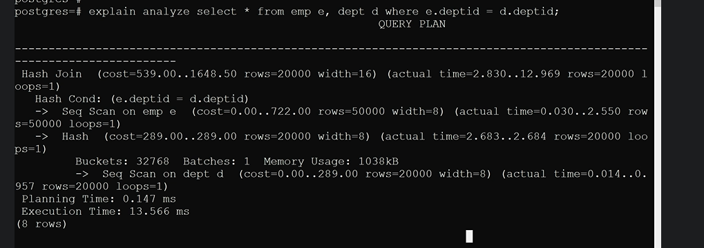

- The table employee and department will execute this query and you can see that it went for a hash join.
- As I said it is a two-stage process. Let us discuss the first stage.

In the first stage, the hash table has to be built.

- For this table there has to be some kind of an input which is your inner relation or your inner table. which is your department table. Now this will be acting as an input for your hash table.
- The hash join condition which is specified is d.department id. d dot department id will be used as a hash key in the hash table. When we are matching the table, this ID will be used as a hash key.
- Once all the rows are loaded in your hash table. The build phase or the first phase is completed, so 20,000 rows are loaded from this department table in the hash table.

Ques: Now how do we know this table is there in the memory?

Answer: You can see the memory usage here 1038 KB, and there is also called batch one.

We will discuss this later what is batch.

So, hash table in the memory is constructed with 20,000 rows.

The hash key is d dot department ID.

The next stage is your probe stage.

- In this stage you have your sequential scan of employee table which is your outer table.
- This table will act as an input for each individual row in employee table.
- The server will probe the hash table here for matching rows for comparing rows using E dot department ID as the lookup key.
- E dot department ID will be checked with d dot department ID and if there is a matching row, then that row is joined and result is returned
- So, you will see that there are 20,000 rows which are returned based on these criteria.

This is how your hash join works.

Ques: Is there anything we can do to speed up this query?

Answer: Well, the answer is yes. The first phase, as we said, the hash table gets built using the input department in this case right. Now here you see that this table gets constructed in the memory. And which memory is it? "Work_mem" If your work_mem is not adequately sized you see this batches here. This will increase. So, what is a batch?

If your query result or if your table inner table content is too big to fit in the available memory, the system will divide the data into small subset called batches. These batches are processed one by one. So, you see, if my work is not adequately sized, I will have many batches or many subsets of data being loaded in the hash table.

In this example, table is not big, so it was able to fit it in the work_mem.

There are two parameters which basically decides the amount of memory for the hash table.

The first one of course is work_mem (default: 4 mb)

And the second one, is hash Mem multiplier (whenever there is a hash table your work mem will be multiplied by two which is hash mem multiplier)

So, 4MB * 2 which is eight MB will be allocated for your hash table.

Now what I will do is I will go ahead and reduce the work_mem and see how the same query is going to react.

Because the table did fit in my hash table properly because my work mem was 4 MB.

If I reduce it then what happens?

Set work_mem=128kb;

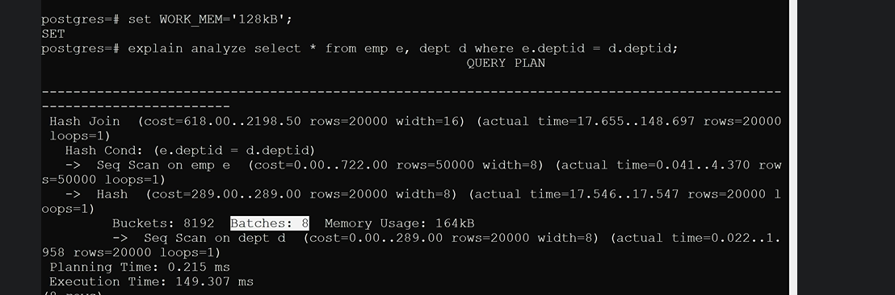

Now execute the same query and see what happens.

- You see that the memory usage is 164 KB. It has to do eight batches instead of one batch.
- It has to do eight batches because the work mem was not sized properly.
- And then see the execution time. It has increased considerably.
- So, this is one good performance tip which you can follow if you know the size of your table.

**merge join**:

The (sort) merge join combines two sorted lists like a zipper. Both sides of the join must be presorted.

- - Can only be used for equality join conditions.
    - Generally, the most performant for large data sets.
    - Requires ordered inputs - which can require slow sorts or index scans.
    - Slow to start up, as all index tuples are read and sorted.

The last join which we are going to discuss about is the merge join.

- It is a pretty straightforward and simple join.
- The only prerequisite is that both the sides of the joint should be pre-sorted. Which means it has to be either indexed or sorted.
- It is good for equality Join and it is the best join for large data set. So, if you have large data set this is one of the joins which you can go for.
- It is slow to start up because there are index tuples and it has to be read and sorted.

For this join I'm going to go ahead and create indexes on my department and employee table, which is important as the join has to be sorted.

Statement: (Create Indexes)

explain analyze select * from emp e, dept d where e.deptid = d.deptid;

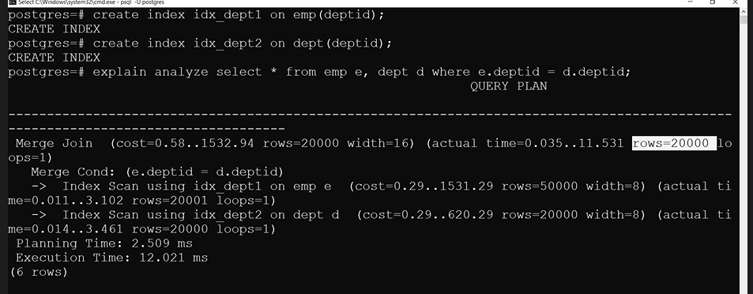

As you can see, it went for merge join right away. Simple reason is we have our index created.

Index one and index two. It went for index scan from both the tables. It took all the value because they are sorted and then checked for the condition here and gave me the results 20,000 rows right away. Also, the execution time is also pretty fast. This join is really good for large data sets. If you are using it, kindly try to go for this join.

There is another concept which I want to, you know.

- Now assume there are times when we think that the optimizer might have gone for a wrong join.
- And in that scenario, we want to see whether, we can change the join or we want to see how much time it takes if I go for another join.
- In that case, what you can do is you can enforce, or you can tell the planner that I don't want you to go for this join, but want to try out some other join
- In this case, it is going for a merge join which I don't want it to go for
- Set Merge join to off.

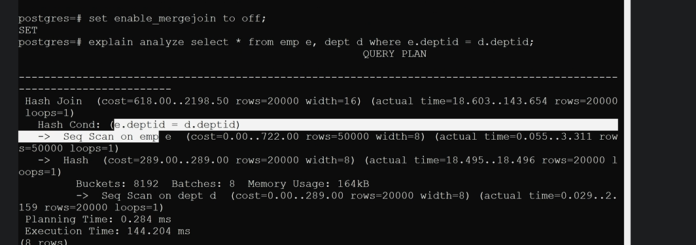

- Now here I am telling the planner that I don't want the merge join, so I'm turning it off.
- Now let me run the same query again and see what happens.
- Now you see it didn't go for merge join. It went for a hash join and it did sequential scan on both the tables even though you had indexes on this.
- It went for sequential scan because I explicitly mentioned no merge join.
- See the execution time. This is why the planner ignored the hash join before.
- Also, there might be a condition where assume there is a join where I see that hash join is happening, but I don't want hash join. In that case, I can turn off hash join.

Note: Do all these joins off at session level.

**Aggregate functions in Explain**

Let's discuss about few aggregate functions which you may see in the execution plan below.

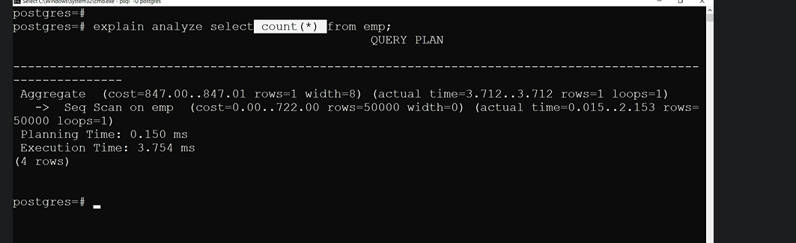

- We can see aggregate here. which is your count star.
- Whenever you do a function like count star or sum or min or max, you will see this aggregate.
- It scans the entire table and then it aggregates the result with one row and will give you the total or count or anything you have requested.

Let's limit the record to ten. I don't want all the 50,000 records. I just want ten records.

So, in that case, it will read the entire table.

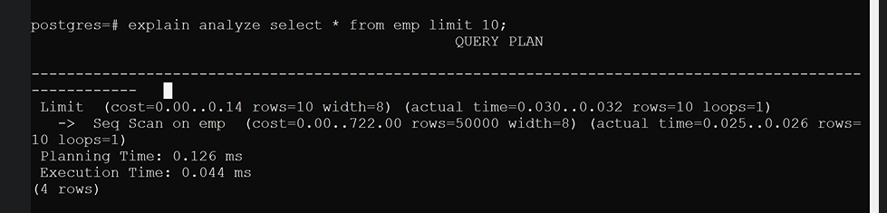

It will go through the entire table, but it will show you only the top ten records.

It will not give you the other records.

It will just discard them.

**Sort/order by in Explain**

You also have Sort order by and all those other clauses, which also will be displayed here.

**INDEX OPTIMIZATION**

In this section we will discuss about the following:

- Types of indexes
- The common mistakes which we do while we create an index
- Special indexes and some queries which can help us in monitoring indexes

**Types of Indexes**

- B-tree Index: Default- &lt;, <=, =,&gt;=,>, Like,Order BY.
- Hash Index: Only for equality checks.
- GIN (Generalized Inverted Index): JSONB, Array, Range types and full-text search.
- GiST (Generalized Search Tree): Geometric data and Network address data.
- SP-GiST (Space Partitioned GIST): Geometries and heterogeneous distributions.
- BRIN (Block Range Index): Minimum value and maximum value.

Here's an explanation of the index types mentioned above:

1. **B-tree Index**:
   - This is the most commonly used index type in databases. It supports a wide range of operations, including comparisons like &lt;, <=, =, &gt;=, >, and is efficient for queries involving sorting (e.g., ORDER BY) and pattern matching using LIKE when the pattern does not start with a wildcard. It is a balanced tree structure that keeps the data sorted and allows searches, sequential access, insertions, and deletions in logarithmic time.
   - Whenever we create an index in PostgreSQL, the default type of index which gets created is your B-tree index or balanced tree index.
   - This is a most popular and commonly used index. The reason being that it supports most of the operators in PostgreSQL.
   - For example, if you have equal to greater than, greater than, equal to lesser than. Those kinds of operators are supported with B-tree index. Then you have your search criteria's where you have order by, like, between, so those kinds of criteria are also supported by your B-tree indexes.
   - It's like an all-rounder amongst the indexes.
   - You may be wondering that then what is the need of other type of indexes if B-tree can do all the job? Well, there are some special data types where your B-tree index will not be efficient which will take us to our next index hash index.
   - **_Syntax:_**

CREATE INDEX idx_tree1 on table(column_name);

1. **Hash Index**:
   - This type of index is optimized for equality comparisons (e.g., =). It is not suitable for range queries because it uses a hashing function to map keys to specific locations in the index. It's efficient for simple lookups but does not support ordering or range-based searches.
   - Hash index is designed especially for your equality operator.
   - B-tree can also be used, but the difference is hash indexes are smaller in size compared to your B-tree index
   - They are specially designed for equality operator, which means they are much more efficient in comparison with your B-tree indexes.
   - If you are using only equality operator in your query, it is advisable to go for a hash index rather than a B-tree index.
   - There is one limitation with hash index is that if you are using any other operator, then your hash index will not be considered by the planner. It will be completely ignored.
   - It is only used for equality operator not for anything else.
   - **_Syntax:_**

CREATE INDEX idx_hash1 on table using HASH(column_name);

1. **GIN (Generalized Inverted Index)**:
   - GIN indexes are used for indexing composite data types, such as JSONB, arrays, and ranges. They are also effective for full-text search because they create an inverted index mapping the content of the data structure to the rows containing that content. This allows for fast searches when looking for specific elements within these types.
   - Your B-tree index will not be able to understand or comprehend this data types.
   - CREATE INDEX IDX_GIN on table USING gin(column_name gin_trgm_ops);
2. **GiST (Generalized Search Tree)**:
   - GiST indexes are highly flexible and can be used for a variety of data types. They are often used for geometric data (e.g., spatial queries) and network address data. This index type provides a structure that can be customized to different kinds of data and query types, making it suitable for operations beyond simple comparisons.
   - **_Syntax:_**

create index on table using gist(column_name);

1. **SP-GiST (Space-Partitioned Generalized Search Tree)**:
   - SP-GiST is extension of GiST. SP-GiST indexes are designed to support data that is partitioned in a space-efficient manner. They are used for geometries and data with heterogeneous distributions. They allow efficient searching and indexing in cases where data is unevenly distributed, optimizing searches based on spatial partitions.
   - **_Syntax:_**

create index on table using spgist(column_name);

1. **BRIN (Block Range Index)**:
   - BRIN indexes are lightweight and are typically used for columns with natural ordering (e.g., timestamps or sequentially increasing/decreasing values). Instead of indexing each row, they index a range of blocks that have a minimum and maximum value. This makes them ideal for large datasets with sequential data, as they provide fast access with minimal storage cost.
   - **_Syntax:_**

create index idx_brin1 on table USING BRIN(column_name);

**Common Mistakes When Using Indexes in PostgreSQL:**

1. Creating Indexes on Every Column: Indexes are not free. They consume additional disk space and add overhead to write operations. When a new row is inserted or an existing one is updated, all indexes on the affected columns must be updated. This can lead to increased transaction times and reduced throughput. It's crucial to analyze the query patterns and create indexes only on columns that are frequently used in WHERE clauses, JOIN conditions, or ORDER BY statements.
2. Not Considering the Selectivity of Columns: The selectivity of a column refers to the proportion of unique values it contains. High selectivity means more unique values, making the index more effective in narrowing down search results. Conversely, indexing columns with low selectivity, such as those with many repeated values, will not be as beneficial. For instance, indexing a column that stores gender, which typically has very few unique values, is unlikely to improve performance and is a waste of resources.
3. Using the Wrong Index Type: PostgreSQL provides several index types, each optimized for different data patterns and query types. The default B-tree index is suitable for general purposes, but for specific use cases, other types like Hash, GiST, SP-GiST, GIN, or BRIN may be more appropriate. For example, GIN indexes are ideal for indexing array data and full-text search, while BRIN indexes are efficient for large tables with naturally ordered data. Using the wrong index type can lead to suboptimal performance and increased storage requirements.
4. Ignoring the Cost of Index Maintenance: Indexes need to be maintained as data changes. This maintenance has a cost, particularly in write-heavy databases where the write amplification due to indexes can be significant. Frequent updates and deletions can lead to index bloat, where the index takes up more space than necessary, and can degrade performance. Regular maintenance tasks like VACUUM and REINDEX can mitigate some of these issues, but the cost-benefit ratio of each index should always be considered.
5. Overlooking the Importance of Statistics: PostgreSQL uses statistics to determine the most efficient way to execute a query. These statistics, collected by the ANALYZE command, provide information about the distribution of data within a table. If the statistics are not up-to-date, PostgreSQL might choose a less-than-ideal execution plan. For example, it might use a sequential scan instead of an index scan if it underestimates the number of rows returned by a query. Regularly updating statistics ensures that the query planner has accurate information to work with.

**Indexes on Expressions:**

index is defined on the result of a function applied to one or more columns of a single table. This feature is useful to obtain fast access to tables based on the results of computations.

explain analyze select * from cust where firstname='jose';

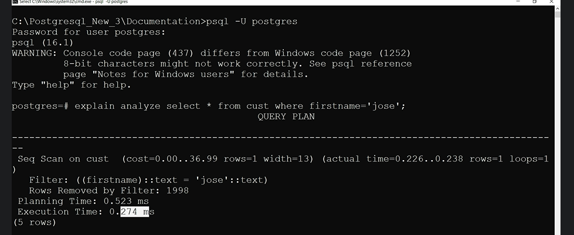

explain analyze select * from cust where lower(firstname)='jose';

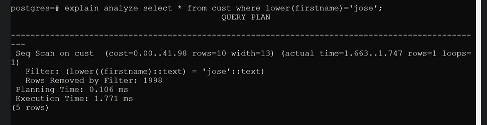

postgres=# create index test1_lower_col1_idx ON cust(lower(firstname));

postgres=# explain analyze select * from cust where lower(firstname)='jose';

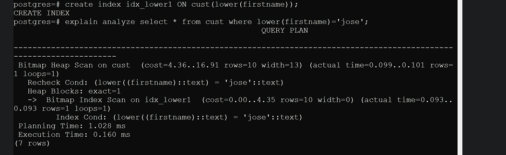

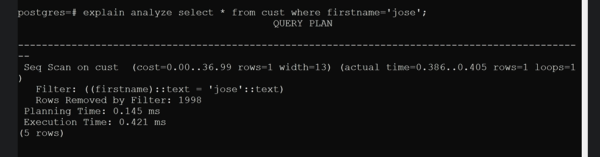

**Considerations:**

1. Index expressions are relatively expensive to maintain, because derived expression(s) must be computed for each row insertion and [non-HOT update.](https://www.postgresql.org/docs/16/storage-hot.html)
2. index expressions are not recomputed during an indexed search since they are already stored in the index.
3. indexes on expressions are useful when retrieval speed is more important than insertion and update speed.

_Note: Now in the above example they are not different types of indexes but indexes created in some different contexts._

**_Partial Indexes:_**

A partial index is an index built over a subset of a table; the subset is defined by a conditional expression (called the predicate of the partial index). This selective indexing strategy is particularly useful for queries that target a specific subset of data, offering a more efficient alternative to full-table indexes.

Understanding Partial Index

- This index is built over a subset of a table. The subset is defined by a conditional expression. What does it mean?
- Assume I have a table and a column, and I am trying to create an index on a column.
- The table has 1 million records, but the query which I am going to run, I just want a thousand records.
- I know that my query will fetch only 1000 records, but the problem is if I create an index, it will create it for the entire 1 million record to avoid that.
- To enhance that feature, there is something called as a partial index, which will create index only for those thousand records.
- So, this way your index size will also reduce. The index creation time will be less. The index rebuild or maintenance will be less and your queries will be faster.

Example:

create table orders (custid int,billed boolean not null,amount int);

explain analyze SELECT * FROM orders WHERE billed is not TRUE AND amount < 75000;

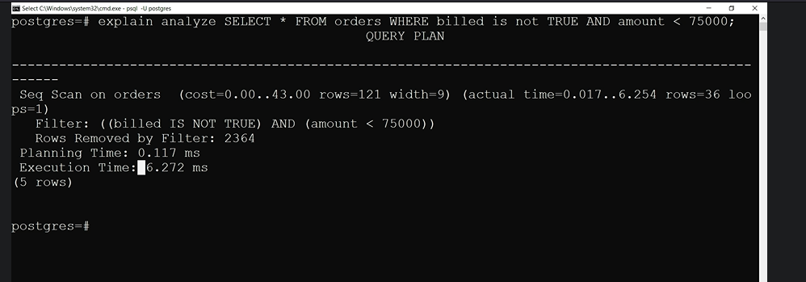

CREATE INDEX orders_unbilled_index ON orders (amount) WHERE billed is not true;

explain analyze SELECT * FROM orders WHERE billed is not TRUE AND amount < 75000;

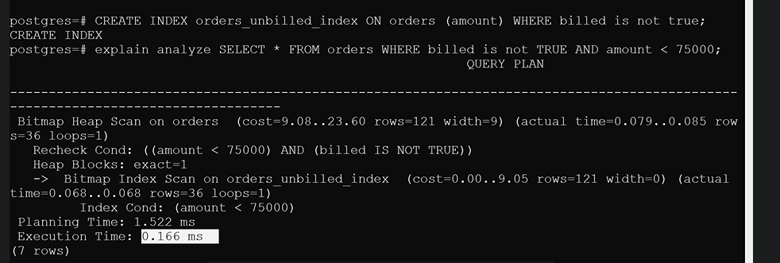

Check the index size

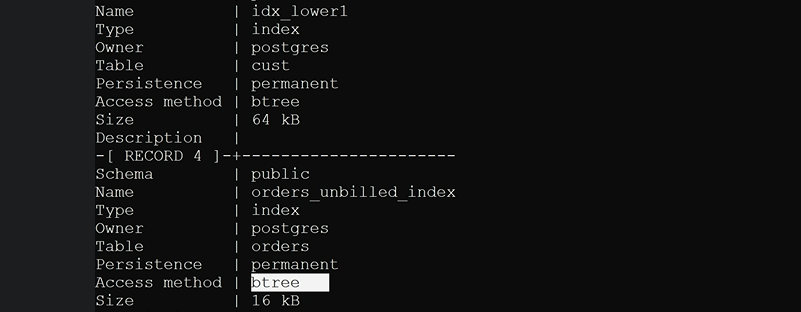

explain analyze SELECT * FROM orders WHERE billed is not TRUE AND custid>100;

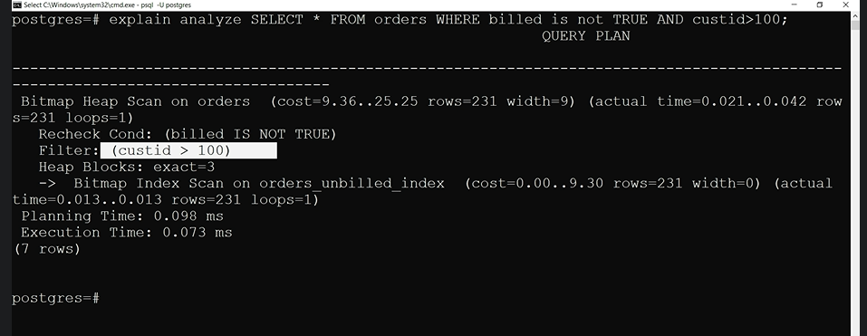

explain analyze SELECT * FROM orders WHERE amount < 75000;

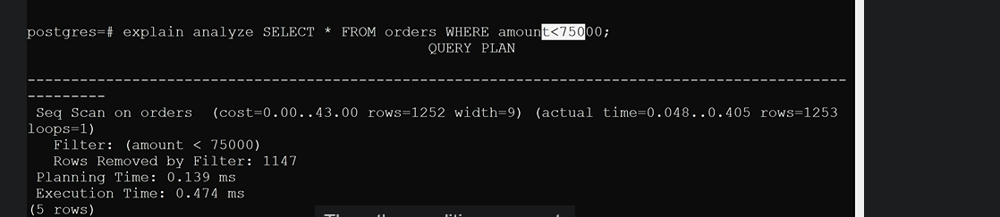

**_Considerations:_**

1. Reduced Index Size: Partial indexes index fewer rows, resulting in a smaller index size and less disk space usage.
2. Faster Index Maintenance: Smaller indexes require less time to update when data changes, leading to better overall performance.
3. Use Partial Indexes for Frequent Conditions: Identify common query conditions and create partial indexes to support them.

**_Multi-Column Indexes:_**

Multi-column indexes, also known as composite indexes, are created on two or more columns of a table. They are effective when queries involve conditions on multiple columns, allowing the database engine to quickly filter and sort data based on the combined index keys. Currently, only the B-tree, GiST, GIN, and BRIN index types support multiple-key-column indexes.

- We are going to discuss about another important special index called multi-column index or composite index.
- This index is created on two or more columns of a table.
- So, assume I have a query with a Where clause and there are three columns which I am interested in. Ideally, what I will do is I will create three separate indexes for this column, which I am going to use in the Where clause in multi-column indexes.
- Instead of creating three separate indexes, I can create one index and specify all the three columns in that index.
- The advantages

you are saving on the space because you don't need to create three separate indexes.

you are going to also save on your execution time because your planner doesn't have to . go through three different indexes and get the data.

it will go to just one index, and that index will hold all the keys. The index keys of the . combined three columns.

- The limitation.

This multi column indexes are not available in all index types.

Only B-tree, gen and brin type of indexes support multi-column indexes.

Example:

create table staff(firstname varchar,lastname varchar,salary int,email varchar);

explain analyze select * from staff where firstname='kasey' and salary=20880;

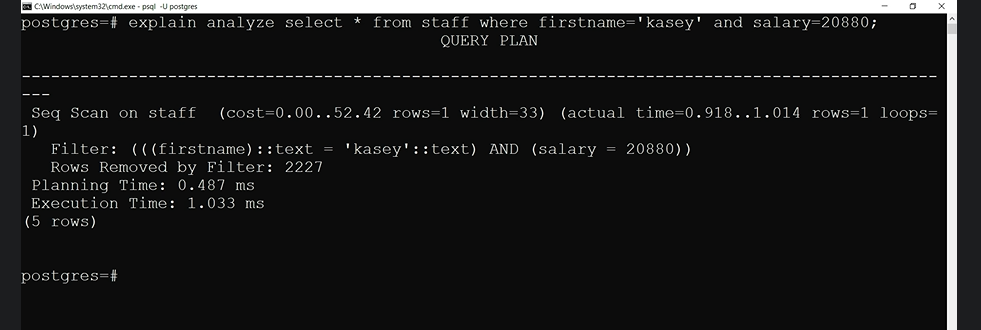

create index idx_staff1 on staff(firstname,salary);

explain analyze select * from staff where firstname='kasey' and salary=20880;

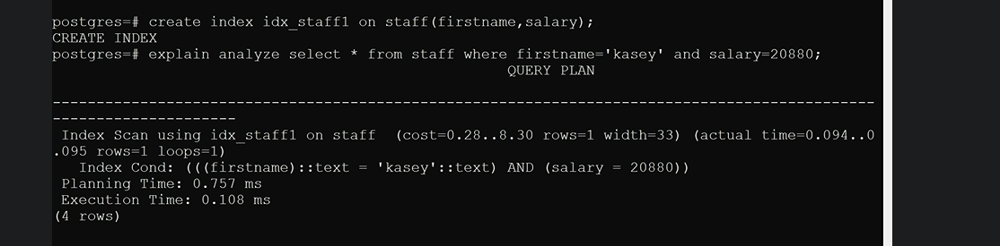

explain analyze select * from staff where firstname='kasey' and salary=20880 AND email='<alonso@gmail.com>';

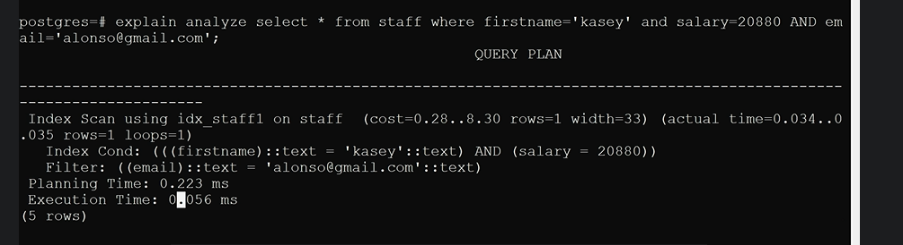

explain analyze select * from staff where salary=20880;

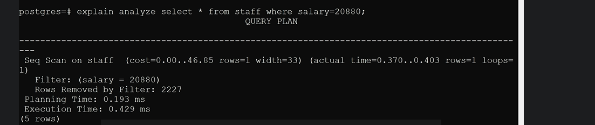

explain analyze select * from staff where salary=20880 and firstname='kasey';

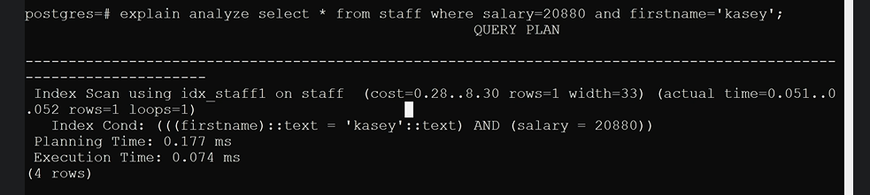

**_Considerations:_**

- Improved Query Speed: Multi-column indexes can eliminate the need for separate single-column index lookups, speeding up query execution.
- Combine Frequently Used Columns: When multiple columns are often used together in queries, consider creating a multi-column index.
- Balance Index Benefits and Costs: While indexes can speed up queries, they also require maintenance. m judiciously to avoid unnecessary overhead.
- When constructing a multi-column index, the sequence in which columns are arranged plays a pivotal role. The database engine prioritizes the leading (leftmost) columns when executing filters.
- Limit the number of columns in a multi-column index to prevent performance degradation due to increased index size.
- For tables with extensive rows, contemplate creating several multi-column indexes on varying column subsets.
- Continuously evaluate index performance and reconstruct them as needed.

**_Null Value Considerations for B-Tree:_**

B-tree indexes are structured to store data in a sorted manner and NULL values are considered to be less than any other value, resulting in their placement at the start of the index. The presence of NULL values at the beginning of a B-tree index can introduce inefficiencies, particularly when queries predominantly target non-NULL entries.

Example:

CREATE INDEX test2_info_nulls_low ON test2 (info NULLS FIRST);

CREATE INDEX test3_desc_index ON test3 (id DESC NULLS LAST);

**_Considerations:_**

- Index Type Selection: opt for index types that manage NULL values more effectively. For example, hash indexes or GiST indexes might be preferable over B-tree indexes for columns with numerous NULL values.
- Column Order in Multi-Column Indexes: In multi-column indexes, position columns likely to contain NULL values towards the end. This arrangement reduces the performance impact since the index can leverage the non-NULL columns more efficiently.
- Partial Indexes: Create partial indexes that exclude NULL values altogether. This can be particularly useful when queries frequently exclude NULL values.
- Default Values: If applicable, consider setting a default value for columns instead of allowing NULL, ensuring all rows contribute to the index's order.

**_Covering Index:_**

&nbsp;An index specifically designed to include the columns needed by a particular type of query that you run frequently. Since queries typically need to retrieve more columns than just the ones they search on, PostgreSQL allows you to create an index in which some columns are just "payload" and are not part of the search key. This is done by adding an INCLUDE clause listing the extra columns.

Example:

explain analyze select bid,tid,tbalance from pgbench_tellers where bid=24;

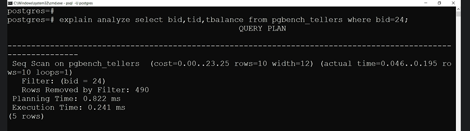

create index idx_test1 on pgbench_tellers(bid);

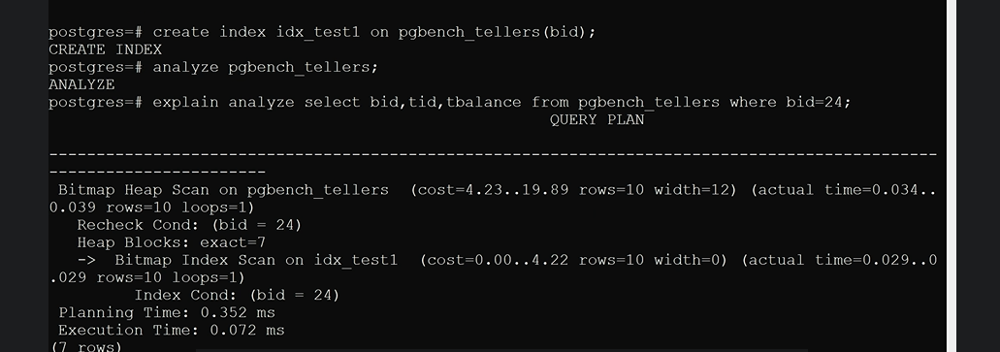

create index idx_test1 on pgbench_tellers(bid) INCLUDE(tid,tbalance);

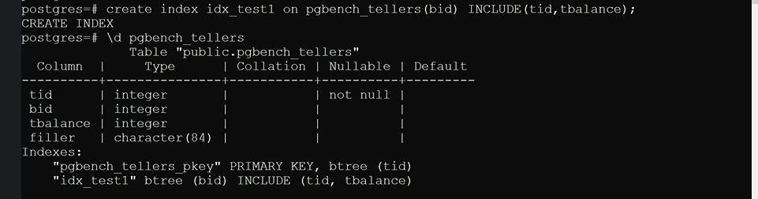

ANALYZE TABLE PGBENCH_TELLERS;

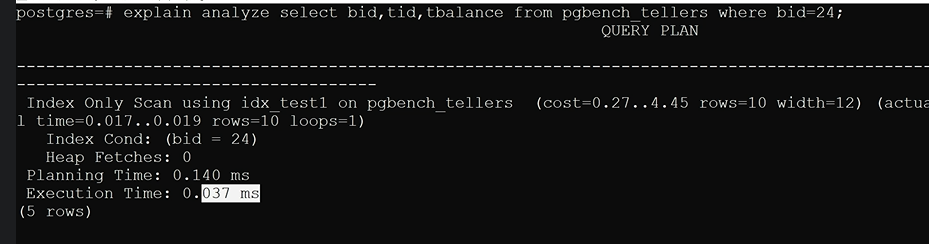

**_Considerations:_**

1. INCLUDE clause can also be written in UNIQUE and PRIMARY KEY constraints the uniqueness condition applies to just the main column (bid) and not to (tid,balance).
2. Planner could handle these queries as index-only scans, because tid,balance can be obtained from the index without visiting the heap.
3. only B-tree, GiST and SP-GiST indexes currently support included columns.

**Useful Queries to check Indexes and its Utilization**

**List all Indexes in public schema:**

SELECT

tablename as "TableName",

indexname as "Index Name",

indexdef as "Index script"

FROM

pg_indexes

WHERE

schemaname = 'public'

ORDER BY

tablename,

indexname;

**List all the indexes in a table and whether it is Primary or Unique key:**

select

c.relnamespace::regnamespace as schema_name,

c.relname as table_name,

i.indexrelid::regclass as index_name,

i.indisprimary as is_pk,

i.indisunique as is_unique

from pg_index i

join pg_class c on c.oid = i.indrelid

where c.relname = 'pgbench_tellers';

**Unused Indexes:**

select * from pg_stat_all_indexes where idx_scan = 0 and schemaname='public';

or

SELECT

relname AS table_name,

indexrelname AS index_name,

pg_size_pretty(pg_relation_size(indexrelid)) AS index_size,

idx_scan AS index_scan_count

FROM

pg_stat_user_indexes

WHERE

idx_scan < 100

ORDER BY

index_scan_count ASC,

pg_relation_size(indexrelid) DESC;

**Does table need an Index:**

SELECT relname, seq_scan-idx_scan AS too_much_seq, CASE WHEN seq_scan-idx_scan>

THEN 'Missing/Ineff Index'

ELSE 'OK' END,

pg_relation_size(relname::regclass) AS rel_size, seq_scan, idx_scan FROM pg_stat_all_tables WHERE schemaname='public' AND pg_relation_size(relname::regclass)>80000 ORDER BY too_much_seq DESC;

**How many indexes are in cache:**

SELECT sum(idx_blks_read) as idx_read, sum(idx_blks_hit) as idx_hit FROM pg_statio_user_indexes;

**Index % usage:**

SELECT relname, 100 * idx_scan / (seq_scan + idx_scan) percent_of_times_index_used, n_live_tup rows_in_table FROM pg_stat_user_tables WHERE (seq_scan + idx_scan) > 0 ORDER BY n_live_tup DESC;

**Duplicate Indexes:**

SELECT ni.nspname || '.' || ct.relname AS "table",

ci.relname AS "dup index",

pg_get_indexdef(i.indexrelid) AS "dup index definition",

i.indkey AS "dup index attributes",

cii.relname AS "encompassing index",

pg_get_indexdef(ii.indexrelid) AS "encompassing index definition",

ii.indkey AS "enc index attributes"

FROM pg_index i

JOIN pg_class ct ON i.indrelid=ct.oid

JOIN pg_class ci ON i.indexrelid=ci.oid

JOIN pg_namespace ni ON ci.relnamespace=ni.oid

JOIN pg_index ii ON ii.indrelid=i.indrelid AND

ii.indexrelid != i.indexrelid AND

(array_to_string(ii.indkey, ' ') || ' ') like (array_to_string(i.indkey, ' ') || ' %') AND

(array_to_string(ii.indcollation, ' ') || ' ') like (array_to_string(i.indcollation, ' ') || ' %') AND

(array_to_string(ii.indclass, ' ') || ' ') like (array_to_string(i.indclass, ' ') || ' %') AND

(array_to_string(ii.indoption, ' ') || ' ') like (array_to_string(i.indoption, ' ') || ' %') AND

NOT (ii.indkey::integer\[\] @> ARRAY\[0\]) AND -- Remove if you want expression indexes (you probably don't)

NOT (i.indkey::integer\[\] @> ARRAY\[0\]) AND -- Remove if you want expression indexes (you probably don't)

i.indpred IS NULL AND -- Remove if you want indexes with predicates

ii.indpred IS NULL AND -- Remove if you want indexes with predicates

CASE WHEN i.indisunique THEN ii.indisunique AND

array_to_string(ii.indkey, ' ') = array_to_string(i.indkey, ' ') ELSE true END

JOIN pg_class ctii ON ii.indrelid=ctii.oid

JOIN pg_class cii ON ii.indexrelid=cii.oid

WHERE ct.relname NOT LIKE 'pg_%' AND

NOT i.indisprimary

ORDER BY 1, 2, 3;

**Useful Functions to Find size of Objects:**

pg_size_pretty() function to format the size.

pg_relation_size() function to get the size of a table.

pg_total_relation_size() function to get the total size of a table.

pg_database_size() function to get the size of a database.

pg_indexes_size() function to get the size of an index.

pg_total_index_size() function to get the size of all indexes on a table.

pg_tablespace_size() function to get the size of a tablespace.

pg_column_size() function to obtain the size of a column of a specific type.

**DATABASE STATISTICS**

- PostgreSQL Optimizer and Planner use table statistics for generating optimal query plans.
- Statistics generally provide information about the most common values in each column in a relation, average width of the column, number of distinct values in the column, etc.
- Statistics are collected when we run ANALYZE or when analyze is triggered by auto vacuum and are stored in the pg_statistic system catalog (whose public readable view is pg_stats).
- The amount of samples considered by ANALYZE depends on the default_statistics_target parameter.

**Types of Statistics**

- Data distribution statistics
- Extended statistics

**Extended Statistics**

- ANALYZE commands gathers and stores statistics on a per-column per-table basis, and therefore can't capture any information about cross-column correlation.
- It Ideally treats each column individually and does not address dependencies between columns.
- Multiple corelated columns used in a query often results in bad execution plans.
- CREATE STATISTICS command can be used to create extended statistics for correlated columns.

**Controlling Statistics Collection**

- Postgres gathers and maintains table and column level statistics.
- Statistics collection level can be controlled using:

\# ALTER TABLE &lt;table&gt; ALTER COLUMN &lt;column&gt; SET STATISTICS &lt;number&gt;;

- The &lt;number&gt; can be set between 1 and 10000 (Default is 100).
- A higher &lt;number&gt; will signal the server to gather and update more statistics but may have slow auto vacuum and analyze operation on stat tables.
- Higher numbers only useful for tables with large irregular data distribution

**Extended Statistics (Example)**

1. CREATE TABLE data_stats(a int, b int);

1) INSERT INTO data_stats SELECT x/100, x/1000 FROM generate_series(1,1000000) g(x);

2) ANALYZE VERBOSE data_stats;

3) set max_parallel_workers_per_gather =0;

4) Explain analyze select * from data_stats where a=1;

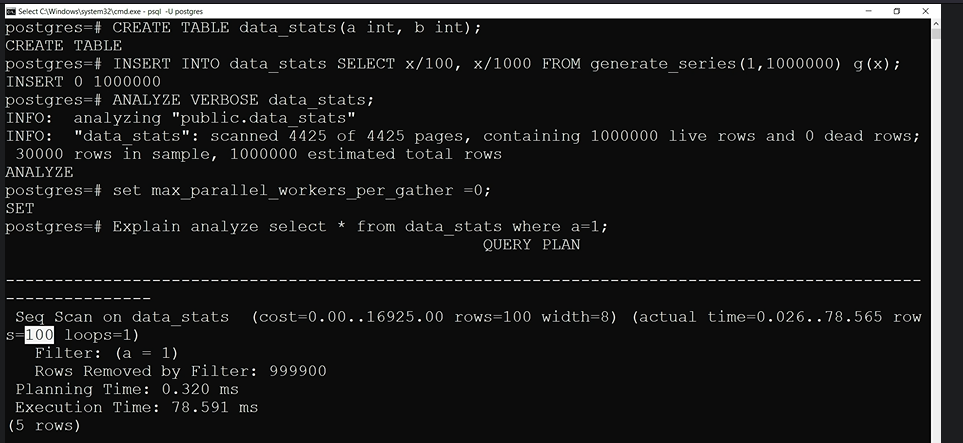

1. Explain analyze select * from data_stats where a=1 and b=0;

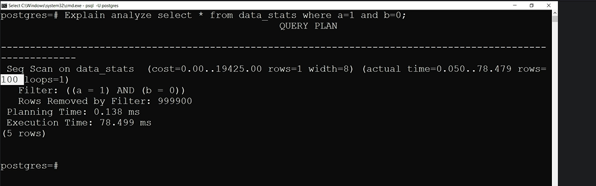

1. Create statistics data_stats_ext(dependencies) on a,b from data_stats;

2. Analyze VERBOSE data_stats;

3. Explain analyze select * from data_stats where a=1 and b=0;

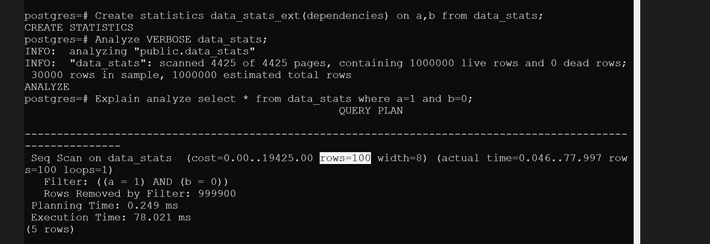

**Query Tuning (Scenario Examples)**

**Example 1:** (Joins Instead of IN).

Explain analyze select * from emp where deptid IN (SELECT deptid from dept where salary>800);

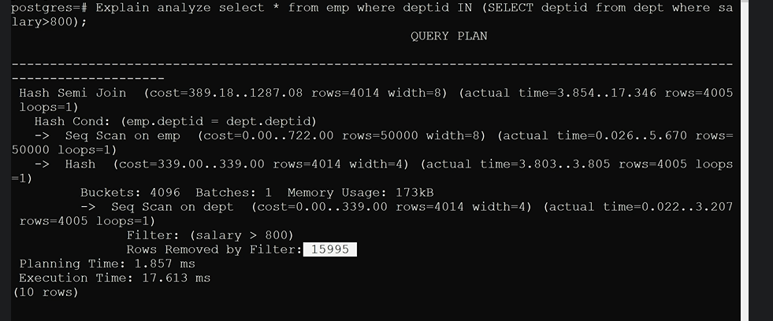

Query Rewrite:

explain analyze select emp.* from emp JOIN dept on emp.deptid=dept.deptid where dept.salary>800;

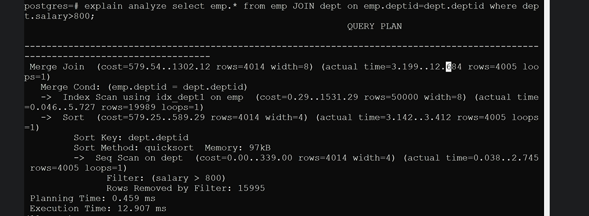

**Example 2**: (Aggregate and Join)

CREATE TABLE bill (id int, status varchar);

INSERT INTO bill VALUES (1, 'billed'), (2, 'non-billed');

CREATE TABLE order_item (orderid serial,order_status int);

INSERT INTO order_item (order_status)

SELECT x % 2 + 1 FROM generate_series(1, 1000000) AS x;

Explain analyze SELECT status,count(*)

FROM bill AS a, order_item AS b

WHERE a.id = b.order_status

GROUP BY 1;

Rewrite:

explain analyze WITH x AS

(

SELECT order_status,count(*) AS res

FROM order_item AS a

GROUP BY 1

)

SELECT status,res

FROM x, bill AS y

WHERE x.order_status = y.id;

**Example 3:** (Select specific column instead of all columns)

Explain analyze select * from pg_Stats;

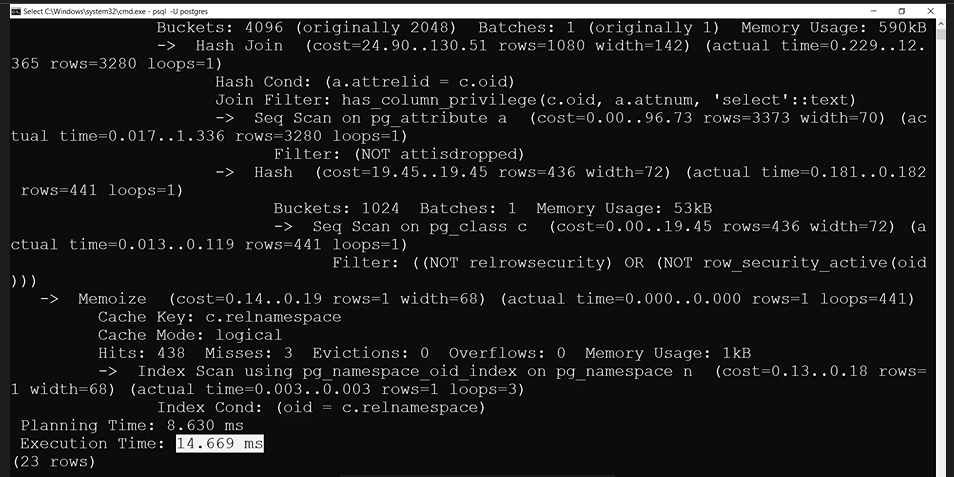

Query Rewrite:

Explain analyze select schemaname,tablename,attname from pg_stats;

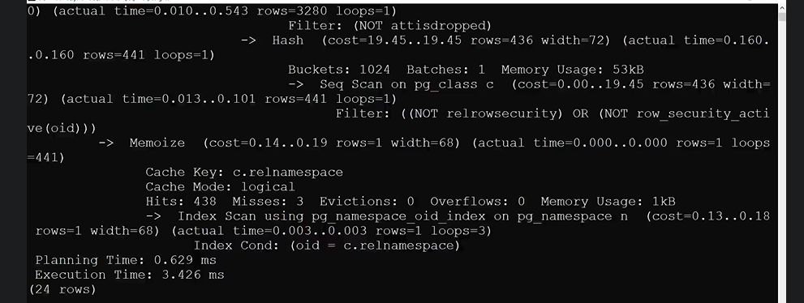

**Example 4:** (Create index on Order by clause to avoid sorting every time)

Explain analyze select * from emp order by empid;

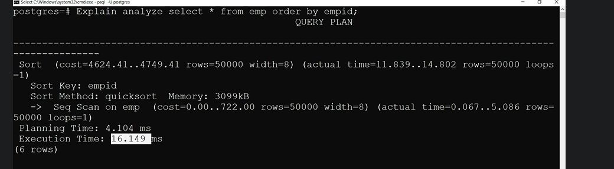

Create index idx_emp1 on emp(empid);

Explain analyze select * from emp order by empid;

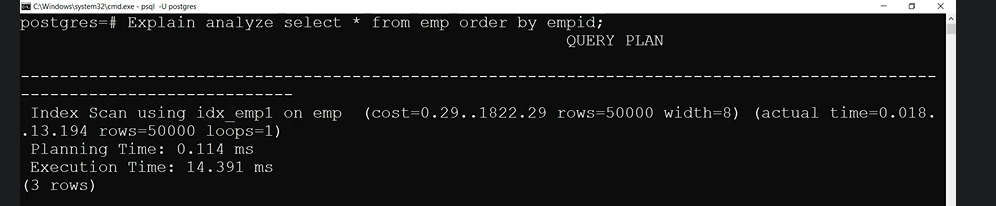

**Example 5:** (Wildcards at the end)

SELECT City FROM Customers WHERE City LIKE '%Char%'

Results:

Charleston, Charleston, Charlton, Cape Charles, Crab Orchard, and Richardson.

Query Rewrite:

SELECT City FROM Customers WHERE City LIKE 'Char%'

Results:

Charleston, Charlotte, and Charlton.

**Example 6:** Limit the rows

There is one more example which I want to specify.

This is also a generic example like assume I have a select * from employee.

I want to know what are the columns in this table, and what kind of data is there in this table?

If I execute this query, it's going to pull all the records.

There are 50,000 records.

It's going to try to pull all the records which once again is causing a disk IO.

It will be good optimization technique to only fetch 5 or 10 records or records as per your requirement only without fetching all records.

**ERROR REPORTING AND LOGGING**

**Where to Log:**

- Logging_collector: This parameter enables the logging collector, which is a background process that captures log messages sent to stderr and redirects them into log files.
- log_directory: When logging_collector is enabled, this parameter determines the directory in which log files will be created. It can be specified as an absolute path, or relative to the cluster data directory.
- log_filename: When logging_collector is enabled, this parameter sets the file names of the created log files.

%H - Hours of the day.

%a is the day of the week

%w is the week of the month

%d day of the month

Examples:

1. %H - Hours - log_filename = 'postgresql-%H.log', set log_rotation_age = 60
2. For backup period of one week, use %a-%w: log_filename = 'postgresql-%a.log', and set log_rotation_age = 1440. one log file per day named server_log.Mon, server_log.Tue, etc., and automatically overwrite last week's log with this week's log, set log_filename to server_log.%a, log_truncate_on_rotation to on.
3. For backup period of one month, use %d: log_filename = 'postgresql-%d.log', and set log_rotation_age = 1440.

**When to Log:**

log_min_duration_statement: Causes the duration of each completed statement to be logged if the statement ran for at least the specified amount of time.

**What to Log:**

- log_statement  
  This is the degree of logging you're using. The level of detail you want in your logs is commonly referred to as log levels. There are several options for log_statement, including ddl (which solely records database structure changes), mod (which records changes to existing data), and all (logs everything).
- log_checkpoints  
  Checkpoints in PostgreSQL are periodic activities that store data about your system, as we described in the configuration settings. Excessive use of log checkpoints can result in performance degradation. If you suspect this is the case, enable log checkpoints to get detailed information about the checkpoints, including how often they run and what might be triggering them.
- log_connection  
  You might also be interested in knowing about links. Something could be wrong if you just have one application connected to your database, but you notice a lot of concurrent connections. Too many connections flooding your database can cause requests to fail to reach the database, causing problems for your application's end users.
- log_autovacuum_min_duration

Causes each action executed by auto vacuum to be logged if it ran for at least the specified amount of time. The default is 10min. For example, if you set this to 250ms then all automatic vacuums and analyzes that run 250ms or longer will be logged. Message will be logged if an auto vacuum action is skipped due to a conflicting lock or a concurrently dropped relation.

- Log_disconnections

Causes session terminations to be logged. The log output provides information like log_connections, plus the duration of the session. The default is off.

- log_temp_files

Controls logging of temporary file names and sizes. Temporary files can be created for sorts, hashes, and temporary query results. If enabled by this setting, a log entry is emitted for each temporary file, with the file size specified in bytes, when it is deleted. A value of zero logs all temporary file information, while positive values log only files whose size is greater than or equal to the specified amount of data.

- log_line_prefix

This is a printf-style string that is output at the beginning of each log line.

Example:'time=%t, pid=%p %q db=%d, usr=%u, client=%h , app=%a, line=%l'

**PGBADGER**

- pgBadger is a PostgreSQL log analyzer built for speed providing fully detailed reports based on your PostgreSQL log files.
- pgBadger is able to autodetect your log file format (syslog, stderr, csvlog or jsonlog).
- Perl based script and uses a JavaScript library (flotr2) to draw graphs
- pgBadger supports any custom format set in the log_line_prefix directive of your postgresql.conf file as long as it at least specifies the %t and %p patterns.

**Features:**

**PGBADGER records the following:**

- The most time consuming prepare/bind queries
- The most frequent queries.
- The most frequent waiting queries.
- Queries that waited the most.
- Queries generating the most temporary files.
- Queries generating the largest temporary files.
- The slowest queries.
- Queries that took up the most time.
- Overall statistics.
- The most frequent errors.
- Histogram of query times.
- Histogram of sessions times.
- Users involved in top queries.
- Applications involved in top queries.
- Queries generating the most cancellation.
- Queries most cancelled.

**PGBADGER records hourly charts for the following:**

- Checkpoints statistics
- Temporary file statistics.
- Autovacuum and autoanalyze statistics.
- SQL queries statistics.
- Cancelled queries.
- Error events (panic, fatal, error and warning).
- Error class distribution.

**Pie Chart Information in PGBADGER**

- Queries by type (select/insert/update/delete).
- Connections per database/user/client/application.
- Distribution of queries type per database/application
- Sessions per database/user/client/application.
- Locks statistics.
- Autovacuum and autoanalyze per table.
- Queries per user and total duration per user.

**Pgbadger installation**

Prerequisites:

Ensure Latest Perl distribution is installed.

yum install perl perl-devel

Installation Instructions:

yum install pgbadger

or

Download from <https://github.com/darold/pgbadger/releases>

tar xzf pgbadger-12.x.tar.gz

cd pgbadger-12.x/

perl Makefile.PL

make && sudo make install

**Required Configuration Parameters for PGBADGER**

- log_min_duration_statement = 0 (OR)
- log_duration/log_statement

**Log line prefix for stderr output could also be:**

- log_line_prefix = '%t \[%p\]: db=%d,user=%u,app=%a,client=%h'

**(OR) for syslog output:**

- log_line_prefix = 'db=%d,user=%u,app=%a,client=%h '
- log_checkpoints = on
- log_connections = on
- log_disconnections = on
- log_lock_waits = on
- log_temp_files = 0
- log_autovacuum_min_duration = 0
- log_error_verbosity = default
- lc_messages='en_US.UTF-8'
- lc_messages='C'

**Detailed Step by Step PGBADGER installation and Reporting**

Download pgbadger:

<https://github.com/darold/pgbadger/releases>

prerequisites:

yum install perl-devel

and on RPM-like system using:

sudo yum install perl-JSON-XS - sudo yum install perl-text-csv_xs

1. tar -xzf pgbadger-12.4.tar.gz

2. cd pgbadger-12.4

3. perl Makefile.PL

\[postgres@standby pgbadger-12.4\]$ perl Makefile.PL

Checking if your kit is complete...

Looks good

Generating a Unix-style Makefile

Writing Makefile for pgBadger

Writing MYMETA.yml and MYMETA.json

1. make && sudo make install

./

1. Setup Environment Variable

LD_LIBRARY_PATH=/usr/pgsql-16/lib

export LD_LIBRARY_PATH

PATH=/usr/pgsql-16/bin:$PATH

export PATH

export PGDATA='/var/lib/pgsql/16/data'

export PGLOG='/var/lib/pgsql/16/data/log'

export PGBADGER='/var/lib/pgsql/16/pgbadger/pgbadger-12.4'

export PGREPORTS='/var/lib/pgsql/16/reports'

./pgbadger --help

1. psql

Log settings:

alter system set logging_collector = 'on';

alter system set log_truncate_on_rotation = 'on';

alter system set log_rotation_age = 1440;

alter system set log_filename = 'postgresql-%a.log';

What to log:

alter system set log_line_prefix = '%t \[%p\]: user=%u,db=%d,app=%a,client=%h';

alter system set log_checkpoints ='on';

alter system set log_connections ='on';

alter system set log_disconnections ='on';

alter system set log_lock_waits ='on';

alter system set log_temp_files = 0;

alter system set log_autovacuum_min_duration = 0;

alter system set log_min_duration_statement='50ms';

alter system set deadlock_timeout = '1s';

alter system set log_error_verbosity = 'terse';

SELECT pg_reload_conf();

1. Generate workload(optional)

pgbench -c 10 -j 2 -t 1000 postgres

1. Reports:

./pgbadger /var/lib/pgsql/16/data/log/postgres* -O /var/lib/pgsql/16/reports

with filename:

./pgbadger /var/lib/pgsql/16/data/log/postgres* -o /var/lib/pgsql/16/reports/today_report.html

Error Reporting

./pgbadger -q -w /var/lib/pgsql/16/data/log/postgres* -o /var/lib/pgsql/16/reports/today_report.html

To incrementally analyze logs and add the results to a single report, use the --last-parsed and --outfile options.

./pgbadger /var/lib/pgsql/16/data/log/postgresql*.log --last-parsed /var/lib/pgsql/16/reports/pgbadger_last_state_file --outfile /var/lib/pgsql/16/reports/report.html

Cron- Auto incremental pgbadger reports on weekly basis.

0 4 * * * /var/lib/pgsql/16/pgbadger/pgbadger-12.4/pgbadger -I -q /var/lib/pgsql/16/data/log/postgresql*.log -O /var/lib/pgsql/16/reports/

By default, PgBadger will generate an HTML report. However, you can also choose from other output formats (like CSV or JSON) using the --format option.

pgbadger /path/to/postgresql.log -o report.csv --format csv

**PG_STAT_STATEMENTS**

- pg_stat_statements module provides a means for tracking planning and execution statistics of all SQL statements.
- This extension is not available globally but can be enabled for a specific database with CREATE EXTENSION pg_stat_statements.

Configuration:

shared_preload_libraries = 'pg_stat_statements'

pg_stat_statements.max = 10000

pg_stat_statements.track = all

track_activity_query_size = 2048

track_io_timing = on

PG_STAT_STATEMENTS.MAX:

Maximum number of statements tracked by the module.

PG_STAT_STATEMENTS.TRACK:

Controls which statement the module tracks.

top (track statements issued directly by clients)

all (track top-level and nested statements),

and none (disable statement statistics collection).

Track_IO_Timing:

Enables timing of database I/O calls. This parameter is off by default, as it will repeatedly query the operating system for the current time, which may cause significant overhead on some platforms.

Track_Activity_Query_Size:

parameter sets the number of characters to display when reporting a SQL query. The default value is 1024 bytes.

PG_STAT_STATEMENT_RESET:

Discards all statistics gathered so far by pg_stat_statements. By default, this function can only be executed by superusers.

**USEFUL MONITORING QUERIES**

Query to Find Bloated Tables

select

schemaname,

relname,

n_tup_ins,

n_tup_upd,

n_tup_del,

n_live_tup,

n_dead_tup,

DATE_TRUNC('minute', last_vacuum) last_vacuum,

DATE_TRUNC('minute', last_autovacuum) last_autovacuum

from

pg_stat_all_tables

where

schemaname = 'public'

order by

n_dead_tup desc;

Get indexes of tables

select

t.relname as table_name,

i.relname as index_name,

string_agg(a.attname, ',') as column_name

from

pg_class t,

pg_class i,

pg_index ix,

pg_attribute a

where

t.oid = ix.indrelid

and i.oid = ix.indexrelid

and a.attrelid = t.oid

and a.attnum = ANY(ix.indkey)

and t.relkind = 'r'

and t.relname not like 'pg_%'

group by

t.relname,

i.relname

order by

t.relname,

i.relname;

Show running queries

SELECT pid, age(query_start, clock_timestamp()), usename, query FROM pg_stat_activity WHERE query != '&lt;IDLE&gt;' AND query NOT ILIKE '%pg_stat_activity%' ORDER BY query_start desc;

Queries which are running for more than 2 minutes

SELECT now() - query_start as "runtime", usename, datname,state, query FROM pg_stat_activity WHERE now() - query_start > '2 minutes'::interval ORDER BY runtime DESC;

Queries which are running for more than 9 seconds

SELECT now() - query_start as "runtime", usename, datname, state, query FROM pg_stat_activity WHERE now() - query_start > '9 seconds'::interval ORDER BY runtime DESC;

Kill running query

SELECT pg_cancel_backend(procpid);

Kill idle query

SELECT pg_terminate_backend(procpid);

Vacuum Command

VACUUM (VERBOSE, ANALYZE);

Cache Hit Ratio

select sum(blks_hit)*100/sum(blks_hit+blks_read) as hit_ratio from pg_stat_database;

\-- (perfectly )hit_ration should be > 90%

Table Sizes

select relname, pg_size_pretty(pg_total_relation_size(relname::regclass)) as full_size, pg_size_pretty(pg_relation_size(relname::regclass)) as table_size, pg_size_pretty(pg_total_relation_size(relname::regclass) - pg_relation_size(relname::regclass)) as index_size from pg_stat_user_tables order by pg_total_relation_size(relname::regclass) desc limit 10;

Another Table Sizes Query

SELECT nspname || '.' || relname AS "relation", pg_size_pretty(pg_total_relation_size(C.oid)) AS "total_size" FROM pg_class C LEFT JOIN pg_namespace N ON (N.oid = C.relnamespace) WHERE nspname NOT IN ('pg_catalog', 'information_schema') AND C.relkind <> 'i' AND nspname !~ '^pg_toast' ORDER BY pg_total_relation_size(C.oid) DESC;

Database Sizes

select datname, pg_size_pretty(pg_database_size(datname)) from pg_database order by pg_database_size(datname);

Unused Indexes

select * from pg_stat_all_indexes where idx_scan = 0;

\-- idx_scan should not be = 0

Write Activity (index usage)

select s.relname, pg_size_pretty(pg_relation_size(relid)), coalesce(n_tup_ins,0) + 2 * coalesce(n_tup_upd,0) - coalesce(n_tup_hot_upd,0) + coalesce(n_tup_del,0) AS total_writes, (coalesce(n_tup_hot_upd,0)::float * 100 / (case when n_tup_upd > 0 then n_tup_upd else 1 end)::float)::numeric(10,2) AS hot_rate, (select v\[1\] FROM regexp_matches(reloptions::text,E'fillfactor=(d+)') as r(v) limit 1) AS fillfactor from pg_stat_all_tables s join pg_class c ON c.oid=relid order by total_writes desc limit 50;

\-- hot_rate should be close to 100

Does table need an Index

SELECT relname, seq_scan-idx_scan AS too_much_seq, CASE WHEN seq_scan-idx_scan>0 THEN 'Missing Index?' ELSE 'OK' END, pg_relation_size(relname::regclass) AS rel_size, seq_scan, idx_scan FROM pg_stat_all_tables WHERE schemaname='public' AND pg_relation_size(relname::regclass)>80000 ORDER BY too_much_seq DESC;

Index % usage

SELECT relname, 100 * idx_scan / (seq_scan + idx_scan) percent_of_times_index_used, n_live_tup rows_in_table FROM pg_stat_user_tables ORDER BY n_live_tup DESC;

How many indexes are in cache

SELECT sum(idx_blks_read) as idx_read, sum(idx_blks_hit) as idx_hit, (sum(idx_blks_hit) - sum(idx_blks_read)) / sum(idx_blks_hit) as ratio FROM pg_statio_user_indexes;

Dirty Pages

select buffers_clean, maxwritten_clean, buffers_backend_fsync from pg_stat_bgwriter;

\-- maxwritten_clean and buffers_backend_fsyn better be = 0

Sequential Scans

select relname, pg_size_pretty(pg_relation_size(relname::regclass)) as size, seq_scan, seq_tup_read, seq_scan / seq_tup_read as seq_tup_avg from pg_stat_user_tables where seq_tup_read > 0 order by 3,4 desc limit 5;

Checkpoints

select 'bad' as checkpoints from pg_stat_bgwriter where checkpoints_req > checkpoints_timed;

Activity

select * from pg_stat_activity where state in ('idle in transaction', 'idle in transaction (aborted)');

Waiting Clients

select * from pg_stat_activity where waiting;

Waiting Connections for a lock

SELECT count (distinct pid) FROM pg_locks WHERE granted = false;

Connections

select client_addr, usename, datname, count(*) from pg_stat_activity group by 1,2,3 order by 4 desc;

User Connections Ratio

select count(*)*100/(select current_setting('max_connections')::int) from pg_stat_activity;

Average Statement Exec Time

select (sum(total_time) / sum(calls))::numeric(6,3) from pg_stat_statements;

Most writing (to shared_buffers) queries

select query, shared_blks_dirtied from pg_stat_statements where shared_blks_dirtied > 0 order by 2 desc;

Block Read Time

select * from pg_stat_statements where blk_read_time <> 0 order by blk_read_time desc;

Last Vacuum and Analyze time

select relname,last_vacuum, last_autovacuum, last_analyze, last_autoanalyze from pg_stat_user_tables;

Total number of dead tuples need to be vacuumed per table

select n_dead_tup, schemaname, relname from pg_stat_all_tables;

Total number of dead tuples need to be vacuumed in DB

select sum(n_dead_tup) from pg_stat_all_tables;

Long Running Queries in Postgresql:

WITH statements AS (

SELECT * FROM pg_stat_statements pss

JOIN pg_roles pr ON (userid=oid)

WHERE rolname = current_user

)

SELECT calls,

mean_exec_time,

query

FROM statements

WHERE calls > 0

AND shared_blks_hit > 0

ORDER BY mean_exec_time DESC

LIMIT 10;

Top Queries based on Cpu Usage:

SELECT

pss.userid,

pss.dbid,

pd.datname as db_name,

round((pss.total_exec_time + pss.total_plan_time)::numeric, 2) as total_time,

pss.calls,

round((pss.mean_exec_time+pss.mean_plan_time)::numeric, 2) as mean,

round((100 * (pss.total_exec_time + pss.total_plan_time) / sum((pss.total_exec_time + pss.total_plan_time)::numeric) OVER ())::numeric, 2) as cpu_portion_pctg,

substr(pss.query, 1, 200) short_query

FROM pg_stat_statements pss, pg_database pd

WHERE pd.oid=pss.dbid

ORDER BY (pss.total_exec_time + pss.total_plan_time)

DESC LIMIT 30;

Top queries based on memory usage:

select userid::regrole, dbid, query

from pg_stat_statements

order by (shared_blks_hit+shared_blks_dirtied) desc

limit 10;

Top I/O intensive queries:

select userid::regrole, dbid, query

from pg_stat_statements

order by (blk_read_time+blk_write_time)/calls desc

limit 10;

Top 10 consumers of temporary space:

select userid::regrole, dbid, query

from pg_stat_statements

order by temp_blks_written desc

limit 10;

Top 10 Based on Total Execution Time:

SELECT userid::regrole, dbid, (total_exec_time / 1000 / 60) as total_min, mean_exec_time as avg_ms,

calls,query

FROM pg_stat_statements

ORDER BY total_exec_time

DESC LIMIT 10;

Cache hit ratio:

SELECT query, calls, total_exec_time, rows, 100.0 * shared_blks_hit /

nullif(shared_blks_hit + shared_blks_read, 0) AS hit_percent

FROM pg_stat_statements ORDER BY total_exec_time DESC LIMIT 10;

Cache Hit ratio with Shared_Blks_Hits,Shared_blks_read:

WITH statements AS (

SELECT * FROM pg_stat_statements pss

JOIN pg_roles pr ON (userid=oid)

WHERE rolname = current_user

)

SELECT calls,

shared_blks_hit,

shared_blks_read,

shared_blks_hit/(shared_blks_hit+shared_blks_read)::NUMERIC*100 hit_cache_ratio,

query

FROM statements

WHERE calls > 0

AND shared_blks_hit > 0

ORDER BY calls DESC, hit_cache_ratio ASC

LIMIT 10;

Detail I/o Information:

select

shared_blks_hit + shared_blks_read + shared_blks_dirtied + shared_blks_written + local_blks_hit + local_blks_read + local_blks_dirtied + local_blks_written + temp_blks_read + temp_blks_written as total_buffers,

(total_exec_time + total_plan_time)::int as total_time,

calls,

shared_blks_hit as sbh,

shared_blks_read as sbr,

shared_blks_dirtied as sbd,

shared_blks_written as sbw,

local_blks_hit as lbh,

local_blks_read as lbr,

local_blks_dirtied as lbd,

local_blks_written as lbw,

temp_blks_read as tbr,

temp_blks_written as tbw,

query

from

pg_stat_statements

order by

total_buffers desc

limit 10;

Reset pg_stat_statements:

SELECT pg_stat_statements_reset ();

**Pg_prewarm Extension**

The pg_prewarm module provides a convenient way to load relation data into PostgreSQL buffer cache. Prewarming can be performed manually using the pg_prewarm function, or can be performed automatically by including pg_prewarm in [shared_preload_libraries](https://www.postgresql.org/docs/current/runtime-config-client.html).

&nbsp;In case of auto prewarm, system will run a background worker which periodically records the contents of shared buffers in a file called autoprewarm.blocks and will be using 2 background workers, reload those same blocks after a restart.

**Prerequisites:**

Contrib module needs to be installed in Linux for pg_prewarm extension.

**Manual Prewarm:**

1. CREATE EXTENSION pg_prewarm;
2. Check how many blocks of table available in pg_buffercache.

SELECT count(*)

FROM pg_buffercache

WHERE relfilenode = pg_relation_filenode('labs'::regclass);

1. Check the tables in buffer cache.

SELECT c.relname,

count(*) blocks,

round( 100.0 * 8192 * count(*) / pg_table_size(c.oid) ) "% of rel",

round( 100.0 * 8192 * count(*) FILTER (WHERE b.usagecount > 3) / pg_table_size(c.oid) ) "% hot"

FROM pg_buffercache b

JOIN pg_class c ON pg_relation_filenode(c.oid) = b.relfilenode

WHERE b.reldatabase IN (

0, (SELECT oid FROM pg_database WHERE datname = current_database())

)

AND b.usagecount is not null

GROUP BY c.relname, c.oid

ORDER BY 2 DESC

LIMIT 10;

1. Number of pages used by table.

SELECT oid::regclass AS tbl, relpages

FROM pg_class

WHERE relname = 'labs';

1. Call Pg_prewarm extension and load the table.

SELECT * FROM pg_prewarm('labs');

1. Check the table is in memory:

SELECT c.relname,

count(*) blocks,

round( 100.0 * 8192 * count(*) / pg_table_size(c.oid) ) "% of rel",

round( 100.0 * 8192 * count(*) FILTER (WHERE b.usagecount > 3) / pg_table_size(c.oid) ) "% hot"

FROM pg_buffercache b

JOIN pg_class c ON pg_relation_filenode(c.oid) = b.relfilenode

WHERE b.reldatabase IN (

0, (SELECT oid FROM pg_database WHERE datname = current_database())

)

AND b.usagecount is not null

GROUP BY c.relname, c.oid

ORDER BY 2 DESC

LIMIT 10;

1. Restart postgresql.
2. Check the table is in memory: (The table wont be their in memory)

SELECT c.relname,

count(*) blocks,

round( 100.0 * 8192 * count(*) / pg_table_size(c.oid) ) "% of rel",

round( 100.0 * 8192 * count(*) FILTER (WHERE b.usagecount > 3) / pg_table_size(c.oid) ) "% hot"

FROM pg_buffercache b

JOIN pg_class c ON pg_relation_filenode(c.oid) = b.relfilenode

WHERE b.reldatabase IN (

0, (SELECT oid FROM pg_database WHERE datname = current_database())

)

AND b.usagecount is not null

GROUP BY c.relname, c.oid

ORDER BY 2 DESC

LIMIT 10;

**Auto Prewarm:**

1. CREATE EXTENSION pg_prewarm;
2. ALTER SYSTEM SET shared_preload_libraries = 'pg_prewarm';
3. Check how many blocks of table available in pg_buffercache.

SELECT count(*)

FROM pg_buffercache

WHERE relfilenode = pg_relation_filenode('labs'::regclass);

1. Check the table is present in buffer cache.

SELECT c.relname,

count(*) blocks,

round( 100.0 * 8192 * count(*) / pg_table_size(c.oid) ) "% of rel",

round( 100.0 * 8192 * count(*) FILTER (WHERE b.usagecount > 3) / pg_table_size(c.oid) ) "% hot"

FROM pg_buffercache b

JOIN pg_class c ON pg_relation_filenode(c.oid) = b.relfilenode

WHERE b.reldatabase IN (

0, (SELECT oid FROM pg_database WHERE datname = current_database())

)

AND b.usagecount is not null

GROUP BY c.relname, c.oid

ORDER BY 2 DESC

LIMIT 10;

1. Number of pages used by table.

SELECT oid::regclass AS tbl, relpages

FROM pg_class

WHERE relname = 'labs';

1. Call Pg_prewarm extension and load the table.

SELECT * FROM pg_prewarm('labs');

1. Check the table is in memory:

SELECT c.relname,

count(*) blocks,

round( 100.0 * 8192 * count(*) / pg_table_size(c.oid) ) "% of rel",

round( 100.0 * 8192 * count(*) FILTER (WHERE b.usagecount > 3) / pg_table_size(c.oid) ) "% hot"

FROM pg_buffercache b

JOIN pg_class c ON pg_relation_filenode(c.oid) = b.relfilenode

WHERE b.reldatabase IN (

0, (SELECT oid FROM pg_database WHERE datname = current_database())

)

AND b.usagecount is not null

GROUP BY c.relname, c.oid

ORDER BY 2 DESC

LIMIT 10;

1. Restart postgresql.
2. Check the table is in memory: (The table should be in their memory)

SELECT c.relname,

count(*) blocks,

round( 100.0 * 8192 * count(*) / pg_table_size(c.oid) ) "% of rel",

round( 100.0 * 8192 * count(*) FILTER (WHERE b.usagecount > 3) / pg_table_size(c.oid) ) "% hot"

FROM pg_buffercache b

JOIN pg_class c ON pg_relation_filenode(c.oid) = b.relfilenode

WHERE b.reldatabase IN (

0, (SELECT oid FROM pg_database WHERE datname = current_database())

)

AND b.usagecount is not null

GROUP BY c.relname, c.oid

ORDER BY 2 DESC

LIMIT 10;

1. If you want to know how much percentage of the buffer the table is using:

SELECT

c.relname,

pg_size_pretty(count(*) * 8192) as buffered,

round(100.0 * count(*) /

(SELECT setting FROM pg_settings

WHERE name='shared_buffers')::integer,1)

AS buffers_percent,

round(100.0 * count(*) * 8192 /

pg_table_size(c.oid),1)

AS percent_of_relation

FROM pg_class c

INNER JOIN pg_buffercache b

ON b.relfilenode = c.relfilenode

INNER JOIN pg_database d

ON (b.reldatabase = d.oid AND d.datname = current_database())

GROUP BY c.oid,c.relname

ORDER BY 3 DESC LIMIT 10;

PAAS AUTOVACUUM/VACUUM TOWARD WRAP AROUND GRAPH

Date: 18 Nov 2024

| **database** | **percent towards wraparound protection** | | **percent towards emergency autovacuum** | | **percent towards wraparound multi-transaction identifier** | **percent towards emergency autovacuum multi-transaction identifier** | |
| --- | --- | | --- | | --- | --- | --- |
| RGNLTRAD-PROD | | 9.45% | | 99.94% | 0.14% | 0.74% | |
| KHADIBHAVAN-PROD | | 9.44% | | 99.9% | 0.14% | 0.74% | |
| STARTRON-PROD | | 9.44% | | 99.82% | 0.14% | 0.74% | |
| MAZACO-PROD | | 9.42% | | 99.67% | 0.14% | 0.74% | |
| RAJFASHIONS-PROD | | 9.41% | | 99.59% | 0.14% | 0.74% | |
| HENAEMBRO-PROD | | 9.41% | | 99.54% | 0.14% | 0.74% | |
| LAKOUTURE-PROD | | 9.4% | | 99.46% | 0.14% | 0.74% | |
| CHILLAPALLI-PROD | | 9.4% | | 99.44% | 0.14% | 0.74% | |
| TRYFIT-PROD | | 9.35% | | 98.95% | 0.14% | 0.74% | |
| MAPCHA-PROD | | 9.27% | | 98.08% | 0.14% | 0.74% | |
| SAREEMAHAL-PROD | | 9.26% | | 97.96% | 0.14% | 0.74% | |
| HRPRETAIL-PROD | | 9.26% | | 97.92% | 0.14% | 0.74% | |
| RAVIDEPT-PROD | | 9.07% | | 95.93% | 0.14% | 0.74% | |
| test | | 9.03% | | 95.46% | 0.14% | 0.74% | |
| SHRING-PROD | | 9.03% | | 95.46% | 0.14% | 0.74% | |
| postgres | | 9.03% | | 95.45% | 0.11% | 0.59% | |
| ZINNA-PROD | | 9.03% | | 95.45% | 0.14% | 0.74% | |
| templatedb_new | | 9.03% | | 95.45% | 0.14% | 0.74% | |
| templatedb | | 9.03% | | 95.45% | 0.14% | 0.74% | |
| tempdb(12.23.0) | | 9.03% | | 95.45% | 0.14% | 0.74% | |
| ROUGHELLS-PROD | | 9.03% | | 95.45% | 0.14% | 0.74% | |
| JMDTREXIM-PROD | | 9.03% | | 95.45% | 0.14% | 0.74% | |
| DHANANJAI-PROD | | 9.03% | | 95.45% | 0.14% | 0.74% | |
| SHIVATEX-PROD | | 9.03% | | 95.44% | 0.14% | 0.74% | |
| VASTRA-PROD | | 9.03% | | 95.44% | 0.14% | 0.74% | |
| PUREARTH-PROD | | 9.03% | | 95.44% | 0.14% | 0.74% | |
| SRIPARAM-PROD | | 9.03% | | 95.44% | 0.14% | 0.74% | |
| VINEETSHOP-PROD | | 9.03% | | 95.44% | 0.14% | 0.74% | |
| FUPRETAIL-PROD | | 9.03% | | 95.44% | 0.14% | 0.74% | |
| templatedb_12.23.0 | | 9.03% | | 95.44% | 0.14% | 0.74% | |
| KRIHAAN-PROD | | 9.03% | | 95.44% | 0.14% | 0.74% | |
| PPRSHOPPING-PROD | | 9.03% | | 95.43% | 0.14% | 0.74% | |
| SIDDHARTH-PROD | | 9.03% | | 95.43% | 0.14% | 0.74% | |
| STARWIN-PROD | | 9.03% | | 95.43% | 0.14% | 0.74% | |
| OYEGURU-PROD | | 9.03% | | 95.43% | 0.14% | 0.74% | |
| SREEGOPAL-PROD | | 9.03% | | 95.43% | 0.14% | 0.74% | |
| SAGARSAREES-PROD | | 9.03% | | 95.43% | 0.14% | 0.74% | |