# PostgreSQL AutoTune: Azure VM Scale Implementation

_Version 4.0 - Systemd ExecStartPre Architecture_

* **Script:** `pg_autotune_systemd.sh` &rarr; Deploy to `/u01/Gsl/pg_autotune_systemd.sh`
* **Log Directory:** `/u01/backup/logs/autotune/`

---

## 1. Overview

This document describes the design, workflow, and implementation of the Version 4 PostgreSQL Auto-Tuning solution for self-hosted PostgreSQL 16/17 on Azure Linux VMs (RHEL 8). When an Azure VM is scaled up or down, the script automatically detects the new hardware profile and applies optimized PostgreSQL parameters on startup - with zero manual intervention and zero double restarts.

The memory allocation formulas calculate `shared_buffers` at 26% and `effective_cache_size` at 76% of OS-visible physical RAM (`MemTotal`). It also uses the dynamically detected `PG_VERSION` for service restarts. In V4, the email functionality has been entirely removed to focus on reliable log tracing, and the CPU fallback formula for `max_parallel_workers_per_gather` was updated.

---

## 2. Architecture & Process Workflow

### 2.1 Systemd ExecStartPre Hook

The script is registered as a privileged `ExecStartPre` hook on the PostgreSQL systemd unit. Systemd guarantees the hook completes before `ExecStart` launches the database engine. This means the script runs after the new hardware is visible to the OS, but before PostgreSQL starts - the database always boots with parameters matched to the current VM size.

```mermaid
flowchart TD
    VMStart(["VM Boots Up or\nsystemctl start postgresql-PG_VERSION"]) --> Systemd["Systemd prepares to start PostgreSQL"]
    Systemd --> ExecStartPre["Systemd intercepts startup\nExecutes ExecStartPre hook as root\n(+ prefix in main service file)"]
    ExecStartPre --> InitLogging["Initialize Global Logging\nAll output &rarr; /u01/backup/logs/autotune/pg_autotune_[TIMESTAMP].log"]
    InitLogging --> LocatePGData{{"Is $PGDATA set\nand postgresql.conf present?"}}
    LocatePGData -- Yes --> SetConfPath["Set PG_CONF and PGDATA_DIR"]
    LocatePGData -- No --> FallbackPGData["Execute su - postgres -c 'echo $PGDATA'"]
    FallbackPGData --> LocatePGDataFallback{{"Did fallback find PGDATA\nand postgresql.conf?"}}
    LocatePGDataFallback -- Yes --> SetConfPath
    LocatePGDataFallback -- No --> ExitError(["Exit 1 with Critical Error\nBlocks PostgreSQL startup"])
    SetConfPath --> DetectVersion["Detect PG_VERSION via postgres -V binary\n(No service required — binary-only call)"]
    DetectVersion --> DetectHardware["Detect Hardware:\nRAM via /proc/meminfo MemTotal\nCPU via nproc"]
    DetectHardware --> ConstructState["Build CURRENT_STATE string\ne.g., '32768MB_RAM-8_CPUS'"]
    ConstructState --> CheckState{{"CURRENT_STATE == LAST_KNOWN_STATE?"}}
    CheckState -- Yes --> ExitSuccess(["Hardware unchanged\nExit 0 — No changes\nPostgreSQL starts normally"])
    CheckState -- No --> LogHardwareBlock["Log HARDWARE CHANGE DETECTED\nshowing Previous vs New specs"]
    LogHardwareBlock --> CalcMem["Calculate Memory Parameters locally:\nshared_buffers      = RAM * 26 / 100  (26%)\neffective_cache_size= RAM * 76 / 100  (76%)\nmaintenance_work_mem= max(RAM_GB/20, 1) GB\nwork_mem            = static 500MB\nwal_buffers         = static 32MB"]
    CalcMem --> CallAPI["Call pgconfig.org API\n(OLTP, SSD, 5s timeout)"]
    CallAPI --> CheckAPI{{"API returned\nmax_parallel_workers?"}}
    CheckAPI -- Yes --> ParseAPI["Parse CPU params from API:\nmax_worker_processes\nmax_parallel_workers\nmax_parallel_workers_per_gather"]
    CheckAPI -- No --> LocalCPUFallback["Local fallback math:\nmax_worker_processes = CPU_CORES\nmax_parallel_workers = CPU_CORES\nper_gather = min(4, CPU/2)"]
    ParseAPI --> Backup["Backup postgresql.conf\nto /u01/backup/logs/autotune/config_backup/postgresql.conf.backup.[TIMESTAMP]"]
    LocalCPUFallback --> Backup
    Backup --> ApplyParams["set_pg_param() for each of 8 parameters:\n- Read original line from postgresql.conf\n- Replace via sed (handles commented lines)\n- Log: [old line] ---&gt; [new line]"]
    ApplyParams --> UpdateState["sed self-edit: update LAST_KNOWN_STATE\ninside script file to CURRENT_STATE"]
    UpdateState --> TestSleep{{"TEST_SLEEP_SECONDS &gt; 0?"}}
    TestSleep -- Yes --> ExecSleep["Sleep N seconds\nLog: check 'systemctl status postgresql-PG_VERSION'\n(visible in systemctl status during gap)"]
    TestSleep -- No --> ScriptExit
    ExecSleep --> ScriptExit(["Script exits 0"])
    ScriptExit --> NativeStart["Systemd executes ExecStart\nPostgreSQL starts natively\nwith the freshly tuned postgresql.conf"]
    ExitSuccess --> NativeStart
```



### 2.2 Execution Flow Summary

| Step | Flow Step | What Happens |
| :--- | :--- | :--- |
| 1 | **VM boots or systemctl start** | Systemd reads the main service file and finds ExecStartPre. |
| 2 | **Script runs as root** | The `+` prefix grants root. Script redirects all output to `/u01/backup/logs/autotune/`. |
| 3 | **Hardware check** | Compares current state to `LAST_KNOWN_STATE` - exits silently if unchanged. |
| 4 | **Parameter calculation** | Memory: local math (26%/76%). CPU: pgconfig.org API with fallback. |
| 5 | **Config applied** | `postgresql.conf` updated via `sed` with before&rarr;after trace logged. |
| 6 | **State saved** | `LAST_KNOWN_STATE` rewritten inside script via `sed`. |
| 7 | **Script exits 0** | Systemd proceeds to `ExecStart` - PostgreSQL starts natively. |

### 2.3 Zero Double-Restart Design
The script does **NOT** call `pg_ctl stop/start`. The single PostgreSQL startup is performed natively by Systemd after the script exits. This eliminates the double-restart problem seen with cron-based V1 deployments.

### 2.4 Version Detection (No Running Service Required)
`PG_VERSION` is detected by calling the postgres binary with the `-V` flag. This reads the version string compiled into the binary - it does not require the PostgreSQL service to be running. This is safe in an `ExecStartPre` context where the database engine has not yet started.

```bash
PG_VERSION=$(postgres -V 2>/dev/null | awk '{print $NF}' | cut -d. -f1)
# Fallback 1: psql -V | Fallback 2: hardcoded "17"
```

---

## 3. V4 Memory and CPU Formulas

All memory parameters are calculated from `MemTotal` in `/proc/meminfo` - the total physical RAM visible to the OS kernel. This is slightly less than the Azure VM SKU spec (due to kernel reservations and hypervisor overhead) but is the correct value for PostgreSQL tuning.

> [!IMPORTANT]
> `MemTotal` is the right source. Do not use the Azure portal RAM spec - it includes overhead the OS cannot use. `MemTotal` reflects exactly what PostgreSQL can work with.

### 3.1 Parameter Reference Table

| Parameter | Formula / Source | Type | 64 GB RAM, 16 CPU Example |
| :--- | :--- | :--- | :--- |
| `shared_buffers` | `(RAM_MB * 26) / 100` | Calculated | 17039 MB (~16.6 GB) |
| `effective_cache_size` | `(RAM_MB * 76) / 100` | Calculated | 49807 MB (~48.6 GB) |
| `maintenance_work_mem` | `max(RAM_GB / 20, 1) * 1024 MB` | Calculated | 3072 MB (3 GB) |
| `work_mem` | Static: `WORK_MEM_MB` | User config | 500 MB |
| `wal_buffers` | Static: `WAL_BUFFERS_MB` | User config | 32 MB |
| `max_worker_processes` | API or `CPU_CORES` | API/Fallback | 16 |
| `max_parallel_workers` | API or `CPU_CORES` | API/Fallback | 16 |
| `max_parallel_workers_per_gather` | API or `min(4, CPU/2)` | API/Fallback | 4 |

### 3.2 RAM Integer Division Note
The shell variable `TOTAL_RAM_GB` is computed by integer division (`TOTAL_RAM_MB / 1024`). On a 32 GB VM this produces 31 (truncated), not 32. This affects `maintenance_work_mem` and the value passed to the `pgconfig.org` API. Memory parameters (`shared_buffers`, `effective_cache_size`) are calculated from `TOTAL_RAM_MB` which is accurate to the MB level.

### 3.3 Parallel Workers per Gather Fallback
If the `pgconfig.org` API is unreachable, the script uses local math to determine CPU-related parameters. For `max_parallel_workers_per_gather`, V4 updates the formula to `min(4, Total CPU Cores / 2)`. This safely limits parallel coordination overhead on large VMs while allowing up to 4 parallel workers.

---

## 4. Deployment Steps

Follow these steps exactly to deploy and integrate the tuner on your PostgreSQL instance:

### Step 1: Upload the Script
Copy `pg_autotune_systemd.sh` to the `/u01/Gsl/` directory on your server:
```bash
cp pg_autotune_systemd.sh /u01/Gsl/pg_autotune_systemd.sh
```

### Step 2: Configure User Variables
Edit the `USER CONFIGURATION` block at the top of `/u01/Gsl/pg_autotune_systemd.sh`:
```bash
MAX_CONNECTIONS=5000  
WORK_MEM_MB=500  
WAL_BUFFERS_MB=32  
TEST_SLEEP_SECONDS=30 # Set to 0 in production!
```

### Step 3: Make Executable
Grant execute permission to the script:
```bash
sudo chmod +x /u01/Gsl/pg_autotune_systemd.sh
```

### Step 4: Create Log Directory
The script writes logs and config backups to `/u01/backup/logs/autotune/`:
```bash
sudo mkdir -p /u01/backup/logs/autotune/config_backup
```

### Step 5: Fix SELinux Context (CRITICAL)
Systemd refuses to execute files without the official `bin_t` binary label. Re-label the script:
```bash
sudo chcon -t bin_t /u01/Gsl/pg_autotune_systemd.sh  

# Verify context:  
ls -Z /u01/Gsl/pg_autotune_systemd.sh
# Should output: system_u:object_r:bin_t:s0
```

### Step 6: Edit the Systemd Service
Open the main PostgreSQL service file:
```bash
sudo vi /usr/lib/systemd/system/postgresql-16.service  # or postgresql-17.service
```
Insert the `ExecStartPre` hook inside the `[Service]` block:
```ini
[Service]
ExecStartPre=+/u01/Gsl/pg_autotune_systemd.sh
```
> [!IMPORTANT]
> The `+` prefix in `ExecStartPre=+/u01/Gsl/pg_autotune_systemd.sh` is mandatory. It grants root-level execution. Without it, the script runs as the postgresql service user and will fail to write logs or modify `postgresql.conf`.

### Step 7: Reload Systemd
Apply the systemd change:
```bash
sudo systemctl daemon-reload
```

### Step 8: Test the Hook
Trigger the hook by restarting PostgreSQL:
```bash
sudo systemctl stop postgresql-16  
sudo systemctl start postgresql-16  

# Check the autotuning trace log:  
cat /u01/backup/logs/autotune/pg_autotune_*.log
```

---

## 5. User Configuration Variables

| Variable | Default | Description |
| :--- | :--- | :--- |
| `MAX_CONNECTIONS` | `5000` | Passed to pgconfig.org API for connection-aware CPU tuning. |
| `WORK_MEM_MB` | `500` | Static work_mem in MB - not auto-scaled (set deliberately per workload). |
| `WAL_BUFFERS_MB` | `32` | Static wal_buffers in MB. |
| `TEST_SLEEP_SECONDS` | `30` | Startup pause for testing ExecStartPre gap. Set to 0 in production. |

---

## 6. Post-Deployment Validation

After the first restart with the hook active, verify the following checks:

1. **Log file created:**
   ```bash
   ls /u01/backup/logs/autotune/pg_autotune_*.log
   ```
2. **Hardware detected:**
   ```bash
   grep "Detected Hardware" /u01/backup/logs/autotune/pg_autotune_*.log
   ```
3. **Change detected:**
   ```bash
   grep "HARDWARE CHANGE DETECTED" /u01/backup/logs/autotune/pg_autotune_*.log
   ```
4. **Parameters applied:**
   ```bash
   grep -E "Updated parameter|Added NEW" /u01/backup/logs/autotune/pg_autotune_*.log
   ```
5. **State saved:**
   ```bash
   grep "Process complete" /u01/backup/logs/autotune/pg_autotune_*.log
   ```
6. **Live values in PG:**
   ```sql
   psql -c "SELECT name, setting, unit FROM pg_settings WHERE name IN ('shared_buffers','effective_cache_size','maintenance_work_mem');"
   ```

---

## 7. Troubleshooting

* **Issue: PostgreSQL fails to start after adding hook**
  * *Resolution:* The SELinux chcon step was skipped or the context was reset. Run:  
    `sudo chcon -t bin_t /u01/Gsl/pg_autotune_systemd.sh`  
    Verify: `ls -Z /u01/Gsl/pg_autotune_systemd.sh` (should show `bin_t`).
* **Issue: No log file in /u01/backup/logs/autotune/**
  * *Resolution:* Log directory does not exist or has incorrect permissions. Run:  
    `sudo mkdir -p /u01/backup/logs/autotune/config_backup`  
    Also check: `journalctl -xe` for Systemd-level errors.
* **Issue: No tuning happens (parameters not changed)**
  * *Resolution:* `LAST_KNOWN_STATE` already matches the current hardware.  
    Edit the script and set: `LAST_KNOWN_STATE="First Run"`, then restart PostgreSQL.
* **Issue: API fallback math used every time**
  * *Resolution:* Normal if the server has no outbound internet access.  
    Fallback math is intentional and safe. Check log for `"API call failed or timed out"`.
* **Issue: Test sleep blocking production**
  * *Resolution:* Set `TEST_SLEEP_SECONDS=0` in the `USER CONFIGURATION` block of the script, then run:  
    `sudo systemctl daemon-reload`

---

## 8. Shell Script Source Code

Below is the complete `pg_autotune_systemd.sh` script for your deployment reference:

```bash
#!/bin/bash
# pg_autotune_systemd.sh — Version 4
# Detects hardware changes, modifies postgresql.conf.
# Designed exclusively to be run via Systemd ExecStartPre hook.
#
# V4 Changes:
#   - max_parallel_workers_per_gather fallback formula updated to: min(4, CPU/2)
#   - Email functionality removed entirely
# V3 Changes from V2:
#   - shared_buffers      : 25% → 26% of RAM
#   - effective_cache_size: 75% → 76% of RAM
#   - systemctl log message now uses dynamic PG_VERSION (no hardcoded '16')

# --- USER CONFIGURATION ---
MAX_CONNECTIONS=5000
WORK_MEM_MB=500
WAL_BUFFERS_MB=32
TEST_SLEEP_SECONDS=30
# --------------------------

# --- LOGGING CONFIGURATION ---
LOG_DIR="/u01/backup/logs/autotune"
LOG_FILE="${LOG_DIR}/pg_autotune_$(date +'%Y%m%d_%H%M%S').log"

# Auto-create log directory if it does not exist
if [ ! -d "$LOG_DIR" ]; then
    mkdir -p "$LOG_DIR" 2>/dev/null
fi

# Redirect all output to the log file
exec >> "$LOG_FILE" 2>&1

# Verify the log file was actually created (exec fails silently if dir is unwritable)
if [ ! -f "$LOG_FILE" ]; then
    # Fall back to stderr — visible via: journalctl -u postgresql-PG_VERSION
    exec >&2
    echo "[$(date '+%Y-%m-%d %H:%M:%S')] CRITICAL: Cannot write to log file: $LOG_FILE"
    echo "[$(date '+%Y-%m-%d %H:%M:%S')] CRITICAL: Check that $LOG_DIR exists and is writable by root."
    echo "[$(date '+%Y-%m-%d %H:%M:%S')] CRITICAL: Continuing — all output will appear in journalctl."
fi

log() {
    echo "[$(date '+%Y-%m-%d %H:%M:%S')] $*"
}

log "================================================================="
log "Executing PostgreSQL Auto-Tune Hook  (v4)"
# -----------------------------

# --- INTERNAL STATE (Do not modify manually) ---
LAST_KNOWN_STATE="First Run"
# -----------------------------------------------

# 1. Dynamically Locate postgresql.conf
log "Locating postgresql.conf dynamically using PGDATA..."

# Check if PGDATA is available in the current environment
if [ -n "$PGDATA" ] && [ -f "$PGDATA/postgresql.conf" ]; then
    PG_CONF="$PGDATA/postgresql.conf"
    PGDATA_DIR="$PGDATA"
else
    # Attempt to load the postgres user's environment variables (useful if running from root crontab)
    PGDATA_ENV=$(su - postgres -c 'echo $PGDATA' 2>/dev/null | grep -v '^\s*$' | tail -n 1)
    if [ -n "$PGDATA_ENV" ] && [ -f "$PGDATA_ENV/postgresql.conf" ]; then
        PG_CONF="$PGDATA_ENV/postgresql.conf"
        PGDATA_DIR="$PGDATA_ENV"
    else
        log "CRITICAL: \$PGDATA environment variable is not set or postgresql.conf not found inside it."
        log "Please ensure \$PGDATA is exported, or set PG_CONF manually."
        exit 1
    fi
fi
log "Found PostgreSQL Configuration: $PG_CONF"

# Dynamically Detect PostgreSQL Version
# Note: postgres -V reads the installed binary — does NOT require the service to be running.
PG_VERSION=$(postgres -V 2>/dev/null | awk '{print $NF}' | cut -d. -f1)
if [ -z "$PG_VERSION" ]; then
    PG_VERSION=$(psql -V 2>/dev/null | awk '{print $3}' | cut -d. -f1)
fi
if [ -z "$PG_VERSION" ]; then
    PG_VERSION="17" # Fallback
fi
log "Detected PostgreSQL Version: $PG_VERSION"

# 2. Detect Hardware
TOTAL_RAM_KB=$(grep MemTotal /proc/meminfo | awk '{print $2}')
TOTAL_RAM_MB=$((TOTAL_RAM_KB / 1024))
TOTAL_RAM_GB=$((TOTAL_RAM_MB / 1024))
CPU_CORES=$(nproc)

log "Detected Hardware: ${TOTAL_RAM_MB}MB RAM  |  ${CPU_CORES} CPU Cores"

CURRENT_STATE="${TOTAL_RAM_MB}MB_RAM-${CPU_CORES}_CPUS"

# 3. Hardware Change Validation (Self-contained)
if [ "$CURRENT_STATE" == "$LAST_KNOWN_STATE" ]; then
    log "Hardware unchanged ($CURRENT_STATE). Skipping auto-tune process."
    exit 0
fi

log "================================================================="
log "HARDWARE CHANGE DETECTED!"
log "Previous Hardware: $LAST_KNOWN_STATE"
log "New Hardware:      $CURRENT_STATE"
log "================================================================="

# 4. Memory Parameters (Local Math)
# shared_buffers      = 26% of OS-visible physical RAM (MemTotal)
# effective_cache_size= 76% of OS-visible physical RAM (MemTotal)  [planner hint only]
# maintenance_work_mem= 5% of RAM (RAM_GB / 20), minimum 1 GB
SHARED_BUFFERS_MB=$(( (TOTAL_RAM_MB * 26) / 100 ))
EFFECTIVE_CACHE_MB=$(( (TOTAL_RAM_MB * 76) / 100 ))

MAINT_WORK_MEM_GB=$((TOTAL_RAM_GB / 20))
if [ "$MAINT_WORK_MEM_GB" -lt 1 ]; then MAINT_WORK_MEM_GB=1; fi
MAINT_WORK_MEM_MB=$((MAINT_WORK_MEM_GB * 1024))

# work_mem and wal_buffers are static — set via USER CONFIGURATION block above

# 5. CPU/Parallel Parameters (API with Local Fallback)
API_URL="https://api.pgconfig.org/v1/tuning/get-config?format=conf&max_connections=${MAX_CONNECTIONS}&pg_version=${PG_VERSION}&environment_name=OLTP&total_ram=${TOTAL_RAM_GB}&cpus=${CPU_CORES}&drive_type=SSD&arch=x86-64&os_type=linux"
log "Calling pgconfig.org API for CPU/parallel parameters..."
API_CONF=$(curl -s --max-time 5 "$API_URL" 2>/dev/null)

if [ -n "$API_CONF" ] && echo "$API_CONF" | grep -q "max_parallel_workers"; then
    log "API call succeeded. Parsing CPU parameters from response."
    MAX_WORKER_PROCESSES=$(echo "$API_CONF" | grep "^max_worker_processes" | awk '{print $3}')
    MAX_PARALLEL_WORKERS=$(echo "$API_CONF" | grep "^max_parallel_workers " | awk '{print $3}')
    MAX_PARALLEL_WORKERS_PER_GATHER=$(echo "$API_CONF" | grep "^max_parallel_workers_per_gather" | awk '{print $3}')
else
    log "API call failed or timed out. Using local fallback math for CPU parameters."
    MAX_WORKER_PROCESSES=$CPU_CORES
    MAX_PARALLEL_WORKERS=$CPU_CORES
    # Formula: min(4, Total CPU Cores / 2)
    MAX_PARALLEL_WORKERS_PER_GATHER=$(( (CPU_CORES / 2) < 4 ? (CPU_CORES / 2) : 4 ))
    if [ "$MAX_PARALLEL_WORKERS_PER_GATHER" -eq 0 ]; then MAX_PARALLEL_WORKERS_PER_GATHER=1; fi
fi

# 6. Backup the Configuration
TIMESTAMP=$(date +"%Y%m%d_%H%M%S")
BACKUP_PATH="/u01/backup/logs/autotune/config_backup/postgresql.conf.backup.${TIMESTAMP}"
cp "$PG_CONF" "$BACKUP_PATH"
log "Backed up $PG_CONF to $BACKUP_PATH"

# 7. Direct File Modification Function
# Logs a before-and-after trace for every parameter change.
set_pg_param() {
    local key=$1
    local val=$2
    local prev_val
    if grep -qE "^\s*#?\s*${key}\s*=" "$PG_CONF"; then
        prev_val=$(grep -E "^\s*#?\s*${key}\s*=" "$PG_CONF" | head -n 1)
        sed -i -E "s/^\s*#?\s*${key}\s*=.*/${key} = ${val}/g" "$PG_CONF"
        log "Updated parameter:  [${prev_val}]   --->   [${key} = ${val}]"
    else
        echo "${key} = ${val}" >> "$PG_CONF"
        log "Added NEW parameter:   [${key} = ${val}]"
    fi
}

# Apply parameters
log "Applying optimized configurations to postgresql.conf..."
set_pg_param "shared_buffers"               "'${SHARED_BUFFERS_MB}MB'"
set_pg_param "effective_cache_size"         "'${EFFECTIVE_CACHE_MB}MB'"
set_pg_param "maintenance_work_mem"         "'${MAINT_WORK_MEM_MB}MB'"
set_pg_param "work_mem"                     "'${WORK_MEM_MB}MB'"
set_pg_param "wal_buffers"                  "'${WAL_BUFFERS_MB}MB'"
set_pg_param "max_worker_processes"         "$MAX_WORKER_PROCESSES"
set_pg_param "max_parallel_workers"         "$MAX_PARALLEL_WORKERS"
set_pg_param "max_parallel_workers_per_gather" "$MAX_PARALLEL_WORKERS_PER_GATHER"

# 8. (Restart logic removed - handled natively by systemd)

# 9. Update Self-Contained State
SCRIPT_PATH=$(readlink -f "$0")
sed -i -E "s/^LAST_KNOWN_STATE=.*/LAST_KNOWN_STATE=\"$CURRENT_STATE\"/" "$SCRIPT_PATH"
log "Process complete. State saved inside script."

# 10. Testing Gap (set TEST_SLEEP_SECONDS=0 in production)
if [ "$TEST_SLEEP_SECONDS" -gt 0 ]; then
    log "TESTING MODE: Sleeping for ${TEST_SLEEP_SECONDS} seconds to demonstrate ExecStartPre gap."
    log "You can check 'systemctl status postgresql-${PG_VERSION}' in another terminal now."
    log "The database engine will not start until this sleep finishes."
    sleep "$TEST_SLEEP_SECONDS"
    log "Sleep finished. Handing control back to systemd native auto-startup..."
fi

```

---

## 9. Project File Reference

| File | Status | Purpose |
| :--- | :--- | :--- |
| `pg_autotune_systemd.sh` | **CURRENT - deploy this** | V4 script. Deploy to `/u01/Gsl/pg_autotune_systemd.sh`. |
| `PostgreSQL_AutoTune_Azure_VM_Scale_Implementation.md` | **CURRENT** | This document - V4 specification & deployment guide. |
| `pgautotune_v3.sh` | Superseded by V4 | V3 script - retained for reference. |
| `pgautotune_v2.sh` | Superseded by V4 | V2 script - retained for reference. |
