# PostgreSQL AutoTune: Azure VM Scale Implementation

_Version 4.0 - Systemd ExecStartPre Architecture_

* **Script:** `pg_autotune_systemd.sh` &rarr; Deploy to `/u01/Gsl/pg_autotune_systemd.sh`
* **Log Directory:** `/u01/backup/logs/autotune/`

---

## 1. Overview

This document describes the design, workflow, and implementation of the Version 4 PostgreSQL Auto-Tuning solution for self-hosted PostgreSQL 16/17 on Azure Linux VMs (RHEL 8). When an Azure VM is scaled up or down, the script automatically detects the new hardware profile and applies optimized PostgreSQL parameters on startup - with zero manual intervention and zero double restarts.

The memory allocation formulas calculate `shared_buffers` at 26% and `effective_cache_size` at 76% of OS-visible physical RAM (`MemTotal`). It also uses the dynamically detected `PG_VERSION` for service restarts. In V4, the email functionality has been entirely removed to focus on reliable log tracing, and the CPU fallback formula for `max_parallel_workers_per_gather` was updated.

---

## 2. Process Flowchart & Logic Breakdown

### 2.1 Visual Execution Flow

```mermaid
flowchart TD
    VMStart["VM Boots / systemctl start"] --> Systemd["Systemd prepares to start PostgreSQL"]
    Systemd --> ExecStartPre["Execute ExecStartPre Hook as root (+ prefix)"]
    ExecStartPre --> InitLogging["Initialize Log File in /u01/backup/logs/autotune/"]
    InitLogging --> LocatePGData{"Is $PGDATA set & postgresql.conf present?"}
    
    LocatePGData -- Yes --> SetConfPath["Set PG_CONF and PGDATA_DIR"]
    LocatePGData -- No --> FallbackPGData["Read PGDATA via su - postgres"]
    
    FallbackPGData --> LocatePGDataFallback{"Did fallback find PGDATA?"}
    LocatePGDataFallback -- Yes --> SetConfPath
    LocatePGDataFallback -- No --> ExitError["Exit 1 with Critical Error (Blocks startup)"]
    
    SetConfPath --> DetectVersion["Detect PG_VERSION via postgres -V binary"]
    DetectVersion --> DetectHardware["Detect RAM from /proc/meminfo & CPU from nproc"]
    DetectHardware --> ConstructState["Build CURRENT_STATE spec string"]
    
    ConstructState --> CheckState{"CURRENT_STATE == LAST_KNOWN_STATE?"}
    CheckState -- Yes --> ExitSuccess["Hardware unchanged: Exit 0 (No changes)"]
    CheckState -- No --> LogHardwareBlock["Log HARDWARE CHANGE DETECTED details"]
    
    LogHardwareBlock --> CalcMem["Calculate Memory Params: 26% shared, 76% cache, 5% maint"]
    CalcMem --> CallAPI["Call pgconfig.org API (5s timeout)"]
    
    CallAPI --> CheckAPI{"Did API return CPU parameters?"}
    CheckAPI -- Yes --> ParseAPI["Parse CPU params from API response"]
    CheckAPI -- No --> LocalCPUFallback["Apply local CPU fallback: min(4, CPU/2)"]
    
    ParseAPI --> Backup["Backup postgresql.conf with timestamp"]
    LocalCPUFallback --> Backup
    
    Backup --> ApplyParams["Apply 8 parameters via sed & log changes"]
    ApplyParams --> UpdateState["Rewrite LAST_KNOWN_STATE inside script file"]
    UpdateState --> TestSleep{"TEST_SLEEP_SECONDS > 0?"}
    
    TestSleep -- Yes --> ExecSleep["Sleep N seconds for testing"]
    TestSleep -- No --> ScriptExit
    
    ExecSleep --> ScriptExit["Script Exits 0"]
    ScriptExit --> NativeStart["Systemd ExecStart: PostgreSQL starts natively"]
    ExitSuccess --> NativeStart
```



### 2.2 Step-by-Step Logic
1. **Logging Initialization:** Redirects stdout and stderr into `/u01/backup/logs/autotune/pg_autotune_[TIMESTAMP].log`.
2. **Configuration Discovery:** Locates `postgresql.conf` using `$PGDATA` or falls back to querying the `postgres` user profile environment.
3. **Version & Hardware Detection:** Checks the version by running `postgres -V` and reads CPU cores (`nproc`) and memory (`/proc/meminfo`).
4. **State Validation:** Compares the new hardware profile string against the `LAST_KNOWN_STATE` stored in the script. If they match, the script exits silently (`exit 0`).
5. **Memory & CPU Tuning:** If hardware changed, memory params are calculated locally. CPU parallel params are fetched from `pgconfig.org` API with a local fallback of `min(4, CPU_CORES/2)` if offline.
6. **State Save & Boot:** Backs up `postgresql.conf`, applies changes via `sed`, updates its own `LAST_KNOWN_STATE` variable, and hands control back to Systemd.

---

## 3. V4 Memory and CPU Formulas

| Parameter | Formula / Source | Type | 64 GB RAM, 16 CPU Example |
| :--- | :--- | :--- | :--- |
| `shared_buffers` | `(RAM_MB * 26) / 100` | Calculated | 17039 MB (~16.6 GB) |
| `effective_cache_size` | `(RAM_MB * 76) / 100` | Calculated | 49807 MB (~48.6 GB) |
| `maintenance_work_mem` | `max(RAM_GB / 20, 1) * 1024 MB` | Calculated | 3072 MB (3 GB) |
| `work_mem` | Static: `WORK_MEM_MB` | User config | 500 MB |
| `wal_buffers` | Static: `WAL_BUFFERS_MB` | User config | 32 MB |
| `max_worker_processes` | API or `CPU_CORES` | API/Fallback | 16 |
| `max_parallel_workers` | API or `CPU_CORES` | API/Fallback | 16 |
| `max_parallel_workers_per_gather` | API or `min(4, CPU/2)` | API/Fallback | 4 |

---

## 4. Deployment Steps

### Step 1: Place the Script
Copy `pg_autotune_systemd.sh` to `/u01/Gsl/pg_autotune_systemd.sh` and make it executable:
```bash
cp pg_autotune_systemd.sh /u01/Gsl/pg_autotune_systemd.sh
sudo chmod +x /u01/Gsl/pg_autotune_systemd.sh
```

### Step 2: Configure Script Variables
Edit the `USER CONFIGURATION` block in the script to match your environment:
```bash
MAX_CONNECTIONS=5000               # Passed to pgconfig.org API
WORK_MEM_MB=500                    # Static work_mem (MB)
WAL_BUFFERS_MB=32                  # Static wal_buffers (MB)
TEST_SLEEP_SECONDS=0               # Set to 0 for production!
```

### Step 3: Create Log Directories
```bash
sudo mkdir -p /u01/backup/logs/autotune/config_backup
```

### Step 4: Configure SELinux Context (CRITICAL)
Systemd will block scripts in `/u01/` from starting unless they carry the official `bin_t` context:
```bash
sudo chcon -t bin_t /u01/Gsl/pg_autotune_systemd.sh

# Verify context:
ls -Z /u01/Gsl/pg_autotune_systemd.sh
# output should contain bin_t
```

### Step 5: Edit the Systemd unit file
Open the PostgreSQL unit file (e.g., `/usr/lib/systemd/system/postgresql-16.service` or `postgresql-17.service`) and insert the hook below `[Service]`:
```ini
[Service]
ExecStartPre=+/u01/Gsl/pg_autotune_systemd.sh
```
> [!IMPORTANT]
> The `+` prefix is mandatory. It grants root privileges to the script during execution.

### Step 6: Reload & Test
```bash
sudo systemctl daemon-reload
sudo systemctl stop postgresql-16
sudo systemctl start postgresql-16

# Verify logs:
cat /u01/backup/logs/autotune/pg_autotune_*.log
```

---

## 5. Troubleshooting & Verification

* **Verify active PG settings:**
  ```sql
  SHOW shared_buffers;
  SHOW effective_cache_size;
  ```
* **SELinux execution block:** If PostgreSQL fails to start, verify context using `ls -Z /u01/Gsl/pg_autotune_systemd.sh` and ensure the `+` prefix is added in the systemd service file.

---

## 6. Tuning Script Source Code

```bash
#!/bin/bash
# pg_autotune_systemd.sh — Version 4
# Detects hardware changes, modifies postgresql.conf.
# Designed exclusively to be run via Systemd ExecStartPre hook.
#
# V4 Changes:
#   - max_parallel_workers_per_gather fallback formula updated to: min(4, CPU/2)
#   - Email functionality removed entirely
# V3 Changes from V2:
#   - shared_buffers      : 25% → 26% of RAM
#   - effective_cache_size: 75% → 76% of RAM
#   - systemctl log message now uses dynamic PG_VERSION (no hardcoded '16')

# --- USER CONFIGURATION ---
MAX_CONNECTIONS=5000
WORK_MEM_MB=500
WAL_BUFFERS_MB=32
TEST_SLEEP_SECONDS=30
# --------------------------

# --- LOGGING CONFIGURATION ---
LOG_DIR="/u01/backup/logs/autotune"
LOG_FILE="${LOG_DIR}/pg_autotune_$(date +'%Y%m%d_%H%M%S').log"

# Auto-create log directory if it does not exist
if [ ! -d "$LOG_DIR" ]; then
    mkdir -p "$LOG_DIR" 2>/dev/null
fi

# Redirect all output to the log file
exec >> "$LOG_FILE" 2>&1

# Verify the log file was actually created (exec fails silently if dir is unwritable)
if [ ! -f "$LOG_FILE" ]; then
    # Fall back to stderr — visible via: journalctl -u postgresql-PG_VERSION
    exec >&2
    echo "[$(date '+%Y-%m-%d %H:%M:%S')] CRITICAL: Cannot write to log file: $LOG_FILE"
    echo "[$(date '+%Y-%m-%d %H:%M:%S')] CRITICAL: Check that $LOG_DIR exists and is writable by root."
    echo "[$(date '+%Y-%m-%d %H:%M:%S')] CRITICAL: Continuing — all output will appear in journalctl."
fi

log() {
    echo "[$(date '+%Y-%m-%d %H:%M:%S')] $*"
}

log "================================================================="
log "Executing PostgreSQL Auto-Tune Hook  (v4)"
# -----------------------------

# --- INTERNAL STATE (Do not modify manually) ---
LAST_KNOWN_STATE="First Run"
# -----------------------------------------------

# 1. Dynamically Locate postgresql.conf
log "Locating postgresql.conf dynamically using PGDATA..."

# Check if PGDATA is available in the current environment
if [ -n "$PGDATA" ] && [ -f "$PGDATA/postgresql.conf" ]; then
    PG_CONF="$PGDATA/postgresql.conf"
    PGDATA_DIR="$PGDATA"
else
    # Attempt to load the postgres user's environment variables (useful if running from root crontab)
    PGDATA_ENV=$(su - postgres -c 'echo $PGDATA' 2>/dev/null | grep -v '^\s*$' | tail -n 1)
    if [ -n "$PGDATA_ENV" ] && [ -f "$PGDATA_ENV/postgresql.conf" ]; then
        PG_CONF="$PGDATA_ENV/postgresql.conf"
        PGDATA_DIR="$PGDATA_ENV"
    else
        log "CRITICAL: \$PGDATA environment variable is not set or postgresql.conf not found inside it."
        log "Please ensure \$PGDATA is exported, or set PG_CONF manually."
        exit 1
    fi
fi
log "Found PostgreSQL Configuration: $PG_CONF"

# Dynamically Detect PostgreSQL Version
# Note: postgres -V reads the installed binary — does NOT require the service to be running.
PG_VERSION=$(postgres -V 2>/dev/null | awk '{print $NF}' | cut -d. -f1)
if [ -z "$PG_VERSION" ]; then
    PG_VERSION=$(psql -V 2>/dev/null | awk '{print $3}' | cut -d. -f1)
fi
if [ -z "$PG_VERSION" ]; then
    PG_VERSION="17" # Fallback
fi
log "Detected PostgreSQL Version: $PG_VERSION"

# 2. Detect Hardware
TOTAL_RAM_KB=$(grep MemTotal /proc/meminfo | awk '{print $2}')
TOTAL_RAM_MB=$((TOTAL_RAM_KB / 1024))
TOTAL_RAM_GB=$((TOTAL_RAM_MB / 1024))
CPU_CORES=$(nproc)

log "Detected Hardware: ${TOTAL_RAM_MB}MB RAM  |  ${CPU_CORES} CPU Cores"

CURRENT_STATE="${TOTAL_RAM_MB}MB_RAM-${CPU_CORES}_CPUS"

# 3. Hardware Change Validation (Self-contained)
if [ "$CURRENT_STATE" == "$LAST_KNOWN_STATE" ]; then
    log "Hardware unchanged ($CURRENT_STATE). Skipping auto-tune process."
    exit 0
fi

log "================================================================="
log "HARDWARE CHANGE DETECTED!"
log "Previous Hardware: $LAST_KNOWN_STATE"
log "New Hardware:      $CURRENT_STATE"
log "================================================================="

# 4. Memory Parameters (Local Math)
# shared_buffers      = 26% of OS-visible physical RAM (MemTotal)
# effective_cache_size= 76% of OS-visible physical RAM (MemTotal)  [planner hint only]
# maintenance_work_mem= 5% of RAM (RAM_GB / 20), minimum 1 GB
SHARED_BUFFERS_MB=$(( (TOTAL_RAM_MB * 26) / 100 ))
EFFECTIVE_CACHE_MB=$(( (TOTAL_RAM_MB * 76) / 100 ))

MAINT_WORK_MEM_GB=$((TOTAL_RAM_GB / 20))
if [ "$MAINT_WORK_MEM_GB" -lt 1 ]; then MAINT_WORK_MEM_GB=1; fi
MAINT_WORK_MEM_MB=$((MAINT_WORK_MEM_GB * 1024))

# work_mem and wal_buffers are static — set via USER CONFIGURATION block above

# 5. CPU/Parallel Parameters (API with Local Fallback)
API_URL="https://api.pgconfig.org/v1/tuning/get-config?format=conf&max_connections=${MAX_CONNECTIONS}&pg_version=${PG_VERSION}&environment_name=OLTP&total_ram=${TOTAL_RAM_GB}&cpus=${CPU_CORES}&drive_type=SSD&arch=x86-64&os_type=linux"
log "Calling pgconfig.org API for CPU/parallel parameters..."
API_CONF=$(curl -s --max-time 5 "$API_URL" 2>/dev/null)

if [ -n "$API_CONF" ] && echo "$API_CONF" | grep -q "max_parallel_workers"; then
    log "API call succeeded. Parsing CPU parameters from response."
    MAX_WORKER_PROCESSES=$(echo "$API_CONF" | grep "^max_worker_processes" | awk '{print $3}')
    MAX_PARALLEL_WORKERS=$(echo "$API_CONF" | grep "^max_parallel_workers " | awk '{print $3}')
    MAX_PARALLEL_WORKERS_PER_GATHER=$(echo "$API_CONF" | grep "^max_parallel_workers_per_gather" | awk '{print $3}')
else
    log "API call failed or timed out. Using local fallback math for CPU parameters."
    MAX_WORKER_PROCESSES=$CPU_CORES
    MAX_PARALLEL_WORKERS=$CPU_CORES
    # Formula: min(4, Total CPU Cores / 2)
    MAX_PARALLEL_WORKERS_PER_GATHER=$(( (CPU_CORES / 2) < 4 ? (CPU_CORES / 2) : 4 ))
    if [ "$MAX_PARALLEL_WORKERS_PER_GATHER" -eq 0 ]; then MAX_PARALLEL_WORKERS_PER_GATHER=1; fi
fi

# 6. Backup the Configuration
TIMESTAMP=$(date +"%Y%m%d_%H%M%S")
BACKUP_PATH="/u01/backup/logs/autotune/config_backup/postgresql.conf.backup.${TIMESTAMP}"
cp "$PG_CONF" "$BACKUP_PATH"
log "Backed up $PG_CONF to $BACKUP_PATH"

# 7. Direct File Modification Function
# Logs a before-and-after trace for every parameter change.
set_pg_param() {
    local key=$1
    local val=$2
    local prev_val
    if grep -qE "^\s*#?\s*${key}\s*=" "$PG_CONF"; then
        prev_val=$(grep -E "^\s*#?\s*${key}\s*=" "$PG_CONF" | head -n 1)
        sed -i -E "s/^\s*#?\s*${key}\s*=.*/${key} = ${val}/g" "$PG_CONF"
        log "Updated parameter:  [${prev_val}]   --->   [${key} = ${val}]"
    else
        echo "${key} = ${val}" >> "$PG_CONF"
        log "Added NEW parameter:   [${key} = ${val}]"
    fi
}

# Apply parameters
log "Applying optimized configurations to postgresql.conf..."
set_pg_param "shared_buffers"               "'${SHARED_BUFFERS_MB}MB'"
set_pg_param "effective_cache_size"         "'${EFFECTIVE_CACHE_MB}MB'"
set_pg_param "maintenance_work_mem"         "'${MAINT_WORK_MEM_MB}MB'"
set_pg_param "work_mem"                     "'${WORK_MEM_MB}MB'"
set_pg_param "wal_buffers"                  "'${WAL_BUFFERS_MB}MB'"
set_pg_param "max_worker_processes"         "$MAX_WORKER_PROCESSES"
set_pg_param "max_parallel_workers"         "$MAX_PARALLEL_WORKERS"
set_pg_param "max_parallel_workers_per_gather" "$MAX_PARALLEL_WORKERS_PER_GATHER"

# 8. (Restart logic removed - handled natively by systemd)

# 9. Update Self-Contained State
SCRIPT_PATH=$(readlink -f "$0")
sed -i -E "s/^LAST_KNOWN_STATE=.*/LAST_KNOWN_STATE=\"$CURRENT_STATE\"/" "$SCRIPT_PATH"
log "Process complete. State saved inside script."

# 10. Testing Gap (set TEST_SLEEP_SECONDS=0 in production)
if [ "$TEST_SLEEP_SECONDS" -gt 0 ]; then
    log "TESTING MODE: Sleeping for ${TEST_SLEEP_SECONDS} seconds to demonstrate ExecStartPre gap."
    log "You can check 'systemctl status postgresql-${PG_VERSION}' in another terminal now."
    log "The database engine will not start until this sleep finishes."
    sleep "$TEST_SLEEP_SECONDS"
    log "Sleep finished. Handing control back to systemd native auto-startup..."
fi

```
