# PostgreSQL Auto-Tuner Process Workflow

This document outlines the complete execution flow of the `pg_autotune_systemd.sh` (v4) script, detailing all decision branches and execution steps when running via Systemd `ExecStartPre`.

## Process Flowchart

```mermaid
flowchart TD
    VMStart(["VM Boots Up or\nsystemctl start postgresql-PG_VERSION"]) --> Systemd["Systemd prepares to start PostgreSQL"]
    Systemd --> ExecStartPre["Systemd intercepts startup\nExecutes ExecStartPre hook as root\n(+ prefix in main service file)"]
    ExecStartPre --> InitLogging["Initialize Global Logging\nAll output &rarr; /u01/backup/logs/autotune/pg_autotune_[TIMESTAMP].log"]
    InitLogging --> LocatePGData{{"Is $PGDATA set\nand postgresql.conf present?"}}
    LocatePGData -- Yes --> SetConfPath["Set PG_CONF and PGDATA_DIR"]
    LocatePGData -- No --> FallbackPGData["Execute su - postgres -c 'echo $PGDATA'"]
    FallbackPGData --> LocatePGDataFallback{{"Did fallback find PGDATA\nand postgresql.conf?"}}
    LocatePGDataFallback -- Yes --> SetConfPath
    LocatePGDataFallback -- No --> ExitError(["Exit 1 with Critical Error\nBlocks PostgreSQL startup"])
    SetConfPath --> DetectVersion["Detect PG_VERSION via postgres -V binary\n(No service required — binary-only call)"]
    DetectVersion --> DetectHardware["Detect Hardware:\nRAM via /proc/meminfo MemTotal\nCPU via nproc"]
    DetectHardware --> ConstructState["Build CURRENT_STATE string\ne.g., '32768MB_RAM-8_CPUS'"]
    ConstructState --> CheckState{{"CURRENT_STATE == LAST_KNOWN_STATE?"}}
    CheckState -- Yes --> ExitSuccess(["Hardware unchanged\nExit 0 — No changes\nPostgreSQL starts normally"])
    CheckState -- No --> LogHardwareBlock["Log HARDWARE CHANGE DETECTED\nshowing Previous vs New specs"]
    LogHardwareBlock --> CalcMem["Calculate Memory Parameters locally:\nshared_buffers      = RAM * 26 / 100  (26%)\neffective_cache_size= RAM * 76 / 100  (76%)\nmaintenance_work_mem= max(RAM_GB/20, 1) GB\nwork_mem            = static 500MB\nwal_buffers         = static 32MB"]
    CalcMem --> CallAPI["Call pgconfig.org API\n(OLTP, SSD, 5s timeout)"]
    CallAPI --> CheckAPI{{"API returned\nmax_parallel_workers?"}}
    CheckAPI -- Yes --> ParseAPI["Parse CPU params from API:\nmax_worker_processes\nmax_parallel_workers\nmax_parallel_workers_per_gather"]
    CheckAPI -- No --> LocalCPUFallback["Local fallback math:\nmax_worker_processes = CPU_CORES\nmax_parallel_workers = CPU_CORES\nper_gather = min(4, CPU/2)"]
    ParseAPI --> Backup["Backup postgresql.conf\nto /u01/backup/logs/autotune/config_backup/postgresql.conf.backup.[TIMESTAMP]"]
    LocalCPUFallback --> Backup
    Backup --> ApplyParams["set_pg_param() for each of 8 parameters:\n- Read original line from postgresql.conf\n- Replace via sed (handles commented lines)\n- Log: [old line] ---&gt; [new line]"]
    ApplyParams --> UpdateState["sed self-edit: update LAST_KNOWN_STATE\ninside script file to CURRENT_STATE"]
    UpdateState --> TestSleep{{"TEST_SLEEP_SECONDS &gt; 0?"}}
    TestSleep -- Yes --> ExecSleep["Sleep N seconds\nLog: check 'systemctl status postgresql-PG_VERSION'\n(visible in systemctl status during gap)"]
    TestSleep -- No --> ScriptExit
    ExecSleep --> ScriptExit(["Script exits 0"])
    ScriptExit --> NativeStart["Systemd executes ExecStart\nPostgreSQL starts natively\nwith the freshly tuned postgresql.conf"]
    ExitSuccess --> NativeStart
```



---

## Step-by-Step Logic Breakdown

### 1. Logging Initialization
All stdout and stderr are immediately redirected via `exec >> "$LOG_FILE" 2>&1` into:
```bash
/u01/backup/logs/autotune/pg_autotune_YYYYMMDD_HHMMSS.log
```
Every subsequent log line is stamped with `[YYYY-MM-DD HH:MM:SS]` via the `log()` function.

### 2. Configuration Discovery
* **IF** `$PGDATA` is set AND `postgresql.conf` exists inside it &rarr; use directly.
* **ELSE** &rarr; run `su - postgres -c 'echo $PGDATA'` to read postgres user profile.
* **ELSE** &rarr; log CRITICAL error and `exit 1` (blocks PostgreSQL startup).

### 3. PostgreSQL Version Detection
Reads the **binary version** — no running service required:
```bash
PG_VERSION=$(postgres -V | awk '{print $NF}' | cut -d. -f1)
# Fallback: psql -V
# Fallback: hardcoded "17"
```

### 4. Hardware Detection
```bash
TOTAL_RAM_KB  = grep MemTotal /proc/meminfo   # OS-visible physical RAM
TOTAL_RAM_MB  = TOTAL_RAM_KB / 1024
TOTAL_RAM_GB  = TOTAL_RAM_MB / 1024           # integer division
CPU_CORES     = nproc
CURRENT_STATE = "${TOTAL_RAM_MB}MB_RAM-${CPU_CORES}_CPUS"
```

### 5. Hardware Change Validation
* **IF** `CURRENT_STATE == LAST_KNOWN_STATE` &rarr; `exit 0`. No changes. Silent.
* **ELSE** &rarr; continue with tuning.

### 6. Memory Parameter Calculation

| Parameter | Formula | Notes |
| :--- | :--- | :--- |
| `shared_buffers` | `RAM_MB * 26 / 100` | **26% of MemTotal** |
| `effective_cache_size` | `RAM_MB * 76 / 100` | **76% of MemTotal** — planner hint only |
| `maintenance_work_mem` | `max(RAM_GB / 20, 1) * 1024 MB` | 5% of RAM, min 1 GB |
| `work_mem` | Static `WORK_MEM_MB` | User config, default 500 MB |
| `wal_buffers` | Static `WAL_BUFFERS_MB` | User config, default 32 MB |

### 7. CPU/Parallel Parameter Calculation

**Path A — pgconfig.org API (preferred):**
```http
GET https://api.pgconfig.org/v1/tuning/get-config
    ?environment_name=OLTP&pg_version=PG_VERSION
    &total_ram=TOTAL_RAM_GB&cpus=CPU_CORES
    &drive_type=SSD&max_connections=5000
    &arch=x86-64&os_type=linux
    (5-second timeout)
```
Parses: `max_worker_processes`, `max_parallel_workers`, `max_parallel_workers_per_gather`

**Path B — Local fallback (API unavailable):**
```bash
max_worker_processes            = CPU_CORES
max_parallel_workers            = CPU_CORES
max_parallel_workers_per_gather = min(4, CPU_CORES / 2)
```

### 8. Configuration Backup
```bash
cp postgresql.conf &rarr; /u01/backup/logs/autotune/config_backup/postgresql.conf.backup.TIMESTAMP
```

### 9. Parameter Application — `set_pg_param()`
1. Search for existing line (active or commented `#`)
2. If found &rarr; `sed` replace in-place + log `[old] ---> [new]`
3. If not found &rarr; append to end of file + log `Added NEW parameter`

### 10. State Update
```bash
sed -i "s/^LAST_KNOWN_STATE=.*/LAST_KNOWN_STATE=\"$CURRENT_STATE\"/" "$SCRIPT_PATH"
```
Script edits its own `LAST_KNOWN_STATE` variable so next execution compares correctly.

### 11. Test Sleep (production: set to 0)
```bash
if [ "$TEST_SLEEP_SECONDS" > 0 ]; then
    sleep "$TEST_SLEEP_SECONDS"
    # log: "systemctl status postgresql-${PG_VERSION}"
fi
```
